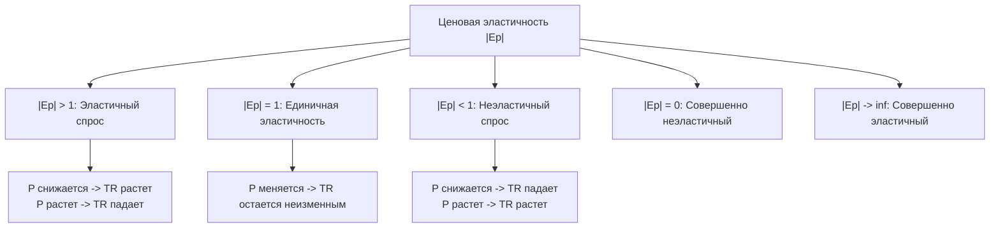

# 📈 Лекция №1: Основы экономической теории, теория спроса и предложения, эластичность и рыночные структуры

> **Дисциплина:** Экономика  
> **Университет:** МТУСИ (Центр заочного обучения по программам бакалавриата)  
> **Направление:** 09.03.02 «Информационные системы и технологии» (Профиль: Инженерия DevSecOps)  
> **Курс / Семестр:** 2 курс, 3 семестр  
> **Дата лекции:** 14 сентября 2026 г.  
> **Исходная видеозапись:** `2026-09-14 18-47-56.mp4` (продолжительность: 3 часа 00 минут, 2 академические пары)  
> **Полная стенограмма с таймкодами:** [`lecture-01-transcript.txt`](./transcripts/lecture-01-transcript.txt)

---

## 📋 Содержание лекции
1. [Организационно-методический регламент и литература по курсу](#1-организационно-методический-регламент-и-литература-по-курсу)
2. [Экономика как наука: предмет, методы и базовая парадигма](#2-экономика-как-наука-предмет-методы-и-базовая-парадигма)
3. [Факторы производства и кривая производственных возможностей (КПВ)](#3-факторы-производства-и-кривая-производственных-возможностей-кпв)
4. [Рыночный спрос (Demand) и закон спроса](#4-рыночный-спрос-demand-и-закон-спроса)
5. [Рыночное предложение (Supply) и закон предложения](#5-рыночное-предложение-supply-и-закон-предложения)
6. [Рыночное равновесие и механизм саморегуляции рынка](#6-рыночное-равновесие-и-механизм-саморегуляции-рынка)
7. [Ценовая эластичность спроса и выручка](#7-ценовая-эластичность-спроса-и-выручка)
8. [Конкуренция: понятие, методы и классификация рыночных структур](#8-конкуренция-понятие-методы-и-классификация-рыночных-структур)
9. [Сравнительная таблица моделей современного рынка](#9-сравнительная-таблица-моделей-современного-рынка)
10. [Вопросы и типовые расчетные задачи для подготовки к зачету](#10-вопросы-и-типовые-расчетные-задачи-для-подготовки-к-зачету)

---

## 1. Организационно-методический регламент и литература по курсу

*Таймкод: `[00:00] – [04:30]`*

### 1.1. Параметры учебной работы и условия аттестации
- **Форма итогового контроля:** **Зачёт** (2 ЗЕТ, 72 академических часа).
- **Объем контактной работы:**
  - Лекции: 4 часа (2 сдвоенные пары);
  - Практические занятия: 4 часа (2 встречи по 2 часа);
  - Самостоятельная работа: 63 часа.
- **Условия получения автомата:**
  - Автомат выставляется при качественном, аккуратном и своевременном выполнении всех практических расчетно-графических заданий в тетради.
  - Тетради с расчетами и графиками подлежат очной/дистанционной демонстрации преподавателю.
  - При небрежном, неполном или самостоятельно непроработанном выполнении заданий студент направляется на устный зачет по вопросам лекционного курса (проводится по подгруппам онлайн).

### 1.2. Рекомендуемая литература
- **Основная литература (доступна в электронной библиотеке МТУСИ):**
  1. *Галиахметов Р.А., Соколова Н.А., Тихонова И.В.* Экономика: учебное пособие.
  2. *Узунов Ф.В., Рогова И.Н., Ященко С.О.* Экономика: теория и практика: учебное пособие.
  3. *Руди Л.Ю., Филатов С.А.* Экономика: курс лекций.
- **Дополнительная литература:**
  1. *Лихачев М.О.* Введение в экономическую теорию.
  2. *Якушкина Т.А.* Основы экономики.
  3. *Янова В.В.* Общая экономическая теория: учебно-методическое пособие.

---

## 2. Экономика как наука: предмет, методы и базовая парадигма

*Таймкод: `[04:30] – [19:30]`*

### 2.1. Определение и базовые сферы
**Экономика** — это наука о хозяйственной деятельности общества, а также совокупность общественных производственных отношений, складывающихся в системе:

$$\text{Производство} \longrightarrow \text{Распределение} \longrightarrow \text{Обмен} \longrightarrow \text{Потребление}$$

- **Предмет экономической теории:** производственные и социально-экономические отношения между людьми по поводу рационального использования редких ресурсов для создания благ и услуг.
- **Фундаментальная экономическая проблема:** противоречие между **безграничными потребностями** общества и **ограниченностью (редкостью) экономических ресурсов**.

### 2.2. Уровни экономического анализа
1. **Микроэкономика (Microeconomics):** исследует поведение отдельных экономических агентов (домохозяйств, потребителей, фирм, предпринимателей), механизмы ценообразования на конкретных рынках, структуру издержек и максимизацию прибыли.
2. **Макроэкономика (Macroeconomics):** изучает национальное хозяйство как единое целое. Оперирует агрегированными показателями: валовой внутренний продукт (ВВП), валовой национальный продукт (ВНП), уровень инфляции, уровень безработицы, государственный бюджет, денежная масса, процентные ставки Центрального банка.

---

## 3. Факторы производства и кривая производственных возможностей (КПВ)

*Таймкод: `[19:30] – [49:15]`*

### 3.1. Факторы производства и факторные доходы
Для создания любого блага используются ресурсы, вовлеченные в производственный процесс (**факторы производства**):

| Фактор производства | Экономическая сущность | Факторный доход собственника |
| :--- | :--- | :--- |
| **Труд ($L$)** | Физические и интеллектуальные способности людей, применяемые в производстве | **Заработная плата ($w$)** |
| **Земля ($T$ / $Land$)** | Все естественные природные ресурсы (пашни, недра, полезные ископаемые, водные ресурсы) | **Рента ($R$)** |
| **Капитал ($K$)** | Производственные фонды: здания, станки, оборудование, транспорт, инструменты (физический капитал) | **Процент ($i$)** |
| **Предпринимательские способности** | Способность объединять ресурсы, идти на риск и внедрять инновации | **Прибыль ($\Pi$)** |
| **Информация** | Базы данных, знания, технологии, программный код, алгоритмы | **Роялти / интеллектуальная рента** |

### 3.2. Кривая производственных возможностей (КПВ)
**Кривая производственных возможностей (график трансформации)** — графическая модель, иллюстрирующая максимально возможный объем одновременного производства двух альтернативных благ при полном и эффективном использовании всех имеющихся ограниченных ресурсов при неизменном уровне технологий.

```text
Благо Y (Средства производства)
    ^
    |
 Y_max * A
    |   \
    |    \  * B (Эффективное производство)
    |     \
    |   * C\        * D (Недостижимая область при текущих ресурсах)
    |  (Неэффективно) \
    |       \          \
    +---------------------*----> Благо X (Потребительские товары)
   0                     X_max
```

- **Точки на кривой ($A, B$):** эффективное использование ресурсов (производство в условиях Парето-эффективности — невозможно увеличить выпуск одного товара без сокращения другого).
- **Точка внутри кривой ($C$):** неэффективное использование ресурсов (неполная занятость, простой мощностей, кризис).
- **Точка вне кривой ($D$):** недостижимый уровень выпуска при текущих ресурсах.
- **Сдвиг КПВ вправо-вверх:** экономический рост (внедрение новых технологий, научно-технический прогресс, рост квалификации кадров, расширение производственной базы).
- **Закон возрастания альтернативных издержек:** для получения каждой дополнительной единицы одного товара общество вынуждено жертвовать все большим количеством альтернативного товара (в силу неполной взаимозаменяемости ресурсов).

---

## 4. Рыночный спрос (Demand) и закон спроса

*Таймкод: `[49:15] – [01:12:00]`*

### 4.1. Определение и функциональная зависимость
**Спрос ($D$, Demand)** — платежеспособная потребность; готовность и способность покупателей приобрести определенное количество товара или услуги по предложенной цене в данный период времени.

В экономической науке строго разграничивают:
- **Величина спроса ($Q_D$, Quantity Demanded):** конкретное количество товара, которое потребители желают и могут купить при фиксированной цене $P$. Графически выражается **движением точки вдоль неизменной кривой спроса**.
- **Спрос как состояние ($D$):** вся совокупность соотношений между ценами и объемами. Графически выражается **сдвигом всей кривой спроса**.

### 4.2. Закон спроса
> **Закон спроса:** при прочих равных условиях снижение цены товара ведет к увеличению величины спроса на него, а рост цены — к снижению величины спроса:
> $$P \uparrow \implies Q_D \downarrow, \qquad P \downarrow \implies Q_D \uparrow$$

Функционально закон спроса описывается обратной зависимостью:
$$Q_D = f(P), \quad \text{в линейном виде: } Q_D = a - bP \quad (a > 0, b > 0)$$

```text
    Цена (P)
      ^
      |
  P1 -+-----* A
      |     | \
  P2 -+-----+--* B
      |     |  | \
      |     |  |  \ (D)
      +-----+--+----*----> Объем (Q)
      0    Q1  Q2
```

### 4.3. Неценовые факторы спроса (сдвиг кривой $D$)
Функция спроса от совокупности факторов:
$$Q_D = f(P, I, T, P_{sub}, P_{comp}, N, E)$$
где:
- $I$ — доходы потребителей (рост доходов смещает спрос вправо на нормальные товары и влево на товары низшей категории);
- $T$ — вкусы, предпочтения и мода;
- $P_{sub}$ — цены на товары-заменители (субституты): рост цены кофе увеличивает спрос на чай;
- $P_{comp}$ — цены на дополняющие товары (комплементы): рост цены бензина снижает спрос на автомобили;
- $N$ — число покупателей на рынке;
- $E$ — потребительские инфляционные ожидания.

---

## 5. Рыночное предложение (Supply) и закон предложения

*Таймкод: `[01:12:00] – [01:43:20]`*

### 5.1. Определение и функциональная зависимость
**Предложение ($S$, Supply)** — готовность и способность продавцов (производителей) поставить на рынок и продать определенное количество товара по данной цене в течение определенного времени.

- **Величина предложения ($Q_S$):** объем товара, предлагаемый по конкретной цене $P$ (движение вдоль кривой $S$).
- **Предложение ($S$):** вся кривая предложения целиком.

### 5.2. Закон предложения
> **Закон предложения:** при прочих равных условиях с ростом цены товара величина его предложения на рынке увеличивается, а при снижении цены — уменьшается (прямая связь):
> $$P \uparrow \implies Q_S \uparrow, \qquad P \downarrow \implies Q_S \downarrow$$

Функциональный линейный вид:
$$Q_S = -c + dP \quad \text{или} \quad Q_S = c + dP \quad (d > 0)$$

```text
    Цена (P)
      ^            (S)
      |           /
  P2 -+--------* B
      |       /|
  P1 -+----* A |
      |   /  | |
      +---+--+-+---------> Объем (Q)
      0  Q1  Q2
```

### 5.3. Неценовые факторы предложения (сдвиг кривой $S$)
$$Q_S = f(P, P_{res}, Tech, T, Sub, N_s, E_s)$$
- $P_{res}$ — цены на производственные ресурсы (рост цен на сырье и зарплату сдвигает $S$ влево-вверх; удешевление — вправо-вниз);
- $Tech$ — уровень технологии производства (прогрессивные технологии снижают издержки, сдвигая $S$ вправо-вниз);
- $T, Sub$ — налоги и государственные субсидии (налоги угнетают предложение, сдвигая его влево; дотации стимулируют выпуск);
- $N_s$ — число фирм-продавцов в отрасли;
- $E_s$ — ожидания производителей изменения рыночной конъюнктуры.

---

## 6. Рыночное равновесие и механизм саморегуляции рынка

*Таймкод: `[01:43:20] – [02:00:40]`*

### 6.1. Равновесная цена и равновесный объем
**Рыночное равновесие** достигается в точке пересечения кривых спроса и предложения $E$, где планы покупателей и продавцов полностью совпадают:

$$Q_D(P_E) = Q_S(P_E) = Q_E$$

где $P_E$ — равновесная цена, $Q_E$ — равновесный объем продаж.

```text
    Цена (P)
      ^            (S)
      | \         /
  P1 -+--\-------/---- [ИЗБЫТОК / ТОВАРНЫЙ ИЗЛИШЕК]
      |   \     /
  Pe -+----* E *------ [ТОЧКА РАВНОВЕСИЯ]
      |   /     \
  P2 -+--/-------\---- [ДЕФИЦИТ / ТОВАРНЫЙ НЕДОСТАТОК]
      | /         \ (D)
      +------------+-----> Объем (Q)
      0           Qe
```

### 6.2. Рыночный механизм восстановления равновесия
1. **Если текущая рыночная цена выше равновесной ($P_1 > P_E$):**
   - Объем предложения превышает объем спроса: $Q_S > Q_D$.
   - На рынке возникает **избыток (затоваривание)**.
   - Продавцы вынуждены конкурировать и снижать цены, возвращая рынок в точку $E$.
2. **Если текущая рыночная цена ниже равновесной ($P_2 < P_E$):**
   - Объем спроса превышает объем предложения: $Q_D > Q_S$.
   - На рынке возникает **товарный дефицит**.
   - Покупатели конкурируют между собой, цена растет, стимулируя производителей увеличивать выпуск вплоть до точки $E$.

> [!IMPORTANT]
> Классический механизм саморегуляции (рыночный автомат «невидимой руки» Адама Смита) беспрепятственно работает исключительно на рынках **чистой (совершенной) конкуренции**. В условиях монополизации и олигополии автоматическое установление равновесных цен блокируется барьерами и соглашениями участников.

---

## 7. Ценовая эластичность спроса и выручка

*Таймкод: `[02:00:40] – [02:22:00]`*

### 7.1. Коэффициент ценовой эластичности
**Ценовая эластичность спроса ($E_p$ или $E_D$)** — показатель степени количественного реагирования объема спроса на изменение цены товара на один процент:

$$E_p = \frac{\% \Delta Q_D}{\% \Delta P} = \frac{(Q_2 - Q_1) / Q_1}{(P_2 - P_1) / P_1} = \frac{\Delta Q}{\Delta P} \cdot \frac{P_1}{Q_1}$$

В силу закона спроса значение $E_p$ всегда отрицательно, поэтому для анализа используется его абсолютная величина (модуль $|E_p|$).

### 7.2. Качественные варианты эластичности и совокупная выручка ($TR = P \times Q$)



| Вариант спроса | Значение $|E_p|$ | Экономический смысл | Реакция выручки ($TR = P \cdot Q$) при снижении $P$ | Примеры товаров |
| :--- | :---: | :--- | :---: | :--- |
| **Эластичный спрос** | $|E_p| > 1$ | Спрос изменяется сильнее, чем цена ($\% \Delta Q > \% \Delta P$) | **$TR$ увеличивается** | Бытовая техника, одежда, автомобили, услуги развлечений |
| **Единичная эластичность** | $|E_p| = 1$ | Процентное изменение спроса равно изменению цены ($\% \Delta Q = \% \Delta P$) | **$TR$ не изменяется** | Стандартные транспортные билеты |
| **Неэластичный спрос** | $0 < |E_p| < 1$ | Спрос слабо реагирует на колебания цены ($\% \Delta Q < \% \Delta P$) | **$TR$ падает** | Продукты первой необходимости (хлеб, соль, молоко) |
| **Совершенно неэластичный** | $|E_p| = 0$ | Вертикальная линия спроса. Объем неизменен при любой цене | Изменяется прямо пропорционально $P$ | Жизненно необходимые медикаменты (инсулин), протезы |
| **Совершенно эластичный** | $|E_p| \to \infty$ | Горизонтальная линия спроса. Фирма может продать любой объем по единой цене | Падает до нуля при превышении единой цены | Сельскохозяйственные стандартизированные биржевые товары |

---

## 8. Конкуренция: понятие, методы и классификация рыночных структур

*Таймкод: `[02:22:00] – [03:00:00]`*

### 8.1. Понятие и функции конкуренции
**Конкуренция** — экономический процесс взаимодействия, соперничества и борьбы между предприятиями за наиболее выгодные условия приложения капитала, закупки факторов производства и сбыта готовой продукции для извлечения максимальной прибыли.

### 8.2. Формы конкурентной борьбы
1. **Ценовая конкуренция:** соперничество за счет снижения цен на однородную продукцию (демпинг, скидки, ценовые войны). Требует снижения себестоимости и издержек производства.
2. **Неценовая конкуренция:** соперничество посредством улучшения потребительских свойств продукции (повышение качества, дизайн, надежность, брендинг, реклама, сервисное обслуживание, продление гарантии). Преобладающая форма на современных рынках.
3. **Внутриотраслевая конкуренция:** борьба между фирмами одной отрасли за потребителя. Приводит к выявлению рыночной (общественной) стоимости товаров и стимулирует внедрение инноваций.
4. **Межотраслевая конкуренция:** борьба капиталов между различными отраслями за наиболее прибыльные сферы приложения. Обеспечивает перелив капитала из низкорентабельных в высокорентабельные отрасли и формирует общую среднюю норму прибыли в экономике.

---

## 9. Сравнительная таблица моделей современного рынка

*Таймкод: `[02:47:00] – [02:56:50]`*

| Параметр сравнения | Совершенная (чистая) конкуренция | Монополистическая конкуренция | Олигополия | Чистая монополия |
| :--- | :--- | :--- | :--- | :--- |
| **Количество продавцов** | Огромное множество мелких фирм | Много фирм (десятки) | Несколько крупных игроков (2–10) | **Один-единственный продавец** |
| **Тип продукции** | Стандартизированный (однородный) | **Дифференцированный** (марки, бренды, дизайн) | Стандартизированный или дифференцированный | **Уникальный** (нет близких заменителей) |
| **Контроль над ценой** | **Отсутствует** (фирма — ценополучатель, *price-taker*) | Ограниченный (в рамках дифференциации своего бренда) | Значительный, но с оглядкой на действия конкурентов | **Полный контроль** (фирма — ценоустановитель, *price-maker*) |
| **Барьеры для входа в отрасль** | **Отсутствуют** (абсолютная свобода входа/выхода) | Незначительные, легко преодолимые | **Очень высокие** (капиталоемкость, патенты, масштаб) | **Непреодолимые** (законодательные, исключительные права) |
| **Неценовая конкуренция** | Не используется | **Чрезвычайно развита** (реклама, торговые знаки) | **Очень высока** (технологии, реклама, сервис) | Практически не ведется (только PR и поддержание имиджа) |
| **Примеры отраслей** | Сельское хозяйство (рынок зерна), валютные биржи | Розничная торговля, кофейни, рестораны, брендовая одежда, обувь | Автопром, операторы мобильной связи, авиаперевозки, поисковые системы | Естественные монополии: РЖД, Газпром, городские водоканалы, электросети |

---

## 10. Вопросы и типовые расчетные задачи для подготовки к зачету

### 10.1. Теоретические вопросы
1. В чем заключается экономическая сущность противоречия между потребностями и ресурсами?
2. Какие пять факторов производства выделяет современная теория, и как называются соответствующие им факторные доходы?
3. В чем состоит принципиальное различие между изменением *величины спроса* и сдвигом *кривой спроса*?
4. Приведите примеры товаров-субститутов и комплементарных благ. Как изменение цены одного товара влияет на спрос другого?
5. Как изменится положение точки рыночного равновесия при одновременном росте доходов населения и удорожании производственного сырья?
6. Почему монополисту невыгодно устанавливать цену на неэластичном участке кривой спроса?
7. Охарактеризуйте сущность олигополии. В чем специфика ценообразования на рынке операторов сотовой связи?

---

### 10.2. Типовые расчетные задачи к зачету

#### Задача 1 (Рыночное равновесие)
Функция спроса на товар задана уравнением: $Q_D = 120 - 4P$, а функция предложения: $Q_S = -30 + 6P$.  
**Найти:** равновесную цену $P_E$ и равновесный объем продаж $Q_E$. Определить состояние рынка при фиксации цены государством на уровне $P = 12$ руб.

**Решение:**
1. В точке рыночного равновесия:
   $$Q_D = Q_S \implies 120 - 4P = -30 + 6P \implies 10P = 150 \implies P_E = 15 \text{ руб.}$$
2. Подставим $P_E$ в любое уравнение:
   $$Q_E = 120 - 4(15) = 120 - 60 = 60 \text{ ед.}$$
3. При государственной цене $P = 12$ руб. ($P < P_E$):
   $$Q_D(12) = 120 - 4(12) = 72 \text{ ед.}$$
   $$Q_S(12) = -30 + 6(12) = 42 \text{ ед.}$$
   Поскольку $Q_D > Q_S$, на рынке возникает **дефицит** в размере:
   $$\Delta Q = 72 - 42 = 30 \text{ ед.}$$

---

#### Задача 2 (Ценовая эластичность спроса)
При цене товара $P_1 = 50$ руб. объем покупок составлял $Q_1 = 200$ шт. в день. После снижения цены до $P_2 = 45$ руб. объем продаж вырос до $Q_2 = 240$ шт.  
**Определить:** коэффициент ценовой эластичности спроса $E_p$, тип спроса и изменение общей выручки продавца.

**Решение:**
1. Относительное изменение объема:
   $$\frac{\Delta Q}{Q_1} = \frac{240 - 200}{200} = \frac{40}{200} = +0{,}20 \quad (+20\%)$$
2. Относительное изменение цены:
   $$\frac{\Delta P}{P_1} = \frac{45 - 50}{50} = \frac{-5}{50} = -0{,}10 \quad (-10\%)$$
3. Коэффициент эластичности:
   $$E_p = \frac{+0{,}20}{-0{,}10} = -2{,}0 \implies |E_p| = 2{,}0$$
   Так как $|E_p| > 1$, спрос является **эластичным по цене**.
4. Динамика общей выручки:
   $$TR_1 = P_1 \times Q_1 = 50 \times 200 = 10\,000 \text{ руб.}$$
   $$TR_2 = P_2 \times Q_2 = 45 \times 240 = 10\,800 \text{ руб.}$$
   Снижение цены при эластичном спросе привело к **росту выручки** на $800$ руб.
