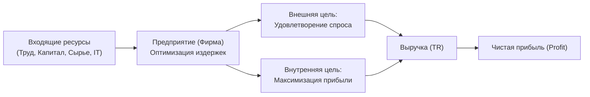
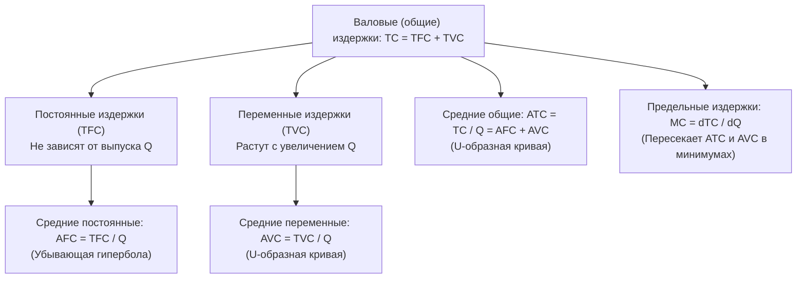

# 📈 Практическое занятие №1: Предприятие, издержки производства и практикум по решению экономических задач

> **Университет:** МТУСИ (Московский технический университет связи и информатики)  
> **Факультет / Подразделение:** Центр заочного обучения по программам бакалавриата  
> **Кафедра:** Экономической теории и менеджмента  
> **Направление:** 09.03.02 «Информационные системы и технологии» (DevSecOps)  
> **Дисциплина:** Экономика (2 курс, 3 семестр)  
> **Дата занятия:** 17 сентября 2026 г.  
> **Преподаватель:** **Критина Елена Дмитриевна**  
> **Тема занятия:** *«Лекция 4: Предприятие как экономический субъект. Издержки и результаты производства фирмы. Практикум по решению расчетных задач: рыночное равновесие, эластичность, явные/неявные издержки, оптимизация выпуска и реальная заработная плата»*  
> **Исходная видеозапись:** `D:\video\Экономика пр 17.09.mp4` (01:31:46)  
> **Стенограмма:** `D:\video\Экономика пр 17.09_transcript.txt` (794 сегмента)  

---

## 🧭 Навигация и оглавление
1. [Введение и регламент учебного курса [01:24]](#1-введение-и-регламент-учебного-курса-0124)
2. [Предприятие как экономический субъект [03:10]](#2-предприятие-как-экономический-субъект-0310)
   - [Определение и ключевые функции предприятия [04:05]](#определение-и-ключевые-функции-предприятия-0405)
   - [Две фундаментальные цели фирмы [25:04]](#две-фундаментальные-цели-фирмы-2504)
3. [Организационно-правовые формы бизнеса в РФ [15:49]](#3-организационно-правовые-формы-бизнеса-в-рф-1549)
   - [Масштабы бизнеса: микро, малый, средний и крупный [16:20]](#масштабы-бизнеса-микро-малый-средний-и-крупный-1620)
   - [Формы без образования юридического лица (Самозанятые, ИП) [17:10]](#формы-без-образования-юридического-лица-самозанятые-ип-1710)
   - [Формы с образованием юридического лица (ООО, АО, кооперативы, ГУП/МУП) [20:03]](#формы-с-образованием-юридического-лица-ооо-ао-кооперативы-гупмуп-2003)
4. [Экономическая природа и классификация издержек [30:07]](#4-экономическая-природа-и-классификация-издержек-3007)
   - [Концепция альтернативных (вмененных) издержек [32:15]](#концепция-альтернативных-вмененных-издержек-3215)
   - [Явные (бухгалтерские) и неявные (внутренние) издержки [37:15]](#явные-бухгалтерские-и-неявные-внутренние-издержки-3715)
5. [Временные горизонты: краткосрочный и долгосрочный периоды [50:14]](#5-временные-горизонты-краткосрочный-и-долгосрочный-периоды-5014)
   - [Постоянные издержки (TFC, AFC) [45:02]](#постоянные-издержки-tfc-afc-4502)
   - [Переменные издержки (TVC, AVC) [48:10]](#переменные-издержки-tvc-avc-4810)
   - [Общие (валовые) издержки (TC, ATC) [55:04]](#общие-валовые-издержки-tc-atc-5504)
   - [Предельные издержки (MC) и теорема о точке минимума [01:00:39]](#предельные-издержки-mc-и-теорема-о-точке-минимума-010039)
6. [Эффект масштаба производства [01:09:40]](#6-эффект-масштаба-производства-010940)
7. [Выручка, виды прибыли и фундаментальные правила фирмы [01:16:35]](#7-выручка-виды-прибыли-и-фундаментальные-правила-фирмы-011635)
   - [Бухгалтерская, экономическая и чистая прибыль [01:16:50]](#бухгалтерская-экономическая-и-чистая-прибыль-011650)
   - [Правило максимизации прибыли: MR = MC = P [01:19:10]](#правило-максимизации-прибыли-mr--mc--p-011910)
   - [Правило безубыточности и правило закрытия фирмы [01:20:05]](#правило-безубыточности-и-правило-закрытия-фирмы-012005)
8. [Практикум: пошаговое решение расчетных задач [01:25:03]](#8-практикум-пошаговое-решение-расчетных-задач-012503)
   - [Задача №1: Рыночное равновесие, дефицит/излишек и эластичность спроса [01:25:15]](#задача-1-рыночное-равновесие-дефицитизлишек-и-эластичность-спроса-012515)
   - [Задача №2: Аналитическое равновесие рынка и регулирование цен [01:28:06]](#задача-2-аналитическое-равновесие-рынка-и-регулирование-цен-012806)
   - [Задача №3: Расчет явных/неявных издержек и экономической прибыли [01:28:24]](#задача-3-расчет-явныхнеявных-издержек-и-экономической-прибыли-012824)
   - [Задача №4: Расчетная таблица издержек фирмы и поиск Q_opt [01:29:03]](#задача-4-расчетная-таблица-издержек-фирмы-и-поиск-q_opt-012903)
   - [Задача №5: Инфляция и уровень реальной заработной платы [01:29:50]](#задача-5-инфляция-и-уровень-реальной-заработной-платы-012950)
9. [Перспективы дальнейших практик и зачетные требования [01:30:15]](#9-перспективы-дальнейших-практик-и-зачетные-требования-013015)

---

## 1. Введение и регламент учебного курса [01:24]

- **Формат:** Практическое занятие / лекция-семинар. Проводится дистанционно для студентов заочного отделения бакалавриата направления «Информационные системы и технологии» (профиль DevSecOps).
- **Специфика курса для IT-специалистов:** Понимание микроэкономики предприятия необходимо инженеру для оценки коммерческой эффективности программных продуктов, расчета себестоимости разработки (OpEx и CapEx), выбора организационно-правовой формы при открытии стартапа и оптимизации использования ресурсов в IT-инфраструктуре.
- **Организация контроля [10:06]:**
  - Студенты ведут конспекты всех лекций и практических занятий.
  - Проверка конспектов и решений задач проводится на зачетно-экзаменационной сессии (примерно через 2 месяца).
  - Наличие полного конспекта и решенных обязательных задач — допуск к сдаче дифференцированного зачета.

---

## 2. Предприятие как экономический субъект [03:10]

### Определение и ключевые функции предприятия [04:05]
> **Предприятие (фирма)** — это самостоятельно хозяйствующий субъект с правами юридического лица или зарегистрированный индивидуальный предприниматель, созданный в порядке, установленном действующим законодательством, для производства продукции, выполнения работ и оказания услуг в целях удовлетворения общественных потребностей и получения прибыли.

Экономическая теория рассматривает предприятие в двух аспектах:
1. **Функциональный (технологический) подход:** Фирма выступает как «черный ящик», трансформирующий входящие производственные ресурсы (факторы производства: труд, земля, капитал, предпринимательские способности) в готовую продукцию.
2. **Институциональный подход:** Фирма — это сеть долгосрочных контрактов между собственниками ресурсов, позволяющая снизить **трансакционные издержки** (затраты на поиск информации, ведение переговоров, защиту прав собственности) по сравнению со свободным рынком.

**Операционные функции предприятия:**
- *Производственно-технологические:* соединение факторов производства и выпуск готовых благ;
- *Коммерческие (маркетинговые):* сбыт продукции, закупка сырья, реклама и логистика;
- *Финансовые:* привлечение инвестиций, кредитование, управление денежными потоками;
- *Учетно-аналитические:* бухучет, калькуляция себестоимости, финансовый аудит;
- *Административно-управленческие:* планирование, организация, координация и контроль (классический цикл менеджмента).

### Две фундаментальные цели фирмы [25:04]
Преподаватель акцентирует внимание: у любого коммерческого предприятия всегда **две неразрывно связанные цели**:
1. **Внешняя цель:** удовлетворение реальных потребностей покупателей (клиентов) качественными товарами или услугами. Без этого продукция не найдет спроса на рынке.
2. **Внутренняя цель:** максимизация экономической прибыли собственников при минимизации совокупных издержек.

---

## 3. Организационно-правовые формы бизнеса в РФ [15:49]

### Масштабы бизнеса: микро, малый, средний и крупный [16:20]
В соответствии с Федеральным законом № 209-ФЗ предприятия классифицируются по двум базовым критериям: численности персонала и годовому доходу:
- **Микропредприятия:** до 15 человек, доход до 120 млн руб./год;
- **Малые предприятия:** от 16 до 100 человек, доход до 800 млн руб./год;
- **Средние предприятия:** от 101 до 250 человек, доход до 2 млрд руб./год;
- **Крупный бизнес:** свыше 250 человек и свыше 2 млрд руб./год.

### Формы без образования юридического лица (Самозанятые, ИП) [17:10]
1. **Самозанятые (плательщики налога на профессиональный доход — НПД):**
   - Физические лица, работающие самостоятельно без наемных сотрудников;
   - Льготная налоговая ставка: 4% при работе с физлицами, 6% — с юридическими лицами;
   - Ограничение по годовому доходу: до 2.4 млн рублей в год;
   - Идеально подходит для начинающих фрилансеров, IT-разработчиков, репетиторов.
2. **Индивидуальный предприниматель (ИП):**
   - Физическое лицо, зарегистрированное в установленном законом порядке и осуществляющее предпринимательскую деятельность на свой риск;
   - Имеет право нанимать работников по трудовым договорам;
   - Упрощенная регистрация, отсутствие требований к уставному капиталу;
   - **Главный риск:** ИП отвечает по своим предпринимательским обязательствам **всем принадлежащим ему личным имуществом** (за исключением единственного жилья по ГПК РФ).

### Формы с образованием юридического лица (ООО, АО, кооперативы, ГУП/МУП) [20:03]
1. **Общество с ограниченной ответственностью (ООО):**
   - Самая популярная и удобная форма для IT-компаний и малого/среднего бизнеса;
   - Уставный капитал разделен на доли (минимальный размер по закону РФ — 10 000 руб.);
   - **Ключевое преимущество:** Участники общества **не отвечают по его обязательствам** и несут риск убытков только в пределах стоимости внесенных ими долей (ограниченная ответственность).
2. **Акционерное общество (АО):**
   - Уставный капитал разделен на определенное число ценных бумаг (акций);
   - Бывают **непубличные (АО)** и **публичные (ПАО)**, акции которых обращаются на бирже;
   - Удобно для привлечения масштабного венчурного и институционального капитала.
3. **Производственные кооперативы (артели):**
   - Объединение граждан на основе личного трудового участия и объединения паевых взносов. Прибыль делится по трудовому вкладу, а не по размеру капитала.
4. **Государственные и муниципальные унитарные предприятия (ГУП / МУП):**
   - Коммерческие организации, не наделенные правом собственности на закрепленное за ними имущество (имущество принадлежит государству или муниципалитету на праве хозяйственного ведения).
5. **Хозяйственные товарищества:**
   - В современной российской практике практически не используются из-за полной солидарной ответственности участников.

---

## 4. Экономическая природа и классификация издержек [30:07]

> **Издержки производства** — это денежное выражение совокупных затрат производственных факторов, необходимых предприятию для осуществления процесса производства и реализации товаров или услуг.

### Концепция альтернативных (вмененных) издержек [32:15]
В условиях ограниченности ресурсов использование любого ресурса в данном производстве означает отказ от возможности его альтернативного использования:
$$\text{Альтернативные издержки} = \text{Ценность наилучшей упущенной альтернативы}$$
Экономический субъект стремится распределить ресурсы так, чтобы их отдача была не ниже упущенной выгоды от альтернативных вариантов.

### Явные (бухгалтерские) и неявные (внутренние) издержки [37:15]

| Критерий | Явные (бухгалтерские, внешние) издержки | Неявные (внутренние, имплицитные) издержки |
| :--- | :--- | :--- |
| **Сущность** | Прямые денежные платежи внешним поставщикам ресурсов | Денежные доходы, которые фирма могла бы получить при наилучшем альтернативном использовании собственных ресурсов |
| **Отражение в учете** | Строго фиксируются в бухгалтерском балансе и проводках | **Не отражаются** в бухгалтерском учете, вычисляются экономистом-аналитиком |
| **Примеры затрат** | - Заработная плата наемных рабочих по ведомости - Оплата сырья, материалов и комплектующих - Аренда офиса и серверных мощностей - Проценты по банковским кредитам - Амортизационные отчисления по оборудованию | - Упущенный доход по банковскому вкладу от собственных денег, вложенных в бизнес - Упущенная заработная плата собственника, если бы он работал по найму - Упущенная аренда от сдачи собственного помещения - Плата за предпринимательский риск |

---

## 5. Временные горизонты: краткосрочный и долгосрочный периоды [50:14]

- **Мгновенный период:** Выпуск изменить невозможно, все факторы фиксированы ($TC = \text{const}$).
- **Краткосрочный период (Short Run):** Часть факторов производства фиксирована (производственные площади, парк станков, серверные стойки), а часть факторов меняется (объем сырья, количество рабочих часов, электроэнергия). Поэтому издержки делятся на **постоянные** и **переменные**.
- **Долгосрочный период (Long Run):** Все факторы производства становятся переменными. Предприятие может изменить масштаб производства, построить новые заводы, сменить технологическую платформу ($TFC = 0$, $TC = TVC$).

### Постоянные издержки (TFC, AFC) [45:02]
- **Совокупные постоянные издержки ($TFC$ — Total Fixed Cost):** Издержки, величина которых не зависит от текущего объема выпускаемой продукции $Q$. Даже при полной остановке производства ($Q = 0$) предприятие обязано их оплачивать.
  - *Примеры:* арендная плата за здания, оклады высшего руководства и бухгалтерии, проценты по облигациям/кредитам, охрана, коммунальные платежи на поддержание тепла, амортизация зданий.
- **Средние постоянные издержки ($AFC$ — Average Fixed Cost):** Постоянные издержки, приходящиеся на единицу продукции:
  $$AFC = \frac{TFC}{Q}$$
  С ростом объема выпуска $Q \to \infty$ величина $AFC \to 0$ (кривая представляет собой равнобочную гиперболу).

### Переменные издержки (TVC, AVC) [48:10]
- **Совокупные переменные издержки ($TVC$ — Total Variable Cost):** Издержки, величина которых изменяется непосредственно при изменении объема выпуска $Q$. При $Q = 0$ переменные издержки равны нулю ($TVC(0) = 0$).
  - *Примеры:* затраты на сырье и материалы, сдельная оплата труда производственных рабочих, технологическая электроэнергия, упаковка, транспортные расходы.
- **Средние переменные издержки ($AVC$ — Average Variable Cost):** Переменные затраты на единицу продукции:
  $$AVC = \frac{TVC}{Q}$$

### Общие (валовые) издержки (TC, ATC) [55:04]
- **Совокупные общие издержки ($TC$ — Total Cost):** Сумма всех затрат фирмы на производство данного объема выпуска $Q$:
  $$TC(Q) = TFC + TVC(Q)$$
- **Средние общие (валовые) издержки ($ATC$ — Average Total Cost):** Затраты на единицу произведенной продукции:
  $$ATC = \frac{TC}{Q} = \frac{TFC + TVC}{Q} = AFC + AVC$$

### Предельные издержки (MC) и теорема о точке минимума [01:00:39]
- **Предельные издержки ($MC$ — Marginal Cost):** Дополнительные затраты, необходимые для производства одной дополнительной единицы продукции:
  $$MC = \frac{\Delta TC}{\Delta Q} = \frac{\Delta TVC}{\Delta Q} \quad \text{или} \quad MC = \frac{dTC}{dQ} = \frac{dTVC}{dQ}$$
  Поскольку $\Delta TFC = 0$, предельные издержки определяются исключительно динамикой переменных затрат!

> [!IMPORTANT]
> **Теорема о взаимосвязи предельных и средних издержек:**  
> Кривая предельных издержек $MC$ всегда пересекает кривые средних переменных $AVC$ и средних общих $ATC$ издержек **в точках их локальных минимумов**:
> $$MC = \min(AVC) \quad \text{и} \quad MC = \min(ATC)$$
> - Если $MC < ATC$, то производство дополнительной единицы снижает средние издержки ($ATC$ падает);
> - Если $MC > ATC$, то производство дополнительной единицы увеличивает средние издержки ($ATC$ растет);
> - При $MC = ATC$ достигается технологический оптимум предприятия.

---

## 6. Эффект масштаба производства [01:09:40]

В долгосрочном периоде, когда все факторы производства переменны, динамика средних совокупных издержек $LRATC$ объясняется **эффектом масштаба**:

1. **Положительный эффект масштаба (экономия от масштаба):**
   - По мере роста масштаба предприятия средние долгосрочные издержки $LRATC$ снижаются;
   - *Факторы:* специализация труда и менеджмента, внедрение автоматизированных конвейерных линий и роботов, оптовые скидки на сырье, распределение затрат на НИОКР (R&D) на гигантский тираж.
2. **Постоянный эффект масштаба:**
   - Издержки на единицу продукции не меняются при увеличении объемов производства ($LRATC = \text{const}$).
3. **Отрицательный эффект масштаба (дезэкономия):**
   - Дальнейший рост сверхкрупной корпорации приводит к росту $LRATC$;
   - *Факторы:* бюрократизация и усложнение управленческой иерархии, замедление принятия решений, рост трансакционных издержек внутри фирмы, перегрузка локальной логистики, локальное насыщение рынка сбыта.

---

## 7. Выручка, виды прибыли и фундаментальные правила фирмы [01:16:35]

### Бухгалтерская, экономическая и чистая прибыль [01:16:50]

- **Валовая выручка (Total Revenue):**
  $$TR = P \times Q$$
- **Бухгалтерская прибыль:**
  $$\Pi_{\text{бух}} = TR - TC_{\text{явн}}$$
- **Экономическая прибыль:**
  $$\Pi_{\text{экон}} = TR - (TC_{\text{явн}} + TC_{\text{неявн}}) = \Pi_{\text{бух}} - TC_{\text{неявн}}$$
- **Нормальная прибыль:** Минимальный доход предпринимателя, удерживающий его капитал и усилия в данном бизнесе (является составной частью неявных издержек).
  - При $\Pi_{\text{экон}} = 0$ предприниматель получает **нормальную прибыль**, бизнес функционирует устойчиво.
  - При $\Pi_{\text{экон}} > 0$ фирма получает **сверхприбыль**, отрасль привлекательна для притока нового капитала.
  - При $\Pi_{\text{экон}} < 0$ капитал эффективнее перевести в альтернативную сферу.
- **Чистая прибыль:**
  $$\Pi_{\text{чист}} = \Pi_{\text{бух}} - \text{Налог на прибыль}$$

### Правило максимизации прибыли: MR = MC = P [01:19:10]
- **Предельный доход ($MR$ — Marginal Revenue):** Прирост выручки от продажи еще одной единицы продукции:
  $$MR = \frac{\Delta TR}{\Delta Q}$$
  На совершенно конкурентном рынке цена задается рынком ($P = \text{const}$), поэтому $MR = P$.
- **Золотое правило бизнеса:**  
  Фирма максимизирует прибыль при таком объеме выпуска $Q^*$, при котором:
  $$MR = MC \implies P = MC$$
  - Если $MR > MC$, выпуск выгодно наращивать (каждая новая единица приносит больше выручки, чем затрат);
  - Если $MR < MC$, выпуск избыточен (последние единицы приносят убыток);
  - При $MR = MC$ общая масса прибыли достигает абсолютного максимума.

### Правило безубыточности и правило закрытия фирмы [01:20:05]
1. **Точка безубыточности (порог рентабельности):**
   $$P = \min(ATC)$$
   Фирма полностью окупает все явные и неявные затраты ($\Pi_{\text{экон}} = 0$).
2. **Правило закрытия предприятия (Shutdown Rule):**
   Предприятие обязано немедленно прекратить производство в краткосрочном периоде, если рыночная цена падает ниже минимальных средних переменных издержек:
   $$P < \min(AVC)$$
   - *Обоснование:* При $P < AVC$ выручка $TR$ не покрывает даже текущие переменные затраты на сырье и зарплату. Продолжая работу, фирма несет убытки $TFC + (TVC - TR)$, что больше, чем чистые убытки $TFC$ при закрытии.

---

## 8. Практикум: пошаговое решение расчетных задач [01:25:03]

Ниже приведен полный разбор всех задач обязательного практикума, продемонстрированных преподавателем.

### Задача №1: Рыночное равновесие, дефицит/излишек и эластичность спроса [01:25:15]

#### Условие:
В таблице представлены данные, характеризующие различные ситуации на рынке товара А:

| Показатель | Значение 1 | Значение 2 | Значение 3 | Значение 4 | Значение 5 |
| :--- | :---: | :---: | :---: | :---: | :---: |
| **Цена товара ($P$), руб./шт.** | 8 | 16 | 24 | 32 | 40 |
| **Объем спроса ($Q_d$), шт.** | 70 | 60 | 50 | 40 | 30 |
| **Объем предложения ($Q_s$), шт.** | 10 | 30 | 50 | 70 | 90 |

#### Задания и пошаговые решения:

**а) Построение графиков линий спроса ($D$) и предложения ($S$):**
- Линия спроса $D$ имеет отрицательный наклон (закон спроса: при росте цены от 8 до 40 спрос падает с 70 до 30).
- Линия предложения $S$ имеет положительный наклон (закон предложения: при росте цены предложение растет с 10 до 90).

**б) Определение равновесной цены ($P_e$) и равновесного объема ($Q_e$):**
- Равновесие достигается в точке пересечения кривых спроса и предложения, где $Q_d = Q_s$:
  $$\mathbf{P_e = 24 \text{ руб./шт.}}, \qquad \mathbf{Q_e = 50 \text{ шт.}}$$

**в) Анализ неравновесных состояний:**
1. При цене **$P_1 = 8$ руб./шт.**:
   - $Q_d(8) = 70$ шт., $Q_s(8) = 10$ шт.
   - Поскольку $Q_d > Q_s$, на рынке возникает **товарный дефицит**:
     $$\Delta Q_{\text{дефицит}} = Q_d - Q_s = 70 - 10 = \mathbf{60 \text{ шт.}}$$
2. При цене **$P_2 = 32$ руб./шт.**:
   - $Q_d(32) = 40$ шт., $Q_s(32) = 70$ шт.
   - Поскольку $Q_s > Q_d$, на рынке возникает **излишек (затоваривание)**:
     $$\Delta Q_{\text{излишек}} = Q_s - Q_d = 70 - 40 = \mathbf{30 \text{ шт.}}$$

**г) Сдвиг линии спроса при росте доходов покупателей на 10 шт.:**
- Рост доходов — неценовой фактор спроса. Кривая спроса параллельно смещается вправо-вверх на 10 единиц:
  $$Q'_d(P) = Q_d(P) + 10$$
  - При $P=8 \implies Q'_d = 80$;
  - При $P=16 \implies Q'_d = 70$;
  - При $P=24 \implies Q'_d = 60$;
  - При $P=32 \implies Q'_d = 50$;
  - При $P=40 \implies Q'_d = 40$.
- Найдем линейные уравнения:
  - Наклон спроса: $k_d = \frac{30 - 70}{40 - 8} = \frac{-40}{32} = -1.25 \implies Q_d(P) = 80 - 1.25P$.
  - Новый спрос: $Q'_d(P) = 90 - 1.25P$.
  - Наклон предложения: $k_s = \frac{90 - 10}{40 - 8} = \frac{80}{32} = 2.5 \implies Q_s(P) = -10 + 2.5P$.
- Новая точка равновесия:
  $$90 - 1.25P = -10 + 2.5P \implies 3.75P = 100 \implies \mathbf{P_{e1} \approx 26.67 \text{ руб.}}$$
  $$Q_{e1} = -10 + 2.5(26.67) = \mathbf{56.67 \text{ шт.}}$$
  *(Вывод: равновесная цена выросла с 24 до 26.67 руб., а равновесный объем — с 50 до 56.67 шт.)*.

**д) Расчет коэффициентов ценовой дуговой эластичности спроса ($E_d$):**
Используем формулу дуговой эластичности:
$$E_d = \frac{Q_2 - Q_1}{P_2 - P_1} \cdot \frac{P_1 + P_2}{Q_1 + Q_2}$$

1. *При изменении цены с 8 до 16 руб./шт. ($Q_1 = 70, Q_2 = 60$):*
   $$E_{d1} = \frac{60 - 70}{16 - 8} \cdot \frac{8 + 16}{70 + 60} = \frac{-10}{8} \cdot \frac{24}{130} = -1.25 \cdot 0.1846 \approx \mathbf{-0.231}$$
   Поскольку $|E_{d1}| = 0.231 < 1$, спрос на данном участке **неэластичен**.

2. *При изменении цены с 16 до 24 руб./шт. ($Q_1 = 60, Q_2 = 50$):*
   $$E_{d2} = \frac{50 - 60}{24 - 16} \cdot \frac{16 + 24}{60 + 50} = \frac{-10}{8} \cdot \frac{40}{110} = -1.25 \cdot 0.3636 \approx \mathbf{-0.455}$$
   Поскольку $|E_{d2}| = 0.455 < 1$, спрос **неэластичен**.

3. *При изменении цены с 24 до 32 руб./шт. ($Q_1 = 50, Q_2 = 40$):*
   $$E_{d3} = \frac{40 - 50}{32 - 24} \cdot \frac{24 + 32}{50 + 40} = \frac{-10}{8} \cdot \frac{56}{90} = -1.25 \cdot 0.6222 \approx \mathbf{-0.778}$$
   Поскольку $|E_{d3}| = 0.778 < 1$, спрос **неэластичен** (но эластичность возрастает по мере роста цены).

---

### Задача №2: Аналитическое равновесие рынка и регулирование цен [01:28:06]

#### Условие:
Спрос и предложение на обеды в заводской столовой заданы уравнениями:
$$Q_d = 2400 - 100P, \qquad Q_s = 1000 + 250P$$
где $Q_d, Q_s$ — объемы спроса и предложения обедов в день (порций); $P$ — цена одного обеда (руб.).

#### Решение:

**1) Нахождение равновесной цены ($P_e$) и равновесного объема ($Q_e$):**
В точке равновесия спрос равен предложению ($Q_d = Q_s$):
$$2400 - 100P = 1000 + 250P$$
$$350P = 1400 \implies \mathbf{P_e = 4 \text{ руб./обед}}$$

Подставляем $P_e$ в уравнение спроса:
$$Q_e = 2400 - 100 \times 4 = \mathbf{2000 \text{ обедов в день}}$$

Выручка столовой при равновесии:
$$TR_e = P_e \times Q_e = 4 \times 2000 = 8000 \text{ руб./день}$$

**2) Последствия государственного регулирования цены на уровне $P_1 = 3$ руб.:**
- Объем спроса при $P_1 = 3$:
  $$Q_d(3) = 2400 - 100 \times 3 = 2100 \text{ обедов}$$
- Объем предложения столовой при $P_1 = 3$:
  $$Q_s(3) = 1000 + 250 \times 3 = 1750 \text{ обедов}$$
- **Результаты решения:**
  1. Возникает **острый дефицит** обедов:
     $$\Delta Q = Q_d - Q_s = 2100 - 1750 = \mathbf{350 \text{ обедов в день}}$$
  2. Фактически будет продано только 1 750 обедов (по объему предложения).
  3. Выручка столовой упадет:
     $$TR_1 = 3 \times 1750 = 5250 \text{ руб. (падение на } 2750 \text{ руб./день или на } 34.4\%)$$
  4. Социально-экономические последствия: длинные очереди, ухудшение качества ингредиентов, необходимость нормирования (талоны) и возникновение теневого рынка.

---

### Задача №3: Расчет явных/неявных издержек и экономической прибыли [01:28:24]

#### Условие:
Владелец мастерской по производству сувениров:
- нанимает помощника: **12 тыс. \$ / год**;
- оплачивает аренду помещения: **5 тыс. \$ / год**;
- закупает сырье: **20 тыс. \$ / год**;
- потратил на оборудование **40 тыс. \$ собственных средств** со сроком службы **20 лет** (линейная амортизация).
При альтернативном использовании эти 40 тыс. \$ могли бы приносить **4 тыс. \$ в год** дохода по банковскому вкладу.
Конкурент предлагал владельцу место наемного мастера с оплатой **15 тыс. \$ в год**.
Свои предпринимательские способности в иной сфере владелец оценивает в **3 тыс. \$ в год**.
Годовая выручка от продажи сувениров составляет **72 тыс. \$ в год**.

#### Требуется определить:
1. Явные издержки ($TC_{\text{явн}}$);
2. Неявные издержки ($TC_{\text{неявн}}$);
3. Бухгалтерскую прибыль ($\Pi_{\text{бух}}$);
4. Экономическую прибыль ($\Pi_{\text{экон}}$);
5. Дать экономическое заключение о целесообразности ведения бизнеса.

#### Решение:

1. **Расчет явных (бухгалтерских) издержек:**
   Включают прямые выплаты и амортизацию оборудования:
   - Годовая амортизация: $A = \frac{40 \text{ тыс. \$}}{20 \text{ лет}} = 2 \text{ тыс. \$ / год}$;
   - Зарплата помощника: 12 тыс. \$;
   - Аренда: 5 тыс. \$;
   - Сырье: 20 тыс. \$.
   $$\mathbf{TC_{\text{явн}}} = 12 + 5 + 20 + 2 = \mathbf{39 \text{ тыс. \$}}$$

2. **Расчет бухгалтерской прибыли:**
   $$\mathbf{\Pi_{\text{бух}}} = TR - TC_{\text{явн}} = 72 - 39 = \mathbf{33 \text{ тыс. \$}}$$

3. **Расчет неявных (внутренних) издержек:**
   Отражают упущенную выгоду от использования собственных ресурсов владельца:
   - Упущенный банковский процент от собственных средств: 4 тыс. \$;
   - Упущенная заработная плата мастера: 15 тыс. \$;
   - Оценка нормальной прибыли от предпринимательского таланта: 3 тыс. \$.
   $$\mathbf{TC_{\text{неявн}}} = 4 + 15 + 3 = \mathbf{22 \text{ тыс. \$}}$$

4. **Расчет экономической прибыли:**
   $$\mathbf{\Pi_{\text{экон}}} = \Pi_{\text{бух}} - TC_{\text{неявн}} = 33 - 22 = \mathbf{11 \text{ тыс. \$}}$$
   *(Или через совокупные издержки: $TC_{\text{экон}} = 39 + 22 = 61 \implies \Pi_{\text{экон}} = 72 - 61 = 11$ тыс. \$)*.

5. **Экономический вывод:**
   Поскольку экономическая прибыль положительна ($\Pi_{\text{экон}} = +11 \text{ тыс. \$} > 0$), выручка покрывает не только все прямые производственные расходы, но и с избытком компенсирует все альтернативные доходы предпринимателя. **Оставаться в сувенирном бизнесе выгодно и экономически целесообразно.**

---

### Задача №4: Расчетная таблица издержек фирмы и поиск Q_opt [01:29:03]

#### Условие:
Заполнить пропуски в таблице динамики издержек предприятия и определить оптимальный объем производства $Q_{opt}$:

| $Q$ | $AFC$ | $TVC$ | $ATC$ | $MC$ | $TC$ |
| :-: | :-: | :-: | :-: | :-: | :-: |
| **0** | — | **?** | — | — | **100** |
| **10** | **?** | **?** | **20** | **?** | **?** |
| **20** | **5** | **180** | **?** | **?** | **?** |
| **30** | **?** | **?** | **?** | **11** | **390** |
| **40** | **?** | **420** | **?** | **?** | **?** |
| **50** | **2** | **?** | **14** | **?** | **?** |

#### Пошаговый расчет формул:
1. При $Q = 0$ выпуск отсутствует $\implies TVC = 0 \implies \mathbf{TFC = TC(0) = 100}$. Поскольку $TFC$ постоянны при любом выпуске, **$TFC = 100$ для всех строк**.
2. **Строка $Q = 10$:**
   - $TC = ATC \times Q = 20 \times 10 = \mathbf{200}$;
   - $TVC = TC - TFC = 200 - 100 = \mathbf{100}$;
   - $AFC = \frac{TFC}{Q} = \frac{100}{10} = \mathbf{10}$;
   - $MC = \frac{TC(10) - TC(0)}{10 - 0} = \frac{200 - 100}{10} = \mathbf{10}$.
3. **Строка $Q = 20$:**
   - Проверка $TFC = AFC \times Q = 5 \times 20 = 100$ (сходится);
   - $TC = TFC + TVC = 100 + 180 = \mathbf{280}$;
   - $ATC = \frac{TC}{Q} = \frac{280}{20} = \mathbf{14}$;
   - $MC = \frac{TC(20) - TC(10)}{20 - 10} = \frac{280 - 200}{10} = \mathbf{8}$.
4. **Строка $Q = 30$:**
   - $TVC = TC - TFC = 390 - 100 = \mathbf{290}$;
   - $AFC = \frac{100}{30} \approx \mathbf{3.33}$;
   - $ATC = \frac{TC}{Q} = \frac{390}{30} = \mathbf{13}$;
   - Проверка $MC$: дано $MC = 11 \implies TC(30) = TC(20) + 11 \times 10 = 280 + 110 = 390$ (полное совпадение).
5. **Строка $Q = 40$:**
   - $TC = TFC + TVC = 100 + 420 = \mathbf{520}$;
   - $AFC = \frac{100}{40} = \mathbf{2.5}$;
   - $ATC = \frac{TC}{Q} = \frac{520}{40} = \mathbf{13}$;
   - $MC = \frac{TC(40) - TC(30)}{40 - 30} = \frac{520 - 390}{10} = \mathbf{13}$.
6. **Строка $Q = 50$:**
   - $TC = ATC \times Q = 14 \times 50 = \mathbf{700}$;
   - $TVC = TC - TFC = 700 - 100 = \mathbf{600}$;
   - Проверка $AFC = \frac{100}{50} = 2$ (сходится);
   - $MC = \frac{TC(50) - TC(40)}{50 - 40} = \frac{700 - 520}{10} = \mathbf{18}$.

#### Заполненная итоговая расчетная таблица:

| $Q$ | $TFC$ | $TVC$ | $TC$ | $AFC$ | $AVC$ | $ATC$ | $MC$ |
| :-: | :-: | :-: | :-: | :-: | :-: | :-: | :-: |
| **0** | 100 | 0 | **100** | — | — | — | — |
| **10** | 100 | **100** | **200** | **10** | 10 | **20** | **10** |
| **20** | 100 | **180** | **280** | **5** | 9 | **14** | **8** |
| **30** | 100 | **290** | **390** | **3.33** | 9.67 | **13** | **11** |
| **40** | 100 | **420** | **520** | **2.5** | 10.5 | **13** | **13** |
| **50** | 100 | **600** | **700** | **2** | 12 | **14** | **18** |

#### Определение оптимального объема выпуска $Q_{opt}$:
- Технологический оптимум достигается при минимальных средних общих издержках, где $ATC = MC$:
  $$\min(ATC) = 13 \quad \text{при} \quad Q = 40 \quad (\text{где } MC = 13)$$
- **Ответ:** Оптимальный объем производства составляет **$Q_{opt} = 40$ единиц**.

---

### Задача №5: Инфляция и уровень реальной заработной платы [01:29:50]

#### Условие:
За конкретный период номинальная заработная плата в стране повысилась на **25%**, а стоимость жизни (индекс потребительских цен) выросла на **60%**. Определить изменение уровня реальной заработной платы.

#### Решение:
1. Индекс номинальной заработной платы ($I_{\text{ном}}$):
   $$I_{\text{ном}} = 1 + 0.25 = 1.25$$
2. Индекс стоимости жизни / потребительских цен ($I_p$):
   $$I_p = 1 + 0.60 = 1.60$$
3. Индекс реальной заработной платы ($I_{\text{реал}}$):
   $$I_{\text{реал}} = \frac{I_{\text{ном}}}{I_p} = \frac{1.25}{1.60} = 0.78125$$
4. Относительное изменение покупательской способности:
   $$\Delta W_{\text{реал}} = (I_{\text{реал}} - 1) \times 100\% = (0.78125 - 1) \times 100\% = \mathbf{-21.875\%}$$

**Ответ:** Несмотря на номинальный рост зарплаты на четверть, реальная заработная плата работников из-за опережающей инфляции снизилась на **21.875%** (почти на 22%).

---

## 9. Перспективы дальнейших практик и зачетные требования [01:30:15]

- **Следующие темы курса:**
  - Оценка стоимости земли и земельная рента ($P_{\text{земли}} = \frac{\text{Рента}}{r} \times 100\%$);
  - Формулы простых и сложных процентов в инвестиционных расчетах ($FV = PV(1 + r)^n$);
  - Кругооборот основного и оборотного капитала, коэффициенты амортизации;
  - Расчет Валового внутреннего продукта (ВВП / GDP) двумя методами: по расходам ($GDP = C + I + G + X_n$) и по доходам (зарплата, рента, процент, прибыль, амортизация, косвенные налоги).
- **Критерии успешной сдачи зачета:**
  - Полное оформление конспекта в тетради или электронном виде;
  - Самостоятельное безошибочное решение типовых расчетных задач 1–5 с экономическими выводами;
  - Уверенные ответы на теоретические вопросы по кривым издержек ($TFC, TVC, TC, MC, ATC$) и правилам поведения фирмы на рынке ($MR = MC$).
