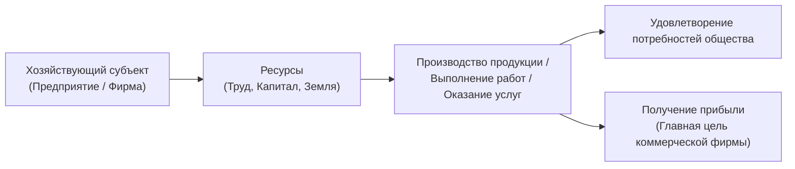
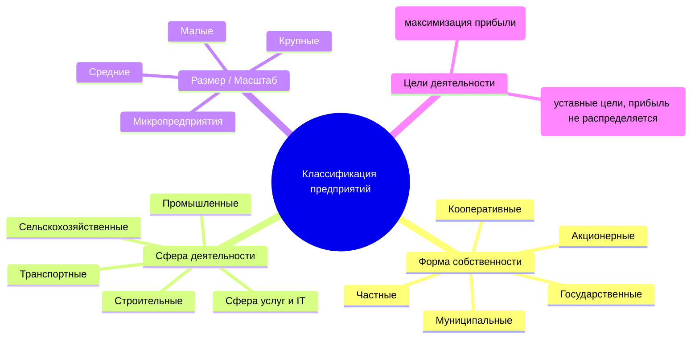
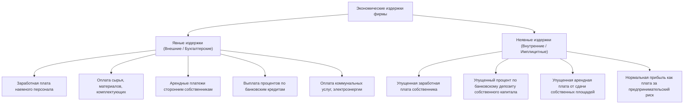
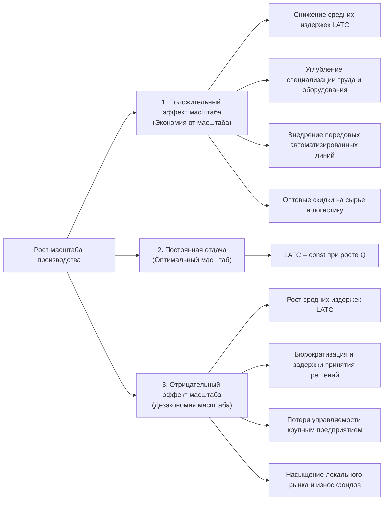
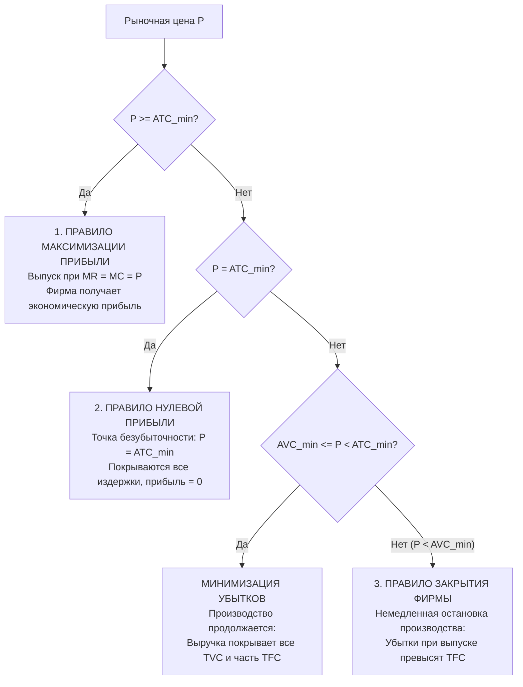

# Дисциплина: Экономика (Практическое занятие 2 / Лекция 4)

**Преподаватель:** Критина Елена Дмитриевна  
**ВУЗ:** Московский технический университет связи и информатики (МТУСИ)  
**Подразделение:** Центр заочного обучения по программам бакалавриата  
**Группа:** БСТ2556  
**Курс / Семестр:** 2 курс, 3 семестр  
**Специальность:** 09.03.02 Информационные системы и технологии  
**Профиль:** Инженерия DevSecOps  
**Дата занятия:** 18 сентября 2026 года  
**Исходный видеофайл:** `Экономика пр 18.09.mp4`  
**Продолжительность:** 1 час 29 минут 57 секунд (5397 сек.)  
**Текст транскрипции:** [practice-02-transcript.txt](./transcripts/practice-02-transcript.txt)

---

## 📑 Оглавление

1. [Введение и регламент занятия [00:03:38 - 00:06:45]](#1-введение-и-регламент-занятия-000338---000645)
2. [Предприятие как экономический субъект [00:06:45 - 00:20:09]](#2-предприятие-как-экономический-субъект-000645---002009)
   - 2.1. [Определение и цели создания фирмы](#21-определение-и-цели-создания-фирмы)
   - 2.2. [Шесть групп операций по Анри Файолю](#22-шесть-групп-операций-по-анри-файолю)
   - 2.3. [Классификация предприятий](#23-классификация-предприятий)
   - 2.4. [Организационно-правовые формы коммерческих организаций в РФ](#24-организационно-правовые-формы-коммерческих-организаций-в-рф)
3. [Издержки производства: сущность и классификация [00:20:09 - 00:50:43]](#3-издержки-производства-сущность-и-классификация-002009---005043)
   - 3.1. [Концепция альтернативных издержек](#31-концепция-альтернативных-издержек)
   - 3.2. [Явные (бухгалтерские) и неявные (имплицитные) издержки](#32-явные-бухгалтерские-и-неявные-имплицитные-издержки)
   - 3.3. [Постоянные ($TFC$) и переменные ($TVC$) издержки](#33-постоянные-tfc-и-переменные-tvc-издержки)
   - 3.4. [Общие валовые издержки ($TC$)](#34-общие-валовые-издержки-tc)
   - 3.5. [Средние издержки ($ATC, AFC, AVC$)](#35-средние-издержки-atc-afc-avc)
   - 3.6. [Предельные издержки ($MC$)](#36-предельные-издержки-mc)
   - 3.7. [Безвозвратные издержки (Sunk Costs)](#37-безвозвратные-издержки-sunk-costs)
4. [Графический анализ издержек и эффект масштаба [00:50:43 - 01:08:23]](#4-графический-анализ-издержек-и-эффект-масштаба-005043---010823)
   - 4.1. [График совокупных издержек ($TC, TFC, TVC$)](#41-график-совокупных-издержек-tc-tfc-tvc)
   - 4.2. [График средних и предельных издержек ($ATC, AVC, AFC, MC$)](#42-график-средних-и-предельных-издержек-atc-avc-afc-mc)
   - 4.3. [Точка оптимального объема производства ($B$)](#43-точка-оптимального-объема-производства-b)
   - 4.4. [Теория эффекта масштаба (положительный, постоянный, отрицательный)](#44-теория-эффекта-масштаба-положительный-постоянный-отрицательный)
5. [Доходы и прибыль предприятия [01:08:23 - 01:18:04]](#5-доходы-и-прибыль-предприятия-010823---011804)
   - 5.1. [Валовый ($TR$), средний ($AR$) и предельный ($MR$) доход](#51-валовый-tr-средний-ar-и-предельный-mr-доход)
   - 5.2. [Бухгалтерская, экономическая, чистая и нормальная прибыль](#52-бухгалтерская-экономическая-чистая-и-нормальная-прибыль)
   - 5.3. [Критерий целесообразности продолжения бизнеса](#53-критерий-целесообразности-продолжения-бизнеса)
6. [Правила поведения фирмы на рынке [01:18:04 - 01:26:16]](#6-правила-поведения-фирмы-на-рынке-011804---012616)
   - 6.1. [Правило максимизации прибыли ($MR = MC = P$)](#61-правило-максимизации-прибыли-mr--mc--p)
   - 6.2. [Правило нулевой прибыли / безубыточности ($P = ATC_{min}$)](#62-правило-нулевой-прибыли--безубыточности-p--atc_min)
   - 6.3. [Правило закрытия предприятия ($P < AVC_{min}$)](#63-правило-закрытия-предприятия-p--avc_min)
7. [Практикум: решение задач по микроэкономике [01:26:16 - 01:29:56]](#7-практикум-решение-задач-по-микроэкономике-012616---012956)
   - 7.1. [Организационные вопросы (перезачеты, деканат)](#71-организационные-вопросы-перезачеты-деканат)
   - 7.2. [Задача №1: Рыночное равновесие, дефицит/избыток, сдвиг спроса и эластичность](#72-задача-1-рыночное-равновесие-дефицитизбыток-сдвиг-спроса-и-эластичность)
   - 7.3. [Задача №2: Аналитический расчет равновесия спроса и предложения](#73-задача-2-аналитический-расчет-равновесия-спроса-и-предложения)
8. [Сводная таблица ключевых формул дисциплины](#8-сводная-таблица-ключевых-формул-дисциплины)

---

## 1. Введение и регламент занятия [00:03:38 - 00:06:45]

Лектор начинает занятие в сервисе «Контур Толк» для студентов заочного отделения бакалавриата. 

Тема занятия объединяет теоретический лекционный блок (Лекция №4 курса) и практическую подготовку к расчетным задачам:
> **Тема:** «Предприятие как экономический субъект. Издержки и результаты производства предприятия (издержки, доходы и прибыль фирмы)».

В ходе вводной части подчеркивается логика перехода от общеэкономических моделей рыночного равновесия (микроэкономики) к непосредственному экономическому анализу деятельности производственного предприятия.

---

## 2. Предприятие как экономический субъект [00:06:45 - 00:20:09]

### 2.1. Определение и цели создания фирмы



> **Предприятие (фирма)** — самостоятельно хозяйствующий субъект, созданный в порядке, установленном действующим законодательством страны, для производства продукции, выполнения работ и оказания услуг в целях удовлетворения общественных потребностей и систематического извлечения прибыли.

---

### 2.2. Шесть групп операций по Анри Файолю

Один из основоположников классической школы менеджмента **Анри Файоль** (Henri Fayol) выделил 6 взаимосвязанных групп операций, охватывающих всю деятельность предприятия:

| Группа операций | Содержание и функциональные обязанности |
| :--- | :--- |
| **1. Технические** | Добыча сырья, механическая и химическая обработка, переработка ресурсов, непосредственно производственный цикл создания материальных благ и услуг. |
| **2. Коммерческие** | Материально-техническое снабжение (закупка сырья, материалов, станков), сбыт готовой продукции, маркетинговые исследования, реклама, ценообразование. |
| **3. Финансовые** | Привлечение источников финансирования (эмиссия акций, кредитование, лизинг), оптимизация структуры капитала, рациональное размещение денежных потоков. |
| **4. Страховые** | Страхование имущественных рисков предприятия, обеспечение промышленной безопасности, охрана труда и здоровья персонала, физическая и информационная защита. |
| **5. Учетные** | Бухгалтерский и налоговый учет, калькуляция производственной себестоимости, статистическая отчетность, комплексный анализ хозяйственной деятельности (АХД). |
| **6. Административные** | Базовые функции менеджмента: **планирование** (стратегическое, тактическое, оперативное), **организация**, **координация** взаимодействий и **контроль** исполнения. |

> **Комментарий лектора:** Если базовый менеджмент (стили руководства, оргструктуры) доступен для самостоятельного освоения, то **финансовый менеджмент** и **анализ хозяйственной деятельности** требуют фундаментальной экономической подготовки, поскольку напрямую определяют финансовую устойчивость и платежеспособность фирмы.

---

### 2.3. Классификация предприятий

В современной экономической системе предприятия классифицируются по нескольким фундаментальным признакам:



> **Важное отличие коммерческих и некоммерческих организаций:**  
> Некоммерческие организации (фонды, ассоциации, союзы, религиозные и общественные объединения) имеют право осуществлять приносящую доход деятельность, но **не имеют права распределять полученную прибыль между учредителями (участниками)**. Вся полученная прибыль обязана направляться исключительно на реализацию уставных некоммерческих целей (например, фонд защиты дикой природы направляет средства от продажи атрибутики на поддержку заповедников).

---

### 2.4. Организационно-правовые формы коммерческих организаций в РФ

В соответствии с Гражданским кодексом РФ коммерческая деятельность может осуществляться в двух фундаментальных формах: **без образования юридического лица** и **с образованием юридического лица**.

| № | Организационно-правовая форма | Правовой статус и ключевые особенности | Ответственность и ограничения |
| :-: | :--- | :--- | :--- |
| **1** | **Самозанятый** (Плательщик НПД) | Физическое лицо, ведущее индивидуальную деятельность. Без образования юрлица. | Ограничение по доходу: до **2,4 млн руб./год** (~200 тыс. руб./мес.). Запрещено нанимать сотрудников по трудовым договорам и перепродавать чужие товары. |
| **2** | **Индивидуальный предприниматель (ИП)** | Физическое лицо, зарегистрированное в качестве предпринимателя. Без образования юрлица. | **Полная имущественная ответственность** по обязательствам всем личным имуществом. Разрешен наем работников. Статус ИП не передается по наследству (бизнес переоформляется заново). |
| **3** | **Хозяйственное товарищество** | Полное товарищество или товарищество на вере (коммандитное). Юридическое лицо. | Объединение лиц и капиталов. В РФ имеет ограниченное распространение из-за солидарной ответственности полных товарищей. |
| **4** | **Общество с ограниченной ответственностью (ООО)** | Наиболее распространенная форма юрлица в РФ. Уставный капитал разделен на доли. Число участников — от 1 до 50. | **Ответственность ограничена стоимостью внесенного вклада в уставный капитал**. Участники не отвечают по обязательствам ООО личным имуществом (за исключением субсидиарной ответственности при банкротстве). |
| **5** | **Акционерное общество (АО: ПАО / НАО)** | Уставный капитал разделен на определенное число акций. Крупная концентрация капитала (>50 участников). | Акционеры несут риск убытков в пределах стоимости принадлежащих им акций. Доход выплачивается в виде **дивидендов**. Сложная многоуровневая структура корпоративного управления. |
| **6** | **Производственный кооператив (Артель)** | Добровольное объединение граждан на основе членства для совместной производственной деятельности. | Основан на **личном трудовом участии** членов кооператива и объединении паевых имущественных взносов. |
| **7** | **Фермерское (крестьянское) хозяйство** | Объединение граждан, связанных родством/свойством, имеющих в общей собственности имущество для с/х производства. | Совместное ведение предпринимательской производственной деятельности в аграрном секторе. |
| **8** | **ГУП и МУП** | Государственные и муниципальные унитарные предприятия. | Имущество закрепляется на праве хозяйственного ведения или оперативного управления (неделимо, не распределяется по долям). |

---

## 3. Издержки производства: сущность и классификация [00:20:09 - 00:50:43]

### 3.1. Концепция альтернативных издержек

> **Издержки производства** — совокупность затрат живого и овеществленного труда на приобретение и использование экономических ресурсов, необходимых для производства и реализации товаров, работ или услуг.

Все экономические издержки носят **альтернативный характер** (концепция альтернативной стоимости / Opportunity Costs):
$$\text{Альтернативные издержки} = \text{Ценность наилучшей упущенной альтернативы}$$

Альтернативность издержек заставляет предпринимателя отбирать на рынке комбинацию факторов производства, суммарная стоимость которых для заданного объема выпуска $Q$ будет минимальной, обеспечивая тем самым максимизацию прибыли.

---

### 3.2. Явные (бухгалтерские) и неявные (имплицитные) издержки



1. **Явные издержки (внешние, денежные, бухгалтерские):**
   Прямые денежные выплаты сторонним поставщикам за привлекаемые внешние ресурсы. Полностью отражаются в первичных документах бухгалтерского учета.
2. **Неявные издержки (внутренние, скрытые, имплицитные):**
   Денежные доходы, которыми жертвует собственник фирмы, используя собственные ресурсы вместо предоставления их в пользование другим лицам на рыночных условиях. Бухгалтер их не фиксирует, но экономист обязан учитывать их для стратегических решений.

> **Пример лектора:**  
> Предприниматель открывает швейную мастерскую. Он вложил 5 млн руб. собственных накоплений, использует свое нежилое помещение и сам руководит бизнесом, уволившись с прежней работы.  
> Его **неявные издержки** складываются из:
> - Упущенных процентов по банковскому вкладу на 5 млн руб. (например, 18-20% годовых);
> - Упущенной рыночной арендной платы от сдачи своего помещения другому арендатору;
> - Потерянной заработной платы, которую он получал на предыдущем рабочем месте в найме.

---

### 3.3. Постоянные ($TFC$) и переменные ($TVC$) издержки

Деление издержек на постоянные и переменные имеет смысл **только в краткосрочном периоде производства (Short-Run)**:
- **Мгновенный период:** все ресурсы и издержки фиксированы (постоянны).
- **Краткосрочный период:** часть факторов производства фиксирована (оборудование, площади), часть — масштабируема (сырье, рабочий персонал).
- **Долгосрочный период (Long-Run):** все факторы и издержки становятся переменными.

| Показатель | Обозначение | Экономический смысл | Примеры статей затрат |
| :--- | :---: | :--- | :--- |
| **Постоянные издержки (Total Fixed Costs)** | $TFC$ | Затраты, величина которых **не зависит от объема выпускаемой продукции** $Q$. При $Q = 0$ издержки $TFC > 0$. | Аренда производственных помещений, амортизация зданий, проценты по кредитам, охрана, оклады топ-менеджмента и бухгалтерии, отопление цехов. |
| **Переменные издержки (Total Variable Costs)** | $TVC$ | Затраты, величина которых **напрямую изменяется при изменении объема выпуска** $Q$. При $Q = 0 \implies TVC = 0$. | Сырье и основные материалы, сдельная оплата труда производственных рабочих, технологическая электроэнергия, упаковка, транспортные расходы. |

---

### 3.4. Общие валовые издержки ($TC$)

> **Общие (совокупные, валовые) издержки (Total Cost, $TC$)** — суммарные издержки на выпуск всего объема продукции $Q$:
$$TC = TFC + TVC$$

При нулевом производстве ($Q = 0$) общие издержки равны постоянным:
$$TC(0) = TFC$$

---

### 3.5. Средние издержки ($ATC, AFC, AVC$)

Средние издержки показывают затраты в расчете **на одну единицу произведенной продукции**:

1. **Средние постоянные издержки (Average Fixed Cost):**
   $$AFC = \frac{TFC}{Q}$$
   *Свойство:* Монотонно убывают с ростом $Q$, приближаясь к оси абсцисс (эффект распределения накладных расходов).

2. **Средние переменные издержки (Average Variable Cost):**
   $$AVC = \frac{TVC}{Q}$$
   *Свойство:* Имеют $U$-образную форму в силу действия закона убывающей предельной производительности.

3. **Средние общие (валовые) издержки (Average Total Cost):**
   $$ATC = \frac{TC}{Q} = \frac{TFC + TVC}{Q} = AFC + AVC$$

---

### 3.6. Предельные издержки ($MC$)

> **Предельные издержки (Marginal Cost, $MC$)** — дополнительные затраты, необходимые для выпуска каждой последующей (дополнительной) единицы продукции:

$$MC = \frac{\Delta TC}{\Delta Q} = \frac{\Delta TVC}{\Delta Q}$$

Для дискретного шага $\Delta Q = 1$:
$$MC_n = TC_n - TC_{n-1} = TVC_n - TVC_{n-1}$$

Поскольку постоянные издержки не меняются ($\Delta TFC = 0$), предельные издержки определяются исключительно динамикой переменных затрат.

---

### 3.7. Безвозвратные издержки (Sunk Costs)

> **Безвозвратные издержки** — затраты, которые были совершены в прошлом и не могут быть компенсированы или возвращены ни при каких обстоятельствах (даже при полной ликвидации предприятия).

Примеры:
- Узкоспециализированный индивидуальный дизайн помещения и несъемные декорации;
- Расходы на регистрацию юрлица, государственные пошлины;
- Расходы на прошлую рекламную кампанию и маркетинговые исследования;
- Лицензии на узкопрофильное ПО, не подлежащие перепродаже.

*Правило рационального менеджера:* Безвозвратные издержки являются невозвратными потерями прошлого и **не должны влиять на принятие текущих и будущих управленческих решений**.

---

## 4. Графический анализ издержек и эффект масштаба [00:50:43 - 01:08:23]

### 4.1. График совокупных издержек ($TC, TFC, TVC$)

```
Издержки (тыс. руб.)
  ^
  |                                        / TC (Total Cost)
  |                                      /'
  |                                    /'   / TVC (Variable Cost)
  |                                  /'   /'
  |                                /'   /'
  |                              /'   /'
5 +----------------------------/'---/'----------------- TFC = 5 тыс. руб.
  |                          /'   /'
  |                        /'   /'
  |                      /'   /'
0 +--------------------/'---/'------------------------> Q (тыс. шт.)
  0                   40    60    80    100
```

- Линия $TFC$ строго горизонтальна на уровне первоначальных постоянных затрат (например, 5 тыс. руб.).
- Кривая $TVC$ выходит из начала координат $(0, 0)$. На начальном участке темп ее роста замедляется, а затем начинает лавинообразно ускоряться из-за действия закона убывающей отдачи факторов.
- Кривая $TC$ повторяет форму $TVC$, но сдвинута вертикально вверх ровно на величину $TFC$ ($TC(0) = TFC$).

---

### 4.2. График средних и предельных издержек ($ATC, AVC, AFC, MC$)

```
Издержки на ед. (руб./шт.)
  ^
  |  \ MC                 / MC
  |   \                 /'
  |    \   \ ATC       /   / ATC
  |     \   \         /   /'
  |      \   \       /  /'
  |       \   \     / /'
110 +......\...\...B +       <-- B: Точка оптимума (ATC_min = MC)
  |         \   \ /'
  |          \   A +         <-- A: Точка минимума AVC (AVC_min = MC)
  |           \ /' \ AVC
  |            +----\-------
  |                  \------- AFC (асимптотически стремится к 0)
0 +-------------------+---------------------------------> Q (тыс. шт.)
  0                  92
```

### 4.3. Точка оптимального объема производства ($B$)

1. Кривая $MC$ пересекает кривые $AVC$ и $ATC$ **строго в точках их локальных минимумов**:
   - Точка $A$: $\min(AVC)$, где $AVC = MC$;
   - Точка $B$ (или $E$): $\min(ATC)$, где $ATC = MC$.
2. Значение точки $B$:
   - Ей соответствует минимальная себестоимость единицы продукции ($ATC_{\min} \approx 110$ руб.);
   - Ей соответствует **технологически оптимальный объем производства** ($Q_{opt} \approx 92-93$ тыс. шт.);
   - В точке минимума средних издержек фирма достигает максимальной удельной рентабельности.

---

### 4.4. Теория эффекта масштаба (положительный, постоянный, отрицательный)

В долгосрочном периоде предприятие может варьировать все факторы производства, меняя масштабы своих производственных мощностей.



---

## 5. Доходы и прибыль предприятия [01:08:23 - 01:18:04]

### 5.1. Валовый ($TR$), средний ($AR$) и предельный ($MR$) доход

| Вид дохода | Обозначение | Формула | Экономический смысл |
| :--- | :---: | :---: | :--- |
| **Общий (валовый) доход (выручка)** | $TR$ | $TR = P \times Q$ | Совокупная денежная сумма, полученная предприятием от продажи объема продукции $Q$ по цене $P$. |
| **Средний доход** | $AR$ | $AR = \frac{TR}{Q} = \frac{P \times Q}{Q} = P$ | Доход, приходящийся на одну проданную единицу продукции (в условиях совершенной конкуренции равен цене $P$). |
| **Предельный доход** | $MR$ | $MR = \frac{\Delta TR}{\Delta Q} = TR_n - TR_{n-1}$ | Дополнительный доход, полученный фирмой от реализации каждой дополнительной единицы выпуска. |

> **Для конкурентной фирмы (рынок совершенной конкуренции):**  
> Поскольку цена задается рынком и постоянна ($P = \text{const}$), каждая дополнительная единица продается по той же цене $P$, поэтому:
> $$P = AR = MR$$

---

### 5.2. Бухгалтерская, экономическая, чистая и нормальная прибыль

```
+---------------------------------------------------------------+
|                    ВАЛОВЫЙ ДОХОД (TR)                         |
+-------------------------------+-------------------------------+
|     ЯВНЫЕ ИЗДЕРЖКИ (Бухг.)    |      БУХГАЛТЕРСКАЯ ПРИБЫЛЬ    |
+-------------------------------+---------------+---------------+
|     ЯВНЫЕ ИЗДЕРЖКИ            |НЕЯВНЫЕ ИЗДЕРЖ.|ЭКОНОМИЧ. ПРИБ.|
+-------------------------------+---------------+---------------+
```

1. **Бухгалтерская прибыль ($\Pi_{бух}$):**
   $$\Pi_{бух} = TR - \text{Явные издержки}$$
2. **Экономическая прибыль ($\Pi_{экон}$):**
   $$\Pi_{экон} = TR - (\text{Явные издержки} + \text{Неявные издержки}) = \Pi_{бух} - \text{Неявные издержки}$$
3. **Чистая прибыль ($\Pi_{чист}$):**
   Прибыль, остающаяся в распоряжении предприятия после уплаты налога на прибыль (базовая ставка в РФ — 20%):
   $$\Pi_{чист} = \Pi_{бух} - \text{Налог на прибыль}$$
4. **Нормальная прибыль:**
   Минимальный доход, необходимый для удержания предпринимательского таланта в данной сфере деятельности. С экономической точки зрения нормальная прибыль входит в состав неявных издержек производства.

---

### 5.3. Критерий целесообразности продолжения бизнеса

Сравнение бухгалтерской прибыли с неявными (упущенными) издержками определяет экономическую стратегию предпринимателя:

| Соотношение | Экономическая прибыль | Интерпретация и рекомендация собственнику |
| :---: | :---: | :--- |
| $\Pi_{бух} > \text{Неявные издержки}$ | $\Pi_{экон} > 0$ | **Сверхприбыль.** Текущий бизнес эффективнее любых альтернативных направлений вложения капитала. Дело необходимо развивать. |
| $\Pi_{бух} = \text{Неявные издержки}$ | $\Pi_{экон} = 0$ | **Нормальная прибыль.** Фирма получает доход, в точности равный альтернативным возможностям. Покидать отрасль нет экономических причин. |
| $\Pi_{бух} < \text{Неявные издержки}$ | $\Pi_{экон} < 0$ | **Экономический убыток.** Альтернативное размещение ресурсов принесет больше дохода, чем текущий бизнес. Рационально закрыть дело и перейти в альтернативу. |

---

## 6. Правила поведения фирмы на рынке [01:18:04 - 01:26:16]

В краткосрочном периоде конкурентная фирма решает одну из трех задач: максимизация прибыли, минимизация убытков или закрытие производства.



### 6.1. Правило максимизации прибыли ($MR = MC = P$)
Фирма достигает максимальной совокупной прибыли при таком объеме выпуска $Q$, при котором предельный доход сравнивается с предельными издержками:
$$MR = MC$$
На конкурентном рынке, где $P = MR$:
$$P = MR = MC$$
> Если $MR > MC$, выпуск дополнительной единицы увеличивает совокупную прибыль $\implies$ выпуск следует наращивать.  
> Если $MR < MC$, выпуск дополнительной единицы приносит убыток $\implies$ выпуск следует сокращать.

### 6.2. Правило нулевой прибыли / безубыточности ($P = ATC_{\min}$)
Если цена опускается до минимальных средних общих издержек при условии $MR = MC$:
$$P = ATC_{\min}$$
Фирма полностью окупает все производственные затраты, но экономическая прибыль равна нулю.

### 6.3. Правило закрытия предприятия ($P < AVC_{\min}$)
Предприятие обязано немедленно прекратить выпуск продукции, если цена товара на рынке падает ниже минимальных средних переменных издержек:
$$P < AVC_{\min}$$
- При $P < AVC_{\min}$ фирма несет убыток на каждой единице продукции, не окупая даже прямые затраты на сырье и зарплату. Совокупный убыток от работы превысит величину постоянных затрат $TFC$.
- Если $P = AVC_{\min}$ (точка закрытия), убыток от продолжения работы в точности равен убытку от закрытия ($TFC$).

---

## 7. Практикум: решение задач по микроэкономике [01:26:16 - 01:29:56]

### 7.1. Организационные вопросы (перезачеты, деканат)
- **Перезачеты:** Вопросы перезачета дисциплины решаются исключительно через студенческий офис и деканат. Преподаватель ориентируется строго на электронную ведомость в системе LMS (при наличии официального перезачета выставляется соответствующая отметка).
- **Связь с преподавателем:** Критина Е.Д. передает материалы через старост учебных групп и размещает задания в личном кабинете LMS.

---

### 7.2. Задача №1: Рыночное равновесие, дефицит/избыток, сдвиг спроса и эластичность

#### Условие задачи (по материалам слайдов 89-90):
В таблице представлены данные, характеризующие различные ситуации на рынке товара А:

| Показатель | Значение 1 | Значение 2 | Значение 3 | Значение 4 | Значение 5 |
| :--- | :---: | :---: | :---: | :---: | :---: |
| **Цена товара ($P$), руб./шт.** | 8 | 16 | 24 | 32 | 40 |
| **Объем спроса ($Q_d$), шт.** | 70 | 60 | 50 | 40 | 30 |
| **Объем предложения ($Q_s$), шт.** | 10 | 30 | 50 | 70 | 90 |

---

#### Решение и разбор пунктов задания:

**а) Построение графиков линий спроса ($D$) и предложения ($S$):**  
По оси ординат откладывается цена $P$ (руб./шт.), по оси абсцисс — количество товара $Q$ (шт.). Линия спроса $D$ имеет отрицательный наклон, линия предложения $S$ — положительный наклон.

**б) Определение равновесной цены ($P_e$) и равновесного объема ($Q_e$):**  
Рыночное равновесие достигается при условии совпадения объема спроса и предложения ($Q_d = Q_s$):
$$Q_d(24) = Q_s(24) = 50 \implies P_e = 24\text{ руб./шт.}, \quad Q_e = 50\text{ шт.}$$

**в) Анализ неравновесных состояний рынка:**
1. **При снижении цены до $P_1 = 8$ руб./шт.:**
   $$Q_d(8) = 70\text{ шт.}, \quad Q_s(8) = 10\text{ шт.}$$
   $$Q_d > Q_s \implies \text{Дефицит (избыточный спрос)} = 70 - 10 = 60\text{ шт.}$$
2. **При повышении цены до $P_2 = 32$ руб./шт.:**
   $$Q_d(32) = 40\text{ шт.}, \quad Q_s(32) = 70\text{ шт.}$$
   $$Q_s > Q_d \implies \text{Избыток (профицит предложения)} = 70 - 40 = 30\text{ шт.}$$

**г) Сдвиг графика спроса при росте доходов покупателей:**  
Рост доходов покупателей является положительным неценовым фактором спроса $\implies$ кривая спроса сдвигается **вправо-вверх на 10 шт.** ($Q_{d1} = Q_d + 10$):

| Цена $P$ (руб.) | Старый $Q_d$ | Новый объем спроса $Q_{d1}$ | Объем предложения $Q_s$ | Рыночная ситуация |
| :---: | :---: | :---: | :---: | :---: |
| 8 | 70 | **80** | 10 | Дефицит (70 шт.) |
| 16 | 60 | **70** | 30 | Дефицит (40 шт.) |
| 24 | 50 | **60** | 50 | Дефицит (10 шт.) |
| 32 | 40 | **50** | 70 | Избыток (20 шт.) |
| 40 | 30 | **40** | 90 | Избыток (50 шт.) |

*Аналитический расчет нового равновесия:*  
Функция предложения: $Q_s(P) = -10 + 2.5P$ (при приросте $\Delta Q_s / \Delta P = 20 / 8 = 2.5$).  
Новая функция спроса: $Q_{d1}(P) = 90 - 1.25P$ (при приросте $\Delta Q_d / \Delta P = -10 / 8 = -1.25$).  
Приравниваем $Q_{d1} = Q_s$:
$$90 - 1.25P = -10 + 2.5P \implies 3.75P = 100 \implies P_{e1} = 26.67\text{ руб./шт.}$$
$$Q_{e1} = 90 - 1.25 \times 26.67 = 56.67\text{ шт.}$$
*Вывод:* Вследствие роста спроса равновесная цена возросла с 24 до 26.67 руб., а объем продаж вырос с 50 до 56.67 шт.

**д) Расчет коэффициентов ценовой эластичности спроса ($E_d$ / $K_d$):**  
Используем стандартную формулу дуговой эластичности спроса по цене:
$$E_d = \frac{\Delta Q / \bar{Q}}{\Delta P / \bar{P}} = \frac{(Q_2 - Q_1) / (Q_1 + Q_2)}{(P_2 - P_1) / (P_1 + P_2)}$$

1. **При изменении цены с 8 до 16 руб./шт. ($Q$ падает с 70 до 60):**
   $$E_{d(8 \to 16)} = \frac{(60 - 70) / (70 + 60)}{(16 - 8) / (8 + 16)} = \frac{-10 / 130}{8 / 24} = \frac{-0.0769}{0.3333} \approx -0.23 \quad (|E_d| < 1 \implies \text{Неэластичный спрос})$$

2. **При изменении цены с 16 до 24 руб./шт. ($Q$ падает с 60 до 50):**
   $$E_{d(16 \to 24)} = \frac{(50 - 60) / (60 + 50)}{(24 - 16) / (16 + 24)} = \frac{-10 / 110}{8 / 40} = \frac{-0.0909}{0.2000} \approx -0.45 \quad (|E_d| < 1 \implies \text{Неэластичный спрос})$$

3. **При изменении цены с 24 до 32 руб./шт. ($Q$ падает с 50 до 40):**
   $$E_{d(24 \to 32)} = \frac{(40 - 50) / (50 + 40)}{(32 - 24) / (24 + 32)} = \frac{-10 / 90}{8 / 56} = \frac{-0.1111}{0.1429} \approx -0.78 \quad (|E_d| < 1 \implies \text{Неэластичный спрос})$$

---

### 7.3. Задача №2: Аналитический расчет равновесия спроса и предложения

#### Условие задачи:
Спрос и предложение на обеды в заводской столовой заданы уравнениями:
$$Q_d = 2400 - 100P, \quad Q_s = 1000 + 250P$$
где $Q_d, Q_s$ — объемы спроса и предложения обедов в день (порций), $P$ — цена обеда (руб.).

#### Решение:
В точке рыночного равновесия объем спроса равен объему предложения:
$$Q_d = Q_s$$
$$2400 - 100P = 1000 + 250P$$
$$350P = 1400 \implies P_e = \frac{1400}{350} = 4\text{ руб.}$$

Подставим найденную равновесную цену $P_e = 4$ в любое из уравнений:
$$Q_e = 2400 - 100 \times 4 = 2400 - 400 = 2000\text{ обедов в день.}$$

Проверка по уравнению предложения:
$$Q_s = 1000 + 250 \times 4 = 1000 + 1000 = 2000\text{ обедов в день (верно).}$$

**Ответ:**  
Равновесная цена обеда составляет **$P_e = 4$ руб.**, равновесный суточный объем реализации — **$Q_e = 2000$ обедов**.

---

## 8. Сводная таблица ключевых формул дисциплины

| Категория | Экономический показатель | Формула расчета |
| :--- | :--- | :---: |
| **Издержки** | Совокупные (валовые) издержки | $TC = TFC + TVC$ |
| | Средние постоянные издержки | $AFC = \frac{TFC}{Q}$ |
| | Средние переменные издержки | $AVC = \frac{TVC}{Q}$ |
| | Средние общие издержки | $ATC = \frac{TC}{Q} = AFC + AVC$ |
| | Предельные издержки | $MC = \frac{\Delta TC}{\Delta Q} = \frac{\Delta TVC}{\Delta Q}$ |
| **Доходы** | Совокупный доход (выручка) | $TR = P \times Q$ |
| | Средний доход | $AR = \frac{TR}{Q} = P$ |
| | Предельный доход | $MR = \frac{\Delta TR}{\Delta Q}$ |
| **Прибыль** | Бухгалтерская прибыль | $\Pi_{бух} = TR - \text{Явные издержки}$ |
| | Экономическая прибыль | $\Pi_{экон} = \Pi_{бух} - \text{Неявные издержки}$ |
| | Чистая прибыль | $\Pi_{чист} = \Pi_{бух} \times (1 - 0.20)$ |
| **Оптимизация** | Условие максимизации прибыли | $MR = MC = P$ |
| | Точка безубыточности | $P = ATC_{\min}$ при $MR = MC$ |
| | Точка закрытия фирмы | $P < AVC_{\min}$ |
| **Рынок** | Равновесие спроса и предложения | $Q_d(P) = Q_s(P)$ |
| | Коэффициент ценовой эластичности спроса | $E_d = \frac{\Delta Q / \bar{Q}}{\Delta P / \bar{P}}$ |
