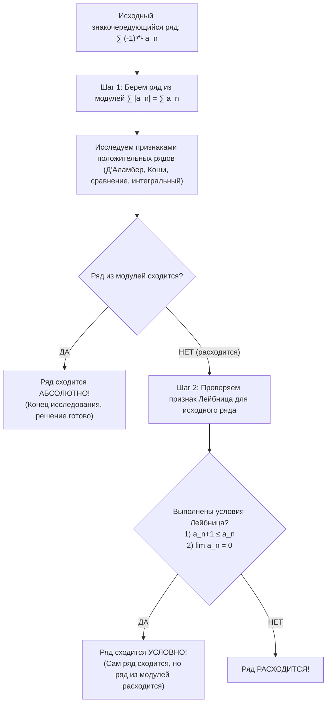

# 📐 Лекция № 1. Числовые ряды: основные понятия, сходимость и признаки сходимости

**Дисциплина:** Высшая математика (3-й семестр)  
**ВУЗ:** Московский технический университет связи и информатики (МТУСИ)  
**Факультет / Центр:** Центр заочного обучения по программам бакалавриата  
**Направление:** 09.03.02 «Информационные системы и технологии»  
**Профиль:** Инженерия DevSecOps  
**Дата записи лекции:** 14 сентября 2026 года  
**Исходный видеоматериал:** `2026-09-14 09-26-28.mp4` (09:26:28 – 11:01:01)  
**Продолжительность:** 1 час 34 минуты 33 секунды (5673 сек.)  
**Полная стенограмма:** [lecture-01-transcript.txt](./transcripts/lecture-01-transcript.txt)

---

## 📑 Содержание лекции

1. [Организационный регламент и структура курса](#1-организационный-регламент-и-структура-курса)
   - 1.1. [Формат занятий и распределение часов](#11-формат-занятий-и-распределение-часов)
   - 1.2. [Критерии аттестации и оценивания](#12-критерии-аттестации-и-оценивания)
   - 1.3. [Учебная литература и практические задания](#13-учебная-литература-и-практические-задания)
2. [Числовые последовательности и понятие ряда](#2-числовые-последовательности-и-понятие-ряда)
   - 2.1. [Последовательность и её общий член](#21-последовательность-и-её-общий-член)
   - 2.2. [Определение числового ряда](#22-определение-числового-ряда)
   - 2.3. [Прикладное значение теории рядов](#23-прикладное-значение-теории-рядов)
3. [Сходимость ряда и частичные суммы](#3-сходимость-ряда-и-частичные-суммы)
   - 3.1. [Последовательность частичных сумм](#31-последовательность-частичных-сумм)
   - 3.2. [Сходимость по определению](#32-сходимость-по-определению)
4. [Основные свойства сходящихся рядов](#4-основные-свойства-сходящихся-рядов)
5. [Необходимый признак сходимости ряда](#5-необходимый-признак-сходимости-ряда)
   - 5.1. [Формулировка теоремы и практическое следствие](#51-формулировка-теоремы-и-практическое-следствие)
   - 5.2. [Ловушка необходимого условия: почему предел 0 не гарантирует сходимость](#52-ловушка-необходимого-условия-почему-предел-0-не-гарантирует-сходимость)
6. [Базовые эталонные ряды](#6-базовые-эталонные-ряды)
   - 6.1. [Геометрический ряд (бесконечная прогрессия)](#61-геометрический-ряд-бесконечная-прогрессия)
   - 6.2. [Гармонический ряд](#62-гармонический-ряд)
   - 6.3. [Обобщенный гармонический ряд (ряд Дирихле)](#63-обобщенный-гармонический-ряд-ряд-дирихле)
7. [Признаки сходимости рядов с положительными членами](#7-признаки-сходимости-рядов-с-положительными-членами)
   - 7.1. [Первый признак сравнения (мажорантный / минорантный)](#71-первый-признак-сравнения-мажорантный--минорантный)
   - 7.2. [Второй (предельный) признак сравнения и таблица эквивалентностей](#72-второй-предельный-признак-сравнения-и-таблица-эквивалентностей)
   - 7.3. [Признак Д’Аламбера (с подробным разбором примера)](#73-признак-даламбера-с-подробным-разбором-примера)
   - 7.4. [Радикальный признак Коши (с подробным разбором примера)](#74-радикальный-признак-коши-с-подробным-разбором-примера)
   - 7.5. [Интегральный признак Коши — Маклорена и несобственные интегралы I рода](#75-интегральный-признак-коши--маклорена-и-несобственные-интегралы-i-рода)
8. [Знакопеременные и знакочередующиеся ряды](#8-знакопеременные-и-знакочередующиеся-ряды)
   - 8.1. [Определение знакочередующегося ряда](#81-определение-знакочередующегося-ряда)
   - 8.2. [Признак Лейбница](#82-признак-лейбница)
   - 8.3. [Абсолютная и условная сходимость: пошаговый алгоритм](#83-абсолютная-и-условная-сходимость-пошаговый-алгоритм)
9. [Комплексные числа и ряды с комплексными членами](#9-комплексные-числа-и-ряды-с-комплексными-членами)
   - 9.1. [Мотивация расширения множества чисел: от R к C](#91-мотивация-расширения-множества-чисел-от-r-к-c)
   - 9.2. [Мнимая единица и алгебраическая форма комплексного числа](#92-мнимая-единица-и-алгебраическая-форма-комплексного-числа)
   - 9.3. [Ряды с комплексными членами и их сходимость](#93-ряды-с-комплексными-членами-и-их-сходимость)
10. [Сводная шпаргалка по признакам сходимости](#10-сводная-шпаргалка-по-признакам-сходимости)
11. [Хронология и таймкоды видеозаписи](#11-хронология-и-таймкоды-видеозаписи)
12. [Вопросы для самопроверки](#12-вопросы-для-самопроверки)

---

## 1. Организационный регламент и структура курса

### 1.1. Формат занятий и распределение часов
* **Формат:** Полностью дистанционный семестр. Очные пары не предусмотрены.
* **Объем дисциплины:** 5 ЗЕТ (180 академических часов).
* **Сетка аудиторных часов текущей сессии:**
  * **4 лекции** (по 2 акад. часа = 8 часов).
  * **4 практических занятия** (по 2 акад. часа = 8 часов).
* **Тематический план лекций:**
  * **Лекция № 1 (текущая):** Числовые ряды: сходимость, признаки сходимости знакоположительных рядов, знакочередующиеся ряды, введение в комплексные ряды.
  * **Лекция № 2:** Функциональные и степенные ряды, ряды Тейлора и Маклорена, ряды Фурье.
  * **Лекция № 3 (вечер того же дня):** Дифференциальные уравнения: уравнения 1-го порядка, разделяющиеся переменные, однородные и линейные ДУ.
  * **Лекция № 4 (пятница):** Дифференциальные уравнения высших порядков, линейные однородные и неоднородные ДУ с постоянными коэффициентами.
* **Посещаемость:** Обязательный учет через ведомости. Старосты всех 8 групп потока обязаны отправлять списки присутствующих студентов преподавателю в WhatsApp / Личный кабинет по алфавиту после каждой пары.

### 1.2. Критерии аттестации и оценивания
* **Оценка «Удовлетворительно» («3»):**
  * Полное и самостоятельное решение обязательного набора типовых расчетных заданий.
  * Оформление в рукописном виде в отдельной тетради, отправка качественного скана / фото в едином формате PDF через старосту группы.
  * Преподаватель делает строгий акцент: решения должны быть поняты и выполнены самостоятельно, без слепого копирования решений из нейросетей (ChatGPT, Photomath и т.д.).
* **Оценка «Хорошо» («4»):**
  * Выполнение обязательного набора задач плюс блок дополнительных задач повышенной сложности.
* **Оценка «Отлично» («5»):**
  * Выполнение всех заданий плюс индивидуальное собеседование / сдача устного экзамена преподавателю.
* **Сроки сдачи (дедлайны):**
  * Задания выдаются после проведения первого практического занятия.
  * Срок сдачи — во второй половине октября (не позднее, чем за одну неделю до сессионного экзамена).

### 1.3. Учебная литература и практические задания
* **Основное пособие:** «Сборник задач по высшей математике» (электронный файл предоставляется кафедрой).
* Все номера задач для домашней контрольной работы берутся непосредственно из этого сборника.

---

## 2. Числовые последовательности и понятие ряда

### 2.1. Последовательность и её общий член
**Числовая последовательность** — это бесконечный упорядоченный набор чисел, занумерованных натуральными числами $n \in \mathbb{N}$:
$$a_1, a_2, a_3, \dots, a_n, \dots$$

**Примеры последовательностей и их формулы общего члена $a_n$:**
1. Натуральные числа: $1, 2, 3, 4, 5, \dots \implies a_n = n$
2. Четные числа: $2, 4, 6, 8, 10, \dots \implies a_n = 2n$
3. Обратные числа: $1, \frac{1}{2}, \frac{1}{3}, \frac{1}{4}, \frac{1}{5}, \dots \implies a_n = \frac{1}{n}$

### 2.2. Определение числового ряда
> **Определение:** Числовым рядом называется формальное выражение, представляющее собой бесконечную сумму членов числовой последовательности:
> $$\sum_{n=1}^{\infty} a_n = a_1 + a_2 + a_3 + \dots + a_n + \dots$$

* Элементы $a_1, a_2, \dots$ называются **членами ряда**.
* Элемент $a_n$ называется **общим членом ряда** (он задает аналитическую формулу $n$-го слагаемого в зависимости от номера $n$).
* Знак $\sum$ («сигма») обозначает суммирование от начального индекса ($n=1$) до бесконечности ($\infty$).

```text
               Общий член ряда
                      │
           ∞          ▼
           ∑        a_n  =  a_1 + a_2 + a_3 + ... + a_n + ...
          n=1
           ▲
           │
     Индекс суммирования
```

### 2.3. Прикладное значение теории рядов
В математическом моделировании систем, физике и телекоммуникациях точные решения сложных дифференциальных уравнений часто не выражаются через конечные элементарные функции. Решение строится в виде бесконечного ряда.
* Если полученный ряд **сходится**, мы получаем конструктивное решение задачи с заданной погрешностью.
* Если ряд **расходится**, решение не имеет физического и математического смысла (сумма бесконечна или неопределенна).

---

## 3. Сходимость ряда и частичные суммы

### 3.1. Последовательность частичных сумм
Поскольку сложить бесконечное число слагаемых обычным арифметическим путем невозможно, вводится аппарат предельного перехода:

* **1-я частичная сумма:** $S_1 = a_1$
* **2-я частичная сумма:** $S_2 = a_1 + a_2$
* **3-я частичная сумма:** $S_3 = a_1 + a_2 + a_3$
* **$n$-я частичная сумма:**
  $$S_n = \sum_{k=1}^{n} a_k = a_1 + a_2 + \dots + a_n$$

> ⚠️ **Важное замечание лектора:** $S_n$ — это конечная сумма ровно первых $n$ членов. В ней нет многоточия в конце!

### 3.2. Сходимость по определению
Формируется числовая последовательность частичных сумм $\{S_n\} = \{S_1, S_2, S_3, \dots, S_n, \dots\}$.

> **Определение сходимости:**  
> Ряд $\sum_{n=1}^\infty a_n$ называется **сходящимся**, если последовательность его частичных сумм $\{S_n\}$ имеет конечный предел при $n \to \infty$:
> $$S = \lim_{n \to \infty} S_n$$
> Число $S$ называется **суммой ряда** (пишут $\sum_{n=1}^\infty a_n = S$).

* Если $\lim_{n \to \infty} S_n = \pm \infty$ или предел **не существует**, то ряд называется **расходящимся**. Расходящийся ряд суммы не имеет.

---

## 4. Основные свойства сходящихся рядов

1. **Свойство отбрасывания конечного числа членов:**
   Если в ряде отбросить (или приписать к нему) конечное число первых слагаемых, то полученный ряд и исходный ряд сходятся или расходятся **одновременно**.
   *(Отбрасывание конечного числа членов изменяет величину суммы сходящегося ряда, но не влияет на сам факт сходимости).*

2. **Свойство линейности (умножение на константу):**
   Если ряд $\sum a_n$ сходится и его сумма равна $S$, то ряд $\sum (c \cdot a_n)$, где $c \in \mathbb{R}$ ($c \neq 0$), также сходится, и его сумма равна:
   $$\sum_{n=1}^{\infty} c \cdot a_n = c \cdot S$$

3. **Свойство почленного сложения (вычитания) рядов:**
   Если ряды $\sum a_n$ и $\sum b_n$ сходятся и имеют суммы $S_1$ и $S_2$ соответственно, то ряд $\sum (a_n \pm b_n)$ также сходится, причем:
   $$\sum_{n=1}^{\infty} (a_n \pm b_n) = S_1 \pm S_2$$

---

## 5. Необходимый признак сходимости ряда

### 5.1. Формулировка теоремы и практическое следствие

> **Теорема (Необходимый признак):**  
> Если числовой ряд $\sum_{n=1}^\infty a_n$ сходится, то предел его общего члена при стремлении $n$ к бесконечности обязательно равен нулю:
> $$\lim_{n \to \infty} a_n = 0$$

> **Практическое следствие (Достаточный признак расходимости):**  
> Если $\lim_{n \to \infty} a_n \neq 0$ или этот предел вовсе не существует, то ряд **гарантированно расходится**.

**Пример 1:**
$$\sum_{n=1}^{\infty} n = 1 + 2 + 3 + \dots$$
$\lim_{n \to \infty} a_n = \lim_{n \to \infty} n = \infty \neq 0 \implies$ ряд **расходится** по необходимому признаку.

**Пример 2:**
$$\sum_{n=1}^{\infty} \frac{2n + 1}{3n - 2}$$
$\lim_{n \to \infty} a_n = \lim_{n \to \infty} \frac{2n + 1}{3n - 2} = \frac{2}{3} \neq 0 \implies$ ряд **расходится** по необходимому признаку.

### 5.2. Ловушка необходимого условия: почему предел 0 не гарантирует сходимость
> ❗ **Критически важное правило высшей математики:**
> Равенство $\lim_{n \to \infty} a_n = 0$ является **необходимым, но НЕ достаточным** условием сходимости!
> Если предел общего члена равен 0, ряд **может как сходиться, так и расходиться**. Необходим дальнейший анализ другими признаками.

**Аналогия преподавателя про бесконечно малые:**
> «Если 1 рубль разделить на 200 студентов в аудитории — каждый получит копейки. Если разделить 1 рубль на всех жителей Москвы или на 8 миллиардов жителей Земли — каждый получит практически ноль: $\frac{1}{\infty} \to 0$. Член ряда бесконечно мал, но накопленная сумма бесконечного числа таких слагаемых может неограниченно возрастать!»

---

## 6. Базовые эталонные ряды

С этими тремя рядами сопоставляются все остальные ряды в задачах:

### 6.1. Геометрический ряд (бесконечная прогрессия)
$$\sum_{n=0}^{\infty} a q^n = a + aq + aq^2 + aq^3 + \dots \quad (a \neq 0)$$
* **Если $|q| < 1$** (т.е. $-1 < q < 1$) $\implies$ ряд **сходится**, его сумма равна:
  $$S = \frac{a}{1 - q}$$
* **Если $|q| \ge 1$** $\implies$ ряд **расходится**.

### 6.2. Гармонический ряд
$$\sum_{n=1}^{\infty} \frac{1}{n} = 1 + \frac{1}{2} + \frac{1}{3} + \frac{1}{4} + \dots$$
* Предел общего члена: $\lim_{n \to \infty} \frac{1}{n} = 0$.
* Тем не менее, сумма ряда растет логарифмически медленно («как черепаха»), но неограниченно:
  $$S_n \approx \ln n + \gamma \xrightarrow[n \to \infty]{} \infty$$
* **Гармонический ряд ВСЕГДА расходится!**

### 6.3. Обобщенный гармонический ряд (ряд Дирихле)
$$\sum_{n=1}^{\infty} \frac{1}{n^p} = \frac{1}{1^p} + \frac{1}{2^p} + \frac{1}{3^p} + \dots$$
* **Если $p > 1$** $\implies$ ряд **сходится**.
* **Если $p \le 1$** ($0 < p \le 1$) $\implies$ ряд **расходится**.
* При $p = 1$ получаем обычный гармонический ряд $\sum \frac{1}{n}$, который расходится.

---

## 7. Признаки сходимости рядов с положительными членами

Рассматриваются ряды $\sum a_n$, у которых все члены строго положительны: $a_n > 0$.

### 7.1. Первый признак сравнения (мажорантный / минорантный)
Пусть для рядов $\sum a_n$ и $\sum b_n$ начиная с некоторого номера $N$ выполняется неравенство:
$$0 < a_n \le b_n$$
1. Если сходится «больший» (мажорантный) ряд $\sum b_n$, то **сходится** и «меньший» ряд $\sum a_n$.
2. Если расходится «меньший» (минорантный) ряд $\sum a_n$, то **расходится** и «больший» ряд $\sum b_n$.

> ⚠️ Обратное неверно: из расходимости большего ряда ничего нельзя сказать о меньшем, а из сходимости меньшего — о большем.

### 7.2. Второй (предельный) признак сравнения и таблица эквивалентностей
Пусть даны два ряда с положительными членами $\sum a_n$ и $\sum b_n$. Вычисляется предел отношения их общих членов:
$$K = \lim_{n \to \infty} \frac{a_n}{b_n}$$
* Если **$0 < K < \infty$** (предел существует, конечен и отличен от нуля), то оба ряда **ведут себя одинаково**: они либо одновременно сходятся, либо одновременно расходятся.
* **Правило выбора эталона:** В качестве $b_n$ обычно выбирают ряд Дирихле $\frac{1}{n^p}$ со степенью $p$, определяемой разностью старших степеней числителя и знаменателя $a_n$.

#### Полезные эквивалентности при $n \to \infty$ ($\alpha_n = \frac{1}{n} \to 0$):
* $\sin\left(\frac{1}{n}\right) \sim \frac{1}{n}$
* $\operatorname{tg}\left(\frac{1}{n}\right) \sim \frac{1}{n}$
* $\arcsin\left(\frac{1}{n}\right) \sim \frac{1}{n}$
* $\operatorname{arctg}\left(\frac{1}{n}\right) \sim \frac{1}{n}$
* $\ln\left(1 + \frac{1}{n}\right) \sim \frac{1}{n}$
* $e^{1/n} - 1 \sim \frac{1}{n}$

### 7.3. Признак Д’Аламбера (с подробным разбором примера)
Для ряда $\sum a_n$ с положительными членами составляется отношение следующего члена к текущему и ищется предел:
$$L = \lim_{n \to \infty} \frac{a_{n+1}}{a_n}$$
* **$L < 1$** $\implies$ ряд **сходится**.
* **$L > 1$** $\implies$ ряд **расходится**.
* **$L = 1$** $\implies$ **признак не дает ответа** (сомнительный случай, требуется другой метод).

#### 🔍 Разбор примера из лекции: применение признака Д’Аламбера к гармоническому ряду $a_n = \frac{1}{n}$
1. Записываем $a_n = \frac{1}{n}$.
2. Записываем $a_{n+1}$: подставляем $(n+1)$ вместо каждого вхождения $n$:
   $$a_{n+1} = \frac{1}{n+1}$$
3. Составляем отношение и предел:
   $$L = \lim_{n \to \infty} \frac{a_{n+1}}{a_n} = \lim_{n \to \infty} \frac{\frac{1}{n+1}}{\frac{1}{n}} = \lim_{n \to \infty} \frac{n}{n+1}$$
4. Раскрываем неопределенность $\left[\frac{\infty}{\infty}\right]$, деля числитель и знаменатель на $n$:
   $$L = \lim_{n \to \infty} \frac{1}{1 + \frac{1}{n}} = \frac{1}{1 + 0} = 1$$
5. **Вывод:** Получили $L = 1$. Признак Д’Аламбера не дал ответа. Это классический пример: для рациональных алгебраических дробей признак Д’Аламбера всегда дает $L=1$. Он идеален для факториалов ($n!$) и показательных функций ($c^n$).

### 7.4. Радикальный признак Коши (с подробным разбором примера)
Вычисляется предел корня $n$-й степени из общего члена ряда:
$$L = \lim_{n \to \infty} \sqrt[n]{a_n}$$
* **$L < 1$** $\implies$ ряд **сходится**.
* **$L > 1$** $\implies$ ряд **расходится**.
* **$L = 1$** $\implies$ **признак не дает ответа**.

> 💡 **Когда применять:** Когда общий член ряда содержит показатель степени, зависящий от $n$ (например, $a_n = [f(n)]^n$ или $a_n = [f(n)]^{k n}$).

#### 🔍 Разбор примера из лекции: исследование ряда $\sum_{n=1}^\infty \frac{1}{n^{2n}}$
1. Общий член: $a_n = \frac{1}{n^{2n}} = \left(\frac{1}{n^2}\right)^n$.
2. Применяем признак Коши:
   $$L = \lim_{n \to \infty} \sqrt[n]{a_n} = \lim_{n \to \infty} \sqrt[n]{\frac{1}{n^{2n}}} = \lim_{n \to \infty} \frac{1}{\left(n^{2n}\right)^{1/n}} = \lim_{n \to \infty} \frac{1}{n^2}$$
3. Вычисляем предел:
   $$\lim_{n \to \infty} \frac{1}{n^2} = \frac{1}{\infty} = 0$$
4. Сравниваем с единицей: $L = 0 < 1$.
5. **Вывод:** По радикальному признаку Коши ряд **сходится**.

### 7.5. Интегральный признак Коши — Маклорена и несобственные интегралы I рода
Пусть члены ряда положительны и монотонно убывают:
$$a_1 \ge a_2 \ge a_3 \ge \dots \ge a_n \ge \dots > 0$$
Пусть существует непрерывная, положительная, монотонно убывающая на промежутке $[1; +\infty)$ функция $f(x)$ такая, что $f(n) = a_n$.

> **Теорема:** Ряд $\sum_{n=1}^\infty a_n$ и несобственный интеграл $\int_1^\infty f(x)\,dx$ сходятся или расходятся **одновременно**.

#### Методология вычисления несобственного интеграла 1-го рода (ответ лектора на вопрос студента):
Интеграл с бесконечным верхним пределом вычисляется через предельный переход:
$$\int_{1}^{\infty} f(x)\,dx = \lim_{b \to \infty} \int_{1}^{b} f(x)\,dx$$
1. Вычисляется обычный определенный интеграл с переменным верхним пределом $b$:
   $$F(b) - F(1)$$
2. Находится предел полученного первообразного выражения при $b \to \infty$:
   $$\lim_{b \to \infty} [F(b) - F(1)]$$
3. Если предел равен конечному числу $I$ $\implies$ интеграл **сходится** (и соответствующий ряд сходится). Если предел равен $\infty$ или не существует $\implies$ интеграл и ряд **расходятся**.

---

## 8. Знакопеременные и знакочередующиеся ряды

### 8.1. Определение знакочередующегося ряда
Ряд называется **знакопеременным**, если среди его членов есть как положительные, так и отрицательные числа.
Важнейший частный случай — **знакочередующийся ряд**, у которого любые два соседних члена имеют противоположные знаки:
$$\sum_{n=1}^{\infty} (-1)^{n+1} a_n = a_1 - a_2 + a_3 - a_4 + \dots \quad (a_n > 0)$$
или
$$\sum_{n=1}^{\infty} (-1)^n a_n = -a_1 + a_2 - a_3 + a_4 - \dots \quad (a_n > 0)$$

### 8.2. Признак Лейбница
> **Теорема Лейбница:**  
> Знакочередующийся ряд сходится, если выполнены **два условия**:
> 1. Члены ряда монотонно убывают по абсолютной величине:
>    $$a_1 \ge a_2 \ge a_3 \ge \dots \ge a_n \ge a_{n+1} \ge \dots$$
> 2. Предел общего члена равен нулю:
>    $$\lim_{n \to \infty} a_n = 0$$

### 8.3. Абсолютная и условная сходимость: пошаговый алгоритм
При исследовании любого знакочередующегося ряда применяется строгий алгоритм:



#### Терминология:
* **Абсолютная сходимость:** Ряд $\sum (-1)^{n+1} a_n$ сходится, и ряд из абсолютных величин $\sum a_n$ также сходится.
* **Условная сходимость:** Ряд $\sum (-1)^{n+1} a_n$ сходится (по признаку Лейбница), но ряд из абсолютных величин $\sum a_n$ расходится.
  * *Классический пример условной сходимости:* ряд Лейбница $\sum_{n=1}^\infty \frac{(-1)^{n+1}}{n} = 1 - \frac{1}{2} + \frac{1}{3} - \frac{1}{4} + \dots = \ln 2$. Сам ряд сходится, а ряд из модулей $\sum \frac{1}{n}$ (гармонический) — расходится!

---

## 9. Комплексные числа и ряды с комплексными членами

### 9.1. Мотивация расширения множества чисел: от $\mathbb{R}$ к $\mathbb{C}$
На числовой прямой действительных чисел $\mathbb{R}$ ($-\infty < x < +\infty$) уравнение:
$$x^2 + 1 = 0 \iff x^2 = -1$$
не имеет решений, так как квадрат любого действительного числа неотрицателен ($x^2 \ge 0$).
В школьной математике говорят: *«решений нет»*. Математически корректный ответ: *«решений нет в поле действительных чисел $\mathbb{R}$»*.

В физических процессах (электродинамика, волновые уравнения, теория колебаний, радиотехника) решения подобных уравнений наблюдаются экспериментально, что потребовало создания множества **комплексных чисел $\mathbb{C}$**.

### 9.2. Мнимая единица и алгебраическая форма комплексного числа
Вводится **мнимая единица** $i$:
$$i^2 = -1 \quad (\text{или } i = \sqrt{-1})$$

Тогда уравнение $x^2 = -1$ имеет два комплексных корня:
$$x^2 = i^2 \implies x = \pm i$$

* **Алгебраическая форма комплексного числа $z \in \mathbb{C}$:**
  $$z = x + i y$$
  где $x, y \in \mathbb{R}$.
  * $x = \operatorname{Re}(z)$ — **действительная часть** (*Real*).
  * $y = \operatorname{Im}(z)$ — **мнимая часть** (*Imaginary*).

#### Примеры:
* $z = 2 + 3i$ — комплексное число ($\operatorname{Re}=2, \operatorname{Im}=3$).
* $z = -1 - 5i$ — комплексное число ($\operatorname{Re}=-1, \operatorname{Im}=-5$).
* $z = 6 = 6 + 0\cdot i$ — действительное число, также принадлежащее $\mathbb{C}$ ($\mathbb{R} \subset \mathbb{C}$).
* $z = 2i = 0 + 2i$ — чисто мнимое число ($\operatorname{Re}=0, \operatorname{Im}=2$).
* $z = i = 0 + 1\cdot i$.

### 9.3. Ряды с комплексными членами и их сходимость
Пусть общий член ряда является комплексным числом: $z_n = x_n + i y_n$, где $x_n, y_n \in \mathbb{R}$.
Ряд $\sum_{n=1}^\infty z_n$ распадается на два действительных числовых ряда:
$$\sum_{n=1}^{\infty} z_n = \sum_{n=1}^{\infty} (x_n + i y_n) = \sum_{n=1}^{\infty} x_n + i \sum_{n=1}^{\infty} y_n$$

> **Теорема:** Ряд с комплексными членами $\sum z_n$ сходится тогда и только тогда, когда **одновременно сходятся оба действительных числовых ряда**:
> 1. Ряд действительных частей: $\sum_{n=1}^\infty x_n$
> 2. Ряд мнимых частей: $\sum_{n=1}^\infty y_n$
> Если хотя бы один из них расходится, то комплексный ряд расходится.

---

## 10. Сводная шпаргалка по признакам сходимости

| Признак | Условие / Формула | Сходится | Расходится | Не дает ответа | Когда применять |
| :--- | :--- | :---: | :---: | :---: | :--- |
| **Необходимый признак** | $\lim_{n \to \infty} a_n$ | — | Если $\neq 0$ | Если $= 0$ | Всегда в первую очередь (в уме) |
| **Геометрический ряд** | $\sum a q^n$ | $|q| < 1$ | $|q| \ge 1$ | — | Суммы степеней констант |
| **Ряд Дирихле** | $\sum \frac{1}{n^p}$ | $p > 1$ | $p \le 1$ | — | Главный эталон сравнения |
| **1-й признак сравнения** | $a_n \le b_n$ | Если $\sum b_n$ сход. | Если $\sum a_n$ расх. | — | При явных неравенствах |
| **2-й признак (предельный)** | $\lim_{n \to \infty} \frac{a_n}{b_n} = K$ | Если $\sum b_n$ сход. | Если $\sum b_n$ расх. | $K=0$ или $K=\infty$ | Алгебраические дроби, тригонометрия |
| **Признак Д’Аламбера** | $\lim_{n \to \infty} \frac{a_{n+1}}{a_n} = L$ | $L < 1$ | $L > 1$ | $L = 1$ | Факториалы $n!$, показательные $a^n$ |
| **Признак Коши (радикальный)**| $\lim_{n \to \infty} \sqrt[n]{a_n} = L$ | $L < 1$ | $L > 1$ | $L = 1$ | Выражения в степени $n$, $n^2$ |
| **Интегральный признак** | $\int_1^\infty f(x)\,dx$ | Интеграл сход. | Интеграл расх. | — | Легко интегрируемые функции |
| **Признак Лейбница** | $a_{n+1} \le a_n$ и $a_n \to 0$ | Оба выполнены | Нарушены | — | Знакочередующиеся ряды |

---

## 11. Хронология и таймкоды видеозаписи

* **[08:33]** Начало записи, проверка связи, сбор студентов в видеоконференции (рост со 150 до 170+ человек).
* **[09:00]** Приветствие преподавателя, напоминание о совместной работе на 1 курсе, подтверждение последнего семестра высшей математики для потока.
* **[10:05]** Перекличка старост по номерам групп (1–8 группы).
* **[11:49]** Разъяснение регламента заполнения электронных ведомостей и правил передачи списков присутствующих.
* **[13:01]** Объявление правил дистанционного семестра: выдача расчетных заданий, требования к рукописным решениям и сканам PDF.
* **[14:17]** Градация оценок: условия получения «3», дополнительные задачи на «4», экзаменационное собеседование на «5».
* **[14:50]** Расписание сессии: 4 лекции и 4 практики, проведение 3 лекций в первый день.
* **[15:45]** Вопрос студентки (Варвара Конышева) о пересдаче дисциплины за прошлый год с «3» на «4» через деканат.
* **[16:38]** Разъяснение сроков сдачи заданий: дедлайн за неделю до сессионных экзаменов (вторая половина октября).
* **[17:49]** Анонс двух ключевых разделов курса: 1) Числовые и функциональные ряды; 2) Дифференциальные уравнения.
* **[18:37]** Диалог со студентами о самостоятельности решений и отношении преподавателя к использованию ИИ.
* **[20:48]** Демонстрация экрана: задачник «Сборник задач по высшей математике».
* **[22:07]** Введение понятия последовательности чисел, примеры натуральных, четных и обратных чисел.
* **[23:54]** Переход от последовательности к числовому ряду: сложение бесконечного числа слагаемых.
* **[24:44]** Обозначение общего члена $a_n$ и оператора суммы $\sum_{n=1}^\infty$.
* **[27:34]** Постановка фундаментального вопроса теории рядов: «Сходится ли данный ряд?».
* **[28:43]** Сравнение сумм рядов: неограниченный рост $\sum n$ против медленно растущего ряда $\sum \frac{1}{n}$.
* **[31:24]** Прикладное объяснение: ряды как форма записи аналитических решений дифференциальных уравнений.
* **[33:11]** Исследование сходимости по определению: частичные суммы $S_1, S_2, \dots, S_n$ и их предел.
* **[36:27]** Теоремы о свойствах сходящихся рядов: отбрасывание членов, умножение на скаляр, сумма рядов.
* **[40:06]** Необходимый признак сходимости: формулировка $\lim_{n \to \infty} a_n = 0$.
* **[41:33]** Разбор ловушки необходимого признака: предел $\frac{1}{n}$ равен 0, но гармонический ряд расходится.
* **[42:47]** Метафора преподавателя: распределение 1 рубля среди студентов аудитории, Москвы и населения Земли.
* **[45:49]** Эталонные ряды. Геометрический ряд $\sum a q^n$, условия сходимости $|q| < 1$.
* **[47:44]** Гармонический ряд $\sum \frac{1}{n}$: доказанный факт его постоянной расходимости.
* **[48:49]** Ряд Дирихле $\sum \frac{1}{n^p}$: области сходимости ($p > 1$) и расходимости ($p \le 1$).
* **[53:12]** Недостаточность определения: переход к достаточным признакам сходимости рядов с положительными членами.
* **[54:19]** Первый признак сравнения рядов по неравенствам: мажорирование и минорирование.
* **[56:01]** Второй (предельный) признак сравнения через $\lim \frac{a_n}{b_n} = K$.
* **[58:01]** Эквивалентные бесконечно малые в пределах членов рядов.
* **[58:34]** Признак Д’Аламбера: предел отношения $L = \lim \frac{a_{n+1}}{a_n}$.
* **[01:00:29]** Подробный расчет признака Д’Аламбера для гармонического ряда $a_n = 1/n$ ($L = 1$, признак неприменим).
* **[01:03:18]** Вопрос студента о выборе оптимального признака сходимости.
* **[01:04:27]** Радикальный признак Коши: корень $n$-й степени из общего члена.
* **[01:05:52]** Разбор примера на признак Коши: исследование сходимости ряда $a_n = \frac{1}{n^{2n}}$ ($L = 0 < 1$, ряд сходится).
* **[01:07:28]** Интегральный признак Коши — Маклорена.
* **[01:09:00]** Напоминание студентам понятия несобственного интеграла 1-го рода с бесконечным пределом.
* **[01:12:14]** Подробный вывод формулы вычисления несобственного интеграла через предельный переход $\lim_{b \to \infty} \int_1^b f(x)dx$.
* **[01:14:28]** Знакопеременные и знакочередующиеся ряды: множитель $(-1)^{n+1}$.
* **[01:16:54]** Признак Лейбница: монотонное убывание абсолютных величин и стремление общего члена к 0.
* **[01:18:13]** Понятия абсолютной и условной сходимости знакочередующихся рядов.
* **[01:19:16]** Алгоритм исследования знакочередующегося ряда: модуль $\to$ признак Лейбница.
* **[01:22:43]** Введение в комплексные числа $\mathbb{C}$.
* **[01:24:10]** Обзор числовых множеств: $\mathbb{N} \subset \mathbb{Z} \subset \mathbb{Q} \subset \mathbb{R} \subset \mathbb{C}$.
* **[01:25:10]** Решение уравнений $x^2 - 1 = 0$ и $x^2 + 1 = 0$.
* **[01:26:04]** Алгебраическая форма $z = x + iy$, мнимая единица $i^2 = -1$.
* **[01:29:40]** Физическая необходимость комплексных чисел в теории колебаний и электродинамике.
* **[01:30:33]** Ряды с комплексными членами: разделение на действительную и мнимую части.
* **[01:31:05]** Завершение лекции, ответы на вопросы студентов, обсуждение комплексного анализа.
* **[01:32:08]** Повторное обращение к старостам групп по поводу списков посещаемости.
* **[01:34:07]** Объявление 15-минутного перерыва перед 2-й лекцией.

---

## 12. Вопросы для самопроверки

1. Чем отличается числовая последовательность от числового ряда?
2. Дайте определение сходимости ряда через предел последовательности частичных сумм.
3. Почему утверждение «если общий член ряда стремится к нулю, то ряд сходится» является ложным? Приведите контрпример.
4. При каких значениях параметра $p$ обобщенный гармонический ряд $\sum \frac{1}{n^p}$ сходится, а при каких расходится?
5. В каких случаях признак Д'Аламбера не дает ответа? Какие ряды целесообразно исследовать этим признаком?
6. Для каких типов общих членов наиболее эффективен радикальный признак Коши?
7. В чем принципиальное отличие абсолютной сходимости знакочередующегося ряда от условной?
8. Как формулируется признак Лейбница?
9. Что такое мнимая единица и почему $i^2 = -1$?
10. При каком условии сходится ряд с комплексными членами $\sum (x_n + i y_n)$?
