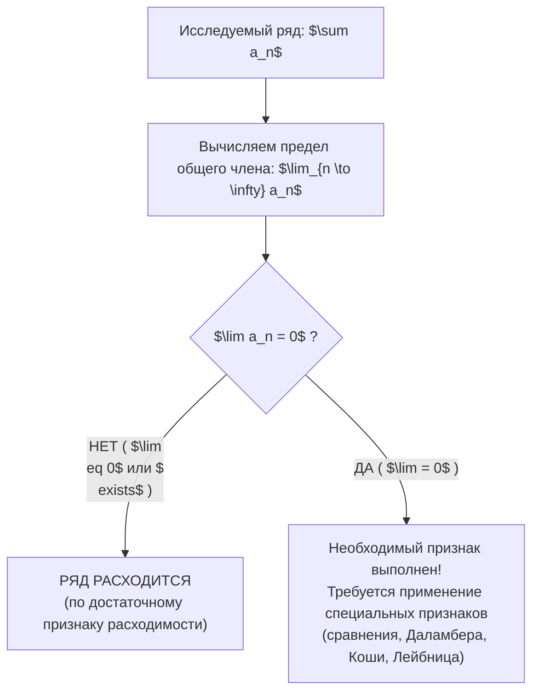
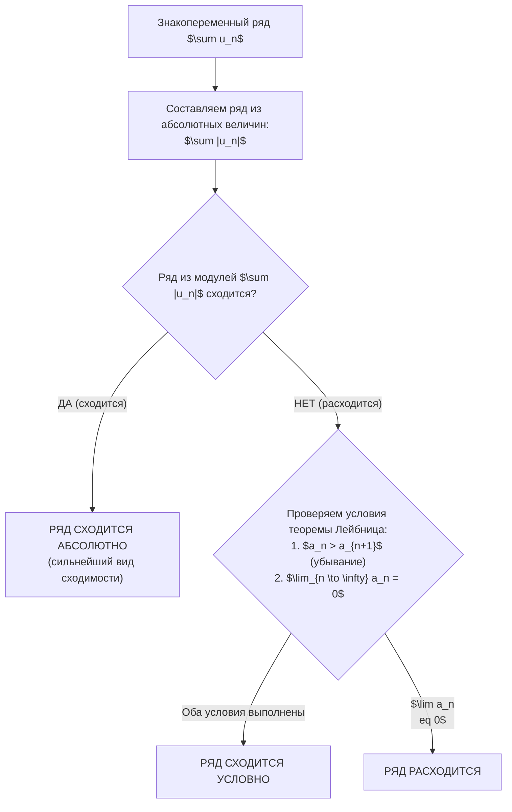

# 📐 Практическое занятие №1: Исследование сходимости числовых рядов

> **Университет:** МТУСИ (Московский технический университет связи и информатики)  
> **Факультет / Подразделение:** Центр заочного обучения по программам бакалавриата  
> **Направление:** 09.03.02 «Информационные системы и технологии» (DevSecOps)  
> **Дисциплина:** Высшая математика (2 курс, 3 семестр)  
> **Дата занятия:** 17 сентября 2026 г.  
> **Преподаватель:** **Алмохамед Муатаз**  
> **Учебное пособие:** «Сборник задач по высшей математике. Курс 2» (Кафедра высшей математики МТУСИ)  
> **Исходная видеозапись:** `D:\video\Вышмат пр 17.09.mp4` (01:48:37)  
> **Полная стенограмма:** `D:\video\Вышмат пр 17.09_transcript.txt` (3 838 сегментов)  

---

## 🧭 Навигация и оглавление
1. [Вводная часть и организация работы [18:04]](#1-вводная-часть-и-организация-работы-1804)
2. [Базовые понятия: числовой ряд, частичные суммы, сходимость [20:10]](#2-базовые-понятия-числовой-ряд-частичные-суммы-сходимость-2010)
3. [Необходимый признак сходимости и достаточный признак расходимости [21:55]](#3-необходимый-признак-сходимости-и-достаточный-признак-расходимости-2155)
   - [Задача 1.1.9 (а): Рациональная дробь с равными степенями [22:56]](#задача-119-а-рациональная-дробь-с-равными-степенями-2256)
   - [Задача 1.1.9 (б): Применение правила Лопиталя к логарифмам [27:05]](#задача-119-б-применение-правила-лопиталя-к-логарифмам-2705)
   - [Задача 1.1.9 (в): Случай равенства предела нулю [33:15]](#задача-119-в-случай-равенства-предела-нулю-3315)
4. [Первый признак сравнения (неравенства) [37:09]](#4-первый-признак-сравнения-неравенства-3709)
   - [Оценка тригонометрического ряда с синусом [38:21]](#оценка-тригонометрического-ряда-с-синусом-3821)
5. [Второй признак сравнения (предельный) и таблица эквивалентностей [42:32]](#5-второй-признак-сравнения-предельный-и-таблица-эквивалентностей-4232)
   - [Задача с многочленами разной степени [44:21]](#задача-с-многочленами-разной-степени-4421)
6. [Признак Даламбера (факториалы и показательные функции) [50:04]](#6-признак-даламбера-факториалы-и-показательные-функции-5004)
   - [Задача 1.1.35 (а): Показательно-степенной ряд [53:30]](#задача-1135-а-показательно-степенной-ряд-5330)
   - [Задача 1.1.35 (б): Сверхбыстро растущий ряд с n! и n^n [57:00]](#задача-1135-б-сверхбыстро-растущий-ряд-с-n-и-nn-5700)
7. [Радикальный признак Коши и второй замечательный предел [01:02:40]](#7-радикальный-признак-коши-и-второй-замечательный-предел-010240)
   - [Задача 1.1.43 (а): Дробно-линейная функция в степени 3n+1 [01:03:00]](#задача-1143-а-дробно-линейная-функция-в-степени-3n1-010300)
   - [Задача 1.1.43 (б): Экспоненциальное затухание (1 - 1/n)^(n^2) [01:09:48]](#задача-1143-б-экспоненциальное-затухание-1---1nn2-010948)
8. [Знакочередующиеся ряды: признак Лейбница, абсолютная и условная сходимость [01:15:20]](#8-знакочередующиеся-ряды-признак-лейбница-абсолютная-и-условная-сходимость-011520)
   - [Задача 1.2.1: Исследование ряда с корнем (условная сходимость) [01:16:14]](#задача-121-исследование-ряда-с-корнем-условная-сходимость-011614)
   - [Задача 1.2.2: Ряд с логарифмом 1/(2n - ln n) [01:23:20]](#задача-122-ряд-с-логарифмом-12n---ln-n-012320)
   - [Задача 1.2.3: Знакопеременный ряд, сходящийся абсолютно [01:30:37]](#задача-123-знакопеременный-ряд-сходящийся-абсолютно-013037)
   - [Задача 1.2.6: Нарушение необходимого признака сходимости [01:33:30]](#задача-126-нарушение-необходимого-признака-сходимости-013330)
9. [Сводная таблица признаков сходимости и эталонных рядов](#9-сводная-таблица-признаков-сходимости-и-эталонных-рядов)
10. [Организационная часть: контрольные работы, домашка и аттестация [01:34:26]](#10-организационная-часть-контрольные-работы-домашка-и-аттестация-013426)
11. [Задачи для самостоятельного решения (ДЗ)](#11-задачи-для-самостоятельного-решения-дз)

---

## 1. Вводная часть и организация работы [18:04]

- **Формат занятия:** Первая онлайн-практика по высшей математике в 3 семестре. Проводится на платформе «Контур Толк».
- **Цель занятия:** Научиться на конкретных задачах определять поведение числовых рядов (сходимость или расходимость), грамотно подбирать метод исследования и обосновывать выводы перед экзаменатором.
- **Особенность учебного графика:** После вводного лекционного интенсива студентам предстоит выполнить блок практических расчетных заданий до следующих трех очных/онлайн-практик.

---

## 2. Базовые понятия: числовой ряд, частичные суммы, сходимость [20:10]

### Определение числового ряда
**Числовым рядом** называется бесконечная сумма элементов числовой последовательности:
$$\sum_{n=1}^{\infty} a_n = a_1 + a_2 + a_3 + \dots + a_n + \dots$$
где $a_n$ — общий член ряда (формула $n$-го слагаемого).

### Частичные суммы и предел
Сумма первых $k$ членов ряда образует последовательность **частичных сумм**:
$$S_k = \sum_{n=1}^{k} a_n = a_1 + a_2 + \dots + a_k$$

- Если существует конечный предел последовательности частичных сумм:
  $$\lim_{k \to \infty} S_k = S \quad (|S| < \infty)$$
  то ряд называется **сходящимся**, а число $S$ — **суммой ряда**.
- Если предел $\lim_{k \to \infty} S_k$ равен $\pm\infty$ или вовсе не существует (например, сумма колеблется), то ряд называется **расходящимся**.

---

## 3. Необходимый признак сходимости и достаточный признак расходимости [21:55]

> [!IMPORTANT]
> **Теорема (Необходимый признак сходимости):**  
> Если числовой ряд $\sum_{n=1}^\infty a_n$ сходится, то предел его общего члена при $n \to \infty$ обязательно равен нулю:
> $$\lim_{n \to \infty} a_n = 0$$

### Достаточный признак расходимости (практическое следствие)
Если предел общего члена отличен от нуля или не существует:
$$\lim_{n \to \infty} a_n \neq 0 \quad \Longrightarrow \quad \text{ряд однозначно расходится!}$$

> [!WARNING]
> Обратное утверждение **неверно**: из того, что $\lim_{n \to \infty} a_n = 0$, **НЕ следует**, что ряд сходится!  
> *Классический контрпример:* гармонический ряд $\sum_{n=1}^\infty \frac{1}{n}$. Здесь $\lim_{n \to \infty} \frac{1}{n} = 0$, однако ряд расходится к $+\infty$.

---

### Задача 1.1.9 (а): Рациональная дробь с равными степенями [22:56]

**Условие:** Исследовать ряд на сходимость:
$$\sum_{n=1}^{\infty} \frac{n+1}{2n+1}$$

**Решение:**
1. Выделим общий член ряда:
   $$a_n = \frac{n+1}{2n+1}$$
2. Вычислим предел при $n \to \infty$:
   $$\lim_{n \to \infty} a_n = \lim_{n \to \infty} \frac{n+1}{2n+1} = \lim_{n \to \infty} \frac{1 + \frac{1}{n}}{2 + \frac{1}{n}} = \frac{1 + 0}{2 + 0} = \frac{1}{2}$$
3. **Экспресс-правило преподавателя [24:20]:** Если числитель и знаменатель представляют собой многочлены одинаковой старшей степени, то предел дроби равен отношению коэффициентов при старших степенях:
   $$\lim_{n \to \infty} \frac{1 \cdot n^1 + 1}{2 \cdot n^1 + 1} = \frac{1}{2}$$
4. **Вывод:** Так как $\lim_{n \to \infty} a_n = \frac{1}{2} \neq 0$, необходимый признак сходимости не выполняется. **Ряд расходится.**

---

### Задача 1.1.9 (б): Применение правила Лопиталя к логарифмам [27:05]

**Условие:** Исследовать ряд на сходимость:
$$\sum_{n=1}^{\infty} \frac{n+2}{\ln(n+1)}$$

**Решение:**
1. Проверяем предел общего члена:
   $$a_n = \frac{n+2}{\ln(n+1)}$$
2. При $n \to \infty$ имеем неопределенность вида $\left[\frac{\infty}{\infty}\right]$. Переходим к функции непрерывного аргумента $x \in [1; \infty)$ и применяем **правило Лопиталя** (дифференцирование числителя и знаменателя):
   $$\lim_{x \to \infty} \frac{x+2}{\ln(x+1)} = \left[\frac{\infty}{\infty}\right] = \lim_{x \to \infty} \frac{(x+2)'}{(\ln(x+1))'} = \lim_{x \to \infty} \frac{1}{\frac{1}{x+1}} = \lim_{x \to \infty} (x+1) = \infty$$
3. **Вывод:** Так как $\lim_{n \to \infty} a_n = \infty \neq 0$, необходимый признак нарушен. **Ряд расходится.**

---

### Задача 1.1.9 (в): Случай равенства предела нулю [33:15]

**Условие:** Рассмотреть общий член ряда:
$$\sum_{n=1}^{\infty} \frac{n^2}{n^3+2}$$

**Решение:**
1. Предел общего члена:
   $$\lim_{n \to \infty} \frac{n^2}{n^3+2} = \lim_{n \to \infty} \frac{\frac{1}{n}}{1 + \frac{2}{n^3}} = \frac{0}{1} = 0$$
2. **Анализ ситуации:** Предел равен нулю. Это означает, что **необходимый признак выполнен, но ответа о сходимости он не дает**. Ряд может как сходиться, так и расходиться. Для ответа требуются признаки сравнения.

---

## 4. Первый признак сравнения (неравенства) [37:09]

> [!IMPORTANT]
> **Теорема (Первый признак сравнения):**  
> Пусть даны два знакоположительных ряда $\sum_{n=1}^\infty a_n$ и $\sum_{n=1}^\infty b_n$, причем для всех $n$, начиная с некоторого номера, выполняется неравенство:
> $$0 \le a_n \le b_n$$
> 1. Если сходится больший ряд $\sum b_n$, то сходится и меньший ряд $\sum a_n$.
> 2. Если расходится меньший ряд $\sum a_n$, то расходится и больший ряд $\sum b_n$.

### Оценка тригонометрического ряда с синусом [38:21]

**Условие:** Исследовать на сходимость ряд:
$$\sum_{n=1}^{\infty} \frac{2 + \sin n}{n}$$

**Пошаговое решение:**
1. Вспомним фундаментальное свойство ограниченности тригонометрической функции синуса:
   $$-1 \le \sin n \le 1 \quad \forall n \in \mathbb{N}$$
2. Прибавим ко всем частям неравенства число 2:
   $$2 - 1 \le 2 + \sin n \le 2 + 1 \quad \Longrightarrow \quad 1 \le 2 + \sin n \le 3$$
3. Так как номер $n \ge 1$ (строго положителен), разделим неравенство на $n$ без смены знаков:
   $$\frac{2 + \sin n}{n} \ge \frac{1}{n}$$
4. Сравним с эталонным рядом $\sum_{n=1}^\infty \frac{1}{n}$ — это **гармонический ряд**, который заведомо **расходится**.
5. **Вывод:** Поскольку меньший ряд $\sum_{n=1}^\infty \frac{1}{n}$ расходится, то по первому признаку сравнения больший ряд $\sum_{n=1}^\infty \frac{2 + \sin n}{n}$ также **расходится**.

---

## 5. Второй признак сравнения (предельный) и таблица эквивалентностей [42:32]

> [!IMPORTANT]
> **Теорема (Предельный признак сравнения):**  
> Пусть $\sum a_n$ и $\sum b_n$ — ряды с положительными членами, и существует конечный отличный от нуля предел:
> $$\lim_{n \to \infty} \frac{a_n}{b_n} = K \quad (0 < K < \infty)$$
> Тогда оба ряда ведут себя одинаково: либо одновременно сходятся, либо одновременно расходятся.

### Таблица эквивалентных бесконечно малых при $n \to \infty$
При исследовании пределов рядов с тригонометрическими и трансцендентными функциями аргумент $\frac{1}{n} \to 0$:
$$\sin \frac{1}{n} \sim \frac{1}{n}, \quad \operatorname{tg} \frac{1}{n} \sim \frac{1}{n}, \quad rcsin \frac{1}{n} \sim \frac{1}{n}, \quad \operatorname{arctg} \frac{1}{n} \sim \frac{1}{n}, \quad \ln\left(1 + \frac{1}{n}\right) \sim \frac{1}{n}, \quad e^{1/n} - 1 \sim \frac{1}{n}$$

---

### Задача с многочленами разной степени [44:21]

**Условие:** Исследовать на сходимость ряд:
$$\sum_{n=1}^{\infty} \frac{n+2}{n^2 + n + 1}$$

**Пошаговое решение:**
1. При $n \to \infty$ поведение многочлена определяется его старшей степенью:
   - В числителе: $n + 2 \sim n$
   - В знаменателе: $n^2 + n + 1 \sim n^2$
2. Следовательно, эквивалентный эталонный общий член:
   $$a_n = \frac{n+2}{n^2 + n + 1} \sim \frac{n}{n^2} = \frac{1}{n} = b_n$$
3. Вычисляем предел отношения $a_n$ к $b_n$:
   $$\lim_{n \to \infty} \frac{a_n}{b_n} = \lim_{n \to \infty} \frac{\frac{n+2}{n^2+n+1}}{\frac{1}{n}} = \lim_{n \to \infty} \frac{n(n+2)}{n^2+n+1} = \lim_{n \to \infty} \frac{n^2 + 2n}{n^2 + n + 1} = 1 \neq 0$$
4. Так как $K = 1 \in (0; \infty)$, исследуемый ряд ведет себя так же, как эталонный ряд $\sum_{n=1}^\infty \frac{1}{n}$.
5. **Вывод:** Гармонический ряд $\sum \frac{1}{n}$ расходится $\Longrightarrow$ исследуемый ряд **расходится**.

---

## 6. Признак Даламбера (факториалы и показательные функции) [50:04]

Преподаватель подчеркнул: *«Признак Даламбера — один из самых удобных и практичных, так как ему не требуется искать вспомогательный эталонный ряд: ряд проверяет сам себя через отношение соседних членов»*.

> [!IMPORTANT]
> **Теорема (Признак Даламбера):**  
> Пусть $\sum_{n=1}^\infty a_n$ — ряд с положительными членами, и существует предел:
> $$l = \lim_{n \to \infty} \frac{a_{n+1}}{a_n}$$
> 1. Если $l < 1$ — ряд **сходится**.
> 2. Если $l > 1$ — ряд **расходится**.
> 3. Если $l = 1$ — признак **не дает ответа** (требуется применять другой признак: сравнения, Раабе или интегральный).

**Маркеры применимости признака Даламбера:**
- Наличие факториалов: $n!$, $(2n)!$, $(n+1)!$
- Наличие показательных функций: $a^n$, $3^{n+1}$
- Наличие выражений вида $n^n$ в комбинации с факториалами.

---

### Задача 1.1.35 (а): Показательно-степенной ряд [53:30]

**Условие:** Исследовать на сходимость ряд:
$$\sum_{n=1}^{\infty} \frac{n^5}{3^{n+1}}$$

**Пошаговое решение:**
1. Запишем $a_n$ и сформируем следующий член $a_{n+1}$, подставив вместо каждого вхождения $n$ выражение $(n+1)$:
   $$a_n = \frac{n^5}{3^{n+1}}, \qquad a_{n+1} = \frac{(n+1)^5}{3^{(n+1)+1}} = \frac{(n+1)^5}{3^{n+2}}$$
2. Составим отношение $\frac{a_{n+1}}{a_n}$:
   $$\frac{a_{n+1}}{a_n} = \frac{(n+1)^5}{3^{n+2}} \cdot \frac{3^{n+1}}{n^5} = \left(\frac{n+1}{n}\right)^5 \cdot \frac{3^{n+1}}{3^{n+1} \cdot 3} = \frac{1}{3} \left(1 + \frac{1}{n}\right)^5$$
3. Найдем предел:
   $$l = \lim_{n \to \infty} \frac{a_{n+1}}{a_n} = \lim_{n \to \infty} \left[ \frac{1}{3} \left(1 + \frac{1}{n}\right)^5 \right] = \frac{1}{3} \cdot (1 + 0)^5 = \frac{1}{3}$$
4. **Вывод:** Так как $l = \frac{1}{3} < 1$, по признаку Даламбера ряд **сходится**.

---

### Задача 1.1.35 (б): Сверхбыстро растущий ряд с n! и n^n [57:00]

**Условие:** Исследовать на сходимость ряд:
$$\sum_{n=1}^{\infty} \frac{n^n}{n!}$$

**Пошаговое решение:**
1. Составим $a_n$ и $a_{n+1}$:
   $$a_n = \frac{n^n}{n!}, \qquad a_{n+1} = \frac{(n+1)^{n+1}}{(n+1)!}$$
2. Раскроем факториал и степень:
   $$(n+1)! = (n+1) \cdot n!, \qquad (n+1)^{n+1} = (n+1)^n \cdot (n+1)$$
3. Упростим дробь $\frac{a_{n+1}}{a_n}$:
   $$\frac{a_{n+1}}{a_n} = \frac{(n+1)^n \cdot (n+1)}{(n+1) \cdot n!} \cdot \frac{n!}{n^n} = \frac{(n+1)^n}{n^n} = \left(\frac{n+1}{n}\right)^n = \left(1 + \frac{1}{n}\right)^n$$
4. Вычислим предел, используя **второй замечательный предел**:
   $$l = \lim_{n \to \infty} \frac{a_{n+1}}{a_n} = \lim_{n \to \infty} \left(1 + \frac{1}{n}\right)^n = e pprox 2{,}71828$$
5. **Вывод:** Так как $l = e > 1$, по признаку Даламбера ряд **расходится** (более того, его общий член стремится к $+\infty$, а не к 0).

---

## 7. Радикальный признак Коши и второй замечательный предел [01:02:40]

> [!IMPORTANT]
> **Теорема (Радикальный признак Коши):**  
> Пусть $\sum_{n=1}^\infty a_n$ — знакоположительный ряд, и существует предел:
> $$l = \lim_{n \to \infty} \sqrt[n]{a_n}$$
> 1. Если $l < 1$ — ряд **сходится**.
> 2. Если $l > 1$ — ряд **расходится**.
> 3. Если $l = 1$ — признак **не дает ответа**.

**Маркер применимости:** Общий член $a_n$ целиком возведен в степень, зависящую от $n$ (например, $[\dots]^n$, $[\dots]^{3n+1}$, $[\dots]^{n^2}$). Корень $\sqrt[n]{\dots}$ «снимает» эту внешнюю степень: $\sqrt[n]{A^k} = A^{k/n}$.

---

### Задача 1.1.43 (а): Дробно-линейная функция в степени 3n+1 [01:03:00]

**Условие:** Исследовать на сходимость ряд:
$$\sum_{n=1}^{\infty} \left(\frac{n+2}{2n+1}\right)^{3n+1}$$

**Пошаговое решение:**
1. Извлекаем корень $n$-й степени из общего члена:
   $$\sqrt[n]{a_n} = \sqrt[n]{\left(\frac{n+2}{2n+1}\right)^{3n+1}} = \left(\frac{n+2}{2n+1}\right)^{\frac{3n+1}{n}} = \left(\frac{n+2}{2n+1}\right)^{3 + \frac{1}{n}}$$
2. Находим предел основания и показателя степени по отдельности:
   $$\lim_{n \to \infty} \frac{n+2}{2n+1} = \frac{1}{2}, \qquad \lim_{n \to \infty} \left(3 + \frac{1}{n}\right) = 3 + 0 = 3$$
3. Итоговый предел корня Коши:
   $$l = \lim_{n \to \infty} \sqrt[n]{a_n} = \left(\frac{1}{2}\right)^3 = \frac{1}{8}$$
4. **Вывод:** Так как $l = \frac{1}{8} < 1$, ряд **сходится** по признаку Коши.

---

### Задача 1.1.43 (б): Экспоненциальное затухание (1 - 1/n)^(n^2) [01:09:48]

**Условие:** Исследовать на сходимость ряд:
$$\sum_{n=1}^{\infty} n \cdot \left(1 - \frac{1}{n}\right)^{n^2}$$

**Пошаговое решение:**
1. Применяем радикал Коши к произведению:
   $$\sqrt[n]{a_n} = \sqrt[n]{n \cdot \left(1 - \frac{1}{n}\right)^{n^2}} = \sqrt[n]{n} \cdot \left(1 - \frac{1}{n}\right)^{\frac{n^2}{n}} = n^{1/n} \cdot \left(1 - \frac{1}{n}\right)^n$$
2. Вычисляем предел первого сомножителя $\lim_{n \to \infty} n^{1/n}$:
   $$n^{1/n} = e^{\ln(n^{1/n})} = e^{\frac{\ln n}{n}}$$
   По правилу Лопиталя: $\lim_{n \to \infty} \frac{\ln n}{n} = \lim_{n \to \infty} \frac{1/n}{1} = 0 \Longrightarrow \lim_{n \to \infty} n^{1/n} = e^0 = 1$.
3. Вычисляем предел второго сомножителя через второй замечательный предел:
   $$\lim_{n \to \infty} \left(1 + \frac{lpha}{n}\right)^n = e^lpha \quad \text{при } lpha = -1 \quad \Longrightarrow \quad \lim_{n \to \infty} \left(1 - \frac{1}{n}\right)^n = e^{-1} = \frac{1}{e}$$
4. Перемножаем пределы:
   $$l = \lim_{n \to \infty} \sqrt[n]{a_n} = 1 \cdot \frac{1}{e} = \frac{1}{e} pprox 0{,}36788$$
5. **Вывод:** Так как $l = \frac{1}{e} < 1$, по признаку Коши исходный ряд **сходится**.

---

## 8. Знакочередующиеся ряды: признак Лейбница, абсолютная и условная сходимость [01:15:20]

Ряд вида $\sum_{n=1}^\infty (-1)^{n+1} a_n = a_1 - a_2 + a_3 - a_4 + \dots$ ($a_n > 0$) называется **знакочередующимся**.

> [!IMPORTANT]
> **Теорема Лейбница:**  
> Знакочередующийся ряд $\sum_{n=1}^\infty (-1)^{n+1} a_n$ ($a_n > 0$) сходится, если выполнены два условия:
> 1. Члены ряда монотонно убывают по модулю: $a_n > a_{n+1}$ для всех $n \ge n_0$.
> 2. Предел общего члена равен нулю: $\lim_{n \to \infty} a_n = 0$.
> При этом сумма ряда удовлетворяет оценке $0 < S < a_1$, а остаток ряда $R_n$ оценивается как $|R_n| < a_{n+1}$.

---

### Задача 1.2.1: Исследование ряда с корнем (условная сходимость) [01:16:14]

**Условие:** Исследовать на абсолютную и условную сходимость ряд:
$$\sum_{n=1}^{\infty} \frac{(-1)^{n+1}}{2\sqrt{n}-1}$$

**Пошаговое решение:**
1. **Шаг 1. Исследуем ряд из абсолютных величин:**
   $$\sum_{n=1}^{\infty} \left| \frac{(-1)^{n+1}}{2\sqrt{n}-1} 
ight| = \sum_{n=1}^{\infty} \frac{1}{2\sqrt{n}-1}$$
   По предельному признаку сравнения при $n \to \infty$:
   $$\frac{1}{2\sqrt{n}-1} \sim \frac{1}{2\sqrt{n}} = \frac{1}{2} \cdot \frac{1}{n^{1/2}}$$
   Эталонный обобщенный гармонический ряд Дирихле $\sum \frac{1}{n^p}$ при $p = \frac{1}{2} \le 1$ **расходится**.  
   Следовательно, ряд из модулей расходится $\Longrightarrow$ **абсолютной сходимости нет**.
2. **Шаг 2. Проверяем признак Лейбница для знакочередующегося ряда:**
   - Монотонное убывание членов:
     $$n < n+1 \implies \sqrt{n} < \sqrt{n+1} \implies 2\sqrt{n}-1 < 2\sqrt{n+1}-1 \implies \frac{1}{2\sqrt{n}-1} > \frac{1}{2\sqrt{n+1}-1}$$
     Неравенство $a_n > a_{n+1}$ строго выполняется для всех $n \ge 1$.
   - Предел общего члена:
     $$\lim_{n \to \infty} a_n = \lim_{n \to \infty} \frac{1}{2\sqrt{n}-1} = \frac{1}{\infty} = 0$$
3. **Вывод:** Знакочередующийся ряд сходится по признаку Лейбница, но ряд из его модулей расходится. Исходный ряд **сходится условно**.

---

### Задача 1.2.2: Ряд с логарифмом 1/(2n - ln n) [01:23:20]

**Условие:** Исследовать на сходимость ряд:
$$\sum_{n=1}^{\infty} \frac{(-1)^{n+1}}{2n - \ln n}$$

**Пошаговое решение:**
1. **Ряд из абсолютных величин:**
   $$\sum_{n=1}^{\infty} \frac{1}{2n - \ln n}$$
   Сравним со стандартным гармоническим рядом $\sum \frac{1}{n}$ по второму (предельному) признаку:
   $$\lim_{n \to \infty} \frac{\frac{1}{2n - \ln n}}{\frac{1}{n}} = \lim_{n \to \infty} \frac{n}{2n - \ln n} = \lim_{n \to \infty} \frac{1}{2 - \frac{\ln n}{n}}$$
   Так как $\lim_{n \to \infty} \frac{\ln n}{n} = 0$ (по Лопиталю), получаем:
   $$K = \frac{1}{2 - 0} = \frac{1}{2} \neq 0$$
   Так как гармонический ряд $\sum \frac{1}{n}$ расходится, то ряд из абсолютных величин также **расходится**. Абсолютной сходимости нет.
2. **Проверка условий Лейбница:**
   - Знаменатель $2n - \ln n$ монотонно возрастает (производная $(2x - \ln x)' = 2 - \frac{1}{x} > 0$ при $x \ge 1$), поэтому члены $a_n = \frac{1}{2n - \ln n}$ строго убывают: $a_n > a_{n+1}$.
   - Предел общего члена: $\lim_{n \to \infty} \frac{1}{2n - \ln n} = 0$.
3. **Вывод:** Исходный знакочередующийся ряд **сходится условно**.

---

### Задача 1.2.3: Знакопеременный ряд, сходящийся абсолютно [01:30:37]

**Условие:** Исследовать на сходимость ряд:
$$\sum_{n=1}^{\infty} (-1)^{n-1} \frac{n}{3^n}$$

**Пошаговое решение:**
1. Составим ряд из абсолютных величин:
   $$\sum_{n=1}^{\infty} \frac{n}{3^n}$$
2. Применим к нему признак Даламбера:
   $$a_n = \frac{n}{3^n}, \qquad a_{n+1} = \frac{n+1}{3^{n+1}}$$
   $$\frac{a_{n+1}}{a_n} = \frac{n+1}{3^{n+1}} \cdot \frac{3^n}{n} = \frac{n+1}{n} \cdot \frac{1}{3} = \left(1 + \frac{1}{n}\right) \cdot \frac{1}{3}$$
   $$l = \lim_{n \to \infty} \frac{a_{n+1}}{a_n} = 1 \cdot \frac{1}{3} = \frac{1}{3} < 1$$
3. Так как $l < 1$, ряд из абсолютных величин **сходится**.
4. **Вывод:** Исходный знакопеременный ряд **сходится абсолютно** (проверять теорему Лейбница уже не требуется, так как абсолютная сходимость влечет обычную).

---

### Задача 1.2.6: Нарушение необходимого признака сходимости [01:33:30]

**Условие:** Исследовать на сходимость ряд:
$$\sum_{n=1}^{\infty} (-1)^n \frac{n^2 + 1}{5n^2 - 2}$$

**Решение:**
1. Проверим предел абсолютной величины общего члена:
   $$\lim_{n \to \infty} |u_n| = \lim_{n \to \infty} \frac{n^2 + 1}{5n^2 - 2} = \lim_{n \to \infty} \frac{1 + \frac{1}{n^2}}{5 - \frac{2}{n^2}} = \frac{1}{5} \neq 0$$
2. Так как общий член $u_n = (-1)^n \frac{n^2+1}{5n^2-2}$ при $n \to \infty$ колеблется около значений $+\frac{1}{5}$ и $-\frac{1}{5}$, предел $\lim_{n \to \infty} u_n$ вообще не существует (и не равен нулю).
3. **Вывод:** Не выполнен необходимый признак сходимости. **Ряд расходится.**

---

## 9. Сводная таблица признаков сходимости и эталонных рядов

### Базовые эталонные ряды для сравнения

| Название ряда | Формула | Условие сходимости | Условие расходимости |
| :--- | :---: | :---: | :---: |
| **Обобщенный гармонический (ряд Дирихле)** | $\sum_{n=1}^\infty \frac{1}{n^p}$ | $p > 1$ | $p \le 1$ ($p=1$ — гармонический ряд) |
| **Геометрическая прогрессия** | $\sum_{n=0}^\infty q^n$ | $\|q\| < 1$ ($S = \frac{a_0}{1-q}$) | $\|q\| \ge 1$ |

### Матрица признаков сходимости

| Признак сходимости | Расчетная формула | Когда применять | Условия и выводы |
| :--- | :---: | :--- | :--- |
| **Необходимый признак** | $\lim_{n \to \infty} a_n$ | Всегда в первую очередь | Если $\neq 0 \implies$ расходится. Если $=0 \implies$ проверять дальше |
| **1-й признак сравнения** | $a_n \le b_n$ | Тригонометрия ($\sin, \cos$), ограниченные функции | Больший сходится $\implies$ меньший сходится. Меньший расходится $\implies$ больший расходится |
| **2-й (предельный) признак сравнения** | $\lim_{n \to \infty} \frac{a_n}{b_n} = K$ | Алгебраические дроби с многочленами, корни, эквивалентности | При $0 < K < \infty$ ряды ведут себя одинаково |
| **Признак Даламбера** | $l = \lim_{n \to \infty} \frac{a_{n+1}}{a_n}$ | Факториалы $n!$, показательные функции $a^n$ | $l < 1$ — сходится, $l > 1$ — расходится, $l = 1$ — не дает ответа |
| **Радикальный признак Коши** | $l = \lim_{n \to \infty} \sqrt[n]{a_n}$ | Выражение целиком в степени $n$, $n^2$, $k \cdot n$ | $l < 1$ — сходится, $l > 1$ — расходится, $l = 1$ — не дает ответа |
| **Признак Лейбница** | 1) $a_n > a_{n+1}$ 2) $\lim a_n = 0$ | Знакочередующиеся ряды $\sum (-1)^n a_n$ | Выполнены оба $\implies$ сходится. Если ряд модулей расходится $\implies$ сходимость условная |

---

## 10. Организационная часть: контрольные работы, домашка и аттестация [01:34:26]

В заключительной части занятия преподаватель подробно ответил на вопросы старосты и студентов относительно порядка сдачи и аттестации по высшей математике:

1. **Критерии оценок:**
   - **Оценка «3» (Удовлетворительно):** Полное решение базового пула типовых расчетных заданий из задачника (исследование сходимости рядов стандартными методами).
   - **Оценка «4» (Хорошо):** Базовый пул + решение заданий повышенной сложности (исследование рядов с функциональными параметрами, вычисление радиусов сходимости степенных рядов, разложение в ряды Фурье).
   - **Оценка «5» (Отлично):** Безупречное выполнение всех контрольных задач, защита теоретической базы (умение доказать условия теорем Лейбница, Даламбера, Коши) и решение нестандартных олимпиадных задач.
2. **Сроки сдачи:**
   - Преподаватель ориентирует студентов решать задания ритмично по мере прохождения тем и не откладывать до последней предсессионной недели.
   - Главная цель кафедры — глубокое усвоение принципов решения и понимание аппарата математического анализа.

---

## 11. Задачи для самостоятельного решения (ДЗ)

Преподаватель выделил задачи со слайдов для домашней отработки:

### Доказать, что ряд сходится условно:
- **1.2.7.** $\sum_{n=1}^{\infty} \frac{(-1)^{n-1}}{\ln(n+1)}$
- **1.2.8.** $\sum_{n=1}^{\infty} \frac{(-1)^n (2n+1)}{n(n+2)}$
- **1.2.9.** $\sum_{n=2}^{\infty} \frac{(-1)^n}{n \ln n \sqrt{\ln \ln n}}$
- **1.2.10.** $\sum_{n=1}^{\infty} (-1)^{n+1} \frac{1}{2n - \sqrt{n}}$

### Доказать, что ряд сходится абсолютно:
- **1.2.11.** $\sum_{n=1}^{\infty} (-1)^{n-1} \frac{1}{n^2}$  
  *(Указание: ряд из модулей $\sum \frac{1}{n^2}$ сходится как ряд Дирихле с $p = 2 > 1$)*
- **1.2.12.** $\sum_{n=1}^{\infty} \frac{(-1)^n}{(2n-2)!}$  
  *(Указание: по признаку Даламбера для ряда из модулей отношение соседних членов стремится к 0)*
