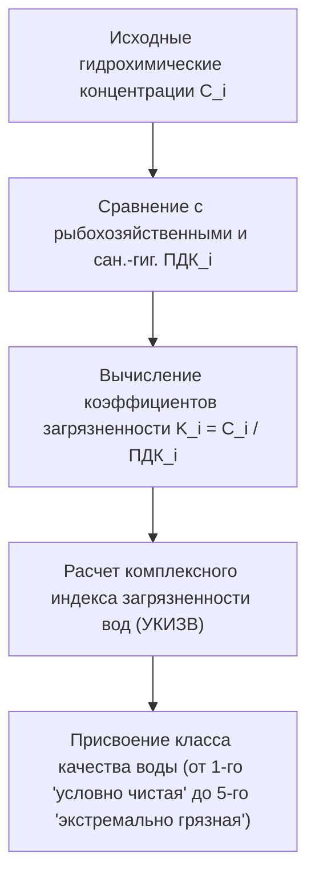
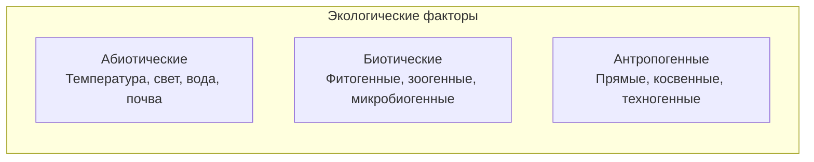
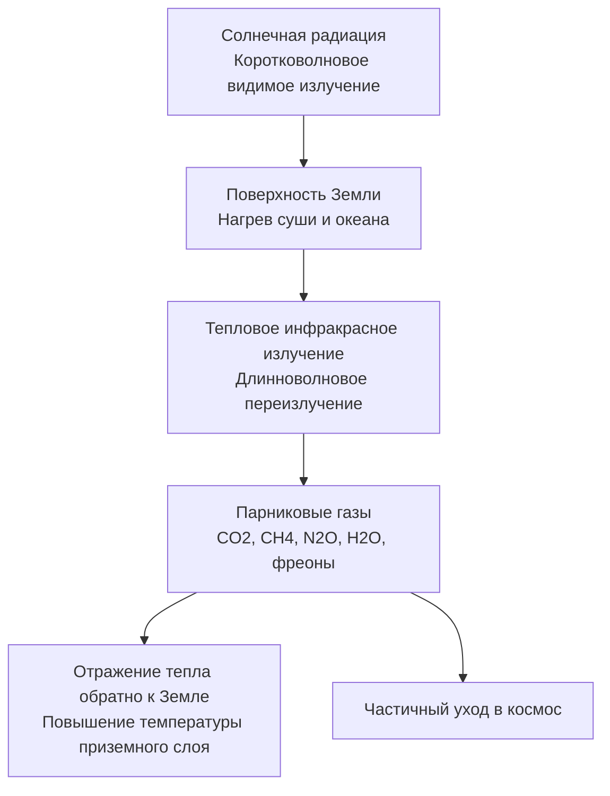

# 🌿 Информационная экология: Комплексный синтез видеолекции и слайдов презентации

> **Дисциплина:** Информационная экология  
> **Университет:** МТУСИ (Центр заочного обучения по программам бакалавриата)  
> **Группы:** БСТ2551 – БСТ2558 (2 курс, 3 семестр)  
> **Преподаватель:** к.ф.-м.н., доцент **Курбатов Валерий Александрович** (`v.a.kurbatov@mtuci.ru`)  
> **Дата занятия:** 15 сентября 2026 г.  
> **Видеофайл:** `D:\video\2026-09-15 13-00-53.mp4` (продолжительность: 3 часа 44 минуты 56 секунд = 225 минут)  
> **Нарезка кадров презентации:** `D:\lekcii\slides\` (225 кадров с шагом 1 минута, `slide_0001.jpg` ... `slide_0225.jpg`)  
> **Полный стенографический транскрипт:** [`transcripts/lecture-2026-09-15-transcript.txt`](./transcripts/lecture-2026-09-15-transcript.txt) (3313 сегментов)

---

## 📑 Содержание конспекта

1. [Шаг 1. Первые 10 строк расшифровки аудио](#1-шаг-1-первые-10-строк-расшифровки-аудио)
2. [Шаг 2. Поминутный анализ слайдов презентации и визуальных материалов](#2-шаг-2-поминутный-анализ-слайдов-презентации-и-визуальных-материалов)
3. [Шаг 3. Комплексный синтез: структурированный конспект занятия](#3-шаг-3-комплексный-синтез-структурированный-конспект-занятия)
   - 3.1. [Организационный регламент и Лабораторная работа №1 «Оценка качества воды»](#31-организационный-регламент-и-лабораторная-работа-1-оценка-качества-воды)
   - 3.2. [Предмет и специфика дисциплины «Информационная экология»](#32-предмет-и-специфика-дисциплины-информационная-экология)
   - 3.3. [Жизнь как термодинамический процесс: энтропия, негэнтропия и открытые биосистемы](#33-жизнь-как-термодинамический-процесс-энтропия-негэнтропия-и-открытые-биосистемы)
   - 3.4. [Экологические факторы и законы толерантности (Либих, Шелфорд)](#34-экологические-факторы-и-законы-толерантности-либих-шелфорд)
   - 3.5. [Популяционная динамика: биотический потенциал и логистический рост](#35-популяционная-динамика-биотический-потенциал-и-логистический-рост)
   - 3.6. [Экосистемы, биогеоценозы и фундаментальные законы экологии Коммонера](#36-экосистемы-биогеоценозы-и-фундаментальные-законы-экологии-коммонера)
   - 3.7. [Санитарно-гигиеническое нормирование: формулы ПДВ, ПДС и градации ПДК](#37-санитарно-гигиеническое-нормирование-формулы-пдв-пдс-и-градации-пдк)
   - 3.8. [Глобальные проблемы биосферы: классификация загрязнителей и парниковый эффект](#38-глобальные-проблемы-биосферы-классификация-загрязнителей-и-парниковый-эффект)
   - 3.9. [Радиоактивное и радиационное загрязнение: полураспад, активность и риски](#39-радиоактивное-и-радиационное-загрязнение-полураспад-активность-и-риски)
   - 3.10. [Озоновый кризис, кислотные осадки, смоги и температурная инверсия](#310-озоновый-кризис-кислотные-осадки-смоги-и-температурная-инверсия)
   - 3.11. [Деградация почв, проблема отходов, загрязнение Мирового океана и экология человека](#311-деградация-почв-проблема-отходов-загрязнение-мирового-океана-и-экология-человека)

---

## 1. Шаг 1. Первые 10 строк расшифровки аудио

Ниже представлены первые 10 строк транскрипта видеозаписи `2026-09-15 13-00-53.mp4`, полученные с помощью модели Whisper `large-v3`:

```text
[00:00] Солнце моё, вы когда говорите, говорите, что членораздельный. Я плохо вас слышу.
[00:06] Запись экрана ЛМС.
[00:12] Хорошо. Здесь информационная экология. Видим, нет?
[00:16] Да.
[00:18] Информационная экология БСТ 2551-58, да?
[00:23] Всё верно.
[00:25] Да-да.
[00:26] Спасибо. Поехали, ребят.
[00:28] Значит, суть происходящего.
[00:31] Вот это у вас находится в личном кабинете, ребят.
```

---

## 2. Шаг 2. Поминутный анализ слайдов презентации и визуальных материалов

Кадры `slide_0001.jpg` – `slide_0225.jpg` соответствуют минутам 1–225 видеозаписи. В результате последовательного анализа визуальных экранов выделены следующие содержательные блоки:

| Временной диапазон | Номера кадров (слайдов) | Отображаемый визуальный контент на экране | Тема, тезисы, формулы и ключевые схемы |
| :---: | :---: | :--- | :--- |
| **01 – 05 мин** | `slide_0001.jpg` – `slide_0005.jpg` | Личный кабинет LMS МТУСИ (`lms.mtuci.ru`), курс «Информационная экология (БСТ2551-58)». | • Правила освоения курса: лекции, лабораторный практикум, тестирование.<br>• Контакты: `v.a.kurbatov@mtuci.ru`. |
| **06 – 08 мин** | `slide_0006.jpg` – `slide_0008.jpg` | Методические указания к Лабораторной работе №1 «Оценка качества воды» (PDF, 8 стр.). | • Литература: Максимова Т.А., Мишаков И.В. «Экология гидросферы».<br>• Таблица исходных данных и распределения вариантов.<br>• Расчетные показатели: БПК, взвешенные вещества, нефтепродукты, фенолы, ионы тяжелых металлов ($Fe, Cr^{3+}, Cr^{6+}, Cd, Zn$), $NO_3^-, NO_2^-$. |
| **09 – 17 мин** | `slide_0009.jpg` – `slide_0017.jpg` | Окно видеоконференции «Контур.Толк», общий чат потока, перекличка. | • Ответы на вопросы студентов по оформлению отчетов (Word / PDF), правилам сдачи и срокам аттестации. |
| **18 – 25 мин** | `slide_0018.jpg` – `slide_0025.jpg` | Титульный слайд и оглавление лекционного курса (презентация 219 слайдов). | • Название: «Курс лекций по предмету «Информационная экология» (Заочная форма обучения, 2026 г.).<br>• Определение экологии (Эрнст Геккель, 1866 г., греч. *oikos* — жилище, *logos* — наука).<br>• Специфика информационной экологии: информационные потоки, сигнальные связи в биосистемах, техногенное электромагнитное и когнитивное поле. |
| **26 – 35 мин** | `slide_0026.jpg` – `slide_0035.jpg` | Раздел 2.2. Слайд «Жизнь как термодинамический процесс» (стр. 9/219). | • Жизнь как способ существования белковых тел (Ф. Энгельс).<br>• Открытые неравновесные термодинамические системы.<br>• Преобразование солнечной энергии в химические связи.<br>• Энтропия $S$ как мера хаоса; живые системы поддерживают упорядоченность за счет оттока энтропии во внешнюю среду: $dS = d_i S + d_e S$, где $d_e S < 0$ (концепция негэнтропии Э. Шрёдингера). |
| **36 – 58 мин** | `slide_0036.jpg` – `slide_0058.jpg` | Разделы: Геосферы Земли, экологические факторы, законы толерантности. | • Структура биосферы (атмосфера, тропосфера, стратосфера, гидросфера, литосфера).<br>• Абиотические факторы: световой режим, температура, влажность, фазовые переходы воды (роса, туман).<br>• Закон минимума Ю. Либиха (лимитирующий фактор, «бочка Либиха»).<br>• Закон толерантности В. Шелфорда: колоколообразная кривая (зона оптимума, зоны пессимума, критические точки минимума и максимума). |
| **59 – 80 мин** | `slide_0059.jpg` – `slide_0080.jpg` | График «Динамика популяций» (стр. 22/219), трофические цепи, экосистемы. | • График: биотический потенциал (экспонента), сопротивление среды, предел численности (емкость среды $K$), логистическая S-образная кривая роста.<br>• Понятия биоценоза, биотопа и биогеоценоза (В.Н. Сукачев).<br>• Трофические уровни: продуценты $\to$ консументы I порядка $\to$ консументы II порядка $\to$ редуценты.<br>• Экологические пирамиды, правило 10% Р. Линдемана. |
| **81 – 99 мин** | `slide_0081.jpg` – `slide_0099.jpg` | Слайды «Законы экологии Барри Коммонера» и закон ограниченности ресурсов. | • 4 закона Б. Коммонера: 1) «Всё связано со всем»; 2) «Всё должно куда-то деваться»; 3) «Природа знает лучше»; 4) «Ничто не дается даром».<br>• Закон ограниченности природных ресурсов: Земля — замкнутая материальная система. |
| **100 – 125 мин** | `slide_0100.jpg` – `slide_0125.jpg` | Статичный экран конференции «Контур.Толк». | • Академический перерыв между парами. |
| **126 – 153 мин** | `slide_0126.jpg` – `slide_0153.jpg` | Слайд «Санитарно-гигиеническое нормирование: ПДВ, ПДС, ПДК» (стр. 37/219). | • Формула: $\text{ПДВ} = (\text{ПДК} - K_{\text{фон}}) \cdot K_{\text{разб}}$.<br>• Градации ПДК: максимально разовая ($\text{ПДК}_{\text{м.р.}}$, экспозиция $\le 20$ мин), среднесуточная ($\text{ПДК}_{\text{с.с.}}$), рабочей зоны ($\text{ПДК}_{\text{р.з.}}$, 8 ч/день, высота до 2 м).<br>• Токсикометрия: $\text{ЛК}_{50}$ и $\text{ЛД}_{50}$.<br>• Условия сброса сточных вод в водоемы. |
| **154 – 179 мин** | `slide_0154.jpg` – `slide_0179.jpg` | Лекция №2: Слайд «Загрязнитель» (стр. 142/219, фото заброшенных бочек), парниковый эффект. | • Определение загрязнителя (любой агент, попадающий в ОС сверх естественного фона).<br>• Классификация: физические, химические, механические, биологические.<br>• Парниковый эффект: прозрачность атмосферы для видимого солнечного света и поглощение теплового ИК-излучения Земли газами ($CO_2, CH_4, N_2O$, водяной пар, ХФУ). |
| **180 – 199 мин** | `slide_0180.jpg` – `slide_0199.jpg` | Слайд «Радиоактивный распад и активность» (стр. 161/219, 3D-модель ядра). | • Определение радиоактивного распада и радионуклида.<br>• Период полураспада $T_{1/2}$.<br>• Активность: распад ядер в секунду; единица СИ — **Беккерель (Бк)** ($1 \text{ Бк} = 1 \text{ расп/с}$); внесистемная единица — Кюри ($1 \text{ Ки} = 3,7 \cdot 10^{10} \text{ Бк}$).<br>• Закон радиоактивного распада: $N(t) = N_0 \cdot 2^{-t / T_{1/2}} = N_0 e^{-\lambda t}$. |
| **200 – 225 мин** | `slide_0200.jpg` – `slide_0225.jpg` | Слайды: Кислотные осадки, 3 типа смога, температурная инверсия (стр. 193/219), деградация почв, экология человека. | • Кислотные дожди ($pH < 5,6$, $SO_2, NO_x$). Формула $pH = -\lg[H^+]$.<br>• Смоги: 1) ледяной (аляскинский); 2) влажный (лондонский); 3) фотохимический (лос-анджелесский).<br>• **Температурная инверсия:** при нормальном градиенте теплый воздух с газами поднимается вверх ($+15^\circ\text{C}$ у земли, $-56^\circ\text{C}$ на 11 км); при инверсии холодный воздух запирается под слоем теплого, образуя «купол» смога.<br>• Деградация почв (эрозия, вторичное засоление при избыточном поливе), ТБО, статистика ВОЗ. |

---

## 3. Шаг 3. Комплексный синтез: структурированный конспект занятия

### 3.1. Организационный регламент и Лабораторная работа №1 «Оценка качества воды»

*Таймкод: `[00:00] – [17:30]` | Слайды: `slide_0001.jpg` – `slide_0017.jpg`*

- **Учебный план дисциплины:**
  - Форма итогового контроля: **Зачёт** (включает сдачу и защиту всех лабораторных работ практикума и прохождение контрольного тестирования).
  - Сдача отчетов: загрузка в личный кабинет LMS МТУСИ либо отправка на корпоративную почту преподавателя `v.a.kurbatov@mtuci.ru`.
  - Формат оформления отчетов: разрешены форматы `.docx` и `.pdf` (преподаватель особо подчеркнул допустимость и удобство PDF-файлов).
- **Методика Лабораторной работы №1 «Оценка качества воды»:**
  - Базовое учебное пособие: Максимова Т.А., Мишаков И.В. «Экология гидросферы».
  - Цель работы: на основе численных данных по своему варианту рассчитать класс загрязненности природного водоема.
  - Контролируемые гидрохимические показатели:
    1. **БПК** (биохимическое потребление кислорода, мг $O_2$/л) — мера органического загрязнения;
    2. **Взвешенные вещества** и сульфаты, хлориды;
    3. **Нефтепродукты и фенолы**;
    4. **Ионы тяжелых металлов:** железо общее ($Fe$), хром трех- и шестивалентный ($Cr^{3+}, Cr^{6+}$), цинк ($Zn$), никель ($Ni$), свинец ($Pb$), кадмий ($Cd$);
    5. **Биогенные элементы:** нитраты ($NO_3^-$), нитриты ($NO_2^-$), фосфаты, СПАВ (синтетические поверхностно-активные вещества).



---

### 3.2. Предмет и специфика дисциплины «Информационная экология»

*Таймкод: `[17:30] – [26:00]` | Слайды: `slide_0018.jpg` – `slide_0025.jpg`*

- **Этимология:** термин «экология» введен немецким биологом-эволюционистом **Эрнстом Геккелем в 1866 г.** (греч. *oikos* — дом, местопребывание; *logos* — наука).
- **Специфика информационной экологии:**
  - Классическая биоэкология изучает вещественно-энергетический обмен между организмами и средой.
  - **Информационная экология** исследует закономерности движения, обработки и влияния **информационных потоков** на живые организмы, человеческое сообщество и техносферу.
  - На биологическом уровне информация передается химическими сигналами (феромоны), акустическими волнами, оптическими сигналами и генетическим кодом.
  - На социотехническом уровне информационная экология рассматривает воздействие техногенных полей (электромагнитные излучения связи, СВЧ, сотовая связь, оптические линии) и когнитивного информационного шума на психофизиологическое состояние человека.

---

### 3.3. Жизнь как термодинамический процесс: энтропия, негэнтропия и открытые биосистемы

*Таймкод: `[26:00] – [35:50]` | Слайды: `slide_0026.jpg` – `slide_0035.jpg`*

- **Определение жизни:** «Жизнь есть способ существования белковых тел, существенным моментом которого является постоянный обмен веществ с окружающей их внешней природой» (Ф. Энгельс).
- **Термодинамический статус живого:**
  - Замкнутая (изолированная) термодинамическая система по Второму закону термодинамики неуклонно эволюционирует в сторону максимизации **энтропии** ($S \to \max$) — состояния термодинамического равновесия, хаоса и смерти.
  - Живой организм — это **открытая неравновесная термодинамическая система**, поддерживающая постоянный градиент параметров (температуры, давления, химических потенциалов) по отношению к окружающей среде.
  - Уравнение баланса энтропии Пригожина:
    $$dS = d_i S + d_e S$$
    где $d_i S > 0$ — внутреннее производство энтропии за счет диссипативных процессов обмена веществ; $d_e S$ — поток энтропии через внешние границы системы.
  - Для поддержания стационарного состояния жизни необходимо условие:
    $$d_e S < 0 \quad \text{и} \quad |d_e S| \ge d_i S$$
  - По выражению Эрвина Шрёдингера, *«организм питается отрицательной энтропией (негэнтропией)»*, извлекая порядок из окружающей среды (через поглощение солнечного излучения продуцентами и высокоорганизованной пищи гетеротрофами) и сбрасывая деградировавшую тепловую энергию во внешнюю среду.

---

### 3.4. Экологические факторы и законы толерантности (Либих, Шелфорд)

*Таймкод: `[36:00] – [58:30]` | Слайды: `slide_0036.jpg` – `slide_0058.jpg`*

#### Классификация экологических факторов:
1. **Абиотические:** компоненты неживой природы (свет, температура, влажность, давление, минеральный состав почв и вод).
2. **Биотические:** совокупность влияний одних живых организмов на другие (симбиоз, мутуализм, комменсализм, хищничество, паразитизм, конкуренция).
3. **Антропогенные:** формы деятельности человеческого общества, преобразующие среду обитания.



#### Законы взаимодействия факторов:
- **Закон минимума Юстуса Либиха (1840 г.):**
  Жизнедеятельность и продуктивность организма лимитируются тем экологическим фактором, который находится в относительном минимуме по сравнению с потребностью организма («правило бочки Либиха»: уровень воды в бочке с разновеликими досками определяется самой короткой доской).
- **Закон толерантности Виктора Шелфорда (1913 г.):**
  Лимитирующим фактором для процветания организма может быть как недостаток, так и **избыток** экологического воздействия. Диапазон между минимальным и максимальным переносимым значением фактора называется **зоной толерантности** (экологической валентностью).

```text
Жизнедеятельность организма
     ▲
     │              Зона оптимума
     │                ┌───────┐
     │               /         \
     │   Зона       /           \       Зона
     │ пессимума   /             \    пессимума
     │     ┌──────┘               └──────┐
     └─────┴─────────────────────────────┴────────► Интенсивность фактора
        Точка                           Точка
       минимума                        максимума
```

- **Зона оптимума:** значения фактора, наиболее благоприятные для размножения и роста.
- **Зоны пессимума (стресса):** значения, при которых организм выживает, но находится в угнетенном состоянии (прекращается размножение).
- **Критические (летальные) точки минимума и максимума:** выход фактора за эти пределы влечет гибель организма.
- Виды с широким диапазоном толерантности называют **эврибионтами** (например, крыса, пырей), с узким — **стенобионтами** (форель, орхидеи).

---

### 3.5. Популяционная динамика: биотический потенциал и логистический рост

*Таймкод: `[58:30] – [80:00]` | Слайды: `slide_0059.jpg` – `slide_0080.jpg`*

- **Популяция:** совокупность особей одного вида, населяющих определенное пространство (ареал), свободно скрещивающихся между собой и изолированных от других аналогичных совокупностей.
- **Модели роста численности популяции:**
  1. **Экспоненциальный рост ($J$-образная кривая):**
     В неограниченной ресурсами идеальной среде численность $N$ растет в соответствии с биотическим потенциалом $r$:
     $$\frac{dN}{dt} = r \cdot N \implies N(t) = N_0 \cdot e^{r \cdot t}$$
  2. **Логистический рост ($S$-образная кривая):**
     В реальной природной среде росту популяции препятствует **сопротивление среды** (дефицит корма, болезни, накопление токсичных отходов, хищники). Среда обладает предельной емкостью $K$ (максимальная численность особей, которую может стабильно поддерживать экосистема):
     $$\frac{dN}{dt} = r \cdot N \left(1 - \frac{N}{K}\right)$$
     - При $N \ll K$ фактор $(1 - N/K) \approx 1$ — популяция растет экспоненциально;
     - При $N \to K$ фактор $(1 - N/K) \to 0$ — темп прироста затухает, и численность стабилизируется на уровне асимптоты $K$.

---

### 3.6. Экосистемы, биогеоценозы и фундаментальные законы экологии Коммонера

*Таймкод: `[80:00] – [99:30]` | Слайды: `slide_0081.jpg` – `slide_0099.jpg`*

- **Экосистема (Артур Тенсли, 1935 г.):** любая система, включающая живые организмы и абиотическую среду их обитания, объединенные круговоротом веществ и потоком энергии.
- **Биогеоценоз (В.Н. Сукачев, 1942 г.):** конкретная территориальная экосистема с четко выраженным фитоценозом (растительным покровом), гидрологическими, почвенными и климатическими границами.
- **Трофическая структура и правило 10% (Реймонд Линдеман, 1942 г.):**
  При переходе с одного трофического уровня на следующий передается в среднем лишь **около 10% энергии** (остальные 90% рассеиваются в виде тепла при метаболизме и дыхании):
  $$\text{Продуценты (1000 кДж)} \longrightarrow \text{Консументы I (100 кДж)} \longrightarrow \text{Консументы II (10 кДж)} \longrightarrow \text{Консументы III (1 кДж)}$$
- **Четыре закона экологии Барри Коммонера (1971 г.):**
  1. *«Всё связано со всем»* — закон всеобщей экологической взаимосвязи в биосфере. Любое локальное антропогенное вмешательство вызывает глобальные каскадные эффекты.
  2. *«Всё должно куда-то деваться»* — закон сохранения массы в экологических круговоротах. В природе нет отходов (отходы одних видов служат ресурсом для других); техногенные отходы, не включающиеся в природные циклы, неизбежно накапливаются и отравляют геосферы.
  3. *«Природа знает лучше»* — предостережение против слепой технократической самоуверенности. Любое искусственное химическое соединение (ксенобиотик), отсутствующее в природе миллионы лет, не имеет природных ферментов для быстрой деградации (например, пластик, ДДТ, фреоны).
  4. *«Ничто не дается даром»* — любая технологическая или экологическая выгода неизбежно компенсируется затратами ресурсов и энергии.
- **Закон ограниченности природных ресурсов:** планета Земля представляет собой термодинамически закрытую систему по веществу, обладающую конечными запасами невозобновимых ресурсов.

---

### 3.7. Санитарно-гигиеническое нормирование: формулы ПДВ, ПДС и градации ПДК

*Таймкод: `[02:06:00] – [02:33:00]` | Слайды: `slide_0126.jpg` – `slide_0153.jpg`*

- **ПДК (предельно допустимая концентрация):** норматив содержания вредного вещества в объектах окружающей среды, при постоянном или временном воздействии которого на организм человека на протяжении всей жизни не возникает патологических изменений или заболеваний у него и его потомства.
- **Градации нормативов ПДК:**
  1. **$\text{ПДК}_{\text{м.р.}}$ (максимально разовая):** концентрация в воздухе населенных мест, которая при вдыхании в течение **20 минут** не вызывает рефлекторных реакций (кашля, слезотечения, удушья, ощущения запаха).
  2. **$\text{ПДК}_{\text{с.с.}}$ (среднесуточная):** концентрация, которая не оказывает прямого или косвенного токсического воздействия при непрерывном вдыхании в течение суток и неограниченно долгого времени.
  3. **$\text{ПДК}_{\text{р.з.}}$ (рабочей зоны):** допустимая концентрация в воздушном пространстве высотой до **2 м** над полом производственного помещения при работе 8 ч в смену (не более 40–41 ч в неделю).
  - Справедливо соотношение: $\text{ПДК}_{\text{с.с.}} < \text{ПДК}_{\text{м.р.}} < \text{ПДК}_{\text{р.з.}}$.
- **Расчет предельно допустимого выброса (ПДВ):**
  $$\text{ПДВ} = (\text{ПДК} - K_{\text{фон}}) \cdot K_{\text{разб}}$$
  где $K_{\text{фон}}$ — существующая фоновая концентрация вредного вещества в атмосфере до включения источника; $K_{\text{разб}}$ — коэффициент аэродинамического рассеивания (зависит от высоты трубы, скорости и розы ветров, температуры газов).
- **Токсикологические параметры:**
  - $\text{ЛК}_{50}$ (летальная концентрация) — концентрация токсиканта, вызывающая гибель 50% подопытных биологических объектов при стандартной экспозиции.
  - $\text{ЛД}_{50}$ (летальная доза) — доза токсиканта на единицу массы животного, вызывающая гибель 50% особей.

---

### 3.8. Глобальные проблемы биосферы: классификация загрязнителей и парниковый эффект

*Таймкод: `[02:34:00] – [03:00:00]` | Слайды: `slide_0154.jpg` – `slide_0179.jpg`*

- **Определение загрязнителя:** любой физический агент, химическое вещество или биологический вид, поступающий в природную среду или образующийся в ней в количествах, превышающих фоновые природные значения.
- **Классификация загрязнений:**
  - *Механическое:* взвеси, пыль, твердые бытовые отходы, строительный мусор;
  - *Химическое:* токсичные газы, тяжелые металлы, диоксины, фенолы, нефтепродукты;
  - *Физическое:* тепловое (сброс горячих вод ТЭС/АЭС), шумовое, электромагнитное (ЭМП радиосвязи), радиационное;
  - *Биологическое:* патогенные микроорганизмы, чужеродные инвазивные виды (борщевик Сосновского, колорадский жук).



- **Физический механизм парникового эффекта:**
  - Атмосфера Земли прозрачна для оптического (видимого) солнечного излучения высокой энергии.
  - Поверхность Земли поглощает свет и переизлучает энергию в виде длинноволнового **инфракрасного (теплового)** излучения ($\lambda \sim 5 - 50 \text{ мкм}$).
  - Молекулы парниковых газов ($CO_2, CH_4, N_2O$, пары $H_2O$, хлорфторуглероды) обладают резонансными полосами поглощения в ИК-диапазоне, задерживая тепловую энергию и переизлучая ее обратно к поверхности планеты.
  - Вклад газов в антропогенный парниковый эффект:
    1. Углекислый газ ($CO_2$) — $\sim 60\%$ (сжигание угля, нефти, газа);
    2. Метан ($CH_4$) — $\sim 15 - 20\%$ (парниковая активность молекулы метана в 25–28 раз выше $CO_2$!);
    3. Оксиды азота ($N_2O$) — $\sim 5\%$;
    4. Фреоны и ХФУ — до $10 - 15\%$ (парниковая активность в тысячи раз превосходит $CO_2$).

---

### 3.9. Радиоактивное и радиационное загрязнение: полураспад, активность и риски

*Таймкод: `[03:00:00] – [03:19:00]` | Слайды: `slide_0180.jpg` – `slide_0199.jpg`*

- **Различие терминов:**
  - *Радиационное воздействие:* облучение потоком ионизирующих частиц или квантов (гамма-кванты, рентген), существующее только в момент работы источника и исчезающее после его выключения.
  - *Радиоактивное загрязнение:* попадание в окружающую среду материальных радиоактивных веществ (радионуклидов), которые продолжают самопроизвольно распадаться и облучать живые ткани годами и веками.
- **Основные характеристики радионуклидов:**
  - **Период полураспада ($T_{1/2}$):** время, за которое распадается ровно половина ядер исходного изотопа.
    - Йод-131: $T_{1/2} = 8$ суток (накапливается в щитовидной железе);
    - Цезий-137: $T_{1/2} \approx 30$ лет (аналог калия, равномерно поражает мышцы и мягкие ткани);
    - Стронций-90: $T_{1/2} \approx 29$ лет (аналог кальция, депонируется в костях и костном мозге, вызывая лейкозы);
    - Плутоний-239: $T_{1/2} = 24\,100$ лет (альфа-излучатель колоссальной токсичности).
  - **Закон радиоактивного распада:**
    $$N(t) = N_0 \cdot e^{-\lambda t} = N_0 \cdot 2^{-t / T_{1/2}}$$
    где $\lambda = \frac{\ln 2}{T_{1/2}} \approx \frac{0,693}{T_{1/2}}$ — постоянная распада.
  - **Активность ($A$):** число ядерных распадов в единицу времени:
    $$A(t) = -\frac{dN}{dt} = \lambda N(t)$$
    Единица в СИ: **Беккерель (Бк)** ($1 \text{ Бк} = 1 \text{ распад в секунду}$). Внесистемная единица: **Кюри (Ки)** ($1 \text{ Ки} = 3,7 \cdot 10^{10} \text{ Бк}$).

---

### 3.10. Озоновый кризис, кислотные осадки, смоги и температурная инверсия

*Таймкод: `[03:19:00] – [03:38:00]` | Слайды: `slide_0200.jpg` – `slide_0219.jpg`*

#### Озоновый экран и каталитический распад:
- Озоновый слой расположен в стратосфере на высоте 20–25 км и задерживает жесткий солнечный ультрафиолет УФ-C и УФ-B, губительный для ДНК клеток.
- Естественный фотохимический цикл Чепмена:
  $$O_2 + h\nu \to O + O; \quad O + O_2 + M \to O_3 + M; \quad O_3 + h\nu \to O_2 + O$$
- Хлорный каталитический цикл распада фреонами (ХФУ):
  $$\text{CF}_2\text{Cl}_2 + h\nu \to \text{CF}_2\text{Cl}^\bullet + \text{Cl}^\bullet$$
  $$\text{Cl}^\bullet + O_3 \to \text{ClO}^\bullet + O_2$$
  $$\text{ClO}^\bullet + O \to \text{Cl}^\bullet + O_2$$
  Один свободный радикал хлора $\text{Cl}^\bullet$ способен разрушить до $100\,000$ молекул озона до выхода из цикла!

#### Кислотные осадки:
- Кислотными называют осадки с $pH < 5,6$ (чистый дождь имеет слабокислый $pH \approx 5,6$ из-за естественного растворения углекислого газа: $CO_2 + H_2O \rightleftharpoons H_2CO_3$).
- Математический расчет: $pH = -\lg[H^+]$. Уменьшение $pH$ на 1 единицу означает десятикратное увеличение концентрации ионов водорода!
- Реакции образования серной и азотной кислот:
  $$SO_2 + H_2O \to H_2SO_3; \quad 2SO_2 + O_2 \xrightarrow{\text{кат.}} 2SO_3; \quad SO_3 + H_2O \to H_2SO_4$$
  $$2NO_2 + H_2O \to HNO_2 + HNO_3$$
- Последствия: вымывание алюминия из почв, закисление озер, гибель икры и рыбы, коррозия металлических конструкций и разрушение известняковых памятников архитектуры.

#### Смоги и явление температурной инверсии:
- **Три типа смога:**
  1. *Ледяной (аляскинский):* при температурах ниже $-30^\circ\text{C}$ микрокристаллы льда адсорбируют выбросы отопительных систем и выхлопных газов.
  2. *Влажный (лондонский):* сочетание густого тумана с диоксидом серы $SO_2$ и сажей (в декабре 1952 г. в Лондоне погубил более 4000 человек).
  3. *Фотохимический (лос-анджелесский):* образуется в жаркую солнечную погоду в результате фотолиза выхлопных газов ($NO_x$ и несгоревших углеводородов) с генерацией приземного токсичного озона, пероксиацетилнитрата (ПАН) и альдегидов.
- **Температурная инверсия (по слайду 193/219, `slide_0211.jpg`):**
  - В норме температура падает с высотой: $+15^\circ\text{C}$ у поверхности земли и $-56^\circ\text{C}$ на высоте 11 км (в тропопаузе). Теплый приземный воздух поднимается вверх, унося выбросы заводов и транспорта.
  - При инверсии (в холодное время года или в котловинах) холодный тяжелый воздух застаивается у земли, а над ним располагается слой более теплого воздуха. Инверсионный слой действует как «непроницаемая крышка», запирая все техногенные выбросы в зоне дыхания людей.

---

### 3.11. Деградация почв, проблема отходов, загрязнение Мирового океана и экология человека

*Таймкод: `[03:38:00] – [03:44:56]` | Слайды: `slide_0220.jpg` – `slide_0225.jpg`*

- **Деградация почв:**
  - *Водная и ветровая эрозия:* смыв плодородного слоя гумуса ливневыми потоками и пыльными бурями из-за распашки склонов и сведения лесополос.
  - *Вторичное засоление:* при чрезмерном искусственном поливе грунтовые воды поднимаются к поверхности, вода испаряется, а соли кристаллизуются в корнеобитаемом слое, превращая плодородные земли в солончаки (осмотическое высушивание растений).
- **Проблема ТБО и промышленных отходов:**
  - Накопление пластика и полимеров (срок биоразложения 100–500 лет);
  - Образование фильтратов свалок — концентрированных растворов тяжелых металлов и органических ядов, просачивающихся в подземные горизонты питьевой воды;
  - Отвалы и терриконы горнодобывающих предприятий (пыление, самовозгорание сернистых углей).
- **Загрязнение Мирового океана:**
  - Нефтяная пленка нарушает газообмен между атмосферой и гидросферой, уничтожает фитопланктон, генерирующий до 50% кислорода планеты;
  - Накопление микропластика в пищевых цепях гидробионтов.
- **Экология человека и выводы ВОЗ:**
  - По данным Всемирной организации здравоохранения (ВОЗ), **до 75–80% современных заболеваний человека** прямо или косвенно вызваны неблагоприятным состоянием окружающей среды.
  - Решение экологических проблем требует триединого подхода:
    1. *Биологического* (сохранение видового разнообразия и естественных биогеохимических циклов);
    2. *Инженерно-технологического* (замкнутые безотходные циклы, фильтрация выбросов, альтернативная энергетика, зеленый софт);
    3. *Социально-экономического и правового* (экологическое просвещение, нормирование, международные соглашения).
