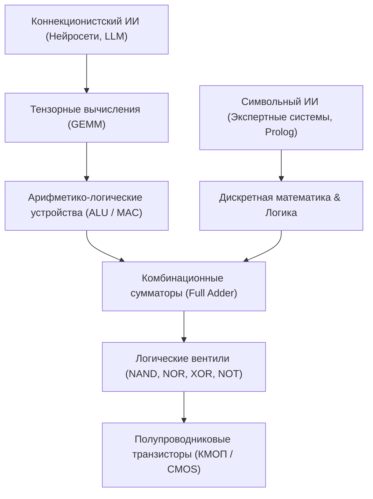
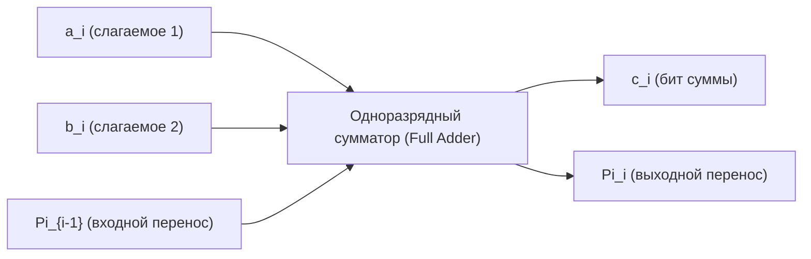
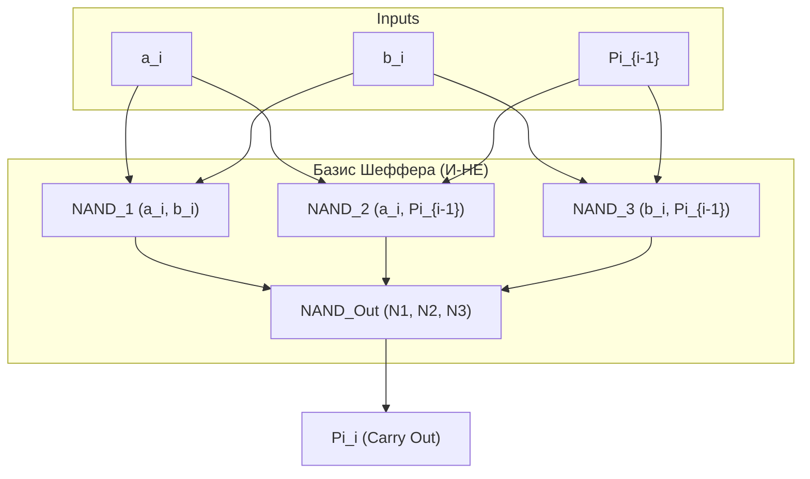

# 🧠 Практическое занятие №1: Синтез и минимизация комбинационных логических схем

> **Университет:** МТУСИ (Московский технический университет связи и информатики)  
> **Факультет / Подразделение:** Центр заочного обучения по программам бакалавриата  
> **Кафедра:** Математической кибернетики и информационных технологий  
> **Направление:** 09.03.02 «Информационные системы и технологии» (DevSecOps)  
> **Дисциплина:** Математическая логика и теория алгоритмов (МЛиТА, 2 курс, 3 семестр)  
> **Дата занятия:** 17 сентября 2026 г.  
> **Преподаватель:** **Зайцев Евгений Игоревич**  
> **Тема занятия:** *«Логические функции и логические (комбинационные) схемы: таблицы истинности, карты Карно, схемотехника базовых вентилей, синтез одноразрядного двоичного сумматора (Full Adder) и выбор логического базиса»*  
> **Исходная видеозапись:** `D:\video\Мат логика пр 17.09.mp4` (01:38:43)  
> **Стенограмма:** `D:\video\Мат логика пр 17.09_transcript.txt` (2 773 сегмента)  

---

## 🧭 Навигация и оглавление
1. [Введение: Математическая логика в цифровой инженерии и ИИ [00:00]](#1-введение-математическая-логика-в-цифровой-инженерии-и-ии-0000)
2. [Иерархия абстракций: от физического уровня к логическому [20:10]](#2-иерархия-абстракций-от-физического-уровня-к-логическому-2010)
   - [Элементная база: транзисторы (BJT, n-MOS, p-MOS, КМОП) [22:30]](#элементная-база-транзисторы-bjt-n-mos-p-mos-кмоп-2230)
   - [Логический инвертор НЕ: физика переключения [25:15]](#логический-инвертор-не-физика-переключения-2515)
3. [Функционально полные системы (логические базисы) [27:40]](#3-функционально-полные-системы-логические-базисы-2740)
   - [Базис Буля $\{\wedge, \vee, \neg\}$ и его избыточность [28:10]](#базис-буля-wedge-vee-neg-и-его-избыточность-2810)
   - [Штрих Шеффера (И-НЕ) и Стрелка Пирса (ИЛИ-НЕ) [30:15]](#штрих-шеффера-и-не-и-стрелка-пирса-или-не-3015)
   - [Базис Жегалкина $\{\oplus, \cdot, 1\}$ и его роль в арифметике [38:50]](#базис-жегалкина-oplus-cdot-1-и-его-роль-в-арифметике-3850)
4. [Арифметический фундамент ЭВМ и ускорителей ИИ [32:20]](#4-арифметический-фундамент-эвм-и-ускорителей-ии-3220)
5. [Синтез комбинационных схем: пошаговая методология [41:00]](#5-синтез-комбинационных-схем-пошаговая-методология-4100)
   - [Этап 1: Постановка задачи и определение входов/выходов [41:15]](#этап-1-постановка-задачи-и-определение-входоввыходов-4115)
   - [Этап 2: Построение таблицы истинности сумматора [41:40]](#этап-2-построение-таблицы-истинности-сумматора-4140)
6. [Минимизация булевых функций: Карты Карно [55:10]](#6-минимизация-булевых-функций-карты-карно-5510)
   - [Принцип кода Грея и соседство ячеек [58:30]](#принцип-кода-грея-и-соседство-ячеек-5830)
   - [Склеивание единиц и поиск простых импликант [01:05:20]](#склеивание-единиц-и-поиск-простых-импликант-010520)
   - [Минимизация функции переноса $\Pi_i$ [01:08:40]](#минимизация-функции-переноса-pi_i-010840)
   - [Минимизация функции суммы $c_i$ [01:14:10]](#минимизация-функции-суммы-c_i-011410)
7. [Оптимизация схем: декомпозиция и суперпозиция [01:20:10]](#7-оптимизация-схем-декомпозиция-и-суперпозиция-012010)
   - [Повторное использование переноса $\Pi_i$ при вычислении $c_i$ [01:22:30]](#повторное-использование-переноса-pi_i-при-вычислении-c_i-012230)
   - [Недоопределенные функции и состояния «безразличия» ($*$) [01:25:50]](#недоопределенные-функции-и-состояния-безразличия--012550)
8. [Переход в технологический базис И-НЕ (Шеффера) [01:28:40]](#8-переход-в-технологический-базис-и-не-шеффера-012840)
9. [Анонс следующей темы: Логика предикатов и Prolog [01:34:20]](#9-анонс-следующей-темы-логика-предикатов-и-prolog-013420)
10. [Организационные требования к зачету и аттестации [01:37:00]](#10-организационные-требования-к-зачету-и-аттестации-013700)

---

## 1. Введение: Математическая логика в цифровой инженерии и ИИ [00:00]

- **Цель курса:** Освоить инструментарий математической логики и теории алгоритмов не как отвлеченную теоретическую абстракцию, а как прикладной инженерный фундамент для специалистов в области информационных систем, DevSecOps и вычислительной техники.
- **Две парадигмы в истории ИИ:**
  1. **Символьный (семиотический) ИИ:** Основан на классической математической логике, исчислении высказываний и предикатов, экспертных системах, системах логического вывода и доказательства теорем.
  2. **Коннекционистский (кибернетический) ИИ:** Искусственные нейронные сети, обучение на данных, вероятностный вывод.
- **Связующее звено:** Современные нейросети и модели глубокого обучения физически функционируют на цифровых процессорах (CPU, GPU, TPU, NPU). Вся их мощь упирается в скорость выполнения тензорных матричных операций, которые на аппаратном уровне сводятся к миллионам и миллиардам **логических сумматоров и сдвиговых регистров**, спроектированных по законам алгебры логики.

---

## 2. Иерархия абстракций: от физического уровня к логическому [20:10]

В разработке вычислительных систем критически важно разделять уровни абстракции, не смешивая физические законы микроэлектроники с формальными правилами переключения логических состояний:

| Уровень | Носитель информации | Описание и модели |
| :--- | :--- | :--- |
| **Физический (схемотехнический)** | Непрерывные напряжения ($U$), токи ($I$), переходные процессы | Уравнения Максвелла, закон Ома, зонная теория полупроводников, ВАХ транзисторов |
| **Логический (цифровой)** | Дискретные уровни $\{0, 1\}$ | Алгебра логики (Булева алгебра), функции переключения, таблицы истинности |
| **Регистровый / архитектурный (RTL)** | Двоичные слова, регистры, шины данных | АЛУ, сумматоры, счетчики, мультиплексоры, память |
| **Программный (System / Software)** | Машинный код, ассемблер, ЯПВУ | Алгоритмы, структуры данных, декларативные/императивные парадигмы |

### Элементная база: транзисторы (BJT, n-MOS, p-MOS, КМОП) [22:30]
- **Биполярные транзисторы (BJT):** Управляются током базы. Исторически применялись в схемах ТТЛ (Транзисторно-транзисторная логика).
- **Полевые МОП-транзисторы (MOSFET):**
  - **n-MOS:** открывается при подаче высокого уровня логической единицы ($+V_{dd}$) на затвор;
  - **p-MOS:** открывается при низком уровне логического нуля (земля / $GND$) на затворе.
- **КМОП-структуры (CMOS — Complementary Metal-Oxide-Semiconductor):** Построены на взаимодополняющих парах n- и p-канальных транзисторов.
  - **Главное достоинство КМОП:** В статическом состоянии (когда на входе стабильный $0$ или $1$) ток от источника питания к земле практически равен нулю (минимальное статическое энергопотребление). Энергия рассеивается только в момент динамического переключения (перезарядка емкостей затворов).

### Логический инвертор НЕ: физика переключения [25:15]
Простейший логический вентиль — **инвертор (НЕ)**.
- В КМОП-исполнении состоит из пары транзисторов: верхнего p-MOS (подтягивающего к шине питания $V_{dd}$) и нижнего n-MOS (стягивающего к шине «земля» $GND$):
  - При $x = 0$ (низкое напряжение): p-MOS **открыт**, n-MOS **закрыт** $\implies$ выход $y$ подключен к $V_{dd} \implies y = 1$.
  - При $x = 1$ (высокое напряжение): p-MOS **закрыт**, n-MOS **открыт** $\implies$ выход $y$ подключен к $GND \implies y = 0$.

> [!IMPORTANT]
> На физическом уровне любой активный транзисторный каскад по своей природе является **инвертирующим**. Поэтому вентили с инверсией на выходе (**НЕ, И-НЕ, ИЛИ-НЕ**) схемотехнически реализуются проще и требуют меньше транзисторов, чем прямые элементы (**И, ИЛИ**).

---

## 3. Функционально полные системы (логические базисы) [27:40]

Система логических операций называется **функционально полной** (или логическим базисом), если любая сколь угодно сложная булева функция может быть выражена суперпозицией операций этой системы.

### Базис Буля $\{\wedge, \vee, \neg\}$ и его избыточность [28:10]
Классический базис алгебры логики включает:
1. Конъюнкцию (логическое умножение, И): $x_1 \wedge x_2$ или $x_1 \cdot x_2$.
2. Дизъюнкцию (логическое сложение, ИЛИ): $x_1 \vee x_2$ или $x_1 + x_2$.
3. Отрицание (инверсию, НЕ): $\overline{x}$ или $\neg x$.

Хотя базис Буля интуитивен для человека, он **избыточен**:
- По закону де Моргана: $x_1 \vee x_2 = \overline{\overline{x_1} \cdot \overline{x_2}}$, следовательно, достаточно только $\{\wedge, \neg\}$;
- Аналогично: $x_1 \cdot x_2 = \overline{\overline{x_1} \vee \overline{x_2}}$, следовательно, достаточно только $\{\vee, \neg\}$.

### Штрих Шеффера (И-НЕ) и Стрелка Пирса (ИЛИ-НЕ) [30:15]
Существуют **минимальные одноэлементные базисы**:

1. **Штрих Шеффера (И-НЕ, 2-NAND):**
   $$x_1 \mid x_2 = \overline{x_1 \cdot x_2}$$
   - Инверсия: $\overline{x} = x \mid x$
   - Конъюнкция: $x_1 \cdot x_2 = (x_1 \mid x_2) \mid (x_1 \mid x_2)$
   - Дизъюнкция: $x_1 \vee x_2 = (x_1 \mid x_1) \mid (x_2 \mid x_2)$

2. **Стрелка Пирса (ИЛИ-НЕ, 2-NOR):**
   $$x_1 \downarrow x_2 = \overline{x_1 \vee x_2}$$
   - Инверсия: $\overline{x} = x \downarrow x$
   - Дизъюнкция: $x_1 \vee x_2 = (x_1 \downarrow x_2) \downarrow (x_1 \downarrow x_2)$
   - Конъюнкция: $x_1 \cdot x_2 = (x_1 \downarrow x_1) \downarrow (x_2 \downarrow x_2)$

> [!TIP]
> **Почему микропроцессоры строят на вентилях И-НЕ / ИЛИ-НЕ?**  
> В технологии КМОП вентиль 2-И-НЕ состоит всего из **4 транзисторов** (2 p-MOS параллельно, 2 n-MOS последовательно). Чтобы сделать чистый элемент 2-И, требуется к вентилю 2-И-НЕ добавить еще 2 транзистора инвертора (итого **6 транзисторов**), что увеличивает площадь кристалла и задержку распространения сигнала!

### Базис Жегалкина $\{\oplus, \cdot, 1\}$ и его роль в арифметике [38:50]
- Операция $\oplus$ — сложение по модулю 2 (исключающее ИЛИ, XOR):
  $$x_1 \oplus x_2 = x_1 \overline{x_2} \vee \overline{x_1} x_2$$
- Базис Жегалкина образует кольцо с единицей, где любая функция представляется полиномом Жегалкина без использования инверсий ($\overline{x} = x \oplus 1$).
- **Критическое значение для ЭВМ:** Операция $\oplus$ является прямым воплощением сложения одного разряда без учета переноса: $0 \oplus 0 = 0$, $0 \oplus 1 = 1$, $1 \oplus 0 = 1$, $1 \oplus 1 = 0$.

---

## 4. Арифметический фундамент ЭВМ и ускорителей ИИ [32:20]

Преподаватель подчеркивает:
1. **Любая вычислительная операция** в процессоре (вычитание, умножение, деление, вычисление корней, тригонометрия, плавающая точка IEEE 754) в конечном счете сводится к комбинации **сложения, битовых сдвигов и логических сравнений**.
   - Вычитание: сложение с числом в дополнительном коде ($A - B = A + \overline{B} + 1$).
   - Умножение: последовательные сдвиги и накопление сумм.
2. **В нейросетевых ускорителях (GPU/TPU):**
   - Базовая операция тензорных ядер — **FMA (Fused Multiply-Add)**: $D = A \times B + C$.
   - Внутри каждого тензорного ядра располагаются систолические массивы сумматоров, синхронно перерабатывающие миллиарды бит в секунду.
   - Поэтому синтез и оптимизация одноразрядного двоичного сумматора — это ключевая задача аппаратного проектирования.

---

## 5. Синтез комбинационных схем: пошаговая методология [41:00]

**Комбинационной** называется логическая схема, значения выходов которой в любой момент времени однозначно определяются только текущими значениями входных сигналов (в отличие от последовательностных схем, не содержит элементов памяти / триггеров).

### Универсальный алгоритм синтеза:
1. **Словесное описание работы устройства** и формализация спецификации.
2. **Определение количества входов и выходов**.
3. **Составление таблицы истинности** для всех возможных комбинаций входных переменных ($2^n$ строк).
4. **Запись логических функций** для каждого выхода в совершенной дизъюнктивной нормальной форме (СДНФ) или совершенной конъюнктивной нормальной форме (СКНФ).
5. **Минимизация функций** аналитическим методом или с помощью карт Карно.
6. **Факторизация и совместная оптимизация** системы функций (использование общих промежуточных подвыражений).
7. **Преобразование формул в заданный технологический базис** (И-НЕ, ИЛИ-НЕ, КМОП-логика).
8. **Построение принципиальной логической схемы**.

---

### Этап 1: Постановка задачи и определение входов/выходов [41:15]
Синтезируем **полный одноразрядный двоичный сумматор (Full Adder)**.

- **Входы (3 переменные):**
  - $a_i \in \{0, 1\}$ — бит первого слагаемого в $i$-м разряде;
  - $b_i \in \{0, 1\}$ — бит второго слагаемого в $i$-м разряде;
  - $\Pi_{i-1} \in \{0, 1\}$ — перенос из младшего $(i-1)$-го разряда.
- **Выходы (2 функции):**
  - $c_i \in \{0, 1\}$ — значение бита суммы в текущем $i$-м разряде;
  - $\Pi_i \in \{0, 1\}$ — перенос в старший $(i+1)$-й разряд.

---

### Этап 2: Построение таблицы истинности сумматора [41:40]
Поскольку входов 3, таблица содержит $2^3 = 8$ строк:

| № | $a_i$ | $b_i$ | $\Pi_{i-1}$ | Арифметическая сумма ($a_i + b_i + \Pi_{i-1}$) | Бит суммы $c_i$ | Бит переноса $\Pi_i$ | Минтерм |
| :-: | :-: | :-: | :-: | :-: | :-: | :-: | :--- |
| **0** | 0 | 0 | 0 | $0 + 0 + 0 = 0_{10} = 00_2$ | **0** | **0** | $\overline{a_i}\,\overline{b_i}\,\overline{\Pi_{i-1}}$ |
| **1** | 0 | 0 | 1 | $0 + 0 + 1 = 1_{10} = 01_2$ | **1** | **0** | $\overline{a_i}\,\overline{b_i}\Pi_{i-1}$ |
| **2** | 0 | 1 | 0 | $0 + 1 + 0 = 1_{10} = 01_2$ | **1** | **0** | $\overline{a_i} b_i \overline{\Pi_{i-1}}$ |
| **3** | 0 | 1 | 1 | $0 + 1 + 1 = 2_{10} = 10_2$ | **0** | **1** | $\overline{a_i} b_i \Pi_{i-1}$ |
| **4** | 1 | 0 | 0 | $1 + 0 + 0 = 1_{10} = 01_2$ | **1** | **0** | $a_i \overline{b_i}\,\overline{\Pi_{i-1}}$ |
| **5** | 1 | 0 | 1 | $1 + 0 + 1 = 2_{10} = 10_2$ | **0** | **1** | $a_i \overline{b_i}\Pi_{i-1}$ |
| **6** | 1 | 1 | 0 | $1 + 1 + 0 = 2_{10} = 10_2$ | **0** | **1** | $a_i b_i \overline{\Pi_{i-1}}$ |
| **7** | 1 | 1 | 1 | $1 + 1 + 1 = 3_{10} = 11_2$ | **1** | **1** | $a_i b_i \Pi_{i-1}$ |

Запись в виде СДНФ (по строкам, где значение равно 1):
$$\Pi_i = \overline{a_i} b_i \Pi_{i-1} \vee a_i \overline{b_i}\Pi_{i-1} \vee a_i b_i \overline{\Pi_{i-1}} \vee a_i b_i \Pi_{i-1}$$
$$c_i = \overline{a_i}\,\overline{b_i}\Pi_{i-1} \vee \overline{a_i} b_i \overline{\Pi_{i-1}} \vee a_i \overline{b_i}\,\overline{\Pi_{i-1}} \vee a_i b_i \Pi_{i-1}$$

---

## 6. Минимизация булевых функций: Карты Карно [55:10]

СДНФ громоздка: для $\Pi_i$ требуется 4 трехвходовых вентиля И и 1 четырехвходовый ИЛИ. Для оптимизации применяются методы минимизации.

### Принцип кода Грея и соседство ячеек [58:30]
**Карта Карно** — это развертка таблицы истинности в двумерную матрицу.
- **Главное правило:** Соседние строки и соседние столбцы должны различаться значением **ровно одной переменной** (принцип рефлексивного двоичного кода Грея):
  $$00 \longrightarrow 01 \longrightarrow 11 \longrightarrow 10$$
- Крайний левый и крайний правый столбцы, а также верхняя и нижняя строки также являются **соседними** (топологически карта Карно сворачивается в тор).
- Благодаря соседству, две рядом стоящие единицы соответствуют двум конституентам единицы вида $X \cdot y \vee X \cdot \overline{y} = X \cdot (y \vee \overline{y}) = X$, что позволяет исключить переменную $y$ (**правило склеивания**).

### Склеивание единиц и поиск простых импликант [01:05:20]
1. Объединять единицы можно только в прямоугольные области размером $2^k \in \{1, 2, 4, 8, 16\}$ ячеек.
2. Чем **больше размер склейки**, тем меньше переменных входит в соответствующую **простую импликанту** ($2^1=2$ ячейки убирают 1 переменную, $2^2=4$ ячейки убирают 2 переменные).
3. Каждая единица функции должна войти хотя бы в одну склейку.
4. Допускается и приветствуется перекрытие склеек для получения более крупных контуров.

---

### Минимизация функции переноса $\Pi_i$ [01:08:40]

Разместим переменные:
- Столбцы: $a_i b_i \in \{00, 01, 11, 10\}$
- Строки: $\Pi_{i-1} \in \{0, 1\}$

Таблица значений для $\Pi_i$:

| $\Pi_{i-1} \setminus a_i b_i$ | 00 | 01 | 11 | 10 |
| :---: | :---: | :---: | :---: | :---: |
| **0** | 0 | 0 | **1** | 0 |
| **1** | 0 | **1** | **1** | **1** |

Выделяем **три склейки по 2 единицы**:
1. **Горизонтальная склейка в нижней строке (столбцы 01 и 11):**
   - $\Pi_{i-1} = 1$, $b_i = 1$, а $a_i$ меняется с 0 на 1 (склеивается) $\implies b_i \Pi_{i-1}$.
2. **Горизонтальная склейка в нижней строке (столбцы 11 и 10):**
   - $\Pi_{i-1} = 1$, $a_i = 1$, а $b_i$ меняется с 1 на 0 (склеивается) $\implies a_i \Pi_{i-1}$.
3. **Вертикальная склейка в столбце 11 (строки 0 и 1):**
   - $a_i = 1$, $b_i = 1$, а $\Pi_{i-1}$ меняется с 0 на 1 (склеивается) $\implies a_i b_i$.

Итоговая минимальная ДНФ для функции переноса:
$$\Pi_i = a_i b_i \vee a_i \Pi_{i-1} \vee b_i \Pi_{i-1}$$

Вынося общий множитель $\Pi_{i-1}$:
$$\Pi_i = \Pi_{i-1}(a_i \vee b_i) \vee a_i b_i$$

---

### Минимизация функции суммы $c_i$ [01:14:10]

Таблица значений для $c_i$:

| $\Pi_{i-1} \setminus a_i b_i$ | 00 | 01 | 11 | 10 |
| :---: | :---: | :---: | :---: | :---: |
| **0** | 0 | **1** | 0 | **1** |
| **1** | **1** | 0 | **1** | 0 |

- **Особенность карты:** Единицы расположены в «шахматном порядке».
- Ни одна пара единиц не граничит по горизонтали или вертикали. Склеивание в булевом базисе $\{\wedge, \vee\}$ **невозможно**!
- Каждая единица образует изолированную импликанту из 3 переменных.
- Запись через группировку строк:
  $$c_i = \Pi_{i-1}(\overline{a_i}\,\overline{b_i} \vee a_i b_i) \vee \overline{\Pi_{i-1}}(\overline{a_i} b_i \vee a_i \overline{b_i})$$

Заметим, что:
- $\overline{a_i} b_i \vee a_i \overline{b_i} = a_i \oplus b_i$ (XOR)
- $\overline{a_i}\,\overline{b_i} \vee a_i b_i = \overline{a_i \oplus b_i} = a_i \odot b_i$ (XNOR / эквивалентность)

Подставляя, получаем компактную форму:
$$c_i = \Pi_{i-1} \cdot \overline{(a_i \oplus b_i)} \vee \overline{\Pi_{i-1}} \cdot (a_i \oplus b_i) = (a_i \oplus b_i) \oplus \Pi_{i-1}$$

---

## 7. Оптимизация схем: декомпозиция и суперпозиция [01:20:10]

Преподаватель акцентирует внимание: раздельный синтез функций $\Pi_i$ и $c_i$ приводит к избыточности аппаратных затрат. В реальных СБИС используется принцип **декомпозиции и совместного синтеза**.

### Повторное использование переноса $\Pi_i$ при вычислении $c_i$ [01:22:30]
Поскольку значение переносного бита $\Pi_i$ формируется параллельно, его можно подать на вход схемы формирования бита суммы $c_i$ как дополнительную переменную:

$$c'_i = \overline{\Pi_i}(a_i \vee b_i \vee \Pi_{i-1}) \vee a_i b_i \Pi_{i-1}$$

Проверка истинности:
- Если все входы $0 \implies \Pi_i=0$, скобка $(0\vee 0\vee 0)=0 \implies c_i = 0$.
- Если ровно один вход равен $1 \implies \Pi_i=0$, инверсия $\overline{\Pi_i}=1$, в скобке $(1) \implies c_i = 1$.
- Если ровно два входа равны $1 \implies \Pi_i=1$, инверсия $\overline{\Pi_i}=0$, правое слагаемое $a_i b_i \Pi_{i-1} = 0 \implies c_i = 0$.
- Если все три входа равны $1 \implies \Pi_i=1$, правое слагаемое $1\cdot 1\cdot 1 = 1 \implies c_i = 1$.

Формула полностью идентична функции $c_i$, но требует существенно меньше вентилей благодаря использованию сигнала $\Pi_i$!

### Недоопределенные функции и состояния «безразличия» ($*$) [01:25:50]
Когда часть комбинаций входных переменных физически невозможна или их результат уже учтен другими блоками схемы, значения таких ячеек в карте Карно помечаются символом $*$ («don't care» / безразличное состояние).
- При склеивании ячейки $*$ можно произвольно доопределять единицами (для укрупнения склеек) или нулями (если они не помогают минимизации).
- За счет этого достигается максимальное сокращение транзисторного бюджета интегральной схемы.

---

## 8. Переход в технологический базис И-НЕ (Шеффера) [01:28:40]

Для переноса формул в базис 2-И-НЕ применяется **двойная инверсия** и закон де Моргана:
$$\overline{\overline{X \vee Y}} = \overline{\overline{X} \cdot \overline{Y}}$$

Для функции переноса $\Pi_i = \Pi_{i-1}(a_i \vee b_i) \vee a_i b_i$:
$$\Pi_i = \overline{\overline{\Pi_{i-1}(a_i \vee b_i) \vee a_i b_i}} = \overline{\overline{\Pi_{i-1}(a_i \vee b_i)} \cdot \overline{a_i b_i}}$$

Схема в базисе И-НЕ строится исключительно из стандартных логических ячеек 2-NAND / 3-NAND, что идеально согласуется с технологическими библиотеками полупроводниковых фабрик (TSMC, SMIC, Микрон).

---

## 9. Анонс следующей темы: Логика предикатов и Prolog [01:34:20]

В заключительной части практики преподаватель наметил переход от аппаратного уровня к программно-интеллектуальному:
1. **Ограниченность алгебры высказываний:** Высказывание может быть лишь истинным или ложным в целом. Алгебра высказываний не заглядывает внутрь структуры предложения, не связывает субъекты и объекты.
2. **Логика предикатов:** Вводит понятие предиката $P(x_1, \dots, x_n)$ — отношения между объектами, а также кванторы:
   - $\forall$ — квантор всеобщности («для всех»);
   - $\exists$ — квантор существования («существует»).
3. **Декларативное программирование и язык Prolog:**
   - Вместо пошагового алгоритма («как делать») разработчик задает декларативную базу знаний — факты и правила отношений («что истинно»).
   - **Механизм логического вывода (SLD-резолюция):** Система сама отвечает на запросы пользователя, доказывая истинность гипотез и находя значения неизвестных переменных путем сопоставления с образцом (унификации) и отката (backtracking).

---

## 10. Организационные требования к зачету и аттестации [01:37:00]

- **Преподаватель:** Зайцев Евгений Игоревич.
- **Форма итогового контроля:** Дифференцированный зачет / зачет.
- **Главные критерии оценки на зачете:**
  1. Глубокое понимание **инженерного смысла** абстракций, а не механическое заучивание формул.
  2. Умение объяснить, почему для синтеза процессоров выбираются вентили И-НЕ/ИЛИ-НЕ (связь с КМОП-технологией).
  3. Уверенное владение картами Карно для функций от 2, 3 и 4 переменных (понимание кода Грея, правил склеивания степенями двойки).
  4. Умение от словесного описания задачи перейти к таблице истинности, составить формулы и синтезировать базовый цифровой узел (сумматор, компаратор, мультиплексор).
- **Посещаемость:** Старостам групп поручено строго фиксировать присутствие студентов в электронном журнале университета. На следующей практике по логике предикатов присутствие строго обязательно!
