# 🦉 Лекция №1: Полный курс истории философии и фундаментальных философских проблем

> **Дисциплина:** Философия  
> **Преподаватель:** Макатов Зураб Валерьевич, кандидат философских наук, доцент кафедры философии, истории и межкультурной коммуникации МТУСИ  
> **Университет:** Московский технический университет связи и информатики (Центр заочного обучения по программам бакалавриата)  
> **Направление подготовки:** 09.03.02 «Информационные системы и технологии» (Профиль: Инженерия DevSecOps)  
> **Курс / Семестр:** 2 курс, 3 семестр  
> **Дата проведения лекции:** 15 сентября 2026 г. (16:58 – 22:09)  
> **Формат занятия:** Интенсивный лекционный марафон (3 академические пары = 6 академических часов, хронометраж видео: 5 часов 11 минут)  
> **Исходная видеозапись:** `2026-09-15 16-58-31.mp4` (размер: 1,33 ГБ, продолжительность: 18 665 секунд)  
> **Полная стенограмма с таймкодами:** [`transcripts/lecture-01-transcript.txt`](./transcripts/lecture-01-transcript.txt)  
> **Форма итогового контроля:** Дифференцированный зачёт (устный онлайн-опрос по билетам/списку из 46 вопросов, без предварительной подготовки, 2 вопроса на студента)  

---

## 📋 Содержание лекционного курса

1. [Организационный блок и регламент сдачи дифференцированного зачета](#1-организационный-блок-и-регламент-сдачи-дифференцированного-зачета)
   - [1.1. Регламент аттестации и критерии оценивания: почему нет «автоматов на тройку»](#11-регламент-аттестации-и-критерии-оценивания-почему-нет-автоматов-на-тройку)
   - [1.2. Процедура сдачи онлайн-зачета: 46 вопросов и экспресс-опрос](#12-процедура-сдачи-онлайн-зачета-46-вопросов-и-экспресс-опрос)
   - [1.3. Принципиальная позиция по рефератам и использованию искусственного интеллекта](#13-принципиальная-позиция-по-рефератам-и-использованию-искусственного-интеллекта)
   - [1.4. Формат и задачи практических (семинарских) занятий](#14-формат-и-задачи-практических-семинарских-занятий)
2. [Пара 1. Введение в философию: специфика знания, предельные вопросы и структура](#2-пара-1-введение-в-философию-специфика-знания-предельные-вопросы-и-структура)
   - [2.1. Предмет философии: отличие от частных наук и исследование предельных оснований](#21-предмет-философии-отличие-от-частных-наук-и-исследование-предельных-оснований)
   - [2.2. Исторические типы мировоззрения: мифология, религия, наука и философия](#22-исторические-типы-мировоззрения-мифология-религия-наука-и-философия)
   - [2.3. Взаимоотношение философии и науки: аксиоматические предпосылки научного поиска](#23-взаимоотношение-философии-и-науки-аксиоматические-предпосылки-научного-поиска)
   - [2.4. Основной вопрос философии (ОВФ): онтологический и гносеологический аспекты](#24-основной-вопрос-философии-овф-онтологический-и-гносеологический-аспекты)
   - [2.5. Структурные разделы философии: онтология, гносеология, аксиология, антропология, социальная философия](#25-структурные-разделы-философии-онтология-гносеология-аксиология-антропология-социальная-философия)
   - [2.6. Категории бытия, материи, времени и пространства: субстанциальная vs реляционная концепции](#26-категории-бытия-материи-времени-и-пространства-субстанциальная-vs-реляционная-концепции)
   - [2.7. Проблема истины в гносеологии: корреспондентная, когерентная и прагматическая теории](#27-проблема-истины-в-гносеологии-корреспондентная-когерентная-и-прагматическая-теории)
3. [Пара 2. Античная философия: от поиска первоначала до эллинистических школ](#3-пара-2-античная-философия-от-поиска-первоначала-до-эллинистических-школ)
   - [3.1. Ранняя греческая натурфилософия (досократики): поиск «архэ»](#31-ранняя-греческая-натурфилософия-досократики-поиск-архэ)
     - [Милетская школа: Фалес (вода) и Анаксимандр (апейрон)](#милетская-школа-фалес-вода-и-анаксимандр-апейрон)
     - [Гераклит Эфесский: всеобщая текучесть, огонь, Логос и диалектика противоположностей](#гераклит-эфесский-всеобщая-текучесть-огонь-логос-и-диалектика-противоположностей)
     - [Элейская школа: Парменид (бытие есть, небытия нет; тождество мышления и бытия)](#элейская-школа-парменид-бытие-есть-небытия-нет-тождество-мышления-и-бытия)
     - [Зенон Элейский и его апории движения (Ахиллес и черепаха, Дихотомия, Стрела)](#зенон-элейский-и-его-апории-движения-ахиллес-и-черепаха-дихотомия-стрела)
     - [Атомистический материализм Демокрита: неделимые атомы и пустота](#атомистический-материализм-демокрита-неделимые-атомы-и-пустота)
   - [3.2. Софисты и Сократический поворот к человеку](#32-софисты-и-сократический-поворот-к-человеку)
     - [Софистика и эпистемологический релятивизм: Протагор](#софистика-и-эпистемологический-релятивизм-протагор)
     - [Сократ: антропологический переворот, этический рационализм, метод майевтики и иронии](#сократ-антропологический-переворот-этический-рационализм-метод-майевтики-и-иронии)
   - [3.3. Объективный идеализм Платона: учение об эйдосах и государстве](#33-объективный-идеализм-платона-учение-об-эйдосах-и-государстве)
     - [Двоемирие: мир эйдосов (идей) vs мир чувственных вещей (теней)](#двоемирие-мир-эйдосов-идей-vs-мир-чувственных-вещей-теней)
     - [Аллегория («миф») о пещере: природа познания и трагедия просветителя](#аллегория-миф-о-пещере-природа-познания-и-трагедия-просветителя)
     - [Гносеология Платона: учение о припоминании (анамнезис)](#гносеология-платона-учение-о-припоминании-анамнезис)
     - [Учение о трехчастной душе и проект Идеального государства](#учение-о-трехчастной-душе-и-проект-идеального-государства)
   - [3.4. Энциклопедический философский синтез Аристотеля](#34-энциклопедический-философский-синтез-аристотеля)
     - [Критика платоновского мира идей: имманентность сущностей](#критика-платоновского-мира-идей-имманентность-сущностей)
     - [Учение о четырех причинах бытия (материальная, формальная, действующая, целевая)](#учение-о-четырех-причинах-бытия-материальная-формальная-действующая-целевая)
     - [Диалектика возможности (потенции) и действительности (акта), энтелехия](#диалектика-возможности-потенции-и-действительности-акта-энтелехия)
     - [Учение о Перводвигателе (Нус) и логический Органон](#учение-о-перводвигателе-нус-и-логический-органон)
     - [Социальная этика: «человек — политическое животное» и добродетель как середина](#социальная-этика-человек--политическое-животное-и-добродетель-как-середина)
   - [3.5. Эллинистическо-римская философия: этика личного спасения и покоя](#35-эллинистическо-римская-философия-этика-личного-спасения-и-покоя)
     - [Эпикуреизм: преодоление страха богов и смерти, атараксия, разумный гедонизм](#эпикуреизм-преодоление-страха-богов-и-смерти-атараксия-разумный-гедонизм)
     - [Стоицизм: покорность мировому Логосу, долг, апатия](#стоицизм-покорность-мировому-логосу-долг-апатия)
     - [Античный скептицизм: эпохе (воздержание от суждений)](#античный-скептицизм-эпохе-воздержание-от-суждений)
4. [Пара 3. Средневековье, Новое время, Просвещение и классические системы XIX–XX веков](#4-пара-3-средневековье-новое-время-просвещение-и-классические-системы-xixxx-веков)
   - [4.1. Средневековая теоцентрическая философия: патристика и схоластика](#41-средневековая-теоцентрическая-философия-патристика-и-схоластика)
     - [Фундаментальные принципы: теоцентризм, креационизм, провиденциализм, ревеляционизм](#фундаментальные-принципы-теоцентризм-креационизм-провиденциализм-ревеляционизм)
     - [Аврелий Августин: теодицея, свобода воли, концепция времени, предвосхищение картезианства](#аврелий-августин-теодицея-свобода-воли-концепция-времени-предвосхищение-картезианства)
     - [Фома Аквинский: гармония веры и разума, 5 рациональных доказательств бытия Бога](#фома-аквинский-гармония-веры-и-разума-5-рациональных-доказательств-бытия-бога)
     - [Спор об универсалиях: реализм vs номинализм, бритва Оккама](#спор-об-универсалиях-реализм-vs-номинализм-бритва-оккама)
   - [4.2. Философия Нового времени (XVII в.): гносеологический переворот и научный метод](#42-философия-нового-времени-xvii-в-гносеологический-переворот-и-научный-метод)
     - [Рационализм: Рене Декарт (картезианское сомнение, Cogito ergo sum, дуализм субстанций)](#рационализм-рене-декарт-картезианское-сомнение-cogito-ergo-sum-дуализм-субстанций)
     - [Пантеистический монизм Бенедикта Спинозы (Deus sive Natura, свобода как осознанная необходимость)](#пантеистический-монизм-бенедикта-спинозы-deus-sive-natura-свобода-как-осознанная-необходимость)
     - [Плюралистическая монадология Готфрида Лейбница](#плюралистическая-монадология-готфрида-лейбница)
     - [Эмпиризм и сенсуализм: Фрэнсис Бэкон (индукция и идолы), Джон Локк (tabula rasa), Джордж Беркли (esse est percipi), Дэвид Юм (критика причинности)](#эмпиризм-и-сенсуализм-фрэнсис-бэкон-индукция-и-идолы-джон-локк-tabula-rasa-джордж-беркли-esse-est-percipi-дэвид-юм-критика-причинности)
   - [4.3. Социальная философия Нового времени и эпохи Просвещения (XVIII в.)](#43-социальная-философия-нового-времени-и-эпохи-просвещения-xviii-в)
     - [Теории общественного договора: Томас Гоббс («война всех против всех» и государство-Левиафан)](#теории-общественного-договора-томас-гоббс-война-всех-против-всех-и-государство-левиафан)
     - [Джон Локк: неотчуждаемые естественные права, частная собственность, разделение властей](#джон-локк-неотчуждаемые-естественные-права-частная-собственность-разделение-властей)
     - [Жан-Жак Руссо: «Человек рождается свободным, но повсюду он в цепях», общая воля](#жан-жак-руссо-человек-рождается-свободным-но-повсюду-он-в-цепях-общая-воля)
     - [Идеология Просвещения: культ разума, науки, образования и прогресса](#идеология-просвещения-культ-разума-науки-образования-и-прогресса)
   - [4.4. Немецкая классическая философия: Иммануил Кант и Георг Гегель](#44-немецкая-классическая-философия-иммануил-кант-и-георг-гегель)
     - [Иммануил Кант: коперниканский переворот, априорные формы, феномен и ноумен («вещь в себе»), категорический императив](#иммануил-кант-коперниканский-переворот-априорные-формы-феномен-и-ноумен-вещь-в-себе-категорический-императив)
     - [Георг Гегель: абсолютный идеализм, законы диалектики и триада](#георг-гегель-абсолютный-идеализм-законы-диалектики-и-триада)
   - [4.5. Постклассическая и современная мысль: марксизм, экзистенциализм, гуманистический психоанализ](#45-постклассическая-и-современная-мысль-марксизм-экзистенциализм-гуманистический-психоанализ)
     - [Карл Маркс: исторический материализм, базис и надстройка, смена формаций, преодоление отчуждения труда](#карл-маркс-исторический-материализм-базис-и-надстройка-смена-формаций-преодоление-отчуждения-труда)
     - [Экзистенциализм XX века: Альбер Камю («Миф о Сизифе», философия абсурда, бунт и достоинство)](#экзистенциализм-xx-века-альбер-камю-миф-о-сизифе-философия-абсурда-бунт-и-достоинство)
     - [Эрих Фромм: психоанализ, «Искусство любить», модусы бытия и обладания](#эрих-фромм-психоанализ-искусство-любить-модусы-бытия-и-обладания)
5. [Сводные аналитические таблицы и логические схемы](#5-сводные-аналитические-таблицы-и-логические-схемы)
   - [5.1. Сравнительная таблица: Эмпиризм vs Рационализм Нового времени](#51-сравнительная-таблица-эмпиризм-vs-рационализм-нового-времени)
   - [5.2. Сравнительная таблица: Платон vs Аристотель](#52-сравнительная-таблица-платон-vs-аристотель)
   - [5.3. Сравнительная таблица: Концепции общественного договора (Гоббс, Локк, Руссо)](#53-сравнительная-таблица-концепции-общественного-договора-гоббс-локк-руссо)
   - [5.4. Архитектурно-логические схемы (Mermaid)](#54-архитектурно-логические-схемы-mermaid)
6. [Комплекс экзаменационных вопросов и эталонных тезисов для подготовки к дифференцированному зачету](#6-комплекс-экзаменационных-вопросов-и-эталонных-тезисов-для-подготовки-к-дифференцированному-зачету)

---

## 1. Организационный блок и регламент сдачи дифференцированного зачета

*Таймкод: `[05:46] – [24:00]`*

### 1.1. Регламент аттестации и критерии оценивания: почему нет «автоматов на тройку»
Лектор, кандидат философских наук Зураб Валерьевич Макатов, открывает занятие подробным разъяснением принципов аттестации студентов Центра заочного обучения МТУСИ. В условиях жесткого лимита контактных часов (всего 3 лекции по 2 часа = 6 академических часов, совмещенные в единый интенсивный 5-часовой блок) аттестация охватывает **весь нормативный объем курса философии**.

> [!IMPORTANT]
> **Принципиальная позиция преподавателя по «автоматам»:**
> - «Автоматом» в университетской академической традиции может выставляться **исключительно оценка «отлично»** (5). Автомат — это признание безупречного уровня знаний студента, освоившего категориальный аппарат, терминологию, персоналии и историко-философский контекст на высшем уровне.
> - Понятие «автомат на тройку (удовлетворительно)», распространенное среди некоторых заочников, лектор называет нонсенсом и профанацией: *«Автоматом получить тройку для меня это совершенно дикая новость. Я не понимаю, как можно получить автоматом тройку... Оценка "удовлетворительно" ставится тогда, когда человек пришел, отвечал на вопросы, что-то знает, а чего-то не знает»*.
> - **Сдавать зачет будут все студенты без исключения.**

### 1.2. Процедура сдачи онлайн-зачета: 46 вопросов и экспресс-опрос
Первоначально лектор предполагал очную форму сдачи, однако в ходе диалога староста (студентка Елена, `[12:29]`) уточнила, что обучение и сессия в ЦЗО полностью переведены в дистанционный формат. Преподаватель утвердил регламент:

1. **База вопросов:** Преподаватель предоставил полный утвержденный перечень из **46 зачетных вопросов** (файл отправлен в чат занятия).
2. **Формат опроса:** Индивидуальное подключение к видеоконференции (один на один с преподавателем с включенной камерой и микрофоном).
3. **Регламент ответа:** Студенту задаются **два вопроса** из утвержденного списка.
4. **Отсутствие времени на подготовку:** Подготовка («посидеть 20 минут с листочком») не предоставляется. Вопрос задается устно — студент должен сразу продемонстрировать живое владение темой, логику рассуждения и понимание сущности концепций.
5. **Критерии выставления оценки:**
   - **«Отлично»:** Глубокое понимание философской проблемы, знание первоисточников, ключевых терминов (онтология, эйдос, апейрон, монада, категорический императив и др.), умение сопоставлять мыслителей разных эпох.
   - **«Хорошо»:** Правильное изложение концепций обоих мыслителей/направлений с незначительными неточностями в формулировках.
   - **«Удовлетворительно»:** Понимание общей сути вопросов на базовом смысловом уровне, но без владения категориальным аппаратом.
   - **«Неудовлетворительно»:** Неспособность ответить на поставленные вопросы, молчание, попытки зачитывания чужого сгенерированного текста.

### 1.3. Принципиальная позиция по рефератам и использованию искусственного интеллекта
Лектор категорически отвергает практику сбора формальных письменных рефератов:
- *«Заставлять вас писать какие-то бессмысленные рефераты в определенном количестве, которые вы просто сгенерируете в нейросети и пришлете мне — это абсолютная профанация... Никакого отношения к реальному знанию и мыслительному процессу это не имеет»*.
- Навык программиста и инженера DevSecOps заключается в критическом анализе, выявлении уязвимостей в логических конструкциях и понимании архитектуры систем. Философия развивает именно эту способность на предельном уровне абстракции.

### 1.4. Формат и задачи практических (семинарских) занятий
- Практические занятия не должны превращаться в чтение 10-минутных формальных докладов из Википедии («чтобы и вам было скучно, и мне невыносимо»).
- Семинары посвящаются живому разбору сложных, дискуссионных вопросов курса: этика искусственного интеллекта, свобода воли в детерминированном мире, кризис истины в эпоху постправды, феномен отчуждения труда в цифровой экономике.

---

## 2. Пара 1. Введение в философию: специфика знания, предельные вопросы и структура

*Таймкод: `[24:00] – [01:42:00]`*

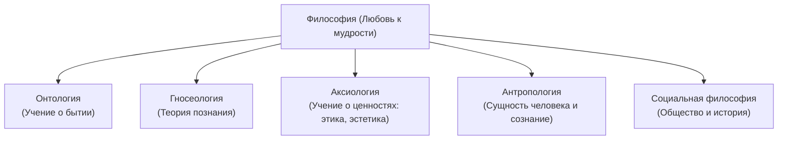

### 2.1. Предмет философии: отличие от частных наук и исследование предельных оснований
Курс философии для студентов технических специальностей неизбежно начинается с вопроса: **«Что именно изучает философия, если физика изучает материю и законы природы, история — прошлое обществ, а экономика — хозяйственную деятельность?»**

Часто кажется, что философия говорит «обо всем сразу» (о человеке, государстве, морали, смерти, истине, космосе). Однако у философии есть свой уникальный, строгий предмет:
- **Частные науки** изучают конкретные, локализованные срезы и уровни реальности (физический, химический, биологический, социологический). Они всегда исходят из заранее заданных допущений и исследуют вопрос *«Как устроен данный объект?»*.
- **Философия** исследует **предельные основания** мира, человека, знания и деятельности. Она задает вопросы там, где частные науки останавливаются и принимают условия как данность:
  - Физика спрашивает: *«Как взаимодействуют тела в пространстве и времени?»* — Философия спрашивает: *«Что такое само бытие? Что значит существовать? Обладают ли пространство и время самостоятельным бытием или они лишь формы нашего восприятия?»*.
  - Информатика и нейробиология спрашивают: *«Как закодировать и передать информацию?»* — Философия спрашивает: *«Что значит знать? Что такое истина и сознание? Сводима ли мысль к электрохимическим импульсам мозга?»*.
  - Юриспруденция и социология спрашивают: *«Законно ли данное действие и почему люди исполняют закон?»* — Философия права и морали спрашивает: *«Что делает поступок справедливым и морально благим по существу? В чем источник авторитета закона?»*.

> [!NOTE]
> **Определение:**  
> **Философия** — это рационально-теоретическая форма мировоззрения, направленная на критическое исследование предельных оснований бытия, познания, ценностей и человеческой деятельности.

### 2.2. Исторические типы мировоззрения: мифология, религия, наука и философия
Человек не может существовать без **мировоззрения** — целостной системы взглядов на мир, свое место в нем и ценностных ориентиров. В истории человечества сменились четыре базовых типа мировоззрения:

| Тип мировоззрения | Исторический период | Характерные черты | Критерий истинности |
| :--- | :--- | :--- | :--- |
| **Мифологическое** | Первобытное общество, архаика | **Синкретизм** (нерасчлененность мышления), **антропоморфизм** (перенос человеческих качеств на силы природы), **анимизм** (одушевление всего сущего), отсутствие рефлексии, циклическое восприятие времени. Миф переживается как абсолютная реальность. | Традиция, авторитет предков, ритуал |
| **Религиозное** | Древний мир — Средневековье — настоящее время | **Удвоение мира** (разграничение на посюсторонний, тварный, несовершенный мир и потусторонний, сверхъестественный, вечный абсолют — Бога). Культ, священные тексты, догматика. | **Вера** и Божественное Откровение (*revelatio*) |
| **Научное** | Новое время (XVII в.) — современность | Рациональность, системность, эмпирическая проверяемость (**верификация** и **фальсифицируемость**), объективность, опора на математический аппарат и эксперимент. Локальный, специализированный характер знания. | Эксперимент, доказательство, воспроизводимость |
| **Философское** | Зародилось в VII–VI вв. до н.э. («Осевое время») | **Рационально-критическое осмысление**, теоретичность, понятийный аппарат, проблематизация очевидного, поиск предельных первооснований мира в целом. | Логическая аргументация, внутренняя непротиворечивость |

Лектор подчеркивает важнейший социокультурный факт: **в современном человеке все эти формы могут парадоксально сосуществовать**. Программист или инженер может на работе пользоваться строгими научными методами, в повседневной жизни следовать мифологическим предрассудкам (гороскопы, приметы), в духовной сфере исповедовать религиозные догматы, а в минуты экзистенциального кризиса задаваться глубокими философскими вопросами о смысле жизни и свободе воли.

### 2.3. Взаимоотношение философии и науки: аксиоматические предпосылки научного поиска
Студенты технических направлений часто совершают ошибку сциентизма, полагая, что философия устарела, а наука полностью заменила ее. Однако наука принципиально не может заменить философию по двум причинам:
1. **Аксиоматический фундамент науки:** Любая наука опирается на предпосылки, которые сама доказать не в состоянии:
   - Принцип причинности (каждое событие имеет причину);
   - Объективность материального мира и его познаваемость;
   - Законы логики и непротиворечивости мышления;
   - Принцип однородности законов природы в пространстве и времени.  
   Все эти категории и аксиомы разрабатываются, исследуются и критически обосновываются **философией**.
2. **Проблема ценностей и целей:** Наука дает знание о том, *как* устроены вещи и процессы, но принципиально не способна ответить на вопрос, *зачем* и *во имя чего* использовать эти знания (этические последствия генной инженерии, искусственного интеллекта, создания ядерного или кибероружия). Эти вопросы лежат в плоскости философской аксиологии и этики.

### 2.4. Основной вопрос философии (ОВФ): онтологический и гносеологический аспекты
В классической традиции (в частности, сформулированной Ф. Энгельсом и глубоко укорененной в университетском преподавании) **Основной вопрос философии** — это вопрос об отношении мышления к бытию, духа к природе, сознания к материи.

Он имеет две неразрывные стороны:

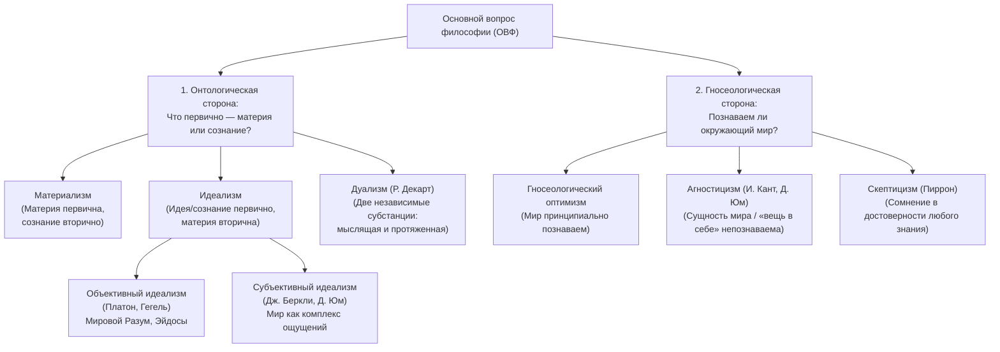

#### Онтологический аспект (субстанция мира):
- **Материализм:** Первична материя, природа, объективная реальность, существующая вне и независимо от человеческого сознания. Сознание — свойство высокоорганизованной материи (мозга) отражать объективный мир (Демокрит, Спиноза, Дидро, Маркс, Энгельс, Ленин).
- **Идеализм:** Первичен дух, идея, разум, сознание; материя вторична, порождена духом или зависит от него:
  - *Объективный идеализм:* Первоосновой мира является надмировой, безличный идеальный принцип (Мир эйдосов у Платона, Абсолютный Дух у Гегеля, Бог в религиозной философии).
  - *Субъективный идеализм:* Мир есть совокупность восприятий, представлений и ощущений субъекта познания («Существовать — значит быть воспринимаемым» у Дж. Беркли).
- **Дуализм:** Признание двух равноправных, несводимых друг к другу субстанций — материальной (обладающей протяженностью) и духовной (обладающей мышлением). Ярчайший представитель — Рене Декарт.

#### Гносеологический аспект (познаваемость мира):
- **Гносеологический оптимизм (гностицизм):** Человеческий разум способен адекватно познавать законы объективного мира и достигать объективной истины.
- **Агностицизм:** Отрицание возможности познания глубинной сущности реальности. Человек имеет дело только с явлениями (*феноменами*), тогда как «вещь в себе» (*ноумен*) принципиально недоступна человеческому познанию (Иммануил Кант, Дэвид Юм).
- **Скептицизм:** Философская позиция, не отрицающая познаваемость категорически, но выражающая обоснованное сомнение в достоверности любого претендующего на абсолютность знания.

### 2.5. Структурные разделы философии
1. **Онтология** (от греч. *ontos* — сущее и *logos* — учение) — учение о бытии, его формах, сущности, субстанции, категориях пространства, времени, движения, причинности.
2. **Гносеология / Эпистемология** (от греч. *gnosis* — познание, *episteme* — знание) — теория познания, исследующая структуру познавательного процесса, отношение субъекта и объекта, критерии истины, уровни познания (чувственное и рациональное).
3. **Аксиология** (от греч. *axia* — ценность) — учение о природе ценностей, их иерархии и месте в структуре человеческого действия.
   - **Этика** — учение о морали, нравственности, добре и зле, долге, справедливости и совести.
   - **Эстетика** — учение о прекрасном, безобразном, возвышенном, природе художественного творчества и искусства.
4. **Философская антропология** — философское учение о человеке, его биосоциальной сущности, происхождении, соотношении души и тела, проблеме свободы воли и смысла жизни.
5. **Социальная философия** — исследование общества как специфической формы бытия, законов его функционирования, институтов, исторической динамики и критериев социального прогресса.

### 2.6. Категории бытия, материи, времени и пространства: субстанциальная vs реляционная концепции
Особое внимание в лекции уделено философскому анализу понятий пространства и времени:
- **Субстанциальная концепция** (Демокрит, Исаак Ньютон): Пространство и время мыслятся как самостоятельные субстанции, существующие абсолютно независимо от материи. Пространство — это гигантское пустое «вместилище» (ящик), в котором размещены физические тела; время — это абсолютный, равномерно текущий мировой поток (часы), ход которого не зависит от происходящих во Вселенной процессов.
- **Реляционная концепция** (Аристотель, Г.В. Лейбниц, развитая А. Эйнштейном в теории относительности): Пространство и время не являются самостоятельными сущностями. Пространство — это система отношений между сосуществующими материальными объектами (порядок их взаимного расположения). Время — это форма координации сменяющих друг друга состояний и процессов. Вне материи и движения пространства и времени не существует.

### 2.7. Проблема истины в гносеологии: корреспондентная, когерентная и прагматическая теории
Что такое истина и как ее верифицировать? Лектор рассматривает три классические концепции:
1. **Корреспондентная (классическая) теория истины** (восходит к Платону и Аристотелю): Истина — это соответствие мысли, утверждения или теории объективной реальности (*veritas est adaequatio rei et intellectus*). Пример: суждение «На улице идет дождь» истинно тогда и только тогда, когда за окном действительно выпадают осадки.
2. **Когерентная теория истины** (Лейбниц, Спиноза, неопозитивизм): Истина — это внутренняя логическая согласованность, системность и взаимонепротиворечивость высказываний внутри данной теоретической системы (критически важна для математики, логики и теоретической физики).
3. **Прагматическая теория истины** (Ч.С. Пирс, У. Джеймс, Дж. Дьюи): Истинным признается то знание, которое практически полезно, эффективно работает и позволяет достигать успешных практических результатов.

---
## 3. Пара 2. Античная философия: от поиска первоначала до эллинистических школ

*Таймкод: `[02:10:00] – [03:20:00]`*

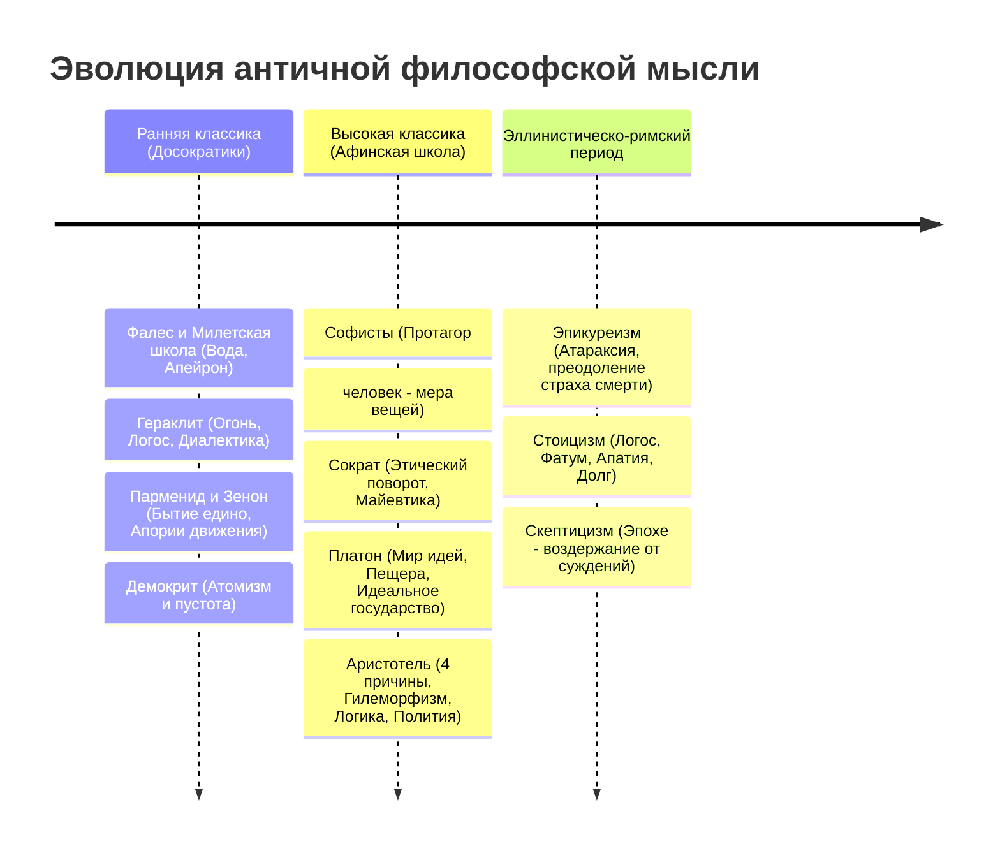

---

### 3.1. Ранняя греческая натурфилософия (досократики): поиск «архэ»
Античная философия зародилась в VII–VI вв. до н.э. в ионийских полисах Малой Азии как переход от мифа к логосу (*vom Mythos zum Logos*). Мыслители этого периода называются **досократиками** или натурфилософами, поскольку их внимание было направлено на физический космос и поиск единого первоначала — **«архэ»** (*arche*).

#### Милетская школа: Фалес (вода) и Анаксимандр (апейрон)
- **Фалес Милетский** (ок. 624–546 до н.э.) — основатель первой европейской философской школы. Он провозгласил: **«Первоначало всего сущего — Вода»** (*hydor*).
  - *Суть открытия:* Дело не в физической воде, а в радикальной смене познавательной парадигмы. Фалес впервые объяснил устройство мира не капризами мифологических олимпийских богов (Посейдона, Зевса), а единым естественным природным принципом, лежащим в основе всех вещей. Вода способна переходить в жидкое, твердое (лед) и газообразное (пар) состояния, питает все живое; земля «плавает на воде».
- **Анаксимандр** (ок. 610–546 до н.э.) — ученик Фалеса, совершивший решающий скачок абстрактного мышления.
  - *Критика Фалеса:* Анаксимандр заметил фундаментальное противоречие: если первооснова — вода, то как может существовать ее прямая противоположность — огонь? Ведь огонь испаряет воду, а вода гасит огонь. Ни одна из чувственно наблюдаемых частных стихий (вода, огонь, воздух, земля) не может быть первоначалом, иначе бы она уничтожила все остальные.
  - *Введение понятия «Апейрон»:* Анаксимандр утверждает, что первоосновой мира является **Апейрон** (*apeiron*) — бесконечная, беспредельная, вечная, бескачественная субстанция, находящаяся в непрерывном круговом движении. Из апейрона в процессе вечного движения выделяются противоположные пары (горячее — холодное, сухое — влажное), порождая конкретный материальный космос, и в апейрон же все вещи возвращаются «по закону воздаяния за несправедливость своего обособления».

#### Гераклит Эфесский: всеобщая текучесть, огонь, Логос и диалектика противоположностей
Гераклит (ок. 544–483 до н.э.) вошел в историю как отец античной **диалектики**:
- **Первоначало — Огонь:** Огонь для Гераклита — не просто стихия, а метафора вечной подвижности, трансформации и преобразования: *«Этот космос, один и тот же для всего сущего, не создал никто из богов и никто из людей, но он всегда был, есть и будет вечно живым огнем, мерами возгорающимся и мерами угасающим»*.
- **Принцип абсолютной динамики:** *«Все течет, все меняется»* (*Panta rhei*). Мир — это не застывший набор предметов, а непрерывный процесс становления. Знаменитый афоризм: *«Нельзя дважды войти в одну и ту же реку, ибо на входящего наплывают все новые и новые воды»*.
- **Учение о Логосе:** За кажущимся хаосом непрерывных изменений стоит объективный космический закон, всеобщий порядок и разум — **Логос** (*Logos*). Мудрость состоит в том, чтобы слышать Логос и поступать в согласии с природой.
- **Единство и борьба противоположностей:** Всякая вещь существует лишь благодаря напряжению противоположных начал (как струна и лук): день сменяет ночь, зима — лето, болезнь делает приятным здоровье. «Война — отец всего и царь всего».

#### Элейская школа: Парменид (бытие есть, небытия нет; тождество мышления и бытия)
Парменид из Элеи (ок. 515–450 до н.э.) занял диаметрально противоположную Гераклиту позицию, заложив основы философской **онтологии**:
- **Центральный тезис:** **«Бытие есть, а небытия нет»**.
  - *Логическое доказательство:* Помыслить небытие невозможно. Как только мы начинаем думать или говорить о «ничто», оно уже становится предметом мысли, то есть обретает бытие. Небытия нет, следовательно, бытие ниоткуда не возникало (иначе оно возникло бы из небытия) и не может исчезнуть.
  - Бытие едино, непрерывно, неделимо, неподвижно и неизменно. В нем нет пустоты, пустота — это небытие, которого нет.
- **Принцип тождества бытия и мышления:** *«Одно и то же — мысль и то, о чем мысль»* (*to gar auto noein estin te kai einai*). Мысль всегда предметна, мыслить можно только сущее.
- **Два пути познания:**
  1. *Путь Истины (Aletheia):* Рациональный путь чистого разума, постигающий единое неподвижное бытие.
  2. *Путь Мнения (Doxa):* Ложный путь чувственного восприятия, внушающий иллюзию множественности, делимости и движения.

#### Зенон Элейский и его апории движения (Ахиллес и черепаха, Дихотомия, Стрела)
Зенон Элейский (ок. 490–430 до н.э.), ученик Парменида, стал создателем диалектического доказательства от противного, сформулировав знаменитые **апории** (логические тупики, неразрешимые парадоксы), доказывающие логическую невозможность множественности и движения при допущении непрерывной делимости пространства и времени:

1. **«Ахиллес и черепаха»:**
   - Быстроногий Ахиллес никогда не догонит медлительную черепаху, если на старте между ними есть дистанция (например, 100 метров).
   - *Доказательство:* Пока Ахиллес пробежит 100 метров, черепаха проползет 1 метр. Пока Ахиллес пробежит этот метр, черепаха продвинется на 1 сантиметр. Пока Ахиллес преодолеет сантиметр, черепаха сдвинется на миллиметр. Дистанция между ними сокращается до бесконечно малых величин, но никогда не станет равной нулю, так как отрезок бесконечно делим. В чувственном опыте Ахиллес обгоняет черепаху, но чистый дискурсивный разум фиксирует парадокс бесконечной делимости континуума.
2. **«Дихотомия»:**
   - Движущийся предмет не может начать движение или пройти путь $S$.
   - Чтобы пройти весь путь, необходимо сначала преодолеть половину пути $S/2$. Но чтобы пройти эту половину, надо преодолеть $S/4$, до этого $S/8$, и так далее ad infinitum. Поскольку бесконечный ряд пространственных интервалов невозможно пройти за конечное время, движение не может даже начаться.
3. **«Стрела»:**
   - Летящая стрела в действительности неподвижна.
   - В каждый неделимый миг (квант) времени стрела занимает в пространстве место, равное своему объему. Но занимать место, равное себе — означает покоиться. Следовательно, в каждый конкретный момент полета стрела покоится. Но сумма состояний покоя не может образовать движения! Значит, движение — лишь иллюзия чувств (*doxa*), не выдерживающая проверки логикой.

#### Атомистический материализм Демокрита: неделимые атомы и пустота
Демокрит из Абдер (ок. 460–370 до н.э.) предложил материалистический синтез идей Парменида и Гераклита:
- Бытие состоит из мельчайших, неделимых, вечных и неизменных материальных частиц — **Атомов** (*atomos* — неделимый).
- В отличие от элеатов, Демокрит признает существование **Пустоты** (небытия), в которой атомы движутся и взаимодействуют.
- Атомы отличаются формой (шарообразные, крючкообразные, гладкие), порядком и пространственным положением. Все вещи материального мира — это временные механические сцепления атомов; распад сцеплений воспринимается нами как гибель или смерть вещи.
- **Жесткий механистический детерминизм:** В мире Демокрита нет случайностей. Каждое событие строго предопределено предшествующей цепью причин. Случайность — лишь иллюзия, возникающая из-за незнания человеком истинных причин явлений.

---

### 3.2. Софисты и Сократический поворот к человеку

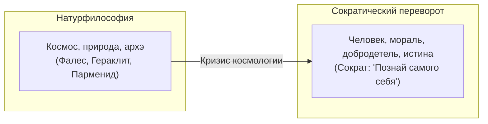

#### Софистика и эпистемологический релятивизм: Протагор
В V в. до н.э. в условиях расцвета афинской демократии возник колоссальный общественный запрос на искусство публичной речи и ведения судебных тяжб. На авансцену вышли **софисты** — профессиональные платные учителя красноречия и риторики:
- Старший софист **Протагор** (ок. 485–410 до н.э.) выдвинул релятивистский манифест: **«Человек есть мера всех вещей: существующих, что они существуют, и несуществующих, что они не существуют»**.
- Релятивизм: объективной истины не существует. Для больного мед кажется горьким, для здорового — сладким; один и тот же ветер для одного холоден, для другого свеж. Истина субъективна и зависит от точки зрения воспринимающего. Цель софиста в споре — не поиск объективной истины, а победа над оппонентом с помощью убедительной риторики и софизмов (манипулятивных уловок).

#### Сократ: антропологический переворот, этический рационализм, метод майевтики и иронии
Сократ (469–399 до н.э.) совершил революционный поворот европейской мысли: **от изучения природы (космологии) к изучению человека и его внутреннего нравственного мира (антропологии и этике)**.

1. **Отказ от натурфилософии и девиз Дельфийского оракула:**
   - Сократ утверждал, что устройство далекого космоса непостижимо и практически бесполезно для человека. Главная задача мыслителя — познать самого себя (*Gnoti seauton* — «Познай самого себя»).
2. **Этический рационализм:**
   - В противоположность софистам Сократ настаивал: **истина и добродетель объективны, они не зависят от мнений толпы**.
   - Фундаментальная максима Сократа: **«Добродетель есть знание»**. Ни один человек не совершает зла по своей доброй воле. Зло — это всегда результат неведения и заблуждения относительно того, что есть подлинное благо. Если человек точно знает, что есть справедливость и мужество, он неизбежно будет поступать справедливо.
3. **Метод Сократа (диалектика):**
   - **Ирония:** Сократ притворялся простаком и задавал собеседникам, считавшим себя экспертами (политикам, полководцам, поэтам), простые вопросы: *«Что такое мужество? Что такое справедливость? Что такое прекрасное?»*. Обнаруживая в ответах логические противоречия, Сократ разрушал их иллюзорную самоуверенность, приводя к спасительному осознанию собственного незнания: **«Я знаю только то, что ничего не знаю, но другие не знают и этого»**.
   - **Майевтика** (букв. «повивальное искусство»): Подобно тому, как повитуха помогает женщине разрешиться от бремени, философ в диалоге помогает душе собеседника самостоятельно родить скрытое внутри знание истины.
   - **Индукция и выработка общих понятий:** Восхождение от разрозненных частных примеров (справедливый поступок судьи, возврат долга) к универсальному общему определению сущности явления («Справедливость как таковая»).
4. **Суд и смерть Сократа:**
   - В 399 г. до н.э. Сократ был обвинен афинским судом в «непочитании богов полиса и развращении юношества». Несмотря на возможность оправдаться или бежать из тюрьмы, 70-летний мыслитель отказался преступать закон, добровольно выпив яд цикуты. Своей гибелью он доказал верность своим идеалам: закон полиса и верность истине выше физического выживания.

---

### 3.3. Объективный идеализм Платона: учение об эйдосах и государстве

Ученик Сократа Платон (427–347 до н.э.) создал первую в истории европейской мысли всеобъемлющую систему **объективного идеализма**.

#### Двоемирие: мир эйдосов (идей) vs мир чувственных вещей (теней)
Платон разделяет бытие на два фундаментальных онтологических пласта:

| Параметр | Мир эйдосов (идей) / Hyperouranios | Мир чувственных вещей / Окружающий мир |
| :--- | :--- | :--- |
| **Онтологический статус** | **Подлинное бытие** (*on*) | Кажущееся бытие, бывание, становление |
| **Свойства** | Вечен, неизменен, неделим, совершенен, бестелесен | Временен, текуч, бреннен, несовершенен, пространственен |
| **Отношение сущности** | **Первообраз, архетип, причина** | Вторичная копия, несовершенная тень, материальный отпечаток |
| **Способ познания** | Только **чистый разум, интеллектуальная интуиция** (*noesis*) | Органы чувств (*doxa* — субъективное мнение) |
| **Высшая вершина** | **Идея Блага** (подобно Солнцу озаряет весь мир идей истиной) | Земной материальный хаос |

Чувственные вещи рождаются и гибнут, но их эйдосы вечны: конкретная лошадь может умереть, но «идея лошадности» пребывает вечно; нарисованный круг может быть неровным, но математическая идея круга абсолютна.

#### Аллегория («миф») о пещере: природа познания и трагедия просветителя
В VII книге диалога «Государство» Платон приводит свою знаменитую аллегорию:
- **Узники в пещере:** Люди с детства сидят в глубокой темной пещере спиной к входу, прикованные цепями за ноги и шею так, что могут смотреть только на стену перед собой.
- **Тени на стене:** Позади них на возвышении горит огонь, а между огнем и узниками проносят различные статуи, фигурки людей и животных. Узники видят только мелькающие на стене тени и слышат эхо голосов. Они убеждены, что тени — это и есть единственная подлинная реальность.
- **Освобождение узника:** Философ — это узник, сумевший разорвать цепи и с мучительным трудом поднявшийся наружу. Сначала яркий солнечный свет ослепляет его, причиняя боль глазам. Но постепенно он адаптируется, начинает видеть сами предметы, деревья, звезды и, наконец, созерцает само **Солнце** (символ Идеи Блага).
- **Возвращение в пещеру:** Исполненный сострадания философ спускается обратно в темноту, чтобы освободить собратьев. Однако его отвыкшие от мрака глаза спотыкаются, он кажется узникам нелепым и смешным. Когда же он начинает убеждать их, что тени — обман, узники объявляют его безумцем и готовы растерзать любого, кто попытается увести их из привычной пещеры (прямая параллель с судьбой Сократа).

#### Гносеология Платона: учение о припоминании (анамнезис)
Как человек способен познавать нематериальные эйдосы, находясь в материальном теле?
- Платон утверждает: **душа человека бессмертна**. До рождения и вселения в материальное тело душа пребывала в горнем мире идей (*Hyperouranios*), непосредственно созерцая чистую истину, красоту и благо.
- При рождении душа падает в «темницу тела» и забывает всё виденное.
- Познание — это не приобретение нового знания из внешнего материального опыта, а **Анамнезис** (*anamnesis*) — **припоминание** душой того, что она уже созерцала в мире эйдосов. Чувственные вещи служат лишь внешним толчком, пробуждающим память души.

#### Учение о трехчастной душе и проект Идеального государства
В диалоге «Государство» Платон выстраивает параллелизм между структурой человеческой души и социальной архитектурой справедливого общества:

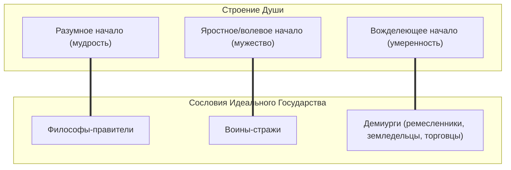

- **Справедливость** в государстве — это гармония, при которой каждое из трех сословий выполняет свою естественную функцию и не вмешивается в дела других.
- Правящие сословия (философы и стражи) ради исключения коррупции, стяжательства и кумовства лишаются **частной собственности и института индивидуальной семьи**: они живут в общих казармах, трапезничают вместе, а их дети воспитываются государством.

---

### 3.4. Энциклопедический философский синтез Аристотеля

Аристотель из Стагиры (384–322 до н.э.) — величайший ученик Платона, воспитатель Александра Македонского, систематизатор всего античного научного знания, основатель Ликея (перипатетической школы).

#### Критика платоновского мира идей: имманентность сущностей
Аристотель отвергает платоновский дуализм двух миров:
> *«Платон мне друг, но истина дороже»* (*Amicus Plato, sed magis amica veritas*).
- Платоновские эйдосы, вынесенные в заоблачный мир, бесполезны: они ничего не объясняют в движении и жизни чувственных вещей. Чтобы объяснить существование реального стола, Платон придумывает еще одну сущность — «идею стола», неоправданно удваивая мир.
- Сущности вещей (**формы**) не существуют обособленно в потустороннем мире; они пребывают **внутри самих вещей**. Каждая конкретная единичная вещь есть неразрывное единство **материи** и **формы** (**гилеморфизм**).

#### Учение о четырех причинах бытия
Любая существующая во Вселенной вещь возникает и объясняется через **четыре взаимосвязанные причины**:

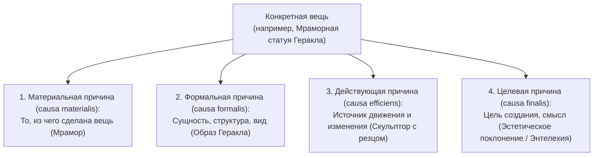

#### Диалектика возможности (потенции) и действительности (акта), энтелехия
Бытие динамично благодаря переходу из одного состояния в другое:
- **Материя** — это чистая **возможность (потенция, *dynamis*)**. Сама по себе она аморфна и пассивна.
- **Форма** — это **действительность (акт, *energeia*)**, организующее активное начало.
- Развитие есть процесс, посредством которого материя оформляется, реализуя заложенную в ней потенциальность.
  - *Пример лектора:* Желудь актуально является семенем, но потенциально содержит в себе дуб. В процессе роста форма дуба овладевает материей желудя.
- **Энтелехия** (*entelecheia*) — внутренняя целенаправленная сила, завершенное единство цели и движения, ведущее объект к полному раскрытию своей сущности.

#### Учение о Перводвигателе (Нус) и логический Органон
- Восходя по иерархической лестнице от неоформленной первоматерии к высшим формам, Аристотель неизбежно приходит к вершине бытия — **Перводвигателю (Первоформе, Космическому Нусу)**. Перводвигатель — это чистая форма, абсолютно лишенная материи; чистая мысль, мыслящая самое себя (*noesis noeseos*). Будучи сам неподвижным, он приводит в движение весь космос как высшая конечная цель любви и стремления (*causa finalis*).
- **Основоположник логики:** Аристотель создал систему формальной логики (свод трудов «Органон»), разработав учение о силлогизмах и три фундаментальных закона правильного мышления:
  1. *Закон тождества:* $A = A$ (всякая мысль в процессе рассуждения должна сохранять одно и то же определенное значение).
  2. *Закон непротиворечия:* $\neg (A \wedge \neg A)$ (не могут быть одновременно истинными два противоположных суждения об одном и том же предмете в одно и то же время и в одном отношении).
  3. *Закон исключенного третьего:* $A \vee \neg A$ (из двух противоречащих суждений одно истинно, другое ложно, а третьего не дано).

#### Социальная этика: «человек — политическое животное» и добродетель как середина
- **Антропология:** Человек по своей природе есть **«политическое животное»** (*zoon politikon*), способное полноценно реализовать свой потенциал только внутри полиса (государства). Тот, кто живет вне государства — либо неразвитый зверь, либо самодостаточный бог.
- **Этика:** Добродетель — это приобретенное свойство воли держаться **«золотой середины»** (*mesotes*) между двумя крайними пороками — избытком и недостатком:
  - *Мужество* — середина между безрассудной трусостью и слепой дерзостью;
  - *Щедрость* — середина между скупостью и расточительностью;
  - *Благоразумие* — середина между бесчувственностью и распущенностью.

---

### 3.5. Эллинистическо-римская философия: этика личного спасения и покоя

Крах классического независимого греческого полиса, завоевания Александра Великого и последующее вхождение Средиземноморья в состав Римской империи привели к утрате гражданином чувства сопричастности к управлению полисом. Общество атомизировалось. Философия перестает строить грандиозные космологические системы и превращается в **«искусство жизни»**, индивидуальную этику поиска душевного покоя в нестабильном и враждебном мире.

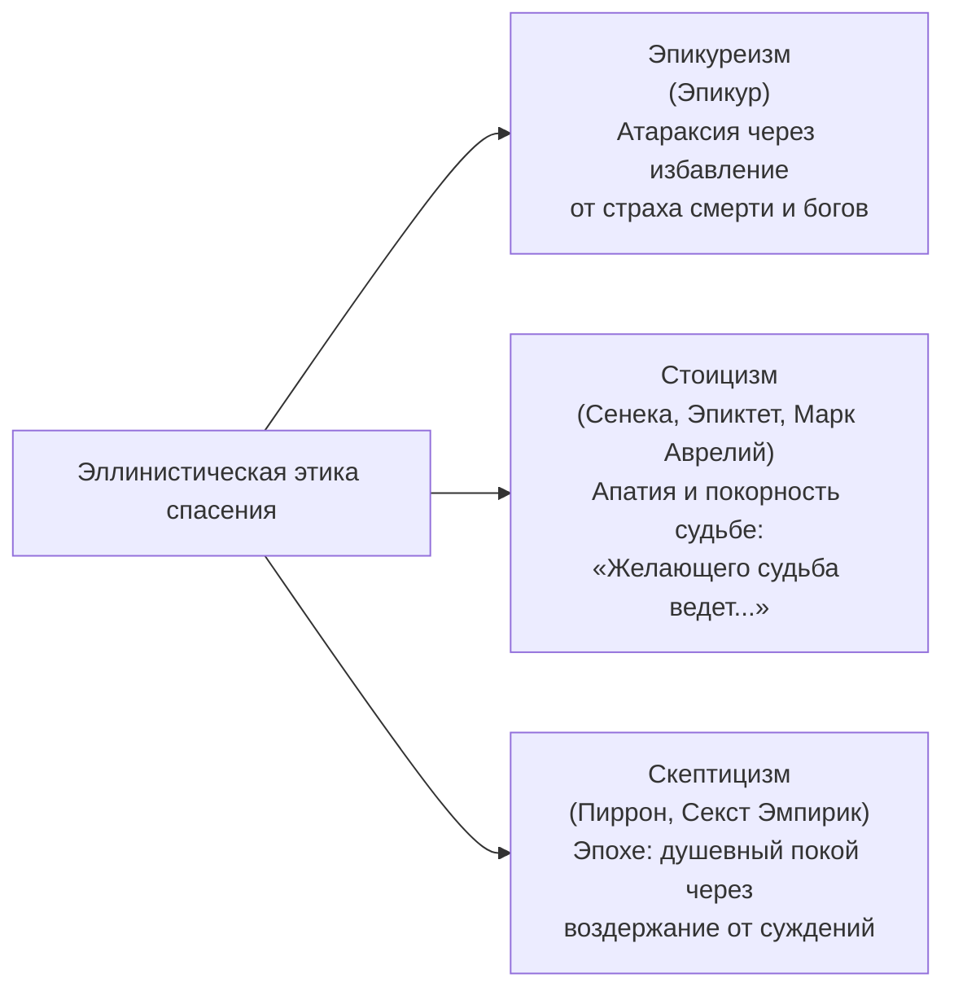

#### Эпикуреизм: преодоление страха богов и смерти, атараксия, разумный гедонизм
- **Эпикур** (342–270 до н.э.) основал в Афинах школу «Сад». Высшая цель человеческой жизни — счастье, понимаемое как **Атараксия** (*ataraxia* — безмятежность, невозмутимость духа) и **Апония** (отсутствие физической боли).
- **Развенчание мифа о вульгарном гедонизме:** Эпикурейство часто ошибочно ассоциируют с безудержным чревоугодием и оргиями. Напротив, Эпикур учил умеренности: избыточные телесные наслаждения неизбежно влекут похмелье, пресыщение и душевные страдания.
- **Иерархия желаний по Эпикуру:**
  1. *Естественные и необходимые* (простая пища, чистая вода, базовая одежда, философская дружба) — легко достижимы и дают подлинный покой.
  2. *Естественные, но не необходимые* (изысканные яства, половые страсти) — допустимы в меру, но не должны становиться зависимостью.
  3. *Неестественные и не необходимые* (богатство, слава, политическая власть) — бесконечны, ненасытны и порождают постоянный страх их потери.
- **Преодоление экзистенциальных страхов:**
  - *Страх перед богами:* Боги блаженны и бессмертны, они пребывают в межмировых пространствах (*интермундии*) и абсолютно равнодушны к делам смертных. Они не насылают болезней и молний, их не нужно бояться.
  - *Страх смерти:* Смерть — это просто распад атомов души и тела:
    > *«Смерть не имеет к нам никакого отношения: пока мы есть — смерти еще нет, когда же смерть наступает — нас уже нет»*. Чувство боли или ужаса после смерти невозможно, так как исчезает сам воспринимающий субъект.

#### Стоицизм: покорность мировому Логосу, долг, апатия
- Основанный Зеноном из Кития (ок. 334–262 до н.э.) и блестяще развитый в Риме (Сенека, Эпиктет, император Марк Аврелий), стоицизм стал философией долга и мужественного противостояния ударам судьбы.
- **Космос как живой организм:** Вселенная управляется строгим законом судьбы и божественным разумом — мировым **Логосом**. Все предопределено. Фаталистический закон выражен латинской сентенцией: *«Желающего судьба ведет, нежелающего — тащит»* (*Ducunt volentem fata, nolentem trahunt*).
- **Дихотомия контроля (Эпиктет):** Весь мир делится на две сферы:
  1. *То, что зависит от нас:* наши убеждения, суждения, моральные решения, желания и отвращения.
  2. *То, что НЕ зависит от нас:* наше тело, богатство, социальный статус, репутация, мнение окружающих, смерть близких.  
  Человек страдает лишь потому, что пытается контролировать внешние вещи, над которыми не властен. Стоик сосредотачивается исключительно на чистоте собственной совести и безупречном исполнении долга.
- **Апатия (*apatheia*):** Свобода от деструктивных страстей (страха, гнева, зависти, скорби). Стойкость перед лицом любых невзгод: «Делай что должен, и будь что будет».

#### Античный скептицизм: эпохе (воздержание от суждений)
- Основатель **Пиррон** (ок. 360–270 до н.э.), систематизатор — Секст Эмпирик (II в. н.э.).
- Скептики утверждали, что чувства обманчивы (весло в воде кажется переломленным, башня издали — круглой, а вблизи — квадратной), а логические доказательства разума приводят к бесконечному регрессу оснований.
- На любой аргумент всегда можно найти равный по силе контрдовод (**изостения**).
- Единственный способ обрести душевное спокойствие (*атараксию*) — практиковать **Эпохе** (*epoche*) — **полное воздержание от окончательных суждений**. Не утверждая ничего категорически («Это теплое», а не «Это кажется мне теплым»), скептик освобождается от догматических иллюзий и тревоги.

---
## 4. Пара 3. Средневековье, Новое время, Просвещение и классические системы XIX–XX веков

*Таймкод: `[03:48:00] – [05:00:00]`*

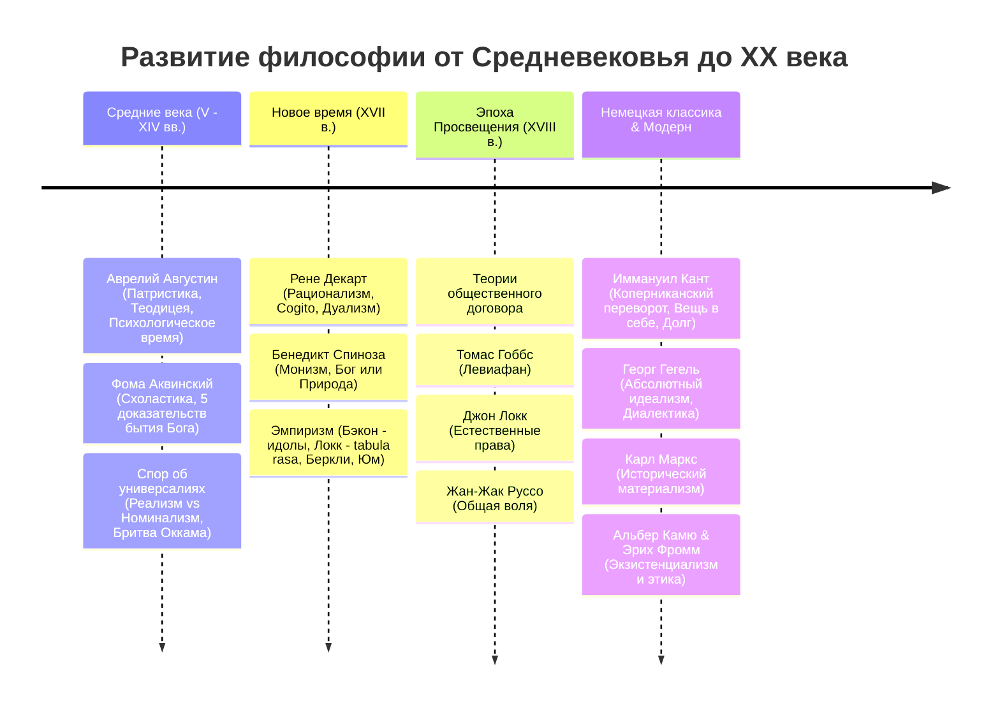

---

### 4.1. Средневековая теоцентрическая философия: патристика и схоластика

С крушением Римской империи и победой христианства характер европейской мысли радикально изменился. Философия на тысячелетие подчиняется религиозному мировоззрению.

#### Фундаментальные принципы средневековой мысли
1. **Теоцентризм:** Бог — абсолютное, бесконечное, совершенное начало, высшая реальность, первопричина и конечная цель всего мироздания. Все сущее исследуется сквозь призму отношения к Творцу.
2. **Креационизм** (от лат. *creatio* — творение): Учение о творении мира Богом из абсолютного небытия (**ex nihilo** — «из ничего») актом свободной божественной воли. Материя не вечна (в отличие от античной космологии), она сотворена во времени.
3. **Провиденциализм** (от лат. *providentia* — промысел): Учение о постоянном божественном промысле, направляющем ход истории человечества к предопределенной эсхатологической цели — Страшному Суду и Царству Божьему.
4. **Ревеляционизм** (от лат. *revelatio* — откровение): Священное Писание (Библия) обладает статусом абсолютной, богооткровенной истины, стоящей неизмеримо выше ограниченного человеческого рассудка.

#### Аврелий Августин: теодицея, свобода воли, концепция времени, предвосхищение картезианства
Епископ Гиппонский Аврелий Августин Блаженный (354–430) — ключевая фигура патристики, синтезировавшая христианство с неоплатонизмом:

- **Проблема зла и теодицея (оправдание Бога):**
  - *Вопрос:* Если Бог всеблаг, всемогущ и всеведущ, откуда в мире зло, болезни и страдания? Не создал ли зло сам Бог?
  - *Решение Августина:* Бог зла не создавал. Зло не обладает самостоятельной онтологической субстанцией. Зло — это **лишенность, недостаток или поврежденность добра** (*privatio boni*), подобно тому как тьма есть лишь отсутствие света, а слепота — повреждение зрения.
  - Источником зла в сотворенном мире выступает **свобода воли человека** (*liberum arbitrium*). Человек злоупотребляет дарованной ему свободой, совершая грехопадение — отвращаясь от высшего блага (Бога) ради наслаждения низшими тварными вещами.
- **Феноменологическая концепция времени (XI книга «Исповеди»):**
  > *«Что же такое время? Если никто меня об этом не спрашивает, я знаю, что такое время; если же я захочу объяснить спрашивающему — я не знаю ничего...»*
  - Время не существовало до сотворения мира, оно сотворено **вместе с миром**. Спрашивать «Что делал Бог до сотворения мира?» бессмысленно, так как не было самого «до».
  - Время не обладает физической субстанцией вне сознания:
    - *Прошлого уже нет* — оно существует лишь в человеческой душе как **память**;
    - *Будущего еще нет* — оно существует лишь в душе как **ожидание / надежда**;
    - *Настоящее* — неуловимый, мгновенный миг, существующий в душе как непосредственное **внимание / созерцание**.
- **«О граде Божием»:** Исторический процесс есть арена противоборства двух духовных сообществ:
  1. *Града Земного* (*civitas terrena*) — сообщества эгоистов, живущих по плоти, основанного на любви к себе, доведенной до презрения к Богу;
  2. *Града Божьего* (*civitas Dei*) — сообщества праведников, объединенных любовью к Богу, доведенной до презрения к себе.
- **Предвосхищение картезианского принципа:** За 1200 лет до Рене Декарта Августин сформулировал опровержение скептицизма: *«Si fallor, sum»* — **«Если я ошибаюсь, я существую»**. Ведь чтобы ошибаться или сомневаться, необходимо существовать.

#### Фома Аквинский: гармония веры и разума, 5 рациональных доказательств бытия Бога
Святой Фома Аквинский (1225–1274) — систематизатор высокой схоластики (томизм), совершивший грандиозный синтез христианской теологии и философии Аристотеля:

- **Гармония веры и разума:** Фома отвергает теорию двойственной истины (будто нечто может быть истинным по вере, но ложным по разуму). Истина едина. Разум и откровение ведут к одной цели:
  > *«Благодать не устраняет природу, но совершенствует ее»* (*Gratia non tollit naturam, sed perficit*).
  Философия автономна в познании тварного мира, но служит теологии: **«Философия — служанка богословия»** (*ancilla theologiae*).
- **Пять путей доказательства бытия Бога (*Quinque Viae*):**
  1. *От движения (ex motu):* Все движущееся в мире приводится в движение чем-то другим. Бесконечный регресс двигателей невозможен, следовательно, существует **Первый Неподвижный Двигатель**, приводящий в движение всё — Бог.
  2. *От производящей причины (ex causa efficiens):* В природе существует цепь причин и следствий. Ни одна вещь не может быть производящей причиной самой себя (для этого ей надо было бы существовать раньше себя). Бесконечный ряд причин невозможен, следовательно, существует **Первопричина** — Бог.
  3. *От необходимости и случайности (ex contingentia):* Все единичные природные вещи случайны: они возникают и уничтожаются. Если бы все вещи были случайными, в бесконечном времени возник бы момент, когда ничего не существовало бы. Но тогда и сейчас ничего бы не возникло. Следовательно, должно быть нечто **Абсолютно Необходимое**, черпающее необходимость в самом себе — Бог.
  4. *От степеней совершенства (ex gradu):* В мире мы видим градации блага, истины, красоты и благородства (одно лучше другого). Но суждение о большем или меньшем возможно только относительно некоторого абсолютного эталона. Существует **Наивысшее Совершенство** — Бог.
  5. *От целесообразности / порядка в природе (ex fine):* Неразумные природные тела действуют согласованно и целесообразно для достижения наилучшего результата. Но объект, лишенный разума, может двигаться к цели, только будучи направляем разумным творцом (как стрела направляется лучником). Следовательно, есть **Высший Архитектор**, упорядочивающий мир — Бог.

#### Спор об универсалиях: реализм vs номинализм, бритва Оккама
Главный теоретический диспут Средневековья: **как существуют общие понятия (универсалии) — реально или только в словах?**

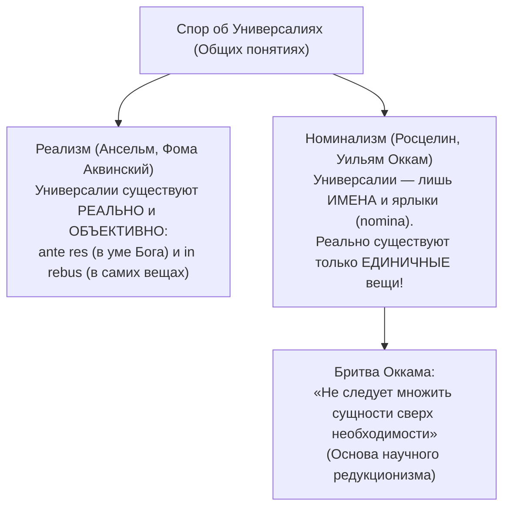

- **Уильям Оккам** (ок. 1287–1347) радикализировал номинализм, сформулировав знаменитый принцип бережливости мышления — **«Бритву Оккама»**:
  > *«Сущности не следует умножать без необходимости»* (*Entia non sunt multiplicanda praeter necessitatem*).
  Если факт можно объяснить простыми физическими причинами, недопустимо придумывать мистические метафизические сущности. Этот принцип стал локомотивом становления экспериментальной науки Нового времени.

---

### 4.2. Философия Нового времени (XVII в.): гносеологический переворот и научный метод

В XVII веке на смену религиозному традиционализму приходит эпоха научной революции (Галилей, Кеплер, Ньютон) и бурного развития раннекапиталистических отношений. В центр философского поиска встает **проблема метода: «Как добыть объективное, практически полезное и достоверное знание?»**.

#### Рационализм: Рене Декарт (картезианское сомнение, Cogito ergo sum, дуализм субстанций)
Французский математик и философ Рене Декарт (Картезий, 1596–1650) заложил основы **новоевропейского рационализма**:

1. **Методологическое сомнение:**
   - Декарт стремится найти абсолютную точку опоры для всей системы наук. Для этого он подвергает тотальному сомнению всё, что вызывает хоть малейшее подозрение:
     - Органы чувств (они часто обманывают нас миражами и сновидениями);
     - Чувство собственного тела (безумцам чудится, что они стеклянные);
     - Истины математики (гипотеза о существовании всемогущего «злого демона-обманщика», внушающего ложные мысли).
2. **Фундаментальная истина:**
   - Я могу сомневаться во всем — в существовании своего тела, Бога, физического мира. Но само мое сомнение абсолютно несомненно!
   - Сомнение есть форма мысли. Мыслящий субъект не может не существовать в момент мышления:
     > **«Я мыслю, следовательно, я существую»** (*Cogito, ergo sum*).
3. **Дуализм Декарта:**
   - Реальность распадается на две абсолютно независимые субстанции:
     - **Мыслящая субстанция (*res cogitans*):** духовна, непротяженна, неделима, свободна (человеческое сознание, душа);
     - **Протяженная субстанция (*res extensa*):** материальна, занимает место в пространстве, бесконечно делима, подчинена механическим законам физики (природа, человеческое тело, животные-автоматы).
   - *Психофизическая проблема:* Как нематериальная душа может двигать материальным телом? Декарт локализовал этот контакт в шишковидной железе головного мозга (*эпифизе*).
4. **Учение о врожденных идеях:** Разум человека изначально наделен врожденными идеями (идея Бога, законы логики, аксиомы геометрии), раскрывающимися методом **дедукции** (от общего к частному).

#### Пантеистический монизм Бенедикта Спинозы (Deus sive Natura, свобода как осознанная необходимость)
Бенедикт Спиноза (1632–1677) преодолевает декартовский дуализм:
- Субстанция не может быть двойственной, иначе одна ограничивала бы другую. Существует только **Одна бесконечная Субстанция** — первопричина самой себя (**causa sui**).
- Спиноза отождествляет Бога и Природу: **«Бог, или Природа»** (*Deus sive Natura*) — это позиция радикального **пантеизма**. Бог Спинозы не трансцендентный творец, а сама имманентная природная реальность.
- Мышление и протяженность — это не две субстанции, а два из бесконечного числа познаваемых человеком **атрибутов** Единой Субстанции.
- Конкретные единичные вещи и люди — это лишь временные проявления, состояния субстанции — **модусы** (*modi*).
- **Свобода и необходимость:** Во вселенной господствует тотальный причинно-следственный детерминизм. Человек ошибочно мнит себя свободным лишь потому, что осознает свои поступки, но слеп к обусловливающим их причинам. Истинная свобода достигается через познание:
  > **«Свобода есть осознанная необходимость»** (*Libertas est cognitio necessitatis*).

#### Плюралистическая монадология Готфрида Лейбница
Готфрид Вильгельм Лейбниц (1646–1716) предложил альтернативу монизму Спинозы — **плюрализм**:
- Мир состоит из бесконечного множества неделимых духовных атомов — **Монад** (*monas* — единица).
- Монады нематериальны, бестелесны, «не имеют окон» (не могут оказывать прямое физическое воздействие друг на друга) и являются центрами живой деятельной силы и восприятия.
- **Предустановленная гармония:** Порядок и взаимодействие во Вселенной объясняются тем, что Бог изначально синхронизировал внутренние состояния всех монад, как гениальный часовщик настраивает множество часов так, чтобы они одновременно отбивали одно и то же время.

#### Эмпиризм и сенсуализм: Фрэнсис Бэкон, Джон Локк, Джордж Беркли, Дэвид Юм
В противоположность континентальному рационализму в Англии сформировалась традиция **эмпиризма**, утверждающая опыт единственным источником подлинного знания:

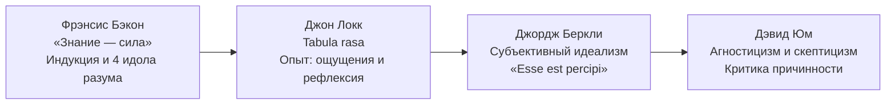

1. **Фрэнсис Бэкон (1561–1626):**
   - Провозгласил практическую цель науки: **«Знание — сила»** (*Scientia potentia est*). Наука должна служить благу человечества и подчинению природы.
   - Обосновал метод **научной индукции** (движение мысли от наблюдений и экспериментов к общим теоретическим законам).
   - Разработал учение о **четырех идолах (призраках) разума**, искажающих познание:
     - *Идолы Рода:* пороки, свойственные самой человеческой биологической природе и органам чувств;
     - *Идолы Пещеры:* субъективные искажения отдельного индивида, вызванные его личным воспитанием, характером и вкусами;
     - *Идолы Площади (Рынка):* заблуждения, возникающие из-за неточности языка, смешения понятий и терминологической путаницы;
     - *Идолы Театра:* слепое подчинение авторитетам старых догматических философских учений, разыгрывающих на сцене вымышленные миры.
2. **Джон Локк (1632–1704):**
   - Отверг учение о врожденных идеях. При рождении душа ребенка — это «чистый лист бумаги», гладкая восковая доска — **Tabula rasa**.
   - Фундаментальный принцип сенсуализма: *«Нет ничего в разуме, чего прежде не было бы в чувствах»* (*Nihil est in intellectu quod non sit prius in sensu*).
   - Все идеи берутся из двух видов опыта: **внешнего** (ощущения через рецепторы органов чувств) и **внутреннего** (рефлексия — наблюдение ума за собственной мыслительной деятельностью).
3. **Джордж Беркли (1685–1753):**
   - Довел сенсуализм до парадоксального **субъективного идеализма**: если все знание дано нам исключительно через ощущения, то откуда мы знаем, что за ними стоит какая-то нематериальная «материя»?
   - Материя — бессмысленная абстракция. Вещь есть ничто иное, как комбинация наших чувственных ощущений (цвет, твердость, запах).
   - Формула бытия: **«Существовать — значит быть воспринимаемым»** (*Esse est percipi*). Чтобы мир не исчезал, когда люди закрывают глаза или спят, Беркли вводит Бога — Всевидящего Субъекта, непрерывно воспринимающего все вещи Вселенной.
4. **Дэвид Юм (1711–1776):**
   - Радикальный скептик и агностик. Человек оперирует лишь впечатлениями (яркие ощущения) и идеями (их блеклые копии в памяти).
   - **Критика закона причинности:** Мы видим, как один шар ударяет другой, и тот начинает катиться. Опыт фиксирует лишь пространственное соприкосновение и временную последовательность («после этого»). Но объективной внутренней связи («по причине этого») органы чувств не фиксируют!
   - Причинность — это не закон физической природы, а **психологическая привычка** и ассоциация человеческого ума ожидать появление события $B$ после события $A$ на основании прошлого повторяющегося опыта.
   - Человеческое «Я» — это не вечная бессмертная субстанция, а непрерывно текущий «пучок или связка различных восприятий».

---

### 4.3. Социальная философия Нового времени и эпохи Просвещения (XVIII в.)

В Новое время рождается секулярная политическая философия, отказавшаяся от средневековой идеи «божественного права королей» в пользу рационалистических теорий **естественного права** и **общественного договора**.

```mermaid
flowchart TD
    subgraph Томас Гоббс
        H1["Естественное состояние:<br>«Война всех против всех»<br>Человек человеку волк"] --> H2["Общественный договор:<br>Отказ от свободы ради безопасности"] --> H3["Итог: Государство-Левиафан<br>(Абсолютная власть суверена)"]
    end
    
    subgraph Джон Локк
        L1["Естественное состояние:<br>Мир, равенство, естественные права:<br>Жизнь, Свобода, Собственность"] --> L2["Общественный договор:<br>Власть как арбитр и защитник прав"] --> L3["Итог: Правовое государство<br>(Разделение властей, право на восстание)"]
    end
    
    subgraph Жан-Жак Руссо
        R1["Естественное состояние:<br>«Золотой век», благородный дикарь.<br>Порча из-за частной собственности"] --> R2["Общественный договор:<br>Подчинение Общей воле (volonté générale)"] --> R3["Итог: Прямое народовластие<br>(Гражданин свободен, подчиняясь закону)"]
    end
```

#### Томас Гоббс: «война всех против всех» и государство-Левиафан
В трактате «Левиафан» (1651) Томас Гоббс рисует драматическую картину:
- **Естественное состояние (*status naturalis*):** До появления государства люди равны от природы по способностям, но эгоистичны, движимы страхом смерти, жаждой наживы и славы. Ресурсы ограничены. Результат — **«война всех против всех»** (*bellum omnium contra omnes*).
- В этом состоянии **«человек человеку — волк»** (*homo homini lupus est*). Нет понятий справедливости, закона и собственности; жизнь человека «одинока, бедна, беспросветна, жестока и кратковременна».
- **Общественный договор:** Руководствуясь фундаментальным инстинктом самосохранения и естественным разумом, люди добровольно передают свои естественные права единому лицу или собранию — государству (**Левиафану** — библейскому чудовищу). Государство получает абсолютную монополию на насилие ради установления мира и железного порядка. Бунт против суверена недопустим.

#### Джон Локк: неотчуждаемые естественные права, частная собственность, разделение властей
Джон Локк во «Втором трактате о правлении» (1689) формулирует фундаментальные принципы классического либерализма:
- **Естественное состояние:** Это состояние свободы и равенства, где люди руководствуются естественным законом разума.
- **Триада неотчуждаемых естественных прав человека:**
  1. Право на **Жизнь**;
  2. Право на **Свободу**;
  3. Право на **Собственность** (*Property* — возникает тогда, когда человек соединяет природный ресурс со своим личным трудом).
- **Общественный договор и цели государства:** Государство создается исключительно как гарант и инструмент надежной судебной защиты естественных прав граждан. Власть монарха ограничена законом.
- **Принцип разделения властей:** Разграничение властей на законодательную (парламент) и исполнительную (монарх, суды) во избежание деспотии.
- **Право народа на восстание:** Если государственная власть нарушает условия договора, попирает права граждан и превращается в тиранию, народ имеет священное и законное право на вооруженное свержение правительства.

#### Жан-Жак Руссо: «Человек рождается свободным, но повсюду он в цепях», общая воля
Французский мыслитель эпохи Просвещения Жан-Жак Руссо (1712–1778) в трактатах «Рассуждение о неравенстве» и «Об общественном договоре»:
- **Естественное состояние («золотой век»):** До цивилизации первобытный человек («благородный дикарь») жил в гармонии с природой, был добр, свободен, счастлив и сострадателен.
- **Происхождение зла и социального неравенства:**
  > *«Тот, кто первый огородил участок земли и сказал: "Это моё!", — и нашел людей, достаточно простодушных, чтобы этому поверить, был истинным основателем гражданского общества... От скольких бедствий избавил бы человечество тот, кто выдернул бы колья и воскликнул: "Вы погибли, если забудете, что плоды земли принадлежат всем, а земля — никому!"»*
- Ложное общество основано на угнетении: **«Человек рождается свободным, но повсюду он в цепях»**.
- **Новый общественный договор:** Возврата в первобытные джунгли нет. Спасение — в создании подлинного республиканского государства, где каждый гражданин передает свою волю суверену — **«Общей воле»** (*volonté générale*). Подчиняясь законам, которые гражданин сам для себя написал, он остается столь же свободным, как и прежде.

#### Идеология Просвещения: вера в силу разума, науки, образования и прогресса
Эпоха Просвещения (XVIII в. — Вольтер, Дидро, д’Аламбер, Монтескье):
- Пафос освобождения человеческого духа от оков средневекового суеверия, клерикализма и деспотизма.
- Культ **Разума** как верховного судьи всех социальных институтов.
- Деизм: представление о Боге как о Великом Часовщике, создавшем законы Вселенной и не вмешивающемся в ход природной механики.
- Вера в бесконечный линейный прогресс цивилизации через науку, энциклопедическое знание и светское образование.

---

### 4.4. Немецкая классическая философия: Иммануил Кант и Георг Гегель

Рубеж XVIII–XIX веков ознаменован расцветом **Немецкой классической философии** — вершины европейского философского рационализма.

#### Иммануил Кант: коперниканский переворот, априорные формы, феномен и ноумен («вещь в себе»), категорический императив
Родоначальник немецкой классики Иммануил Кант (1724–1804, Кенигсберг):

1. **«Коперниканский переворот» в гносеологии:**
   - Подобно тому, как Коперник объяснил видимое движение планет движением самого наблюдателя (Земли), Кант перевернул гносеологию: **не наше познание согласуется с объектами внешнего мира, а сами объекты внешнего опыта сообразуются с априорными познавательными способностями субъекта**.
2. **Структура познания:**
   - *Априорные формы чувственности:* Пространство и Время — это не физические свойства внешнего мира, а врожденные, доопытные (*a priori*) формы человеческого чувственного восприятия.
   - *Априорные формы рассудка:* 12 категорий (причинность, субстанция, необходимость, возможность и др.), с помощью которых рассудок синтезирует и структурирует поток чувственных данных в законы природы.
3. **Двоемирие Канта: Феномены vs Ноумены:**
   - **Феномен (Явление):** Мир таким, каким он является человеку сквозь призму его априорных форм чувственности и рассудка. Феноменальный мир полностью познаваем наукой.
   - **Ноумен («Вещь в себе», *Ding an sich*):** Сущность предметов самих по себе, вне зависимости от нашего восприятия. «Вещь в себе» принципиально **трансцендентна и непознаваема** для человеческого разума (кантовский агностицизм).
4. **Антиномии чистого разума:** При попытке выйти за пределы опыта и познать мир как целое разум впадает в неразрешимые взаимоисключающие противоречия (мир конечен во времени / мир бесконечен; все в мире подчинено строгой причинности / существует свободная причинность воли).
5. **Этика долга и Категорический императив:**
   - Мораль автономна и не зависит от религиозного страха ада или стремления к земному счастью. Моральный закон записан в душе каждого разумного существа:
     > *«Две вещи наполняют душу всегда новым и все более сильным удивлением и трепетом... это звездное небо надо мной и моральный закон во мне»*.
   - **Категорический императив** (безусловное повеление практического разума):
     - *Формула всеобщности:* **«Поступай только согласно такой максиме, руководствуясь которой ты в то же время можешь пожелать, чтобы она стала всеобщим законом»**.
     - *Формула человечности:* **«Поступай так, чтобы ты всегда относился к человечеству и в своем лице, и в лице всякого другого так же, как к цели, и никогда не относился бы к нему только как к средству»**.

#### Георг Гегель: абсолютный идеализм, законы диалектики и триада
Георг Вильгельм Фридрих Гегель (1770–1831) создал грандиозную всеобъемлющую систему **Абсолютного идеализма**:
- **Первооснова мира:** **Абсолютная Идея (Мировой Разум)**. Реальность есть грандиозный исторический процесс саморазвития и самопознания Абсолютного Духа. Знаменитый тезис Гегеля: *«Все действительное разумно, все разумное действительно»*.
- **Триадический цикл саморазвития Идеи:**
  1. *Тезис (Логика):* Идея развивается в стихии чистого отвлеченного мышления до сотворения природы;
  2. *Антитезис (Природа):* Идея отчуждает себя в свое «инобытие» — застывшую материальную природу и космос;
  3. *Синтез (Дух):* Идея преодолевает материальное отчуждение, возвращаясь к себе в человеческой истории, праве, культуре, искусстве, религии и достигая абсолютного самосознания в **Философии**.
- **Три закона диалектики Гегеля:**
  1. **Закон единства и борьбы противоположностей:** Всякое явление содержит в себе внутренние противоречия, борьба которых выступает источником любого развития и движения.
  2. **Закон перехода количественных изменений в качественные:** Постепенные количественные изменения при достижении границы меры приводят к скачкообразному рождению нового качества.
  3. **Закон отрицания отрицания:** Развитие идет не по кругу и не по прямой, а **по спирали**: новое состояние отрицает старое, но на высшем этапе синтезирует и удерживает в себе все положительные достижения предыдущих ступеней (**Aufhebung — «снятие»**).

---

### 4.5. Постклассическая и современная мысль: марксизм, экзистенциализм, гуманистический психоанализ

#### Карл Маркс: исторический материализм, базис и надстройка, смена формаций, преодоление отчуждения труда
Карл Маркс (1818–1883) и Фридрих Энгельс совершили материалистический переворот:
- **Материалистическое понимание истории:** Диалектика Гегеля была «поставлена с головы на ноги». Не духовные идеи определяют историю, а **материальное производство**:
  > *«Не сознание людей определяет их бытие, а, наоборот, их общественное бытие определяет их сознание»*.
- **Структура общественной формации:**
  - **Экономический базис:** Единство производительных сил (технологии, станки, сырье, рабочие) и производственных отношений (прежде всего — отношений собственности на средства производства).
  - **Идеологическая надстройка:** Государство, правовые институты, армия, мораль, религия, философия, искусство. Надстройка отражает и защищает интересы экономически господствующего класса.
- **Классовая борьба и общественно-экономические формации:** История всех до сих пор существовавших обществ была историей борьбы классов (свободный и раб, патриций и плебей, помещик и крепостной, буржуа и пролетарий). Смена формаций:
  $$\text{Первобытная} \longrightarrow \text{Рабовладельческая} \longrightarrow \text{Феодальная} \longrightarrow \text{Капиталистическая} \longrightarrow \text{Коммунистическая}$$
- **Критика капитализма и частной собственности:**
  - Лектор подчеркивает актуальный аргумент Маркса: частная собственность на природные богатства и землю морально и юридически несостоятельна: *«Природа и земля существовали за миллиарды лет до человека. На каком правовом основании кусок планеты или завод может принадлежать частному лицу по праву наследования?»*.
  - При капитализме рабочий отчужден от продуктов своего труда, от процесса труда, от своей человеческой сущности и от других людей (**феномен отчуждения труда**).
  - Преодоление отчуждения мыслится через пролетарскую революцию, уничтожение частной собственности и переход к **коммунизму** — обществу, основанному на общественной собственности, где *«свободное развитие каждого является условием свободного развития всех»*.

#### Экзистенциализм XX века: Альбер Камю («Миф о Сизифе», философия абсурда, бунт и достоинство)
Лектор рекомендует студентам познакомиться с французским экзистенциализмом:
- **Альбер Камю** (1913–1960) в манифесте «Миф о Сизифе» (1942) провозглашает:
  > *«Есть лишь одна по-настоящему серьезная философская проблема — это проблема самоубийства. Решить, стоит ли жизнь труда быть прожитой или нет, — значит ответить на основополагающий вопрос философии»*.
- **Тема Абсурда:** Абсурд — это трагический разрыв и столкновение между человеческим страстным стремлением к смыслу, справедливости и вечности — и холодным, иррациональным, безмолвным хаосом Вселенной.
- **Сизиф как герой абсурда:** Боги осудили коринфского царя Сизифа вечно вкатывать на вершину горы огромный камень, который, достигнув вершины, неизменно срывался вниз к подножию. Сизифов труд — предельный символ механического, бессмысленного человеческого существования (подъем в 7 утра, офис, отчет, метро, сон — и так изо дня в день).
- **Выход из абсурда:** Камю отвергает как физическое самоубийство (трусость), так и «философское самоубийство» (бегство в религиозные иллюзии о загробной жизни). Подлинный ответ человека — **Бунт, Свобода и Достоинство**:
  > *«Сизифа следует представлять себе счастливым»*. Спускаясь к подножию за сорвавшимся камнем, Сизиф осознает бессмысленность своего наказания, но не покоряется богам. Сам процесс преодоления наполняет сердце человека величием.

#### Эрих Фромм: психоанализ, «Искусство любить», модусы бытия и обладания
В заключение лектор рекомендует к обязательному прочтению труды выдающегося мыслителя франкфуртской школы гуманистического психоанализа Эриха Фромма (1900–1980):
- **«Искусство любить» (1956):** Любовь — это не слепое пассивное «падение в чувство» (*falling in love*), а высокое осознанное **искусство** и практика (*standing in love*). Подлинная зрелая любовь базируется на четырех краеугольных камнях:
  1. *Забота* (активная заинтересованность в жизни и развитии любимого);
  2. *Ответственность* (добровольная готовность откликаться на потребности другого);
  3. *Уважение* (способность видеть человека таким, каков он есть, не пытаясь его сломать под себя);
  4. *Знание* (глубокое понимание тайны человеческой души).
- **«Иметь или быть?» (1976):** Анализ экзистенциального кризиса техногенной цивилизации потребления:
  - *Модус обладания («Иметь»):* Стремление превратить все вокруг (вещи, знания, людей, партнеров) в личную собственность, жажда накопления, подчинения и статуса. Порождает неврозы, тревогу потери и одиночество.
  - *Модус бытия («Быть»):* Аутентичное проживание жизни, творческая самореализация, бескорыстная радость сопричастности, живой интерес к миру и открытость бытию.

---
## 5. Сводные аналитические таблицы и логические схемы

### 5.1. Сравнительная таблица: Эмпиризм vs Рационализм Нового времени

| Параметр сравнения | Эмпиризм и Сенсуализм | Рационализм |
| :--- | :--- | :--- |
| **Ключевые представители** | Фрэнсис Бэкон, Джон Локк, Джордж Беркли, Дэвид Юм | Рене Декарт, Бенедикт Спиноза, Готфрид Лейбниц |
| **Главный источник знания** | **Чувственный опыт** (ощущения, восприятия, эксперимент) | **Человеческий разум** (интеллектуальная интуиция, мышление) |
| **Основной метод познания** | **Индукция** (от единичных опытных фактов к общим законам) | **Дедукция** (выведение частных истин из фундаментальных аксиом) |
| **Исходное состояние сознания** | **Tabula rasa** («чистая доска»), сознание пусто до опыта | **Врожденные идеи** (идеи Бога, аксиомы математики и логики) |
| **Критерий истины** | Эмпирическая подтверждаемость, практическая польза | Логическая ясность, очевидность и отчетливость мысли |
| **Отношение к органам чувств** | Единственный канал связи с внешним миром (*nihil est in intellectu...*) | Чувства обманчивы и ненадежны; дают лишь смутные представления |
| **Предельный философский итог** | Агностицизм и скептицизм Д. Юма (критика причинности) | Пантеистический монизм Б. Спинозы и Монадология Г. Лейбница |

---

### 5.2. Сравнительная таблица: Платон vs Аристотель

| Параметр сравнения | Платон (Объективный идеализм) | Аристотель (Энциклопедический реализм / Гилеморфизм) |
| :--- | :--- | :--- |
| **Онтологический статус сущностей** | **Трансцендентны:** Эйдосы существуют обособленно в заоблачном мире идей (*Hyperouranios*) | **Имманентны:** Формы неотделимы от конкретных материальных вещей (*in rebus*) |
| **Строение вещи** | Вещь — бледная, несовершенная тень и материальный оттиск эйдоса | Вещь — неразрывный союз **Материи** (потенции) и **Формы** (акта) |
| **Теория познания** | **Анамнезис:** Припоминание бессмертной душой виденного в мире идей | Обобщение чувственного опыта с помощью рассудка и законов логики |
| **Движение и изменение** | Чувственный мир изменчив и иллюзорен; истинное бытие неподвижно | Движение реально: это переход возможности в действительность (**энтелехия**) |
| **Вершина бытия** | **Идея Блага** (подобно Солнцу озаряет умопостигаемый космос) | **Перводвигатель (Нус)** — чистая Форма, Первопричина и Конечная цель |
| **Идеал государства** | Жесткая кастовая утопия: правят философы, отмена семьи и собственности | **Полития** (власть среднего класса на основе законов); семья и собственность священны |

---

### 5.3. Сравнительная таблица: Концепции общественного договора (Гоббс, Локк, Руссо)

| Параметр сравнения | Томас Гоббс («Левиафан») | Джон Локк («Два трактата...») | Жан-Жак Руссо («Об общественном договоре») |
| :--- | :--- | :--- | :--- |
| **Естественное состояние** | **«Война всех против всех»**; человек человеку волк; страх и насилие | Мир, свобода, равенство; соблюдение естественного закона разума | **«Золотой век»** гармонии; благородный дикарь; порча через частную собственность |
| **Естественные права человека** | Право на всё (вплоть до жизни другого) ради собственного выживания | **Неотчуждаемые права:** на Жизнь, Свободу и Частную Собственность | Естественная свобода, равенство и сострадание к ближнему |
| **Цель общественного договора** | Прекратить взаимное истребление, гарантировать физическую безопасность | Защитить неотчуждаемые естественные права и институты собственности | Преодолеть социальное неравенство и восстановить свободу на уровне закона |
| **Кому передается власть?** | **Абсолютному монарху / суверену** («Левиафану») целиком и безвозвратно | Подотчетному **правительству-арбитру** в рамках разделения властей | **Народу как суверену** («Общей воле» — *volonté générale*) |
| **Форма правления** | Абсолютная монархия | Конституционная монархия / Парламентская республика | Прямая демократия / Республиканское народовластие |
| **Право на восстание** | **Категорически запрещено** (любой бунт возвращает в хаос войны) | **Священное право народа** свергнуть власть в случае нарушения прав | Суверенный народ в любой момент вправе сменить форму правления |

---

### 5.4. Архитектурно-логические схемы (Mermaid)

#### Схема 1: Онтологическая структура бытия в истории философии
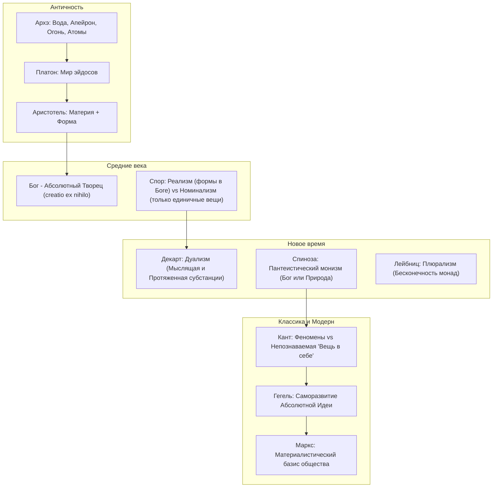

#### Схема 2: Диалектическая триада саморазвития духа по Гегелю
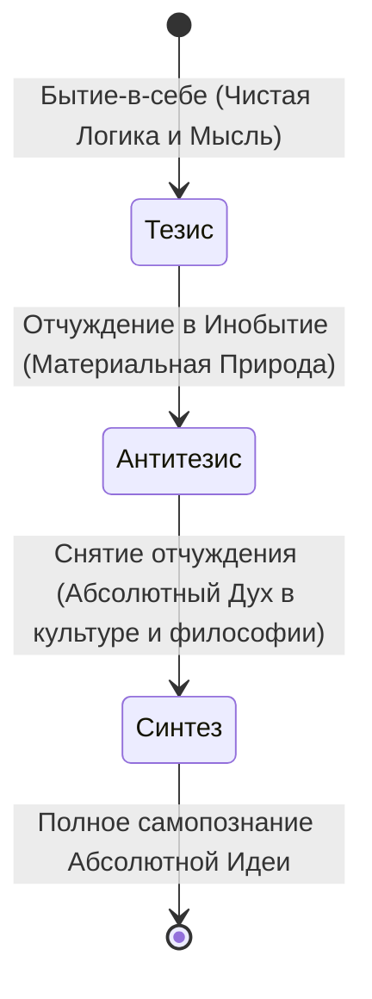

---

## 6. Комплекс экзаменационных вопросов и эталонных тезисов для подготовки к дифференцированному зачету

Ниже приведены развернутые эталонные тезисы ответов на ключевые вопросы из утвержденного перечня к дифференцированному зачету по философии в МТУСИ:

### Вопрос 1. Специфика философского знания. Предмет философии и «предельные вопросы».
- **Тезис 1:** Философия — рационально-теоретическая форма мировоззрения, исследующая предельные основания мира, человека, познания и культуры.
- **Тезис 2:** В отличие от частных наук (физика, химия, биология), изучающих локальные фрагменты бытия, философия ставит вопросы о предельных основаниях («Что значит существовать? Что значит знать? Что делает поступок нравственным?»).
- **Тезис 3:** Структура философского знания включает онтологию (бытие), гносеологию (познание), аксиологию (ценности: этика, эстетика), философскую антропологию (человек) и социальную философию (общество).

### Вопрос 2. Исторические типы мировоззрения: мифология, религия, наука и философия.
- **Тезис 1:** Мировоззрение — система обобщенных взглядов на мир и место человека в нем.
- **Тезис 2:** Миф — синкретизм, антропоморфизм, одушевление природы, циклическое время, отсутствие дистанции между человеком и природой.
- **Тезис 3:** Религия — удвоение мира (посюсторонний и потусторонний), культ, догматика, вера в божественное откровение как высший критерий истины.
- **Тезис 4:** Наука — объективность, опытная проверяемость (верификация), системность, математический аппарат, частный предмет.
- **Тезис 5:** Философия — рационально-критический анализ, теоретичность, опора на логику и рефлексию, поиск предельных первооснований. В современном человеке все формы могут сосуществовать.

### Вопрос 3. Основной вопрос философии (ОВФ): онтологический и гносеологический аспекты.
- **Тезис 1:** ОВФ — вопрос об отношении мышления к бытию, сознания к материи.
- **Тезис 2:** Онтологическая сторона (что первично?):
  - *Материализм:* материя первична, сознание вторично (продукт высокоорганизованной материи).
  - *Идеализм:* первичен дух/сознание; подразделяется на объективный (мировой разум, эйдосы у Платона и Гегеля) и субъективный (мир как комплекс ощущений у Беркли).
  - *Дуализм:* материя и дух — две равноправные независимые субстанции (Декарт).
- **Тезис 3:** Гносеологическая сторона (познаваем ли мир?):
  - *Гносеологический оптимизм:* мир познаваем разумом.
  - *Агностицизм:* сущность мира принципиально непознаваема («вещь в себе» Канта, скептицизм Юма).

### Вопрос 4. Ранняя греческая натурфилософия: поиск «архэ» (Милетская школа, Гераклит, Парменид).
- **Тезис 1:** Досократики совершили переход «от мифа к логосу», пытаясь объяснить космос естественным первоначалом (*архэ*).
- **Тезис 2:** Фалес Милетский провозгласил первоначалом Воду (первая попытка найти единый субстрат мира); Анаксимандр преодолел чувственную конкретность, введя понятие Апейрона — беспредельного, бескачественного вечного первовещества.
- **Тезис 3:** Гераклит Эфесский: первоначало — Огонь (символ вечной динамики); принцип всеобщей текучести («все течет, все меняется», «нельзя дважды войти в одну реку»); учение о мировом законе (Логосе) и единстве и борьбе противоположностей (ранняя диалектика).
- **Тезис 4:** Парменид (Элейская школа): «Бытие есть, небытия нет». Бытие едино, неподвижно, неделимо и неизменно. Принцип тождества мышления и бытия. Разграничение пути Истины (разум) и пути Мнения (обманчивые чувства).

### Вопрос 5. Апории Зенона Элейского и проблема движения.
- **Тезис 1:** Зенон отстаивал тезис Парменида о единстве и неподвижности бытия методом доказательства от противного, показывая логическую противоречивость множественности и движения при допущении бесконечной делимости континуума.
- **Тезис 2:** «Ахиллес и черепаха»: быстроногий Ахиллес никогда не догонит черепаху, так как за время преодоления разделяющей дистанции черепаха успевает сдвинуться на новый отрезок; ряд бесконечен.
- **Тезис 3:** «Дихотомия»: движение не может даже начаться, так как перед прохождением пути нужно пройти его половину, четверть, одну восьмую и т.д.
- **Тезис 4:** «Стрела»: летящая стрела в каждый неделимый миг занимает равное себе пространство, то есть покоится; сумма состояний покоя не может образовать движения.

### Вопрос 6. Софисты и Сократ: этический переворот в античной мысли.
- **Тезис 1:** Софисты (Протагор: «Человек есть мера всех вещей») перенесли внимание на человека и познание, но впали в субъективизм и релятивизм: объективной истины нет, цель речи — победа в споре.
- **Тезис 2:** Сократ совершил антропологический поворот («Познай самого себя»), отвергнув релятивизм софистов. Истина и нравственность объективны.
- **Тезис 3:** Этический рационализм Сократа: «Добродетель есть знание». Зло совершается исключительно по неведению блага.
- **Тезис 4:** Метод Сократа: ирония (разоблачение мнимого знания: «Я знаю только то, что ничего не знаю») $\to$ майевтика («повивальное искусство» рождения истины в диалоге) $\to$ индуктивный поиск общих определений сущностей. Принятие яда цикуты во имя верности закону полиса.

### Вопрос 7. Философия Платона: мир идей, миф о пещере, анамнезис и концепция государства.
- **Тезис 1:** Объективный идеализм: мир делится на совершенный, вечный Мир эйдосов (идей) и вторичный, бренный мир чувственных вещей (теней). Вершина иерархии идей — Идея Блага.
- **Тезис 2:** Миф о пещере: узники в оковах видят лишь тени на стене, принимая их за реальность; философ — освободившийся узник, вышедший к свету Солнца (идей) и вернувшийся просветить собратьев.
- **Тезис 3:** Гносеология как Анамнезис: бессмертная душа до рождения созерцала чистые идеи; познание — это припоминание забытого духовного опыта при соприкосновении с вещами.
- **Тезис 4:** Идеальное государство (Полития): гармония трех сословий в соответствии со структурой души: философы-правители (разум / мудрость), воины-стражи (воля / мужество), демиурги/ремесленники (чувства / умеренность). Ликвидация частной собственности и семьи у правящих сословий.

### Вопрос 8. Философская система Аристотеля: критика идей, 4 причины, энтелехия, логика.
- **Тезис 1:** Критика платоновского мира идей («Платон мне друг, но истина дороже»). Сущности (формы) пребывают внутри самих материальных вещей, а не в потустороннем мире.
- **Тезис 2:** Учение о 4 причинах бытия: материальная (субстрат), формальная (сущность/структура), действующая (источник движения), целевая (смысл и назначение вещи).
- **Тезис 3:** Возможность (потенция, материя) и действительность (акт, форма). Развитие — оформление материи (желудь $\to$ дуб). Энтелехия — завершенное единство цели и действия.
- **Тезис 4:** Перводвигатель (Нус) — чистая нематериальная Форма и Первопричина, мысль, мыслящая самое себя.
- **Тезис 5:** Создатель формальной логики (Органон: законы тождества, непротиворечия, исключенного третьего, теория силлогизма). «Человек — политическое животное». Этика золотой середины.

### Вопрос 9. Эллинистическая философия: эпикуреизм, стоицизм и скептицизм.
- **Тезис 1:** Кризис полиса превратил философию в «искусство жизни» и поиск индивидуального спасения и покоя.
- **Тезис 2:** Эпикуреизм (Эпикур): цель жизни — атараксия (безмятежность духа) и апония (отсутствие боли); преодоление страха богов и страха смерти («пока мы есть — смерти нет, когда смерть есть — нас нет»); разумный гедонизм и умеренность.
- **Тезис 3:** Стоицизм (Сенека, Марк Аврелий, Эпиктет): космос правится мировым Разумом (Логосом) и судьбой («Желающего судьба ведет, нежелающего — тащит»); дихотомия контроля (контролировать свои мысли, быть равнодушным к внешним событиям); идеал — апатия (бесстрастие) и верность долгу.
- **Тезис 4:** Скептицизм (Пиррон): чувства обманчивы, суждения разума противоречивы; воздержание от суждений (эпохе) ведет к атараксии.

### Вопрос 10. Средневековая философия: Августин Блаженный и Фома Аквинский.
- **Тезис 1:** Принципы: теоцентризм, креационизм (creatio ex nihilo), провиденциализм, откровение.
- **Тезис 2:** Августин Блаженный: теодицея — зло не субстанция, а отсутствие добра (privatio boni), его источник — свободная воля человека; концепция времени (психологическое время в душе: память, внимание, ожидание); «О граде Божием»; предвосхищение Декарта («Если я ошибаюсь, я существую»).
- **Тезис 3:** Фома Аквинский (томизм): гармония веры и разума («благодать совершенствует природу»); 5 рациональных доказательств бытия Бога (от движения, производящей причины, необходимости, степеней совершенства, целесообразности порядка).
- **Тезис 4:** Спор об универсалиях: реализм (универсалии реальны) vs номинализм (универсалии — лишь имена); «Бритва Оккама» («не умножай сущности без необходимости»).

### Вопрос 11. Рационализм Нового времени: Рене Декарт и Бенедикт Спиноза.
- **Тезис 1:** Декарт: методологическое сомнение; фундаментальная аксиома мышления «Cogito, ergo sum» («Я мыслю, следовательно, я существую»); дуализм субстанций (res cogitans — мыслящая неделимая, res extensa — протяженная материальная делимая); психофизическая проблема.
- **Тезис 2:** Спиноза: преодоление дуализма Декарта через пантеистический монизм; единая субстанция — «Бог, или Природа» (Deus sive Natura), являющаяся причиной самой себя (causa sui); мышление и протяженность — атрибуты субстанции; единичные вещи — модусы. «Свобода есть осознанная необходимость».

### Вопрос 12. Эмпиризм Нового времени: Ф. Бэкон, Дж. Локк, Дж. Беркли, Д. Юм.
- **Тезис 1:** Бэкон: «Знание — сила», индуктивный метод; учение о 4 идолах разума (рода, пещеры, площади, театра).
- **Тезис 2:** Локк: критика врожденных идей, учение о сознании как Tabula rasa («чистой доске»); сенсуализм («нет ничего в разуме, чего не было в чувствах»); внешний опыт (ощущения) и внутренний (рефлексия).
- **Тезис 3:** Беркли: субъективный идеализм; материи нет, вещь — комплекс ощущений; «Существовать — значит быть воспринимаемым» (Esse est percipi); мир поддерживается непрерывным восприятием Бога.
- **Тезис 4:** Юм: радикальный скептицизм и агностицизм; критика причинности (причинность — не объективный закон природы, а психологическая привычка ума); Я как пучок восприятий.

### Вопрос 13. Теории общественного договора: Т. Гоббс, Дж. Локк, Ж.-Ж. Руссо.
- **Тезис 1:** Гоббс: естественное состояние — «война всех против всех», «человек человеку волк»; общественный договор — добровольная передача свободы абсолютному государству («Левиафану») ради безопасности.
- **Тезис 2:** Локк: естественное состояние — равенство и мир; неотчуждаемые естественные права (жизнь, свобода, собственность); договор учреждает власть как арбитра; разделение властей; право народа на восстание против тирании.
- **Тезис 3:** Руссо: в естественном состоянии человек добр и свободен; неравенство и войны порождены возникновением частной собственности; «Человек рождается свободным, но повсюду он в цепях»; подлинный договор подчиняет волю каждого «Общей воле» (прямое народовластие).

### Вопрос 14. Немецкая классическая философия: Иммануил Кант и Георг Гегель.
- **Тезис 1:** Кант: «коперниканский переворот» в гносеологии; априорные формы чувственности (пространство и время) и рассудка (категории); двоемирие: познаваемые феномены (явления) vs непознаваемая «вещь в себе» (ноумен, агностицизм); Категорический императив (поступай так, чтобы максима воли стала всеобщим законом; относись к человеку как к цели, а не средству).
- **Тезис 2:** Гегель: абсолютный идеализм; мир — саморазвитие Абсолютной Идеи по триаде (Тезис $\to$ Антитезис $\to$ Синтез); три закона диалектики (единство и борьба противоположностей, переход количества в качество, отрицание отрицания).

### Вопрос 15. Марксистская философия и современная мысль XX века (Камю, Фромм).
- **Тезис 1:** Карл Маркс: материалистическое понимание истории; экономический базис (производительные силы и отношения собственности) определяет идеологическую надстройку; классовая борьба как мотор истории; критика частной собственности на природные ресурсы и капитал; преодоление отчуждения труда при коммунизме.
- **Тезис 2:** Альбер Камю: философия Абсурда; столкновение жажды смысла с безмолвным миром; «Миф о Сизифе» (метафора человеческого труда и жизни); ответ на абсурд — бунт, внутренняя свобода и достоинство («Сизифа следует представлять себе счастливым»).
- **Тезис 3:** Эрих Фромм: «Искусство любить» (зрелая любовь как активная забота, уважение, ответственность и знание); модус «Иметь» (потребительство, отчуждение) vs модус «Быть» (аутентичность, творчество, полнота жизни).

---
