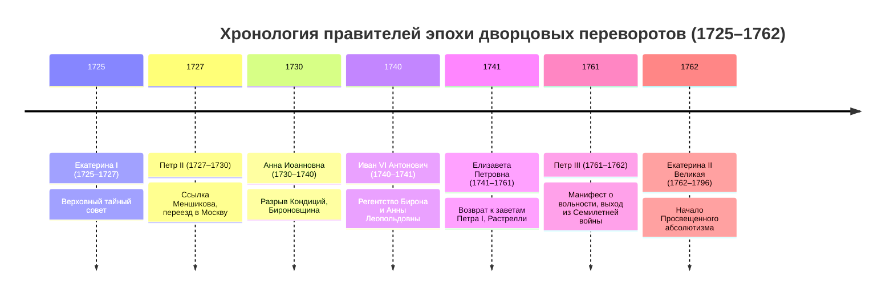
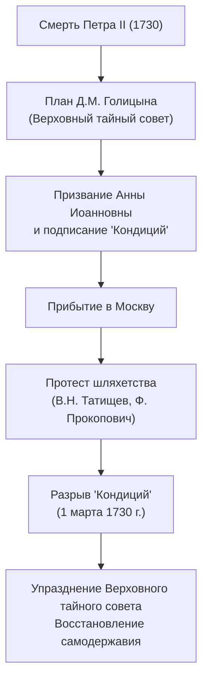

# 🏛️ Лекция №1: Эпоха дворцовых переворотов (1725–1762 гг.) и предпосылки просвещенного абсолютизма

> **Дисциплина:** История России  
> **Университет:** МТУСИ (Центр заочного обучения по программам бакалавриата)  
> **Направление:** 09.03.02 «Информационные системы и технологии» (Профиль: Инженерия DevSecOps)  
> **Курс / Семестр:** 2 курс, 3 семестр  
> **Дата лекции:** 14 сентября 2026 г.  
> **Исходная видеозапись:** `2026-09-14 13-01-29.mp4` (продолжительность: 3 часа 08 минут, 2 академические пары)  
> **Полная стенограмма с таймкодами:** [`lecture-01-transcript.txt`](./transcripts/lecture-01-transcript.txt)

---

## 📋 Содержание лекции
1. [Организационно-методический регламент дисциплины](#1-организационно-методический-регламент-дисциплины)
2. [Историография и социально-политическая сущность дворцовых переворотов](#2-историография-и-социально-политическая-сущность-дворцовых-переворотов)
3. [Правление Екатерины I (1725–1727 гг.) и возвышение А.Д. Меншикова](#3-правление-екатерины-i-17251727-гг-и-возвышение-ад-меншикова)
4. [Правление Петра II (1727–1730 гг.): падение «полудержавного властелина» и реванш старой знати](#4-правление-петра-ii-17271730-гг-падение-полудержавного-властелина-и-реванш-старой-знати)
5. [Правление Анны Иоанновны (1730–1740 гг.): «Кондиции», бироновщина и быт эпохи](#5-правление-анны-иоанновны-17301740-гг-кондиции-бироновщина-и-быт-эпохи)
6. [Кризис престолонаследия: Иоанн VI Антонович и Анна Леопольдовна (1740–1741 гг.)](#6-кризис-престолонаследия-иоанн-vi-антонович-и-анна-леопольдовна-17401741-гг)
7. [Правление Елизаветы Петровны (1741–1761 гг.): русский Версаль, фаворитизм и Семилетняя война](#7-правление-елизаветы-петровны-17411761-гг-русский-версаль-фаворитизм-и-семилетняя-война)
8. [Правление Петра III (1761–1762 гг.) и переворот Екатерины II](#8-правление-петра-iii-17611762-гг-и-переворот-екатерины-ii)
9. [Сводная таблица монархов эпохи дворцовых переворотов](#9-сводная-таблица-монархов-эпохи-дворцовых-переворотов)
10. [Вопросы для самопроверки к дифференцированному зачету](#10-вопросы-для-самопроверки-к-дифференцированному-зачету)

---

## 1. Организационно-методический регламент дисциплины

*Таймкод: `[00:00] – [09:30]`*

Во вводной части лекции преподаватель довела до сведения студентов базовые параметры учебного процесса и критерии аттестации во 2 семестре изучения курса истории:

- **Форма итогового контроля:** Дифференцированный зачёт (2 ЗЕТ, 72 академических часа).
- **Структура учебной работы:** 
  - 18 часов лекционных занятий;
  - 6 практических занятий (семинаров) — в отличие от 5 семинаров первого семестра.
- **Балльно-рейтинговая система (БРС):**
  - Итоговая оценка формируется на основе суммы баллов за 6 семинарских занятий:
    $$\text{Средний балл} = \frac{\sum_{i=1}^{6} \text{Балл}_i}{6}$$
    (с последующим математическим округлением до целого значения).
  - **Автомат:** выставляется автоматически при получении итогового среднего балла **«4» (хорошо)** или **«5» (отлично)**.
  - **При оценке «3» (удовлетворительно):** студент имеет возможность выполнить дополнительное письменное домашнее задание (аналитическое эссе по темам на Яндекс.Диске кафедры). При успешной защите эссе итоговый балл повышается до «4» (автомат).
  - **Выход на зачёт:** студенты с итоговой оценкой ниже «3», а также не сдавшие письменное задание при «тройке», выходят на устный онлайн-зачёт. Вопросы к зачёту формируются исключительно по материалам лекционных курсов.
- **Распределение учебных групп:**
  - Группы **БСТ2551, БСТ2552, БСТ2555, БСТ2556** ведут лекции и семинары с текущим преподавателем.
  - Группы БСТ2553, БСТ2554, БСТ2557, БСТ2558 переданы преподавателю Хуснутдиновой Л.Г. (занятия на платформе «Контур.Толк»).

---

## 2. Историография и социально-политическая сущность дворцовых переворотов

*Таймкод: `[09:30] – [18:30]`*

### 2.1. Определение и хронология
**Эпоха дворцовых переворотов** — принятое в отечественной исторической науке обозначение периода с **1725 по 1762 год** (от смерти Петра I Великого до прихода к власти Екатерины II Великой), в течение которого смена верховной государственной власти в Российской империи происходила преимущественно путём верхушечных заговоров при решающей поддержке гвардейских полков.

### 2.2. Историографический генезис концепта
- **В.О. Ключевский:** термин впервые концептуализирован выдающимся русским историком Василием Осиповичем Ключевским во второй половине XIX века. В его классическом курсе лекций эпоха охарактеризована как время ослабления государственного начала в угоду корыстным групповым интересам придворных элит.
- **Проблема номинации и коммеморации:** номинация исторических явлений определяет призму их восприятия. Слово *«переворот»* несет оттенок дестабилизации и кризиса, а локация *«дворцовый»* четко подчеркивает замкнутый характер событий:
  - Борьба велась исключительно внутри узкого слоя столичного дворянства;
  - Подавляющая масса населения империи (более 90% крестьянства, посадские люди, купечество) оставалась совершенно безучастной к калейдоскопу лиц на троне;
  - Перевороты не меняли социальной природы абсолютистского государства и феодально-крепостнического строя.

### 2.3. Ключевые предпосылки феномена
1. **Указ о престолонаследии 1722 года:** Петр I после дела царевича Алексея отменил традиционный порядок автоматической передачи трона прямым потомкам по мужской линии и узаконил назначение преемника исключительно по личной воле действующего государя.
2. **Династический вакуум 1725 года:** Петр I скончался 28 января 1725 года, не успев назвать наследника (легенда о предсмертной записке *«Отдать всё...»*, написанной неразборчивым почерком).
3. **Раскол правящей элиты:** противостояние старой родовой феодальной аристократии (князья Долгорукие, Голицыны, Репнины) и «птенцов гнезда Петрова» — новой выслужившейся знати незнатного происхождения (А.Д. Меншиков, П.А. Толстой, Ф.М. Апраксин, А.И. Остерман).
4. **Роль императорской гвардии:** Преображенский и Семеновский полки, созданные Петром I, выступали в роли привилегированной военной корпорации («коллективного преторианского корпуса»), чье физическое присутствие и воля определяли легитимность претендента на престол.
5. **Прочность бюрократического механизма Петра Великого:** созданная разветвленная система коллегий, Сената и губернской администрации обладала колоссальным запасом институциональной прочности — империя могла устойчиво функционировать даже при недееспособных, неграмотных или малолетних правителях.
6. **«Женский век» русской истории:** большинство правителей XVIII века составляли женщины (Екатерина I, Анна Иоанновна, Анна Леопольдовна, Елизавета Петровна, Екатерина II).

---

## 3. Правление Екатерины I (1725–1727 гг.) и возвышение А.Д. Меншикова

*Таймкод: `[18:30] – [33:00]`*

### 3.1. Происхождение и восхождение к трону
- **Марта Самуиловна Скавронская:** дочь ливонского крестьянина, родилась в Прибалтике. В августе 1702 г. при взятии шведской крепости Мариенбург (ныне г. Алуксне в Латвии) войсками фельдмаршала Б.П. Шереметева попала в русский плен.
- Была служанкой (портомоей) у Шереметева, затем перешла к А.Д. Меншикову. Около 1703 г. ее заметил Петр I. Приняла православие под именем Екатерины Алексеевны (крестным отцом стал царевич Алексей).
- Родила Петру 12 детей (в живых остались только Анна и Елизавета, обе рожденные до официального брака, но признанные государем). В 1712 г. состоялось официальное бракосочетание с Петром I.
- **Коронация 1724 года:** впервые в истории России некоронованная особа незнатного происхождения была торжественно коронована в Успенском соборе Московского Кремля. Византийский церемониал (шапка Мономаха, бармы) был заменен европейской императорской короной.
- **Переворот 28 января 1725 года:** в ночь смерти Петра I благодаря активным действиям светлейшего князя Меншикова гвардейские полки окружили дворец и заставили высших сановников присягнуть Екатерине Алексеевне вопреки притязаниям родовитой знати на воцарение малолетнего Петра Алексеевича.

### 3.2. Государственный механизм: Верховный тайный совет
- **Личность государыни:** Екатерина I не умела читать и писать (первая и единственная абсолютно неграмотная правительница в истории Российской империи), государственными делами не интересовалась, проводя время в празднествах и увеселениях.
- **Создание Верховного тайного совета (февраль 1726 г.):** высший совещательный орган власти, созданный под предлогом «облегчения бремени трудов государыни». 
  - Члены совета: А.Д. Меншиков (негласный лидер), Ф.М. Апраксин, Г.И. Головкин, П.А. Толстой, Д.М. Голицын, А.И. Остерман, а также зять императрицы герцог Карл Фридрих Голштинский.
  - Компетенция: Верховному тайному совету были подчинены Правительствующий Сенат, Святейший Синод и коллегии. Меншиков стал де-факто полновластным правителем страны («полудержавным властелином»).

---

## 4. Правление Петра II (1727–1730 гг.): падение «полудержавного властелина» и реванш старой знати

*Таймкод: `[33:00] – [43:30]`*

### 4.1. Воцарение и проект Меншикова
- **Петр II Алексеевич (1715–1730):** сын опального царевича Алексея Петровича и немецкой принцессы Шарлотты Кристины Вольфенбюттельской, внук Петра Великого. Взошел на престол в возрасте 11 лет согласно завещательному документу («Тестаменту») Екатерины I от мая 1727 г.
- **План Меншикова:** светлейший князь добился помолвки юного государя со своей 12-летней дочерью Марией Меншиковой и получил высший воинский чин — **генералиссимуса**.

### 4.2. Опала Меншикова и возвышение Долгоруких
- Летом 1727 г. Меншиков тяжело заболел и временно отстранился от дел. За это время фаворитом юного царя стал князь Иван Алексеевич Долгорукий и барон А.И. Остерман.
- В сентябре 1727 г. Меншиков был арестован, лишен всех чинов, наград и колоссального состояния (в казну конфисковано 100 000 душ крестьян, 7 городов и миллионы рублей в ценностях). Меншиков вместе с семьей, включая несостоявшуюся царицу Марию, был сослан в сибирский город Берёзов, где умер в 1729 году.
- Полнота власти перешла к старомосковской боярской знати — князьям Долгоруким и Голицыным, составившим большинство в Верховном тайном совете. Была объявлена помолвка Петра II с княжной Екатериной Долгорукой.

### 4.3. Особенности царствования
- **Фактический перенос столицы в Москву:** Петр II не любил Санкт-Петербург; двор переехал в Москву. Все свободное время царь посвящал охоте в подмосковных лесах.
- **Кончина:** в январе 1730 года во время водосвятия на Москве-реке 15-летний государь легко оделся на сильном морозе, простудился, заболел натуральной оспой и скоропостижно скончался в день, назначенный для его свадьбы.
- Погребен в Архангельском соборе Московского Кремля (единственный из российских императоров, похороненный в Москве, а не в Петропавловском соборе Санкт-Петербурга).
- **Итог:** со смертью Петра II окончательно пресеклась мужская линия династии Романовых.

---

## 5. Правление Анны Иоанновны (1730–1740 гг.): «Кондиции», бироновщина и быт эпохи

*Таймкод: `[43:30] – [01:21:00]`*

### 5.1. Династический выбор «верховников»
После смерти Петра II члены Верховного тайного совета под руководством князя Д.М. Голицына отвергли завещание Екатерины I (по которому права имели дочери Петра I — Анна и Елизавета) и решили пригласить на трон 37-летнюю вдовствующую герцогиню Курляндскую **Анну Иоанновну** — дочь соправителя Петра I, царя Ивана V Алексеевича. 

Герцогиня 19 лет прожила в Митаве (Елгаве), не имела в Петербурге придворных связей и казалась олигархам-верховникам идеальной марионеткой.

### 5.2. «Кондиции» 1730 года — попытка ограничения самодержавия
Верховники составили и направили Анне Иоанновне тайный документ — **«Кондиции» (условия воцарения)**. Без согласия Верховного тайного совета императрица обязывалась:
1. Не объявлять войны и не заключать мира;
2. Не вводить новых налогов и податей;
3. Не расходовать государственные средства самостоятельно;
4. Не раздавать придворные чины выше полковника и государственные должности;
5. Не лишать дворян жизни, чести и имений без решения суда;
6. Не жаловать вотчин и деревень с крепостными душами;
7. Не выходить замуж и не назначать себе наследника престола;
8. Не привозить в Россию своего курляндского фаворита Эрнста Иоганна Бирона.

> [!NOTE]
> В европейском контексте это была реальная попытка трансформации России в ограниченную монархию (наряду с Англией, Швецией времен «эры свобод» и выборной шляхетской монархией в Речи Посполитой).

### 5.3. Разрыв «Кондиций» и реставрация абсолютизма
Широкие круги рядового и генералитетского дворянства (шляхетства) во главе с В.Н. Татищевым и архиепископом Феофаном Прокоповичем категорически отвергли олигархический проект. Дворяне рассуждали: *«Лучше иметь одного самодержавного государя, чем десять тиранов из родовой знати»*.

**1 марта 1730 года**, опираясь на челобитные дворянства и верность гвардии, Анна Иоанновна прилюдно разорвала «Кондиции». Манифестом от 4 марта 1730 г. Верховный тайный совет был упразднен. Спустя несколько лет большинство его активных деятелей (князья Долгорукие и Голицын) были казнены либо отправлены в ссылку.

### 5.4. Политический режим Анны Иоанновны
- **Кабинет министров (1731 г.):** орган из трех доверенных лиц (А.М. Черкасский, Г.И. Головкин, А.И. Остерман). Указом 1735 г. три подписи членов Кабинета приравнивались к подписи императрицы.
- **Новая гвардия:** Измайловский и Конный полки, сформированные из верных курляндцев и дворян-однодворцев как противовес петровским Преображенскому и Семеновскому полкам.
- **«Бироновщина»:** Эрнст Иоганн Бирон (Бюрен), обер-камергер императорского двора, получивший титул герцога Курляндского. Период характеризовался засильем иностранцев (Миних, Остерман, Лёвенвольде), коррупцией и презрением к национальным русским обычаям.
- **Канцелярия тайных розыскных дел (генерал А.И. Ушаков):** разгул доносительства по формуле «Слово и дело государево». За 10 лет репрессировано от 2 до 20 тысяч человек (пытки, казни, ссылки на Камчатку). Казнь кабинет-министра А.П. Волынского (1740 г.).
- **Позитивные начинания:** восстановление боеспособности русского военного флота (до 150 кораблей к концу столетия), оптимизация раздутого бюрократического аппарата.

### 5.5. Придворный быт и шутовская свадьба в Ледяном доме (зима 1739–1740 гг.)
- Нравы императрицы отличались грубостью, суевериями, любовью к стрельбе из ружей по птицам и содержанием штата шутов, сказительниц и карликов.
- **Свадьба шутов:** Анна Иоанновна устроила унизительный перформанс — женитьбу разжалованного в шуты за переход в католичество князя Михаила Голицына-Квасника на пожилой калмычке Авдотье Бужениновой.
- Был возведен **Ледяной дом** на Неве (мебель, баня, пушки и деревья изо льда). Участники маскарада представляли все народы империи («каждой твари по паре» на верблюдах, свиньях и волах). Молодоженов заперли на ночь на ледяном ложе при морозе $-30^\circ\text{C}$, где они чудом спаслись от верной смерти.

---

## 6. Кризис престолонаследия: Иоанн VI Антонович и Анна Леопольдовна (1740–1741 гг.)

*Таймкод: `[01:21:00] – [01:27:30]`*

- Перед смертью в октябре 1740 г. Анна Иоанновна завещала престол двухмесячному младенцу — **Иоанну VI Антоновичу**, сыну своей племянницы Анны Леопольдовны (принцессы Мекленбургской) и Антона Ульриха Брауншвейгского.
- **Регентство Бирона:** длилось всего 3 недели. В ноябре 1740 г. фельдмаршал Бурхард Кристоф Миних арестовал Бирона и отправил его в сибирскую ссылку (Пелым).
- **Регентство Анны Леопольдовны:** юная и политически инертная правительница правила около года. Немецкое засилье «Брауншвейгского семейства» вызывало резкое отторжение в гвардии и столичном обществе, видевшем спасение в «дщери Петровой» — царевне Елизавете.

---

## 7. Правление Елизаветы Петровны (1741–1761 гг.): русский Версаль, фаворитизм и Семилетняя война

*Таймкод: `[02:10:00] – [02:53:30]`*

### 7.1. Государственный переворот 25 ноября 1741 года
- Елизавета Петровна явилась в казармы гренадерской роты Преображенского полка со словами: *«Ребята! Вы знаете, чья я дочь, ступайте за мной!»*.
- Во главе 308 гвардейцев Елизавета вошла в Зимний дворец. Переворот произошел абсолютно бескровно — без единого выстрела. В память о месте сбора гвардии был возведен Преображенский собор.
- Брауншвейгская семья была арестована. Младенец Иоанн VI Антонович провел всю сознательную жизнь в одиночном заключении (Холмогоры, затем Шлиссельбургская крепость как «безымянный колодник») и был заколот стражей в 1764 г. при попытке освобождения поручиком В. Мировичем.

### 7.2. Внутренняя политика: возвращение к петровским основам
- Упразднен ненавистный Кабинет министров, восстановлена руководящая роль Правительствующего Сената.
- Провозглашен патриотический лозунг очищения государственного аппарата от засилья иностранцев.
- **Гуманизация правосудия:** Елизавета дала обет не применять смертную казнь. За 20 лет ее царствования не было подписано ни одного смертного приговора (при этом ссылка и телесные наказания сохранялись).
- Экономические реформы П.И. Шувалова: ликвидация внутренних таможен (1754 г.), стимулировавшая складывание единого всероссийского рынка, основание Дворянского и Купеческого заемных банков.

### 7.3. Культура русского барокко и придворный быт
- **Франческо Бартоломео Растрелли:** апогей елизаветинского барокко. Построены: Зимний дворец в Санкт-Петербурге (первоначально цвета охры), Большой Екатерининский дворец в Царском Селе (Янтарная комната, Зеркальный зал на 700 свечей), Смольный монастырь, Большой дворец в Петергофе.
- **Мода и празднества:** культ красоты, гардероб из 15 000 платьев (нельзя было появиться в одном наряде дважды; гвардейцы ставили несмываемые печати на платья при входе). 
- **«Дело Лопухиной»:** деспотизм императрицы в сфере моды — за ношение одинакового с царицей цветка в волосах и дерзкие разговоры Наталья Лопухина была бита кнутом, ей вырезали язык и сослали в Сибирь.
- **Маскарады-«метаморфозы»:** обязательные балы с переменой костюмов (мужчины в дамских фижмах, женщины в мужских панталонах).
- **Гастрономия и салюты:** появление профессии шеф-повара, французская кухня, пятичасовые банкеты; грандиозные сюжетные фейерверки Академии наук.

### 7.4. Фавориты: А.Г. Разумовский и И.И. Шувалов
- **Алексей Григорьевич Разумовский (Розум):** украинский казак, обладатель уникального баса, замеченный в церковном хоре и взятый в придворную капеллу. Тайный (морганатический) супруг Елизаветы (венчание в 1742 г. в селе Перово), генерал-фельдмаршал, владелец Аничкова дворца. Назывался современниками «ночным императором», в государственные интриги не вмешивался, покровительствовал искусству.
- **Иван Иванович Шувалов:** выдающийся деятель Просвещения.
  - Совместно с М.В. Ломоносовым основал **Московский университет (1755 г.)**;
  - Основал **Императорскую Академию художеств (1757 г.)**;
  - Способствовал изданию указа об учреждении первого постоянного публичного профессионального Русского театра во главе с Ф.Г. Волковым и А.П. Сумароковым (1756 г.), где впервые на сцену вышли актрисы-женщины.

### 7.5. Россия в Семилетней войне (1756–1763 гг.)
- Первая коалиционная война мирового масштаба (У. Черчилль назвал ее «настоящей Первой мировой войной»). Россия в союзе с Австрией и Францией воевала против Пруссии короля Фридриха II.
- **Блестящие победы русской армии:**
  - 1757 г. — сражение при Гросс-Егерсдорфе (С.Ф. Апраксин);
  - 1758 г. — кровопролитная битва при Цорндорфе (В.В. Фермор);
  - 1759 г. — разгром прусской армии при **Кунерсдорфе** (П.С. Салтыков);
  - **1760 г. — взятие Берлина** русским корпусом генерала З.Г. Чернышева;
  - 1761 г. — взятие крепости Кольберг (первый военный триумф П.А. Румянцева и молодого А.В. Суворова, переход к тактике рассыпного строя).
- Кончина Елизаветы Петровны 25 декабря 1761 г. кардинально переломила ход войны.

---

## 8. Правление Петра III (1761–1762 гг.) и переворот Екатерины II

*Таймкод: `[02:53:30] – [03:09:00]`*

### 8.1. Противоречивая личность Петра III
- **Карл Петер Ульрих Гольштейн-Готторпский:** внук Петра Великого (сын царевны Анны Петровны и герцога Голштинского). Выписан Елизаветой в Россию в 1742 г. как официальный наследник престола.
- Обладал капризным характером, инфантилизмом, слабой способностью к обучению; всю жизнь слепо преклонялся перед прусским королем Фридрихом II.

### 8.2. Внешнеполитический поворот: «Чудо Бранденбургского дома»
Вступив на престол, Петр III немедленно остановил военные действия, заключил с Фридрихом II Петербургский мирный договор, **безвозмездно вернул Пруссии все завоеванные Восточные земли** (включая Кенигсберг, жители которого уже присягнули России) и предоставил русские войска в распоряжение недавнего врага. Этот шаг расценивался армией и обществом как национальное предательство.

### 8.3. Внутренняя политика
За 186 дней царствования издал ряд прогрессивных, но поспешных указов:
- **Манифест о вольности дворянства (18 февраля 1762 г.):** освобождение дворян от обязательной военной и гражданской службы (дворянство превратилось в подлинно привилегированное сословие);
- Упразднение Канцелярии тайных розыскных дел;
- Указ о секуляризации церковных земель;
- Прекращение преследования старообрядцев.

Однако внедрение прусских порядков и прусской формы в армии, пренебрежение православными обрядами и намерение начать непопулярную войну с Данией за интересы родной Голштинии настроили гвардию категорически против императора.

### 8.4. Переворот 28 июня 1762 года
- Супруга Петра III — принцесса София Августа Фредерика Ангальт-Цербстская (в православии Екатерина Алексеевна), опираясь на гвардейские полки (Измайловский и Семеновский) и верных дворян (братья Григорий и Алексей Орловы, Н.И. Панин, княгиня Е.Р. Дашкова), свергла супруга.
- Петр III отрекся от престола и спустя неделю погиб при невыясненных обстоятельствах в Ропшинском замке (вероятно, задушен приближенными Орлова).

### 8.5. Проблема легитимности Екатерины II и истоки «просвещенного абсолютизма»
- **Узурпация трона:** Екатерина не имела никаких династических прав на русский престол. При живом и совершеннолетнем сыне Павле Петровиче она обязана была стать лишь временной регентшей, однако провозгласила себя полновластной самодержицей.
- **Комплекс нелегитимности:** на протяжении всего 34-летнего правления Екатерина II панически боялась свержения собственным сыном Павлом I.
- **«Золотой век дворянства»:** чтобы удержать трон, Екатерина была вынуждена максимально осыпать дворянство привилегиями, землями и крепостными («Жалованная грамота дворянству» 1785 г.).
- **Социальная демагогия просвещенного абсолютизма:** декларирование заботы обо всех сословиях империи (Уложенная комиссия 1767 г., переписка с Вольтером и Дидро) при фактическом превращении крестьянства в бесправную дворянскую собственность.

---

## 9. Сводная таблица монархов эпохи дворцовых переворотов

| Монарх | Годы правления | Кто выдвинул / чья опора | Главный орган / фаворит | Ключевые события и реформы | Итог правления |
| :--- | :---: | :--- | :--- | :--- | :--- |
| **Екатерина I** | 1725–1727 | А.Д. Меншиков, гвардейские полки | Верховный тайный совет; А.Д. Меншиков | Создание ВТС (1726), открытие Академии наук (1725) | Скончалась от болезни |
| **Петр II** | 1727–1730 | А.Д. Меншиков, затем князья Долгорукие | Долгорукие, А.И. Остерман | Ссылка Меншикова в Берёзов (1727), перенос двора в Москву | Скончался от оспы в 15 лет |
| **Анна Иоанновна** | 1730–1740 | Верховный тайный совет, затем шляхетство | Кабинет министров; Э.И. Бирон | Разрыв «Кондиций» (1730), бироновщина, террор Тайной канцелярии, Ледяной дом | Скончалась, передав трон внучатому племяннику |
| **Иван VI Антонович** | 1740–1741 | Завещание Анны Иоанновны | Регенты: Э.И. Бирон, затем Анна Леопольдовна | Внутренняя борьба в «немецкой партии» | Свергнут Елизаветой, заточен в крепость |
| **Елизавета Петровна** | 1741–1761 | Рота гренадеров Преображенского полка | Сенат, Конференция при высочайшем дворе; А.Г. Разумовский, И.И. Шувалов | Отмена внутренних таможен (1754), основание МГУ (1755), барокко Растрелли, победы в Семилетней войне | Скончалась в ходе Семилетней войны |
| **Петр III** | 1761–1762 | Назначен наследником Елизаветой | Голштинское окружение | Сепаратный мир с Пруссией (1762), Манифест о вольности дворянства | Свергнут Екатериной II, убит в Ропше |
| **Екатерина II** | 1762–1796 | Братья Орловы, гвардия (Измайловцы) | Н.И. Панин, братья Орловы, Г.А. Потёмкин | Переход к «просвещенному абсолютизму», золотой век дворянства | Скончалась в 1796 г., трон занял Павел I |

---

## 10. Вопросы для самопроверки к дифференцированному зачету

1. В чем заключалась двойственность Указа о престолонаследии 1722 г. Петра I, и как он спровоцировал эпоху переворотов?
2. Почему В.О. Ключевский определил события 1725–1762 гг. именно как «дворцовые», а не «государственные» перевороты?
3. Каковы были функции Верховного тайного совета, и почему в 1730 г. дворянство воспротивилось олигархическому проекту верховников?
4. Раскройте содержание «Кондиций» Анны Иоанновны. Была ли возможность установления конституционной монархии в России в 1730 г.?
5. Что понимается под историческим термином «бироновщина»? Назовите карательный орган эпохи Анны Иоанновны.
6. Чем отличалась идеологическая программа Елизаветы Петровны от предыдущих царствований?
7. Каковы главные культурные и научные достижения елизаветинского царствования (Растрелли, Шувалов, Ломоносов, Волков)?
8. В чем состояло военно-политическое значение Семилетней войны для России, и почему мирный договор Петра III называют предательством национальных интересов?
9. Какие фундаментальные права получили дворяне по Манифесту о вольности дворянства 1762 года?
10. Почему историки называют политику Екатерины II «социальной демагогией», и как комплекс нелегитимности влиял на ее отношения с дворянством и сыном Павлом?
