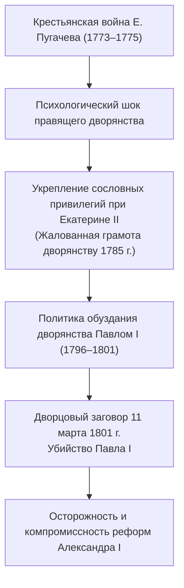
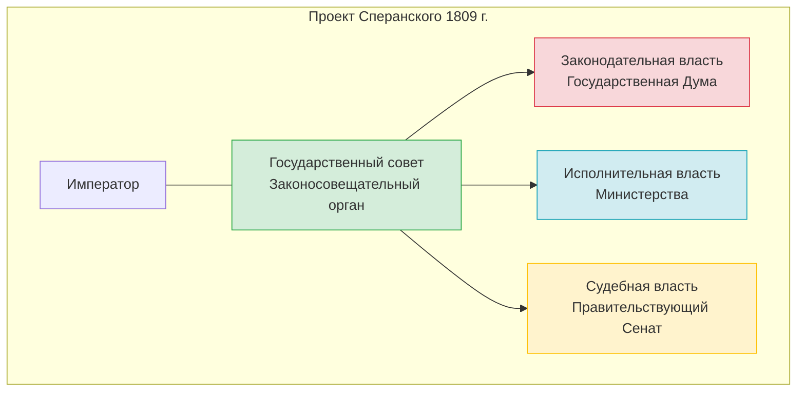
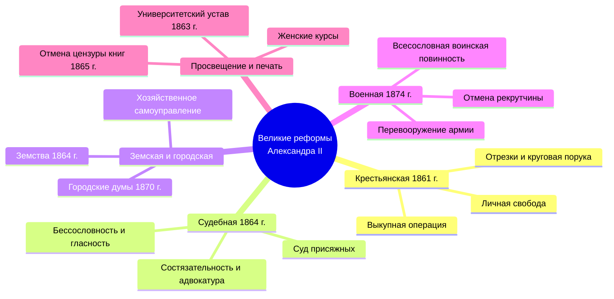
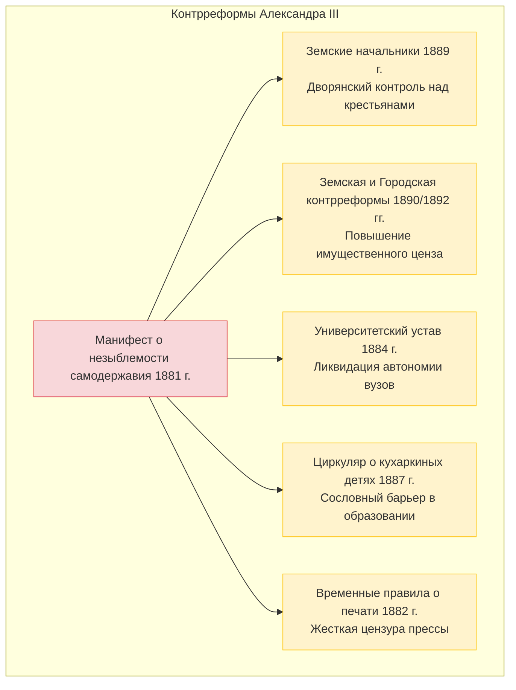

# 🏛️ Лекция №2: Российская империя в XIX – начале XX века: от реформ Александра I до кризиса самодержавия при Николае II

> **Дисциплина:** История России  
> **Университет:** МТУСИ (Центр заочного обучения по программам бакалавриата)  
> **Направление:** 09.03.02 «Информационные системы и технологии» (Профиль: Инженерия DevSecOps)  
> **Курс / Семестр:** 2 курс, 3 семестр  
> **Дата лекции:** 15 сентября 2026 г.  
> **Исходная видеозапись:** `2026-09-15 09-31-36.mp4` (продолжительность: 3 часа 17 минут, 2 академические пары)  
> **Полная стенограмма с таймкодами:** [`lecture-02-transcript.txt`](./transcripts/lecture-02-transcript.txt)

---

## 📋 Содержание лекции
1. [Вводная часть: исторический контекст рубежа XVIII–XIX веков и правление Павла I (1796–1801 гг.)](#1-вводная-часть-исторический-контекст-рубежа-xviiixix-веков-и-правление-павла-i-17961801-гг)
2. [Правление Александра I (1801–1825 гг.): реформаторские поиски и противоречия](#2-правление-александра-i-18011825-гг-реформаторские-поиски-и-противоречия)
3. [Движение декабристов: тайные общества, программы и восстание 14 декабря 1825 года](#3-движение-декабристов-тайные-общества-программы-и-восстание-14-декабря-1825-года)
4. [Правление Николая I (1825–1855 гг.): апогей самодержавной бюрократии и Крымская война](#4-правление-николая-i-18251855-гг-апогей-самодержавной-бюрократии-и-крымская-война)
5. [Эпоха Великих реформ Александра II (1855–1881 гг.): модернизация империи и революционный террор](#5-эпоха-великих-реформ-александра-ii-18551881-гг-модернизация-империи-и-революционный-террор)
6. [Правление Александра III Миротворца (1881–1894 гг.): эпоха контрреформ и промышленный подъем](#6-правление-александра-iii-миротворца-18811894-гг-эпоха-контрреформ-и-промышленный-подъем)
7. [Начало царствования Николая II (1894–1917 гг.): кризис традиционной государственности](#7-начало-царствования-николая-ii-18941917-гг-кризис-традиционной-государственности)
8. [Сводная таблица монархов Российской империи в XIX – начале XX века](#8-сводная-таблица-монархов-российской-империи-в-xix--начале-xx-века)
9. [Контрольные вопросы для самопроверки к дифференцированному зачету](#9-контрольные-вопросы-для-самопроверки-к-дифференцированному-зачету)

---

## 1. Вводная часть: исторический контекст рубежа XVIII–XIX веков и правление Павла I (1796–1801 гг.)

*Таймкод: `[00:23] – [28:50]`*

### 1.1. Психологический фон эпохи: призрак пугачевщины
Лектор начинает занятие с анализа фундаментального социального страха, предопределившего внутреннюю политику русских самодержцев на протяжении всего XIX столетия — **страха крестьянского бунта («пугачевщины»)**:
- Крестьянская война под предводительством Емельяна Пугачева (1773–1775 гг.) продемонстрировала колоссальную разрушительную силу стихийного народного протеста («бессмысленного и беспощадного», по определению А.С. Пушкина).
- Советская историография идеализировала Пугачева как бескорыстного народного вождя, однако в реальности он отстаивал прежде всего сословные казацкие привилегии и вольности Яицкого войска.
- Для дворянского сословия и монархии пугачевщина стала незаживающей психологической травмой: любые разговоры об освобождении крестьян или радикальных реформах неизменно наталкивались на опасение потерять контроль над многомиллионной крестьянской массой.

### 1.2. Личность и внутренняя политика Павла I («Русский Гамлет»)
Император Павел I Петрович (1754–1801) — одна из наиболее трагических и противоречивых фигур российской истории:
- **Детская травма:** был с младенчества отобран у родителей императрицей Елизаветой Петровной; после восшествия на престол матери (Екатерины II) в результате переворота 1762 года жил в постоянном страхе за свою жизнь и изоляции в Гатчине. Екатерина II открыто дискредитировала умственные способности сына и планировала передать престол напрямую внуку Александру.
- **Обуздание дворянской вольницы:** при Екатерине II дворянство получило абсолютную монополию на власть и собственность, избавившись от обязательной службы и телесных наказаний. Павел I решил жестко дисциплинировать первое сословие:
  - Отменил ключевые статьи Жалованной грамоты дворянству 1785 года;
  - **Восстановил телесные наказания** для дворян за уголовные преступления;
  - Ввел строжайшую прусскую военную дисциплину в гвардии (муштра, парики, букли);
  - Запретил ввоз европейских книг, ношение круглых французских шляп и фраков, ассоциировавшихся с Французской революцией.
- **Крестьянский вопрос:**
  - **Манифест о трехдневной барщине (5 апреля 1797 г.):** первая в истории России законодательная попытка ограничить эксплуатацию помещичьих крестьян работой на помещика не более 3 дней в неделю (остальные 3 дня — на себя, воскресенье — обязательный выходной).
  - Разрешил крестьянам подавать челобитные непосредственно на имя государя; для сбора жалоб у Зимнего дворца был установлен знаменитый **желтый ящик**, ключ от которого находился лично у императора.
- **Акт о престолонаследии (1797 г.):** юридически отменил петровский указ 1722 года о праве монарха назначать себе преемника по собственному усмотрению (что породило эпоху дворцовых переворотов). Утвердил строгий патрилинейный принцип первородства по мужской нисходящей линии (салический закон), гарантировав династическую стабильность династии Романовых.

### 1.3. Внешняя политика и заговор 11 марта 1801 года
- Во внешней политике Павел I первоначально участвовал во 2-й антифранцузской коалиции: блистательные Итальянский и Швейцарский походы А.В. Суворова (1799 г.), морские победы Ф.Ф. Ушакова в Средиземноморье.
- Обиженный на вероломство союзников (Австрии и Великобритании), Павел совершил резкий геополитический разворот: разорвал отношения с Лондоном, наложил эмбарго на британские суда и заключил союз с Первым консулом Франции Наполеоном Бонапартом. Павел даже отправил 40 полков донских казаков во главе с атаманом В.П. Орловым в поход на завоевание Британской Индии.
- **Дворцовый переворот:** разрыв с Англией (главным покупателем российского хлеба и пеньки) ударил по карману дворянства. В ночь с **11 на 12 марта 1801 года** в Михайловском замке заговорщики (генерал-губернатор П.А. Пален, Л.Л. Беннигсен, братья Зубовы) проникли в спальню императора. После отказа отречься от престола Павел I был жестоко убит (удар тяжелой золотой табакеркой в висок и удушение офицерским шарфом).
- Великий князь Александр Павлович, знавший о существовании заговора (но рассчитывавший лишь на бескровное принуждение отца к отречению), испытал глубочайший моральный шок. Знаменитая фраза графа Палена, обращенная к рыдающему новому монарху: *«Хватит ребячиться, ступайте царствовать!»*.

---

## 2. Правление Александра I (1801–1825 гг.): реформаторские поиски и противоречия

*Таймкод: `[28:50] – [53:00]`*

### 2.1. Личность «Благословенного сфинкса»
Александр I сформировался под влиянием двух противоположных полюсов:
- Рационалистическое, либерально-республиканское воспитание швейцарца-просветителя Фредерика Сезара Лагарпа;
- Милитаристская атмосфера Гатчины его отца Павла I.
- А.С. Пушкин характеризовал его: *«Властитель слабый и лукавый, плешивый щеголь, враг труда, нечаянно пригретый славой...»*, а поэт П.А. Вяземский отмечал скрытность и двойственность его натуры.
- В юности Александр искренне тяготился властью, писал друзьям о желании даровать России конституцию, отречься от престола и поселиться на берегах Рейна частным человеком.

### 2.2. Негласный комитет и ранние преобразования
Первые годы царствования прошли под знаком возвращения к екатерининским порядкам («При мне всё будет, как при бабушке»):
- Восстановлено действие Жалованных грамот дворянству и городам, амнистированы тысячи опальных при Павле дворян.
- В 1801–1803 гг. действовал **Негласный комитет** — кружок «молодых друзей» императора (граф П.А. Строганов, князь А.А. Чарторыйский, граф В.П. Кочубей, Н.Н. Новосильцев).
- **Министерская реформа (1802 г.):** громоздкие и коллегиальные петровские коллегии заменены на 8 министерств (Военное, Морское, Иностранных дел, Юстиции, Внутренних дел, Финансов, Коммерции, Народного просвещения). Введено **единоначалие** министров и их личная ответственность перед государем.
- **Указ о вольных хлебопашцах (20 февраля 1803 г.):** помещики получили право по добровольному соглашению отпускать крестьян на волю с землей за установленный выкуп. Практическое значение указа оказалось ничтожным: до 1861 года волю получили лишь ~112 тысяч душ мужского пола (менее 0,5% крепостных), однако был создан важный правовой прецедент добровольного раскрепощения с землей.
- **Еврейский вопрос:** введено «Положение об устройстве евреев» (1804 г.), зафиксировавшее границы **«черты оседлости»** (за пределами которой евреям запрещалось постоянное жительство) и регламентировавшее сословный статус еврейского населения.

### 2.3. Реформаторские проекты М.М. Сперанского
В 1808–1811 гг. главным советником императора становится выдающийся государственный деятель Михаил Михайлович Сперанский (сын сельского священника, достигший вершин власти благодаря феноменальному интеллекту и трудолюбию).

- В 1809 г. Сперанский подготовил фундаментальный проект **«Введение к уложению государственных законов»**:
  - Принцип **разделения властей** (законодательная — Государственная дума, исполнительная — министерства, судебная — Сенат);
  - Трехступенчатые выборы в органы самоуправления (волостные, уездные, губернские думы);
  - Предоставление гражданских прав всему населению, включая крепостных;
  - Политическими правами наделялись лишь лица, обладающие недвижимой собственностью.
- **Реализация проекта:** вызвала бешеное сопротивление высшей дворянской аристократии (идеологом консервативного сопротивления стал писатель Н.М. Карамзин с его запиской «О древней и новой России»). Александр I пошел на компромисс:
  - В **1810 году** был учрежден только **Государственный совет** (высший законосовещательный орган при императоре);
  - В марте **1812 года**, в преддверии надвигающейся войны с Наполеоном, Александр I пожертвовал Сперанским: реформатор был отправлен в отставку и сослан в Нижний Новгород, а затем в Пермь.

### 2.4. Отечественная война 1812 года и заграничные походы
Война 1812 года и освобождение Европы (1813–1814 гг.) стали колоссальным переломом в сознании русского общества:
- Дворянское офицерство и солдаты прошли через всю Европу и своими глазами увидели жизнь европейских народов без крепостного рабства, с гражданскими правами и судебными гарантиями.
- Родился знаменитый девиз будущих декабристов: *«Мы дети 1812 года»*. В народе и армии укрепилась надежда, что народ, спасший Отечество от Наполеона, заслужил освобождение от крепостной неволи.

### 2.5. Послевоенный курс: между конституционализмом и аракчеевщиной
- **Конституция Царства Польского (1815 г.):** Александр I даровал присоединенной Польше одну из самых либеральных конституций Европы (выборный Сейм, свобода печати, собственная армия).
- В **1818 году** на открытии первого польского Сейма в Варшаве Александр I произнес речь, потрясшую российское дворянство: он публично заявил о намерении распространить «законно-свободные учреждения» на всю территорию Российской империи. Разработка общероссийской конституции была поручена Н.Н. Новосильцеву («Уставная грамота Российской империи», 1820 г.), однако проект так и остался на бумаге.
- **Аракчеевщина и военные поселения:**
  - Фактическим руководителем внутренней политики стал граф А.А. Аракчеев;
  - С 1816 года началось массовое внедрение **военных поселений** — попытка совместить военную службу с крестьянским трудом для снижения расходов казны на армию. Крестьяне-поселяне жили по жесточайшему казарменному распорядку, что приводило к постоянным восстаниям (крупнейшее — Чугуевское восстание 1819 г.).

---

## 3. Движение декабристов: тайные общества, программы и восстание 14 декабря 1825 года

*Таймкод: `[53:00] – [01:14:00]`*

### 3.1. Эволюция тайных обществ
Разочарование в реформаторской воле Александра I и консервативный поворот привели к формированию тайных офицерских обществ:
1. **«Союз спасения» (1816–1817 гг., Санкт-Петербург):** около 30 офицеров (А.Н. Муравьев, С.П. Трубецкой, И.Д. Якушкин, П.И. Пестель). Цели: ликвидация крепостного права и введение конституции.
2. **«Союз благоденствия» (1818–1821 гг.):** около 200 членов, упор на легальную просветительскую деятельность и формирование прогрессивного общественного мнения («Зеленая книга»).
3. В 1821–1822 гг. произошел раскол движения на два ключевых центра: **Северное общество** в Санкт-Петербурге и **Южное общество** в армейских гарнизонах на Украине (Тульчин).

### 3.2. Сравнительный анализ программ: Н. Муравьев vs П. Пестель

| Параметр сравнения | «Конституция» Н.М. Муравьева (Северное общество) | «Русская правда» П.И. Пестеля (Южное общество) |
| :--- | :--- | :--- |
| **Форма правления** | **Конституционная монархия** (император — глава исполнительной власти) | **Демократическая республика** (унитарное государство) |
| **Государственное устройство** | **Федерация** из 14 «держав» и 2 «областей» | **Унитарное централизованное** государство |
| **Высший законодательный орган** | Двухпалатное **«Народное вече»** (Верховная дума и Палата народных представителей) | Однопалатное **«Народное вече»** |
| **Высший исполнительный орган** | Император (наследственный монарх с ограниченными полномочиями) | **«Державная дума»** (5 членов, избираемых на 5 лет) |
| **Избирательное право** | Ограничено **высоким имущественным цензом** | **Всеобщее прямое избирательное право** для мужчин с 20 лет |
| **Крестьянский вопрос** | Отмена крепостного права; крестьянам выделяется лишь усадьба и по **2 десятины** пахотной земли на двор; основная земля остается помещикам | Полная отмена крепостного права; конфискация половины помещичьих земель |
| **Аграрный фонд** | Развитие фермерского/помещичьего хозяйства по западному пути | Раздел земли на два фонда: **общественный** (неотчуждаемый, для гарантии прожиточного минимума каждому) и **частный** (рыночный) |
| **Отношение к царской семье** | Сохранение династии как конституционных монархов | **Цареубийство:** физическое истребление всех членов фамилии Романовых во избежание реставрации |

> *«Декабристы таились от государя, а государь таился от народа»* — меткая историческая формулировка, подчеркивающая парадокс эпохи: император Александр I и декабристы стремились к модернизации страны, но взаимное недоверие и конспирация привели к трагическому столкновению.

### 3.3. Кризис междуцарствия и восстание на Сенатской площади
- **Междуцарствие (ноябрь – декабрь 1825 г.):** Александр I скоропостижно скончался в Таганроге 19 ноября 1825 года (что породило легенду об уходе царя от мира под именем старца Федора Кузьмича). Наследник по закону, цесаревич Константин Павлович, тайно отрекся от престола еще в 1823 году. Однако манифест о передаче прав третьему брату Николаю хранился запечатанным. Армия и Сенат успели присягнуть Константину. После официального подтверждения его отречения была назначена «переприсяга» Николаю Павловичу на 14 декабря 1825 года.
- **План восстания:** заговорщики решили использовать юридическую неразбериху и вывести войска на площадь, чтобы заставить Сенат отказаться от присяги Николаю и подписать «Манифест к русскому народу» (отмена крепостничества, созыв Учредительного собрания, гражданские свободы).
- **Ход событий 14 декабря 1825 года:**
  - Декабристы (А. Бестужев, Д. Щепин-Ростовский) вывели на Сенатскую площадь около 3000 солдат (Московский лейб-гвардии полк, Гренадерский полк, Гвардейский экипаж);
  - Выяснилось, что Сенат провел заседание рано утром и уже присягнул Николаю I, сенаторы разъехались;
  - Назначенный «диктатором» князь С.П. Трубецкой на площадь вовсе **не явился**;
  - Генерал-губернатор Санкт-Петербурга, герой войны 1812 года граф М.А. Милорадович попытался уговорить солдат вернуться в казармы. Опасаясь срыва выступления, декабрист П.Г. Каховский смертельно ранил генерала выстрелом из пистолета;
  - Николай I, стянув верные войска (около 12 тысяч человек с кавалерией и артиллерией), после безуспешных уговоров отдал приказ стрелять **картечью**. Восстание было жестоко подавлено.
- На юге 29 декабря 1825 г. восстал Черниговский полк под руководством С. Муравьева-Апостола и М. Бестужева-Рюмина, но уже 3 января 1826 г. был расстрелян артиллерией.
- **Расправа над декабристами:** следствие велось под личным контролем Николая I. К следствию привлечено 579 человек. Пятеро руководителей были приговорены к четвертованию, замененному повешением: **П.И. Пестель, К.Ф. Рылеев, С.И. Муравьев-Апостол, М.П. Бестужев-Рюмин, П.Г. Каховский** (казнены 13 июля 1826 г. в Петропавловской крепости). Более 120 офицеров сосланы на каторгу и вечное поселение в Сибирь. Бессмертным подвигом верности стал поступок жен декабристов (княгини Е. Трубецкая, М. Волконская и др.), разделивших сибирскую ссылку мужей.

---

## 4. Правление Николая I (1825–1855 гг.): апогей самодержавной бюрократии и Крымская война

*Таймкод: `[01:14:00] – [01:30:00]`*

### 4.1. Николаевская государственная модель: дисциплина и регламентация
Вступление на престол через картечь и кровь наложило отпечаток на всю политику Николая I. Получивший военно-инженерное образование («инженер на троне»), он воспринимал государство как армейский полк, где всё должно подчиняться жесткой субординации и инструкциям:
- **Канцеляризация управления:** ключевые государственные функции были сосредоточены в Собственной Его Императорского Величества Канцелярии.
- **III Отделение С.Е.И.В. Канцелярии (1826 г.):** орган высшего политического сыска и надзора во главе с графом А.Х. Бенкендорфом. Для силового обеспечения создан **Отдельный корпус жандармов**. Агенты жандармерии вели тотальную слежку, перлюстрировали личную переписку, контролировали литературу и печать.
- **«Чугунный» цензурный устав (1826 г.):** ввел строжайший предварительный цензурный контроль над любым печатным словом.

### 4.2. Идеология «Официальной народности»
Министр народного просвещения граф С.С. Уваров сформулировал охранительную триаду, ставшую государственной идеологией:

$$\mathbf{Православие} \quad + \quad \mathbf{Самодержавие} \quad + \quad \mathbf{Народность}$$

- **Православие:** духовная основа русского общества, безусловная верность христианской догматике и церкви;
- **Самодержавие:** единственно возможная для России форма государственного правления, оплот стабильности и порядка;
- **Народность:** концепция органического единения русского народа со своим царем-батюшкой и взаимного доверия, чуждого западным революциям и классовой борьбе.

### 4.3. Реформы николаевского царствования
Несмотря на охранительный курс, правительство Николая I провело ряд важных модернизационных мероприятий:
- **Кодификация законов (М.М. Сперанский):** преодолен хаос в законодательстве, не обновлявшемся со времен Соборного уложения 1649 г. В 1830 г. издано **«Полное собрание законов Российской империи»** (45 томов), а в 1832 г. — **«Свод действующих законов Российской империи»** (15 томов).
- **Денежная реформа Е.Ф. Канкрина (1839–1843 гг.):** введение серебряного монометаллизма, устойчивого серебряного рубля и кредитных билетов, укрепивших экономику.
- **Реформа государственных крестьян П.Д. Киселева (1837–1841 гг.):** крестьяне получили самоуправление, волостные сходы, открывались сельские школы и больницы, создавалась «общественная запашка» на случай неурожаев (вызвавшая картофельные бунты из-за принудительной посадки картофеля).
- **Отношение к крепостному праву:** Николай I признавал: *«Крепостное право есть несомненное зло... но прикасаться к нему теперь было бы делом еще более гибельным»*. В 1842 г. был издан Указ «об обязанных крестьянах» (помещик мог дать крестьянину свободу и надел в пользование, а крестьянин обязан был нести повинности).

### 4.4. Крымская война (1853–1856 гг.) и крах внешнеполитической доктрины
Россия, выполнявшая роль «жандарма Европы» (подавление венгерской революции 1849 г.), вступила в острый конфликт с Османской империей («Восточный вопрос»).
- **Синопское сражение (18 ноября 1853 г.):** вице-адмирал П.С. Нахимов наголову уничтожил турецкую эскадру в гавани Синопа — последнее великое сражение эпохи парусного флота.
- Опасаясь крушения Османской империи и усиления России, в войну вступила коалиция передовых держав: Великобритания, Франция и Сардинское королевство.
- **Героическая оборона Севастополя (349 дней, 1854–1855 гг.):** героизм адмиралов В.А. Корнилова, В.И. Истомина, П.С. Нахимова (все трое погибли на Малаховом кургане), военного инженера Э.И. Тотлебена, хирурга Н.И. Пирогова (впервые применившего гипсовую повязку и эфирный наркоз), матроса Петра Кошки, Даши Севастопольской.
- **Причины поражения России:**
  - **Военно-техническая отсталость:** российский парусный флот не мог противостоять англо-французскому винтовому паровому флоту; русские гладкоствольные ружья стреляли на 300 шагов, а нарезные штуцеры союзников — на 1000–1200 шагов.
  - **Инфраструктурная отсталость:** отсутствие железных дорог к югу от Москвы привело к срыву поставок боеприпасов, продовольствия и медикаментов.
  - **Кризис крепостнической системы:** экономика не выдержала тотального военного противостояния с индустриальными державами.
- В разгар осады Севастополя, в феврале 1855 г., Николай I скончался (по свидетельству современников, от тяжелейшей депрессии и крушения всей созданной им системы).
- **Парижский мирный трактат (март 1856 г.):** унизительная «нейтрализация Черного моря» (России и Турции запрещалось иметь военный флот и прибрежные арсеналы на Черном море). Поражение показало неотложность глубоких буржуазных преобразований.

---

## 5. Эпоха Великих реформ Александра II (1855–1881 гг.): модернизация империи и революционный террор

*Таймкод: `[01:50:25] – [02:16:00]`*

### 5.1. Подготовка реформ: осознание исторического выбора
Император Александр II Николаевич (Освободитель) вошел в историю как инициатор масштабной модернизации всех сфер жизни империи. Выступая перед предводителями московского дворянства в марте 1856 года, царь произнес исторические слова:

> *«Лучше отменить крепостное право сверху, нежели дожидаться того времени, когда оно само собой начнет отменяться снизу».*

### 5.2. Отмена крепостного права: Манифест и Положения 19 февраля 1861 года
Крестьянская реформа носила ярко выраженный компромиссный характер между помещичьими интересами и потребностями развития страны:
1. **Личная свобода:** крестьяне получили гражданские права (свободу вступать в брак без разрешения помещика, заключать сделки, владеть недвижимостью, переходить в другие сословия, судиться на равных основаниях).
2. **Земельный компромисс:** вся земля объявлялась собственностью помещиков! Чтобы получить надел в пользование, крестьянин должен был его выкупить.
3. **«Отрезки»:** если дореформенный надел крестьянина превышал нормы, установленные реформой для конкретного региона, помещик «отрезал» излишек в свою пользу. В черноземных губерниях отрезки составили от 20% до 40% лучших крестьянских угодий (водопои, выпасы, луга), что вынуждало крестьян арендовать их у помещиков за отработки.
4. **Временнообязанное состояние:** до момента перехода на выкуп крестьяне оставались «временнообязанными» и продолжали нести прежние повинности — барщину и оброк (временнообязанное состояние было прекращено лишь указом Александра III в 1881 г.).
5. **Финансовый механизм выкупной операции:**
   - Крестьянин уплачивал помещику **20%** стоимости земли наличными или отработками;
   - Государство единовременно выплачивало помещику **80%** стоимости надела ценными бумагами;
   - Крестьяне становились должниками государства и были обязаны выплачивать **выкупные платежи** ежегодно равными долями из расчета **6% годовых в течение 49 лет**;
   - В результате этой ростовщической схемы крестьяне вернули государству около 2 млрд рублей за землю, стоившую в 1861 году около 544 млн рублей! (Выкупные платежи были окончательно списаны государством лишь в 1907 году в разгар Первой русской революции).
6. **Сохранение крестьянской общины («мира»):** земля передавалась не крестьянину персонально, а общине. Община перераспределяла полосы земли между дворами и несла **круговую поруку** за уплату налогов и повинностей. Крестьянин не мог продать свой надел или покинуть деревню без согласия сельского схода.

### 5.3. Комплекс буржуазных реформ 1860–1870-х годов
- **Земская реформа (1864 г.) и Городская реформа (1870 г.):**
  - Учреждены бессословные выборные органы местного самоуправления — губернские и уездные **земские собрания и управы**, а в городах — **городские думы и управы**;
  - Земства ведали местным хозяйством: строительством дорог, земскими школами, земскими больницами (появление земской медицины), агрономической службой и статистикой;
  - Избирательная система строилась по куриальному признаку с высоким имущественным цензом, обеспечивавшим преобладание дворян; земствам было строжайше запрещено заниматься политической деятельностью.
- **Судебная реформа (1864 г.) — самая радикальная и последовательная:**
  - Введены принципы **бессословности**, независимости и **несменяемости судей**;
  - **Гласность и публичность** судебных заседаний;
  - **Состязательность процесса** при участии прокурора (обвинение) и присяжного поверенного (адвокатура);
  - Введение института **суда присяжных заседателей** (12 присяжных из всех сословий, выносящих вердикт «виновен / невиновен»); ярчайший пример триумфа присяжных — оправдание в 1878 г. Веры Засулич, стрелявшей в петербургского градоначальника Ф.Ф. Трепова.
  - Для мелких гражданских и уголовных дел учрежден выборный **Мировой суд**.
- **Военная реформа Д.А. Милютина (1874 г.):**
  - Отмена 25-летней рекрутчины;
  - Введение **всеобщей всесословной воинской повинности** для мужского населения с 20 лет;
  - Сокращение срока действительной службы в армии до **6 лет** (во флоте — до 7 лет) с последующим зачислением в запас на 9 лет (что позволило сформировать мобилизационный резерв без содержания огромной постоянной армии в мирное время);
  - Широкие льготы по образованию: выпускники гимназий служили 1,5 года, лица с высшим образованием — всего 6 месяцев.
- **Реформы в сфере образования и печати:** Университетский устав 1863 г. восстановил широкую автономию вузов (выборность ректоров и деканов); возникли Высшие женские курсы (Бестужевские курсы 1878 г.); закон о печати 1865 г. отменил предварительную цензуру для большинства столичных изданий.

### 5.4. Радикализация общественного движения и охота на царя
Модернизация породила глубокий кризис идентичности интеллигенции и всплеск радикальных настроений:
- **Народничество:** идеология самобытного пути России к социализму через крестьянскую общину, минуя капитализм (теоретики: М. Бакунин — бунтарское крыло; П. Лавров — пропагандистское; П. Ткачев — заговорщическое).
- **«Хождение в народ» (1874 г.):** попытка тысяч молодых интеллигентов поднять крестьянство на восстание потерпела крах — крестьяне не понимали социалистических идей и сами сдавали пропагандистов урядникам.
- В 1876 г. создана тайная организация **«Земля и воля»**, расколовшаяся в 1879 г. в Липецке и Воронеже на:
  - **«Черный передел»** (Г.В. Плеханов, П.Б. Аксельрод) — стояли за продолжение пропаганды в деревне;
  - **«Народную волю»** (А.И. Желябов, С.Л. Перовская, Н.А. Морозов, В.Н. Фигнер) — сделали ставку на **индивидуальный политический террор** для дезорганизации власти и принуждения монархии к передаче власти учредительному собранию.
- **Охота на императора:** на Александра II было совершено 7 покушений (выстрел Д. Каракозова в 1866 г., выстрел А. Березовского в Париже в 1867 г., пять выстрелов А. Соловьева в 1879 г., подрыв царского поезда под Москвой в 1879 г., взрыв столовой Зимнего дворца С. Халтуриным в феврале 1880 г.).
- Стремясь успокоить общество, Александр II создал Верховную распорядительную комиссию во главе с графом **М.Т. Лорис-Меликовым**, проводившим политику «диктатуры сердца» (сочетание беспощадного подавления террористов с привлечением умеренных земских кругов к обсуждению законопроектов — так называемая «Конституция Лорис-Меликова»).
- **Трагедия 1 марта 1881 года:** в день, когда Александр II одобрил созыв совещательных комиссий Лорис-Меликова, народовольцы привели в действие план покушения на набережной Екатерининского канала в Санкт-Петербурге:
  - Первая бомба Н. Рысакова повредила царскую карету, пострадали конвойные казаки и мальчик-разносчик;
  - Александр II вышел из кареты, чтобы оказать помощь раненым;
  - В этот момент второй террорист, **Игнатий Гриневицкий**, бросил бомбу прямо под ноги императору. Взрывом царю оторвало обе ноги; через несколько часов Александр II скончался в Зимнем дворце.

---

## 6. Правление Александра III Миротворца (1881–1894 гг.): эпоха контрреформ и промышленный подъем

*Таймкод: `[02:16:00] – [02:45:25]`*

### 6.1. Поворот к контрреформам
Гибель отца-реформатора от рук революционеров потрясла нового монарха Александра III Александровича. В правящих кругах возобладало убеждение, что либеральные уступки и ослабление государственного контроля ведут к хаосу и разрушению страны:
- В апреле 1881 г. обнародован составленный обер-прокурором Синода К.П. Победоносцевым **Манифест «О незыблемости самодержавия»** (провозгласивший верность самодержавному принципу и положивший конец конституционным проектам). Либеральные министры (М.Т. Лорис-Меликов, Д.А. Милютин, А.А. Абаза) немедленно вышли в отставку.
- Идеологами контрреформ стали К.П. Победоносцев, министр внутренних дел граф Д.А. Толстой и публицист М.Н. Катков.
- В августе 1881 г. принято **«Положение о мерах к охранению государственной безопасности и общественного спокойствия»**: губернаторы получили право объявлять чрезвычайное положение, закрывать газеты, высылать подозрительных лиц без суда и передавать дела в военные трибуналы.

### 6.2. Основные контрреформы
1. **Институт земских участковых начальников (1889 г.):** в уездах введена должность земского начальника, назначаемого исключительно из местных потомственных дворян. Земский начальник получил неограниченную административную и судебную власть над крестьянами (право отменять решения сельских сходов, сажать крестьян под арест и подвергать их телесным наказаниям).
2. **Земская (1890 г.) и Городская (1892 г.) контрреформы:** резкое увеличение имущественного ценза для горожан и снижение ценза для дворян, усиление губернаторского контроля над земскими решениями.
3. **Университетский устав 1884 года:** автономия университетов полностью ликвидирована; ректоры и профессора назначались министром просвещения; плата за обучение увеличена вдвое; студенческие организации запрещены.
4. **Циркуляр «о кухаркиных детях» (1887 г., министр просвещения И.Д. Делянов):** гимназиям рекомендовалось не принимать детей «кучеров, лакеев, поварих, прачек, мелких лавочников и тому подобных людей, детям коих вовсе не следует стремиться к среднему и высшему образованию».

### 6.3. Экономическая модернизация и железнодорожный бум
Парадоксальным образом политическая реакция сопровождалась мощнейшим индустриальным скачком, который готовили выдающиеся министры финансов **Н.Х. Бунге, И.А. Вышнеградский и С.Ю. Витте**:
- **Облегчение положения деревни:** снижены выкупные платежи, ликвидировано временнообязанное состояние крестьян, основан **Крестьянский поземельный банк** (1882 г.) для выдачи ссуд на покупку земли, полностью **отменена подушная подать** (1886 г.).
- **Рабочее законодательство:** заложены основы фабричного права (запрет ночного труда женщин и подростков до 12 лет, ограничение штрафов, учреждение фабричной инспекции).
- **Протекционизм и индустриализация:** жесткие таможенные тарифы защитили молодую русскую промышленность; формула Вышнеградского *«Недоедим, но вывезем!»* обеспечила колоссальный приток золотой валюты за счет экспорта зерна.
- **Великий Сибирский путь:** в **1891 году** началось грандиозное строительство **Транссибирской железнодорожной магистрали**, связавшей европейскую Россию с Дальним Востоком и Тихим океаном.

### 6.4. Внешняя политика Миротворца и крушение в Борках
- За все 13 лет царствования Александра III Россия **не вела ни единой войны** (за что монарх получил официальное прозвание **«Миротворец»**). Известный афоризм императора: *«У России есть только два союзника: ее армия и флот»*. Другое популярное изречение демонстрировало имперское величие: *«Когда русский царь ловит рыбу, Европа может подождать»*.
- **Геополитический разворот:** охлаждение отношений с Германией и Австро-Венгрией привело к подписанию **Франко-русского союза (1891–1894 гг.)**, заложившего основу будущего блока Антанты.
- **Катастрофа царского поезда в Борках (17 октября 1888 г.):** поезд сошел с рельсов на высокой скорости. Обладавший богатырской силой Александр III удерживал на своих плечах рухнувшую крышу вагона-столовой, пока его жена и дети выбирались из-под обломков. Чудовищная физическая травма спровоцировала развитие тяжелого заболевания почек (нефрита).
- 20 октября 1894 г. император Александр III скончался в Ливадийском дворце в Крыму в возрасте всего 49 лет.

---

## 7. Начало царствования Николая II (1894–1917 гг.): кризис традиционной государственности

*Таймкод: `[02:45:25] – [03:17:44]`*

### 7.1. Вступление на престол и мировоззренческий конфликт
Николай II Александрович вступил на трон в возрасте 26 лет, оказавшись психологически неподготовленным к управлению гигантской империей:
- Современники и историки отмечали мягкость его характера в быту, сочетавшуюся с мистической убежденностью в священном характере самодержавной власти и религиозном долге сохранить монархию в неприкосновенности для своего наследника.
- **«Бессмысленные мечтания»:** в январе 1895 года, принимая в Зимнем дворце депутации от земств и дворянства, Николай II произнес речь, в которой назвал надежды земцев на участие в государственном управлении «бессмысленными мечтаниями» и поклялся твердо охранять начала самодержавия.
- **«Хозяин земли Русской»:** во время Первой всеобщей переписи населения Российской империи 1897 года в графе «Род занятий» Николай II собственноручно написал: *«Хозяин земли Русской»*. Для кануна XX века эта средневековая патриархальная формула находилась уже за рамками современного правосознания.

### 7.2. Коронация и трагедия на Ходынском поле (май 1896 г.)
- Во время коронационных торжеств в Москве 18 мая 1896 года на Ходынском поле собралось свыше полумиллиона человек, привлеченных слухами о раздаче царских подарков (эмалированная кружка с вензелями, сайка, сладости, пряник) и слухами, что «буфетчики раздают подарки своим».
- В возникшей чудовищной давке в оврагах и рвах погибло **1389 человек**, более 1300 получили увечья.
- Вечером того же дня император по совету дядей посетил бал у французского посла графа Монтебелло, чтобы не испортить дипломатические отношения с Францией. Общественное мнение сочло это верхом бессердечия; за монархом в радикальной прессе закрепилось прозвище **«Николай Кровавый»**.

### 7.3. Нарастание системных противоречий начала XX века
Лектор завершает обзор периода перечислением фундаментальных узлов кризиса, приведших к революции 1905–1907 гг. и крушению монархии в 1917 г.:
1. **Аграрное перенаселение и крестьянское малоземелье:** быстрый демографический рост при сохранении помещичьего землевладения и архаичной общины привел к голодным бунтам в деревне.
2. **Рабочий вопрос:** бурный рост пролетариата при отсутствии легальных профсоюзов, политических прав, длинном рабочем дне и низкой оплате труда.
3. **Кризис легитимности власти:** неудачи в Русско-японской войне (1904–1905 гг.) подорвали авторитет императора.
4. **Вынужденные уступки:** события Кровавого воскресенья 9 января 1905 г. заставили Николая II издать **Манифест 17 октября 1905 года** (дарование гражданских свобод, учреждение законодательной Государственной Думы), однако самодержец всю жизнь тяготился ограничением власти и стремился вернуть утраченные полномочия.
5. **Трагический эпилог:** крушение монархии в феврале 1917 г. завершилось бессудным расстрелом большевиками Николая II, всей его семьи, доктора Боткина и слуг в Екатеринбурге в доме Ипатьева в июле 1918 года.

---

## 8. Сводная таблица монархов Российской империи в XIX – начале XX века

| Монарх | Годы правления | Концепция власти | Ключевые реформы и события | Крестьянский вопрос | Итоги царствования |
| :--- | :---: | :--- | :--- | :--- | :--- |
| **Павел I** | 1796–1801 | Ограничение дворянских привилегий, рыцарский абсолютизм | Акт о престолонаследии 1797 г., отмена Жалованной грамоты, походы Суворова, союз с Наполеоном | Манифест о трехдневной барщине (1797 г.), прием жалоб | Убит в результате дворянского переворота 11 марта 1801 г. |
| **Александр I** | 1801–1825 | Просвещенный либерализм $\to$ консерватизм («сфинкс») | Негласный комитет, министерства (1802), Госсовет (1810), война 1812 г., польская конституция, военные поселения | Указ о вольных хлебопашцах (1803 г.), отмена крепостного права в Прибалтике | Победа над Наполеоном, династический кризис, восстание декабристов |
| **Николай I** | 1825–1855 | Военно-бюрократическая централизация («инженер на троне») | III Отделение и жандармерия (1826), теория официальной народности, Свод законов (1832), реформа Канкрина | Реформа гос. крестьян Киселева (1837–1841), указ об обязанных крестьянах | Бюрократизация, поражение в Крымской войне (1853–1856), кризис крепостничества |
| **Александр II** | 1855–1881 | Либеральная модернизация («Освободитель») | **Великие реформы:** Земская (1864), Судебная (1864), Городская (1870), Военная (1874), автономия вузов | **Манифест 19 февраля 1861 г.:** личная свобода, выкупные платежи, отрезки, сохранение общины | Модернизация всех институтов, всплеск терроризма «Народной воли», гибель 1 марта 1881 г. |
| **Александр III** | 1881–1894 | Традиционализм, контрреформы («Миротворец») | Институт земских начальников (1889), циркуляр о кухаркиных детях (1887), Транссиб (1891), союз с Францией | Отмена подушной подати (1886), обязательный выкуп (1881), Крестьянский банк (1882) | 13 лет без войн, бурный рост тяжелой индустрии, консервация социальных противоречий |
| **Николай II** | 1894–1917 | Охранение самодержавия («Хозяин земли Русской») | Денежная реформа Витте (1897), Русско-японская война, Первая русская революция, Госдума, Манифест 17 октября | Столыпинская аграрная реформа (1906–1911), списание выкупных платежей | Участие в Первой мировой войне, Февральская революция 1917 г., отречение и гибель |

---

## 9. Контрольные вопросы для самопроверки к дифференцированному зачету

### Вопрос 1. Каковы были объективные и субъективные причины убийства Павла I в марте 1801 года?
> **Тезисный ответ:**  
> 1. *Социальные:* наступление на привилегии дворянства (отмена статей Жалованной грамоты, возврат телесных наказаний, принуждение к службе, муштра в гвардии);  
> 2. *Экономические:* разрыв союза с Великобританией и торговое эмбарго ударили по экспорту российского зерна и доходам дворян;  
> 3. *Внешнеполитические:* союз с Наполеоном и подготовка похода в Индию угрожали интересам английской короны, субсидировавшей заговорщиков;  
> 4. *Психологические:* непредсказуемость и деспотичность императора, страх придворных за свою безопасность.

### Вопрос 2. В чем заключалась сущность реформаторского проекта М.М. Сперанского 1809 г. и почему он не был реализован в полном объеме?
> **Тезисный ответ:**  
> Проект «Введение к уложению государственных законов» предусматривал разделение властей (Государственная Дума, министерства, Сенат под координацией Государственного совета), выборность органов власти и гражданские права для населения при сохранении монархии. Проект вызвал яростное противодействие консервативной дворянской верхушки (записка Н.М. Карамзина «О древней и новой России»), испугавшейся ограничения самодержавия и отмены крепостного права. В условиях надвигающейся войны с Францией Александр I пожертвовал реформатором, учредив лишь Государственный совет (1810 г.) и отправив Сперанского в ссылку.

### Вопрос 3. Сравните программные документы декабристов: «Конституцию» Н. Муравьева и «Русскую правду» П. Пестеля.
> **Тезисный ответ:**  
> - *Форма правления:* у Муравьева — конституционная монархия; у Пестеля — унитарная республика с разделением властей и Народным вече;  
> - *Государственное устройство:* у Муравьева — федерация из 14 держав и 2 областей; у Пестеля — строго унитарное государство;  
> - *Избирательное право:* у Муравьева — высокий имущественный ценз; у Пестеля — всеобщее избирательное право для мужчин с 20 лет;  
> - *Аграрный вопрос:* Муравьев сохранял помещичью собственность на землю, давая крестьянам лишь усадьбу и по 2 десятины на двор; Пестель конфисковывал половину помещичьей земли и делил фонд на неотчуждаемый общественный (гарантия выживания) и частный (рыночный);  
> - *Методы:* Пестель прямо настаивал на истреблении всей царской династии.

### Вопрос 4. Почему Николай I охарактеризовал крепостное право как «пороховой погреб под государством», но так и не решился на его отмену?
> **Тезисный ответ:**  
> Николай I прекрасно понимал экономическую неэффективность и моральную неприемлемость рабства, а также постоянную угрозу крестьянского взрыва. Однако император панически боялся бунта со стороны дворянства (опоры трона) в случае посягательства на их земельную собственность. Кроме того, сохранялся страх, что единовременное освобождение 20 миллионов крестьян без четкого аппарата управления погрузит страну в новую пугачевщину. Правительство ограничилось полумерами: реформой государственных крестьян П.Д. Киселева (1837–1841 гг.) и законом «об обязанных крестьянах» (1842 г.).

### Вопрос 5. Назовите главные военно-технические и социально-экономические причины поражения России в Крымской войне (1853–1856 гг.).
> **Тезисный ответ:**  
> 1. *Военно-технические:* российский парусный флот против союзного парового; гладкоствольное кремневое оружие (дальность 300 шагов) против нарезных штуцеров англо-французов (дальность до 1200 шагов);  
> 2. *Инфраструктурные:* отсутствие железных дорог к югу от Москвы, приведшее к коллапсу снабжения Севастополя боеприпасами и провиантом при изобилии на складах в центре;  
> 3. *Социально-экономические:* исчерпанность крепостнической мануфактурной экономики, не способной конкурировать с передовыми индустриальными державами мира;  
> 4. *Внешнеполитические:* дипломатическая изоляция России в Европе («жандарм Европы» настроил против себя всех потенциальных союзников).

### Вопрос 6. Раскройте финансово-экономический механизм выкупной операции по реформе 19 февраля 1861 года.
> **Тезисный ответ:**  
> Земля оставалась собственностью помещика. 20% ее стоимости крестьянин уплачивал помещику сам (до выплаты оставаясь «временнообязанным» и исполняя барщину/оброк). 80% помещику единовременно выплачивало государство процентными бумагами. Крестьянин становился должником государства («выкупные платежи») и должен был возвращать долг с начислением 6% годовых в течение 49 лет. В итоге крестьяне заплатили государству сумму, втрое превышавшую реальную рыночную стоимость полученной земли.

### Вопрос 7. В чем заключались принципиальные новшества Судебной реформы 1864 года?
> **Тезисный ответ:**  
> Реформа ликвидировала сословный инквизиционный закрытый суд. Были введены:  
> 1. Бессословность судопроизводства и равенство всех перед законом;  
> 2. Независимость и несменяемость судей;  
> 3. Гласность и публичность процессов (допуск публики и прессы);  
> 4. Состязательность сторон с обязательным участием адвокатуры (присяжных поверенных) и прокурора;  
> 5. Институт суда присяжных заседателей из 12 граждан для решения вопроса о виновности;  
> 6. Выборный мировой суд для малозначительных дел.

### Вопрос 8. Почему народническое движение перешло от «хождения в народ» к индивидуальному террору?
> **Тезисный ответ:**  
> Провал «хождения в народ» (1874 г.) показал наивность веры в социалистические инстинкты крестьянства: патриархальные крестьяне верили в «царя-батюшку», отказывались бунтовать и сдавали агитаторов полиции. Массовые аресты и судебные процессы («процесс 193-х») ожесточили радикалов. Лидеры «Народной воли» пришли к выводу, что мирная пропаганда невозможна в условиях полицейского самодержавия, и сделали ставку на дезорганизацию власти террором, надеясь убийством монарха вызвать восстание масс или заставить правительство даровать конституцию.

### Вопрос 9. Каковы были цели и практические последствия контрреформ Александра III?
> **Тезисный ответ:**  
> *Цель:* укрепление самодержавия, свертывание либеральных преобразований, возврат дворянству контроля над обществом и подавление революционного движения.  
> *Практические меры:* учреждение института земских начальников (1889 г.), Земская (1890 г.) и Городская (1892 г.) контрреформы, отмена университетской автономии (1884 г.), циркуляр «о кухаркиных детях» (1887 г.), закон о чрезвычайном положении (1881 г.).  
> *Последствия:* временная стабилизация и подавление открытого террора сопровождались консервацией сословных пережитков, ростом недовольства интеллигенции и закладыванием глубоких предпосылок революционного взрыва начала XX века.

### Вопрос 10. В чем проявилась неподготовленность Николая II к управлению империей на рубеже XIX–XX веков?
> **Тезисный ответ:**  
> Николай II воспринял самодержавие как сакральный патриархальный долг («Хозяин земли Русской»), отвергая любые попытки диалога с обществом и называя надежды на конституцию «бессмысленными мечтаниями» (1895 г.). Трагедия на Ходынском поле (1896 г.) и продолжение празднеств подорвали моральный авторитет царя. Непонимание требований времени, неспособность своевременно разрешить аграрный (малоземелье) и рабочий вопросы, а также военные поражения (Русско-японская война) привели империю к Первой русской революции 1905–1907 гг.
