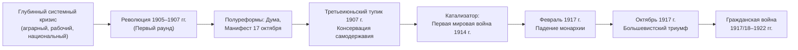
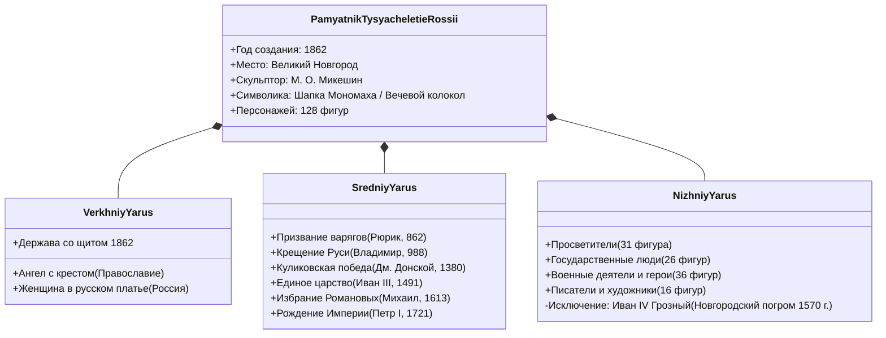
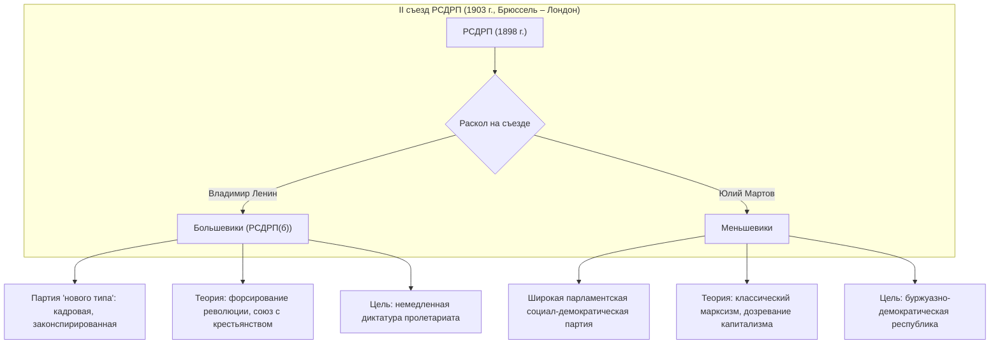
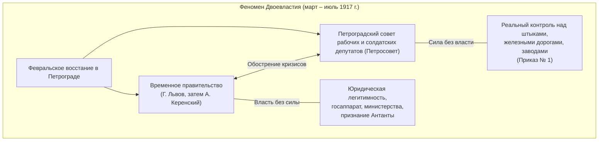
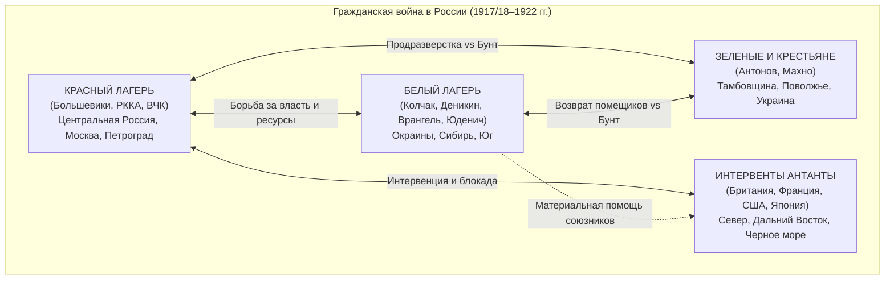
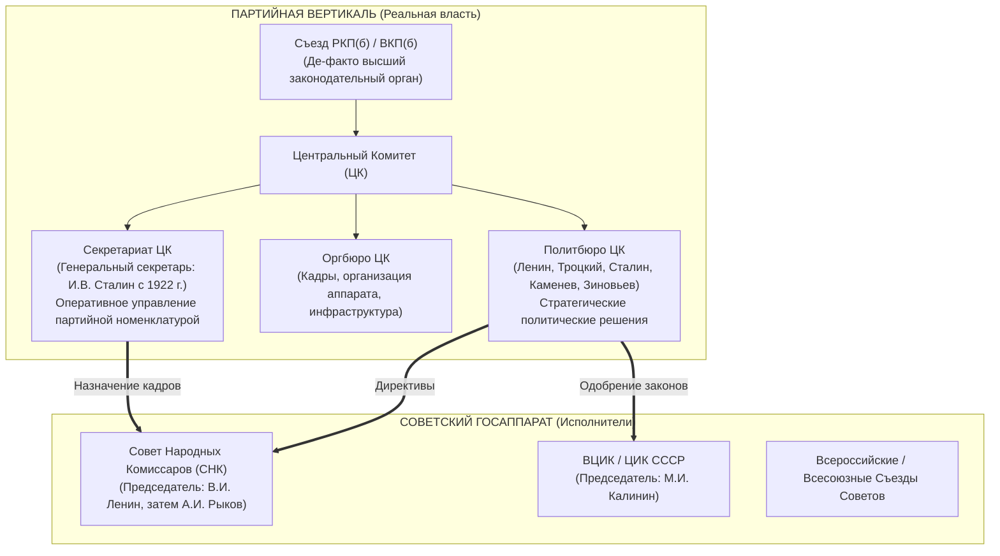

# 🏛️ Лекция №3: Россия в эпоху войн и революций первой четверти XX века: от Первой русской революции к созданию советского государства

> **Дисциплина:** История России  
> **Университет:** МТУСИ (Центр заочного обучения по программам бакалавриата)  
> **Направление:** 09.03.02 «Информационные системы и технологии» (Профиль: Инженерия DevSecOps)  
> **Курс / Семестр:** 2 курс, 3 семестр  
> **Дата лекции:** 16 сентября 2026 г.  
> **Исходная видеозапись:** `История 16.09.mp4` (продолжительность: 3 часа 37 минут 13 секунд, 2 академические пары)  
> **Полная стенограмма с таймкодами:** [`lecture-03-transcript.txt`](./transcripts/lecture-03-transcript.txt)

---

## 📋 Содержание лекции
1. [Вводная часть и социально-демографический профиль Российской империи на рубеже веков (по переписи 1897 г.)](#1-вводная-часть-и-социально-демографический-профиль-российской-империи-на-рубеже-веков-по-переписи-1897-г)
2. [Первая русская революция (1905–1907 гг.): истоки, этапы, Манифест 17 октября и Третьеиюньский переворот](#2-первая-русская-революция-19051907-гг-истоки-этапы-манифест-17-октября-и-третьеиюньский-переворот)
3. [Национализм, историческая память и репрезентация монархии на рубеже веков](#3-национализм-историческая-память-и-репрезентация-монархии-на-рубеже-веков)
4. [Зарождение социал-демократии, раскол РСДРП (1903 г.) и фигура В.И. Ленина](#4-зарождение-социал-демократии-раскол-рсдрп-1903-г-и-фигура-ви-ленина)
5. [Большевистская концепция национальной политики: «Империя положительного действия» и коренизация](#5-большевистская-концепция-национальной-политики-империя-положительного-действия-и-коренизация)
6. [Российская империя в Первой мировой войне (1914–1918 гг.): тотальная мобилизация и паралич власти](#6-российская-империя-в-первой-мировой-войне-19141918-гг-тотальная-мобилизация-и-паралич-власти)
7. [Революционный взрыв 1917 года: Февральское восстание, Двоевластие и Октябрьский переворот](#7-революционный-взрыв-1917-года-февральское-восстание-двоевластие-и-октябрьский-переворот)
8. [Разгон Учредительного собрания (январь 1918 г.) и развязывание Гражданской войны](#8-разгон-учредительного-собрания-январь-1918-г-и-развязывание-гражданской-войны)
9. [Гражданская война (1917/18–1922 гг.): противоборствующие лагеря, причины победы красных и крестьянский фронт](#9-гражданская-война-1917181922-гг-противоборствующие-лагеря-причины-победы-красных-и-крестьянский-фронт)
10. [Генезис советской партийно-государственной машины в 1920-е годы](#10-генезис-советской-партийно-государственной-машины-в-1920-е-годы)
11. [Международный контекст, «военная тревога» 1927 года и формирование психологии «осажденной крепости»](#11-международный-контекст-военная-тревога-1927-года-и-формирование-психологии-осажденной-крепости)
12. [Сводные аналитические таблицы](#12-сводные-аналитические-таблицы)
13. [Контрольные вопросы для самопроверки к дифференцированному зачету](#13-контрольные-вопросы-для-самопроверки-к-дифференцированному-зачету)

---

## 1. Вводная часть и социально-демографический профиль Российской империи на рубеже веков (по переписи 1897 г.)

*Таймкод: `[00:00] – [10:05]`*

### 1.1. Методологический контекст: понятие «отсталости»
Лектор открывает занятие ретроспективой предшествующей лекции (посвященной XIX веку, династической биографике и личности Николая II) и переходит к анализу стартовых условий России в начале XX века:
- В отечественной и зарубежной историографии закрепился тезис об «отсталости» Российской империи рубежа XIX–XX веков. Однако понятие отсталости всегда **релятивно (относительно)**: важно фиксировать критерии сравнения (от кого, в каких сферах и какими темпами страна отставала).
- **С геополитической точки зрения:** Россия являлась великой мировой державой с колоссальным международным авторитетом, утвердившимся после победы над Наполеоном в 1812 году. В XIX веке империя непрерывно расширялась за счет присоединения территорий на Кавказе, Дальнем Востоке и в Центральной Азии (завоевание среднеазиатских ханств). В логике классического империализма XIX века непрерывный территориальный прирост выступал главным показателем витальности и успешности государства.
- **С экономической точки зрения:** Российская империя вступила в фазу полномасштабной промышленной революции лишь в 1890-х годах (виттевский индустриальный рывок) — примерно на полвека позже Великобритании. Модернизация носила догоняющий, очаговый и форсированный характер, опираясь на два ключевых рычага:
  1. *Прямой государственный патернализм* (казенные субсидии, госзаказы на строительство железных дорог, военное производство);
  2. *Массированный приток иностранного капитала* (французского, бельгийского, британского, немецкого).

### 1.2. Статистический срез Первой всеобщей переписи населения 1897 года
Первая всеобщая перепись населения Российской империи 1897 года зафиксировала глубокие диспропорции в структуре общества:
- **Общая численность:** ~125–128 млн человек (из них более 92 млн проживало в Европейской части России, включая 9 млн в Привислинском крае / польских губерниях).
- **Демографическая плотность:** крайне неравномерная. За Уралом и в Сибири плотность падала практически до нуля; на Кавказе сохранялся архаичный демографический режим сверхвысокой рождаемости.
- **Уровень урбанизации:** катастрофически низкий по европейским меркам. 80–92% населения восточных регионов и Сибири составляли сельские жители. Городское население империи в среднем едва превышало 11–13%.
- **Сословная структура:**
  - *Крестьянство:* **77–80%** населения (подавляющее крестьянское аграрное большинство);
  - *Мещане и ремесленники:* ~10,7%;
  - *Дворянство (потомственное и личное):* ~1,5%;
  - *Купечество и почетные граждане:* ~0,5%;
  - *Духовенство:* ~0,5%;
  - *Промышленный рабочий класс (фабрично-заводской пролетариат):* всего **2–3 млн человек** (менее 2,5% населения).
- **Грамотность:**
  - Среди 20-летних: грамотными были **45% мужчин** и лишь **12% женщин**;
  - Среди 50-летних (поколение родителей): **26% мужчин** и **менее 1% женщин**.
  - *Оговорка лектора:* под «грамотностью» в переписи понималось базовое умение по слогам прочесть вывеску, написать фамилию и произвести элементарный счет (уровень современного ребенка 8–9 лет), а вовсе не систематическое среднее или высшее образование.
- **Этноконфессиональный состав:**
  - Понятие юридической «национальности» отсутствовало — фиксация производилась по *родному языку* и *вероисповеданию*.
  - *Великороссы (русские):* составляли лишь **44%** населения (меньшинство в собственной империи). Русскоязычный массив объединял малороссов (украинцев) и белорусов.
  - *Конфессии:* православные (включая несколько миллионов старообрядцев) — **70%**; мусульмане — **11%**; католики (поляки, литовцы) — **9%**; иудеи — **4%**; протестанты и лютеране — ~3%.
- **Крупнейшие промышленные узлы:** Санкт-Петербург, Москва, Варшава, Рига, Донбасс (угольно-металлургический бассейн с преобладанием франко-бельгийских концессий), Баку (глобальный лидер нефтедобычи конца XIX века), портовая Одесса, Киев и Харьков.

---

## 2. Первая русская революция (1905–1907 гг.): истоки, этапы, Манифест 17 октября и Третьеиюньский переворот

*Таймкод: `[10:07] – [20:07]`*

### 2.1. Концепт «Русской революции начала XX века» в современной историографии
Лектор подчеркивает методологический сдвиг: советская историография жестко сепарировала события на три автономные революции:
1. *Первая буржуазно-демократическая революция (1905–1907 гг.);*
2. *Февральская буржуазно-демократическая революция (февраль–март 1917 г.);*
3. *Великая Октябрьская социалистическая революция (октябрь 1917 г.).*

В современной науке утверждается системный подход: события 1905–1922 годов рассматриваются как единый, непрерывный процесс — **Великая русская революция**, проходившая ряд фаз и кризисов из-за неразрешенности системных структурных противоречий.

### 2.2. Комплекс предпосылок революции 1905–1907 гг.
- **Экономический кризис 1900–1903 гг.:** волна банкротств промышленных предприятий, резкий рост безработицы, падение реальных доходов населения и продовольственные затруднения.
- **Аграрно-крестьянский вопрос (главный нерв революции):** хроническое крестьянское малоземелье, гнет выкупных платежей (отмененных только в ходе революции с 1907 г.), архаичная общинная чересполосица и демографический взрыв в деревне.
- **Рабочий вопрос:** изнурительный рабочий день (11,5–14 часов), запрет профсоюзов, штрафы, отсутствие фабричного страхования по инвалидности/старости, нищенские условия барачного жилья.
- **Катализатор — Русско-японская война (1904–1905 гг.):** тяжелейшие поражения на суше (Мукден) и море (Цусима, падение Порт-Артура) разрушили миф о военной непобедимости самодержавия и вызвали общенациональную деморализацию.
- **Политический фактор:** архаичное абсолютистское самодержавие, отвергавшее конституцию, парламент и базовые политические свободы.

### 2.3. Ход борьбы и Манифест 17 октября 1905 года
- **Повод:** «Кровавое воскресенье» 9 января 1905 г. Расстрел правительственными войсками мирного шествия петербургских рабочих к Зимнему дворцу с петицией (во главе со священником Георгием Гапоном). Погибли и были ранены сотни людей; окончательно рухнула народная вера в «доброго царя-батюшку».
- **Характер сопротивления:**
  - *Всеобщая октябрьская политическая стачка (1905 г.):* забастовало свыше 2 млн человек, встали железные дороги, телеграф, электростанции;
  - *Восстания в армии и флоте:* броненосец «Князь Потемкин-Таврический» (июнь 1905), Севастопольское восстание крейсера «Очаков» под руководством лейтенанта Шмидта;
  - *Крестьянские погромы («иллюминации»):* массовый разгром и поджоги помещичьих усадеб.
- **Манифест 17 октября 1905 г. «Об усовершенствовании государственного порядка»:**
  - Подписан Николаем II под угрозой военной диктатуры или полной утраты трона (по настоянию С.Ю. Витте).
  - Даровал «незыблемые основы гражданской свободы»: неприкосновенность личности, свободу совести, слова, собраний и союзов.
  - Учредил выборную **Государственную Думу** с законодательными правами (ни один закон не мог вступить в силу без одобрения Думы).
  - Легализовал политические партии (созданы кадеты, октябристы, черносотенные союзы).
- **Третьеиюньский переворот (3 июня 1907 г.):**
  - Роспуск II Государственной Думы и произвольное изменение избирательного закона в нарушение Манифеста 17 октября (новый закон резко увеличил представительство дворян-помещиков и крупной буржуазии в ущерб крестьянам и рабочим).
  - Наступление реакции: усталость протестных масс, аресты партийных активистов, репрессии военно-полевых судов П.А. Столыпина («столыпинские галстуки»). Самодержавие устояло, но ни одно из фундаментальных противоречий ликвидировано не было.

---

## 3. Национализм, историческая память и репрезентация монархии на рубеже веков

*Таймкод: `[20:08] – [35:08]`*

### 3.1. Эпоха национализма в Российской империи
В XIX веке формируются современные нации, национальные границы, стандартизированные литературные языки и историографические нарративы. В империи сталкиваются два антагонистических вектора:
1. **Польский национализм:**
   - Поляки обладали развитой многовековой традицией государственности (Речь Посполитая) и дифференцированной социальной структурой со средним классом и дворянством (**шляхтой**), являвшимся носителем национального самосознания.
   - Восстания 1830–1831 и 1863–1864 гг. жестоко подавлялись. После 1864 г. власти перешли к тотальной русификации Привислинского края (упразднение автономии, насаждение русского языка в судопроизводстве и образовании).
   - Это вызвало консолидацию нации вокруг польского языка и католической церкви. Сформировались политические партии и лидеры нового типа (Юзеф Пилсудский — социалистическое крыло, Роман Дмовский — национал-демократы).
2. **Русский национализм и государственная идеология:**
   - *Декабристы (1825 г.):* первый набросок гражданского национального проекта (модернизация государства в интересах нации, хотя и понимаемой преимущественно сквозь дворянскую оптику).
   - *Теория официальной народности С.С. Уварова (1833 г.):* триада «Православие, Самодержавие, Народность» — попытка консервативного синтеза имперской автократии и национальной самобытности.
   - *Славянофилы vs Западники:* поиски цивилизационной идентичности России.
   - *Имперский национализм Александра III:* переход от надсословного династического универсализма к жесткой политике русификации окраин.

### 3.2. Памятник «Тысячелетие России» (1862 г.) как материализация национального пантеона
Лектор подробно разбирает уникальный феномен скульптурной композиции **«Тысячелетие России»**, открытой в Великом Новгороде в 1862 году (автор проекта — скульптор Михаил Микешин):
- **Символическое место:** Великий Новгород выбран как колыбель русской государственности (летописное призвание варягов Рюрика в 862 г.).
- **Архитектурно-пластическая форма:** символизирует одновременно **Шапку Мономаха** (эмблему самодержавной царской власти) и **Новгородский вечевой колокол** (символ древнерусского народовластия).
- **Трехъярусная композиция (128 исторических фигур):**
  1. *Верхний ярус:* колоссальный шар-держава, увенчанный ангелом с крестом (Православие) и коленопреклоненной женщиной в русском национальном костюме (Россия) со щитом «1862».
  2. *Средний ярус (6 эпохальных сюжетов):* призвание варягов (862 г.), крещение Руси князем Владимиром (988 г.), Куликовская битва и изгнание ордынцев (1380 г.), основание самодержавного царства Иваном III (1491 г.), избрание династии Романовых (1613 г.), рождение Российской империи при Петре I (1721 г.).
  3. *Нижний ярус (фриз со 109 фигурами выдающихся деятелей):* разделен на 4 группы: «Просветители», «Государственные люди», «Военные люди и герои», «Писатели и художники».
- **Знаковое исключение — отсутствие Ивана IV Грозного:**
  - На памятнике представлены десятки государей, полководцев и святых, но **нет Ивана Грозного**.
  - Новгородское купечество и общественность категорически воспротивились установке фигуры царя в память о кровавом новгородском погроме опричников 1570 года, навсегда подорвавшем автономию города.
- **Символическая судьба в годы Великой Отечественной войны:** нацистские оккупанты распилили монумент и готовились вывезти его в Германию в качестве бронзового лома и трофея; освобождение Новгорода Красной армией в январе 1944 г. позволило восстановить памятник из обломков.

### 3.3. Костюмированный бал 1903 года и карточная колода «Русский стиль»
- **Бал 1903 года в Зимнем дворце:** грандиозное маскарадное празднество императорского двора Николая II, где вся аристократия нарядилась в аутентичные боярские костюмы допетровской Руси эпохи царя Алексея Михайловича (XVII в.). Николай II был в наряде Тишайшего царя, Александра Федоровна — царицы Марии Ильиничны Милославской.
- **Идеологический подтекст:** архаизирующая тоска по «золотому веку» патриархального самодержавия до петровской европеизации. Царская чета грезила идеей «особого русского пути», надеясь обойти пороки западного парламентаризма и капитализма.
- **Колода карт «Русский стиль» (1911/1923 гг.):** эскизы игральных карт были срисованы с фотографий участников бала 1903 года. Ирония истории: в 1923 году советские фабрики переиздали эту колоду колоссальными тиражами, и пролетариат играл в «дурака» портретами свергнутых Романовых.

### 3.4. Эволюция понятия нации: от конфессионализма к биологическому детерминизму Ж.А. де Гобино
- До конца XIX века принадлежность к «русским» определялась через **православие**: крещеный еврей или немец воспринимался полноценным подданным и русским человеком.
- На рубеже веков в европейскую и российскую мысль проникают идеи биологического детерминизма и расовые теории. Французский аристократ Жозеф Артур де Гобино («Опыт о неравенстве человеческих рас», 1853–1855) постулировал фатальную врожденность неравенства рас и народов. Национальная идентичность стала восприниматься как неизменная биологическая данность по рождению.

---

## 4. Зарождение социал-демократии, раскол РСДРП (1903 г.) и фигура В.И. Ленина

*Таймкод: `[35:09] – [57:47]`*

### 4.1. Социальный генезис революционной интеллигенции
- Российская интеллигенция конца XIX века была почти поголовно оппозиционной или революционной. Молодежь из разночинцев и обедневшего дворянства ощущала непреодолимый барьер сословных ограничений и видела единственную цель жизни в переустройстве общества.
- В отличие от Запада, где социалисты вели легальную парламентскую и профсоюзную работу, в самодержавной России любая оппозиционная деятельность автоматически криминализировалась Департаментом полиции, выталкивая радикалов в подполье и террор.

### 4.2. Биография Владимира Ильича Ульянова (Ленина)
- **Социальное происхождение:** вопреки мифам, Ленин происходил из респектабельной семьи высшего чиновничества. Отец — Илья Николаевич Ульянов — дослужился до должности директора народных училищ Симбирской губернии и чина действительного статского советника (IV класс Табели о рангах), что давало права **потомственного дворянства**.
- **Личная трагедия-триггер:** в 1887 году за участие в подготовке покушения на Александра III («Террористическая фракция Народной воли») был казнен через повешение его 21-летний старший брат Александр Ульянов.
- **Путь революционера:** исключение с юридического факультета Казанского университета за студенческие сходки, ссылка, руководство «Союзом борьбы за освобождение рабочего класса» в Петербурге (1895 г.), сибирская ссылка в Шушенском, многолетняя эмиграция в Женеве, Лондоне, Мюнхене, Цюрихе.
- **Психологический склад:** фанатичная убежденность в доктрине, непреклонная воля к власти, бескомпромиссность к инакомыслию внутри фракций, прагматичный макиавеллизм в политических средствах.

### 4.3. II съезд РСДРП (1903 г., Брюссель – Лондон): раскол на Большевиков и Меньшевиков
Съезд стал поворотным пунктом в истории левого движения. Спор между Владимиром Лениным и Юлием Мартовым привел к необратимому расколу:
1. **Спор о § 1 Устава партии:**
   - *Формула Мартова:* членом партии признается всякий, кто принимает ее программу, поддерживает партию материально и оказывает ей *регулярное личное содействие под руководством* одной из ее организаций (демократическая, открытая партия европейского типа).
   - *Формула Ленина:* членом партии признается тот, кто признает программу, поддерживает материально и *лично участвует в одной из партийных организаций* (закрытая, законспирированная организация профессиональных революционеров с железной субординацией).
2. **Теоретико-стратегическое расхождение:**
   - *Меньшевики (Мартов, Плеханов, Аксельрод):* классический ортодоксальный марксизм. Россия — аграрная полуфеодальная страна. Социалистической революции должна предшествовать длительная эпоха развитого капитализма и буржуазной демократии, в ходе которой пролетариат станет абсолютным большинством нации.
   - *Большевики (Ленин):* концепция форсирования истории. Буржуазия слаба и труслива. Пролетариат в союзе с беднейшим крестьянством может и должен перехватить руководство буржуазно-демократической революцией и немедленно перевести ее в фазу социалистической революции («перерастание революций»).
3. **Происхождение терминов «большевики» и «меньшевики»:**
   - При выборах в руководящие органы партии (ЦК и редакция газеты «Искра») после ухода со съезда представителей еврейского Бунда и умеренных «экономистов» сторонники Ленина получили случайное ситуативное большинство в несколько голосов.
   - Ленин мгновенно закрепил победоносный ярлык **«большевики»**, а оппонентов заклеймил психологически проигрышным термином **«меньшевики»**, хотя на протяжении последующих 14 лет (вплоть до осени 1917 г.) меньшевики количественно превосходили большевиков.

### 4.4. Ленинская теория «Партии — авангарда пролетариата»
- **Парадокс российского марксизма:** как совершить марксистскую революцию в стране, где промышленных пролетариев всего 3 млн из 128 млн населения?
- **Решение Ленина:** концепция партии как **авангарда рабочего класса**. Пролетариат сам по себе способен выработать лишь «тред-юнионистское» (профсоюзное, экономическое) сознание. Революционное социалистическое сознание в рабочий класс должна привнести извне сплоченная каста профессиональных революционеров.
- **Цитата из полицейского донесения 1901 г. (приведенная лектором):**
  > *«Добродушный русский юноша из рабочей среды превратился в особый тип полуграмотного интеллигента, который чувствует себя обязанным отвергнуть семью и веру, не соблюдать законы, отрицать существующую власть и насмехаться над ней».*

---

## 5. Большевистская концепция национальной политики: «Империя положительного действия» и коренизация

*Таймкод: `[01:03:36] – [01:13:36]`*

### 5.1. Ответ на вопрос слушателей о ленинских высказываниях о великороссах
Лектор подробно разбирает частый историографический вопрос: почему у Ленина и первых большевиков встречаются жесткие филиппики в адрес русского имперского прошлого («великодержавного держиморды»):
- Большевики по своей глубинной доктрине были последовательными интернационалистами и противниками самого принципа национального государства, считая нацию буржуазным конструктом.
- Однако Ленин проводил фундаментальное классовое разделение между:
  1. *Национализмом угнетающей нации* (великодержавным шовинизмом господствующего русского этноса в Российской империи — «тюрьме народов»);
  2. *Национализмом угнетенных малых народов* (поляков, финнов, украинцев, кавказских и азиатских этносов), в котором признавалось прогрессивное антиколониальное зерно.

### 5.2. Концепция «Affirmative Action Empire» Терри Мартина
Американский историк **Терри Мартин** охарактеризовал ранний Советский Союз 1920-х годов как **«Империю положительного действия» (The Affirmative Action Empire)**:
- В отличие от традиционных колониальных империй (Британской, Французской или Российской), где титульная нация эксплуатировала национальные окраины, советское государство проводило государственную политику институциональной поддержки и компенсации угнетенным меньшинствам за счет исторического донора — великороссов.
- **Суть политики «Коренизации» (1920-е гг.):**
  - Создание национальных автономий, республик и округов;
  - Интенсивное выдвижение представителей коренных этносов на руководящие партийные и государственные посты (райкомы, обкомы, исполкомы);
  - Институционализация и финансирование национальных культур: создание письменности и словарей для бесписьменных народов, открытие национальных школ, вузов, театров и периодических изданий;
  - Борьба с великодержавным шовинизмом объявлялась главной партийной задачей в межнациональных отношениях.

---

## 6. Российская империя в Первой мировой войне (1914–1918 гг.): тотальная мобилизация и паралич власти

*Таймкод: `[01:13:37] – [01:24:39]`, `[01:57:50] – [02:17:50]`*

### 6.1. Причины и характер Первой мировой войны
- **Геополитический узел:** конфликт блоков — Антанты (Россия, Франция, Великобритания) и Тройственного союза / Центральных держав (Германия, Австро-Венгрия, Османская империя, Болгария).
- **Интересы России:** контроль над черноморскими проливами Босфор и Дарданеллы («выход из закрытого Черного моря»), взятие Константинополя (Царьграда), защита славянских народов на Балканах («пороховой погреб Европы») и геополитическое доминирование в Восточной Европе.
- **Феномен «Тотальной войны»:**
  - Впервые в истории война потребовала тотальной мобилизации всей экономики, индустрии, науки и человеческих ресурсов.
  - *Эмансипация женщин:* миллионы мужчин ушли в окопы; их рабочие места у станков на снарядных заводах и на транспорте заняли женщины. Родился новый тип самостоятельной женщины-работницы, кормящей семью.

### 6.2. Внутренний надлом Российской империи в 1915–1916 гг.
- **«Снарядный голод» и Великое отступление 1915 г.:** потеря Польши, Литвы, части Белоруссии; колоссальные потери кадровой армии.
- **Транспортный и продовольственный коллапс:** железные дороги не справлялись с одновременным снабжением многомиллионного фронта и городов. В Петрограде и Москве начались перебои с доставкой муки и хлеба, возникли гигантские «хвосты» (очереди).
- **Дискредитация правящей династии:**
  - Ненависть к императрице Александре Федоровне из-за ее немецкого происхождения (в обществе распространялись беспочвенные слухи об измене и «прямом проводе в Берлин»);
  - Фигура Григория Распутина, его влияние на кадровые назначения («министерская чехарда», когда премьеры и министры менялись каждые несколько месяцев);
  - Речь лидера кадетов П.Н. Милюкова в Госдуме 1 ноября 1916 г. с рефреном: *«Что это — глупость или измена?»*.
- **Вывод лектора:** Первая мировая война выступила **фатальным детонатором**. Без колоссального стресса тотальной войны монархия Романовых имела ресурс для эволюционной модернизации.

---

## 7. Революционный взрыв 1917 года: Февральское восстание, Двоевластие и Октябрьский переворот

*Таймкод: `[02:17:53] – [02:37:53]`*

### 7.1. Февральская революция: стихийный взрыв и крах династии
- **Хроника событий (23 февраля – 2 марта 1917 г.):**
  - 23 февраля (8 марта по новому стилю — Международный женский день): работницы Выборгской стороны выходят на демонстрации с лозунгами «Хлеба!» и «Долой войну!».
  - Забастовка перерастает во всеобщее восстание; ключевой момент — **переход 150-тысячного Петроградского гарнизона на сторону восставших** (солдаты отказались стрелять в рабочих).
  - **2 марта 1917 г.:** император Николай II в вагоне царского поезда на станции Дно под Псковом под давлением генералитета (генералы Алексеев, Рузский) подписывает отречение от престола за себя и сына Алексея в пользу брата Михаила. Великий князь Михаил Александрович 3 марта отказывается принять корону до решения Учредительного собрания. 304-летнее правление дома Романовых пало за неделю.

### 7.2. Система Двоевластия и Приказ № 1
- **Временное правительство:** формируется Временным комитетом Государственной Думы (князь Г.Е. Львов, П.Н. Милюков, А.И. Гучков, позже А.Ф. Керенский). Буржуазно-либеральный орган, провозгласивший лозунг «Война до победного конца!» и отложивший все базовые реформы (о земле, о труде, о форме правления) до Учредительного собрания.
- **Петроградский совет (Петросовет):** сформирован социалистами (меньшевиками и эсерами) при опоре на вооруженных солдат гарнизона и рабочих.
- **Приказ № 1 по Петроградскому гарнизону (1 марта 1917 г.):**
  - Подчинил воинские части Совету;
  - Упразднил титулование офицеров и отдание чести вне службы;
  - Ввел выборные солдатские комитеты, контролировавшие оружие.
  - *Последствие:* стремительная демократизация обернулась катастрофической декомпозицией и разложением дисциплины на фронте.

### 7.3. Возвращение Ленина и «Апрельские тезисы»
- В апреле 1917 года Ленин и группа эмигрантов возвращаются из Швейцарии через воюющую Германию в так называемом **«пломбированном вагоне»** (германское верховное командование разрешило транзит, рассчитывая дестабилизировать тыл противника).
- 4 апреля на броневике у Финляндского вокзала Ленин провозглашает **«Апрельские тезисы»**:
  - Категорический отказ в доверии буржуазному Временному правительству;
  - Лозунг: **«Вся власть Советам!»**;
  - Немедленное прекращение империалистической бойни («Мир народам!»);
  - Конфискация помещичьих земель («Земля крестьянам!»);
  - Переход от первого буржуазного этапа революции ко второму — социалистическому.

### 7.4. Октябрьское вооруженное восстание (24–26 октября 1917 г.)
- **Предыстория:** провал Июльского наступления на фронте, вооруженный кризис 3–5 июля (большевики объявлены немецкими шпионами, Ленин уходит в подполье в Разлив), подавление Корниловского мятежа в августе силами Советов и большевиков (привело к тотальной «большевизации Советов»).
- **Штурм Зимнего и свержение Временного правительства:**
  - Руководство восстанием осуществлял Военно-революционный комитет (ВРК) во главе со Львом Троцким.
  - В ночь на 25 октября (7 ноября) красногвардейцы и матросы Балтийского флота без масштабного кровопролития заняли мосты, вокзалы, почту, телеграф и арестовали министров Временного правительства в Зимнем дворце (Керенский бежал).
- **II Всероссийский съезд Советов (25–27 октября 1917 г.):**
  - В знак протеста против «военного заговора» меньшевики и правые эсеры демонстративно покинули съезд. Троцкий бросил им вслед историческую фразу: *«Вы — жалкие банкроты, идите туда, где вам надлежит быть: в сорную корзину истории!»*.
  - Оставшиеся большевики и левые эсеры приняли первые декреты:
    1. **Декрет о мире:** призыв ко всем воюющим народам и правительствам начать переговоры о справедливом демократическом мире без аннексий и контрибуций;
    2. **Декрет о земле:** полная отмена помещичьей собственности на землю без выкупа, социализация земли и передача ее крестьянским волостным комитетам (принята эсеровская аграрная программа);
    3. Создано советское правительство — **Совет Народных Комиссаров (СНК)** во главе с В.И. Лениным.

---

## 8. Разгон Учредительного собрания (январь 1918 г.) и развязывание Гражданской войны

*Таймкод: `[02:37:54] – [02:47:53]`*

### 8.1. Выборы и роспуск Всероссийского Учредительного собрания
- Идея созыва Учредительного собрания являлась сакральным ориентиром для всех политических сил России на протяжении 1917 года. Большевики не решились отменить давно назначенные выборы.
- **Итоги выборов (ноябрь 1917 г.):**
  - *Партия социалистов-революционеров (эсеры):* получили **около 40%** голосов (триумфальная победа за счет крестьянского электората);
  - *Большевики:* получили **24%** (заняли 2-е место, победив в крупных промышленных центрах, гарнизонах и на Балтфлоте);
  - *Меньшевики:* менее 3%;
  - *Кадеты и правые:* ~5%.
- **Заседание 5–6 января 1918 года:**
  - Депутатское большинство во главе с лидером эсеров В.М. Черновым отказалось утвердить ленинскую «Декларацию прав трудящегося и эксплуатируемого народа» и признать власть Советов.
  - Большевики и левые эсеры покинули Таврический дворец. В 5 часов утра начальник караула матрос Анатолий Железняков произнес крылатые слова: *«Караул устал, прошу закрыть заседание!»*.
  - Днем 6 января ВЦИК издал декрет о роспуске Учредительного собрания. Демонстрации в его защиту в Петрограде были расстреляны красногвардейцами.
- **Историческое значение:** разгон Учредительного собрания ликвидировал возможность мирного коалиционного парламентского развития и перевел конфликт в фазу бескомпромиссной вооруженной конфронтации.

---

## 9. Гражданская война (1917/18–1922 гг.): противоборствующие лагеря, причины победы красных и крестьянский фронт

*Таймкод: `[02:47:54] – [03:12:53]`*

### 9.1. Историографический спор о дате начала войны
- Традиционная советская датировка: **май 1918 года** (мятеж 40-тысячного Чехословацкого корпуса вдоль Транссибирской магистрали и высадка интервентов Антанты).
- Современная трактовка: гражданская война де-факто стартовала **в октябре–декабре 1917 года** с момента свержения Временного правительства, учреждения Всероссийской чрезвычайной комиссии (ВЧК, 20 декабря 1917 г. во главе с Ф.Э. Дзержинским) и первых боев на Дону (формирование Добровольческой армии генералами Корниловым и Алексеевым).

### 9.2. Расклад противоборствующих сил
1. **Красный лагерь (Большевики):**
   - Лидеры: В.И. Ленин, Л.Д. Троцкий (председатель Реввоенсовета Республики, фактический создатель 5-миллионной Рабоче-Крестьянской Красной Армии), Я.М. Свердлов, Ф.Э. Дзержинский.
   - Опора: рабочий класс, городские гарнизоны, беднейшее крестьянство.
   - Идеология: мировая социалистическая революция, диктатура пролетариата, военный коммунизм.
2. **Белое движение:**
   - Лидеры: адмирал А.В. Колчак («Верховный правитель России», Сибирь), генерал А.И. Деникин и П.Н. Врангель (Вооруженные силы Юга России), генерал Н.Н. Юденич (Северо-Западная армия под Петроградом), генерал Е.К. Миллер (Север).
   - Опора: офицерство, дворянство, буржуазия, казачество, часть интеллигенции.
   - Идеология: «Единая и неделимая Россия», верность союзникам по Антанте, концепт **«непредрешенчества»** (форма правления определится после свержения большевиков новым Народным собранием).
3. **«Зеленый» лагерь (Крестьянское повстанчество):**
   - Движение под лозунгами «Советы без коммунистов!», против реквизиций хлеба и продразверстки.
   - Крупнейший очаг: **Тамбовское восстание (Антоновщина, 1920–1921 гг.)** под предводительством А.С. Антонова (подавлено регулярными войсками М.Н. Тухачевского с применением бронетехники и химического оружия). Махновщина на Украине.

### 9.3. Фундаментальные причины победы большевиков
Лектор детально аргументирует, почему красные одержали верх над Белым движением:
1. **Геополитический и логистический фактор:**
   - Большевики контролировали плотно населенное **ядро Европейской России** с обеими столицами (Москва с марта 1918 г. — столица, Петроград).
   - В руках красных оказалась радиальная сеть железных дорог, позволявшая оперативно перебрасывать резервы по внутренним операционным линиям на любой угрожаемый фронт.
   - Красным достались главные арсеналы, склады вооружения царской армии и крупнейшие военные заводы (Тульский оружейный, Ижевский и др.).
   - Белые армии действовали разрозненно на географической периферии (Сибирь, Кубань, Крым, Прибалтика), разделенные тысячами километров без надежной связи и единого стратегического командования.
2. **Аграрный вопрос и психология крестьянства:**
   - Крестьяне ненавидели продразверстку большевиков, но Белое движение пугало деревню неизмеримо больше: генералы возвращали земли старым помещикам и карали крестьян за самозахваты. Выбирая между двумя золами, крестьяне в решающий момент поддержали красных.
3. **Организационный гений и использование «военспецов»:**
   - Л.Д. Троцкий и большевики жесткими мерами мобилизовали в РККА свыше **75 000 кадровых царских офицеров («военспецов»)** и генералов (включая М.Д. Бонч-Бруевича, А.А. Брусилова, С.С. Каменева), приставив к ним комиссаров с правом расстрела и взяв в заложники их семьи. Красная армия стала регулярной военной машиной, превзошедшей белые добровольческие дружины.
4. **Идеология и пропаганда:**
   - Большевики выдвинули простые, понятные массам универсальные лозунги («Мир», «Земля», «Фабрики»), в то время как белое «непредрешенчество» и реставрационные замашки генералов не находили отклика у уставшего от войны населения.

### 9.4. Кронштадтский мятеж (март 1921 г.) и поворот к НЭПу
- **Кронштадтская трагедия:** моряки Балтийского флота («краса и гордость революции») восстали на линкорах «Севастополь» и «Петропавловск» против диктатуры РКП(б) с требованиями: перевыборы Советов тайным голосованием, лозунг **«Советы без коммунистов!»**, свобода слова для социалистов, отмена продразверстки и свобода торговли.
- **Реакция Ленина:** восстание было жестоко подавлено войсками Тухачевского, штурмовавшими крепость по тающему мартовскому льду Финского залива.
- **Политический вывод:** Кронштадт доказал, что рабочий класс и армия отторгают политику «военного коммунизма». На X съезде РКП(б) в марте 1921 года Ленин объявляет переход к **Новой экономической политике (НЭП)**: замена продразверстки твердым продналогом, легализация частной торговли, концессий и мелких частных предприятий.

---

## 10. Генезис советской партийно-государственной машины в 1920-е годы

*Таймкод: `[03:12:54] – [03:22:53]`*

### 10.1. Слияние партии и государства
В 1920-е годы оформилась уникальная партийно-государственная номенклатурная модель. Формально структура власти была советской (согласно Конституциям РСФСР 1918 г. и СССР 1924 г.), но реальные властные импульсы шли исключительно по партийной вертикали РКП(б) / ВКП(б).

### 10.2. Анатомия партийного руководства: Политбюро, Оргбюро и Секретариат
- **Совет Народных Комиссаров (СНК):** главный орган государственного исполнительного управления. Во главе стоял Ленин.
- **Съезды партии:** в условиях жесткой однопартийности де-факто играли роль высшего законодательного органа страны.
- **Политбюро ЦК:** узкий круг высших вождей, определявший внутреннюю и внешнюю политику (В.И. Ленин, Л.Д. Троцкий, И.В. Сталин, Л.Б. Каменев, Г.Е. Зиновьев).
- **Оргбюро ЦК:** ведало распределением кадров, контролем за функционированием ведомств, народным образованием и восстановлением железных дорог.
- **Секретариат и пост Генерального секретаря (учрежден в апреле 1922 г.):**
  - Должность генсека изначально задумывалась как сугубо техническая, аппаратная и канцелярская («перекладывание бумажек»).
  - На этот пост был назначен **И.В. Сталин**. Обладая феноменальной работоспособностью, Сталин быстро подчинил себе весь учет и распределение партийных кадров («учетно-распределительный отдел»), расставляя верных ему людей секретарями губкомов и обкомов. Это предопределило его победу во внутрипартийной борьбе после смерти Ленина (январь 1924 г.).

---

## 11. Международный контекст, «военная тревога» 1927 года и формирование психологии «осажденной крепости»

*Таймкод: `[03:22:56] – [03:35:18]`*

### 11.1. Коминтерн и крах надежд на «Мировую революцию»
- В 1919 году в Москве был учрежден **III Коммунистический Интернационал (Коминтерн)** с целью координации мирового революционного движения и свержения капитализма.
- В 1920 году в Баку состоялся I Съезд народов Востока, призвавший к антиколониальной войне в Азии.
- Однако волна революций в Европе захлебнулась (разгром советских республик в Баварии и Венгрии, поражение Красной армии под Варшавой в 1920 г. — «Чудо на Висле»).
- Советская Россия осталась во враждебном капиталистическом окружении. Отсюда возникла сталинская концепция **«построения социализма в отдельно взятой стране»** (в противовес теории перманентной революции Троцкого).

### 11.2. «Военная тревога» 1927 года и рождение шпиономании
- **Внешнеполитический кризис 1927 года:**
  - Обыск в советско-английском торговом обществе «АРКОС» в Лондоне;
  - Нота министра иностранных дел Великобритании Чемберлена и разрыв дипломатических отношений с СССР;
  - Убийство советского полпреда П.Л. Войкова белогвардейцем Ковердой в Варшаве.
- **Психологический перелом:** в советском обществе разразилась массовая паника. Население сметало с полок соль, спички, муку и керосин, ожидая со дня на день вторжения армий Англии и Польши.
- **«Осажденная крепость» и милитаризация языка:**
  - Гражданская война приучила большевиков решать любые управленческие задачи методами военных походов. Родился специфический советский лексикон: *«фронт посевной»*, *«битва за урожай»*, *«бойцы трудового фронта»*.
  - Закрепилась тотальная **шпиономания** и культ бдительности: любой сбой на производстве, авария на шахте или задержка поезда объяснялись диверсией «вредителей», финансируемых иностранными разведками.

### 11.3. Образцовый культурный документ эпохи: песня «Коричневая пуговка»
В финале лекции преподаватель декламирует знаменитое стихотворение Евгения Долматовского **«Коричневая пуговка»** (1939 г.), ставшее абсолютным выразителем параноидальной советской бдительности 1930-х годов:
- Пионер Алешка случайно находит на проселочной дороге возле границы пуговицу с нерусскими буквами;
- Дети бегут к начальнику погранзаставы, раскрывается крупномасштабная чекистская операция;
- Красноармейцы задерживают в лесу седого незнакомца в широких штанах без пуговицы на заднем кармане, с патронами от нагана и планом укреплений советской границы:
  > *«И так шпион был пойман у самой у границы. / Никто на нашу землю не ступит, не пройдет! / В Алешкиной коллекции та пуговка хранится, / За маленькую пуговку ему большой почет!»*

---

## 12. Сводные аналитические таблицы

### Таблица 1. Социально-демографический профиль Российской империи (по переписи 1897 г.)

| Параметр / Категория | Значение / Доля | Историческое и политическое значение |
| :--- | :--- | :--- |
| **Общее население** | ~125–128 млн человек | Огромный людской потенциал, но крайне низкая плотность в Сибири и на Дальнем Востоке. |
| **Крестьянство** | **77–80%** | Доминирующий социальный класс; аграрное перенаселение и малоземелье — главный детонатор революций. |
| **Фабрично-заводской пролетариат** | **2–3 млн** (~2–2,5%) | Численное меньшинство, сконцентрированное на гигантских заводах обеих столиц; база большевизма. |
| **Дворянство и чиновничество** | ~1,5% | Правящая элита, владевшая поместьями и монополизировавшая высшие государственные посты. |
| **Грамотность населения** | Мужчины (20 лет): **45%** Женщины (20 лет): **12%** | Базовый уровень грамотности; массовая неграмотность крестьянства тормозила модернизацию. |
| **Этнический состав (русские)** | **44%** («великороссы») | Русские являлись меньшинством в полиэтнической империи; необходимость регулирования межнациональных трений. |
| **Конфессиональный состав** | Православные — **70%** Мусульмане — **11%** Католики — **9%** Иудеи — **4%** | Конфессиональный принцип определения лояльности подданных; православие — государственная религия. |

---

### Таблица 2. Идейно-организационный раскол РСДРП (II съезд, 1903 г.)

| Критерий сравнения | Большевики (В.И. Ленин) | Меньшевики (Ю.О. Мартов, Г.В. Плеханов) |
| :--- | :--- | :--- |
| **Тип партийной организации** | Кадровая партия профессиональных революционеров; конспирация, железная дисциплина, личное участие в ячейке. | Массовая открытая партия европейского социал-демократического типа; широкое членство и плюрализм мнений. |
| **Теория революционного процесса** | Сжатие этапов: немедленный переход от буржуазно-демократической революции к социалистической. | Двухэтапная теория: длительный период созревания капитализма и буржуазного парламентаризма. |
| **Движущие силы революции** | Гегемония пролетариата в союзе с беднейшим крестьянством при изоляции буржуазии. | Пролетариат в союзе с либеральной буржуазией против остатков крепостничества. |
| **Итоговая цель власти** | Установление **диктатуры пролетариата** через Советы; слом старой буржуазной государственной машины. | Буржуазно-демократическая республика, парламентская система, постепенный переход к социализму. |

---

### Таблица 3. Этапы трансформации власти в революционном 1917 году

| Дата / Период | Событие / Этап | Сущность и последствия для государственности |
| :--- | :--- | :--- |
| **23 февраля – 2 марта 1917** | **Февральская революция** | Всеобщая забастовка, восстание гарнизона Петрограда, отречение Николая II. Ликвидация монархии. |
| **Март – июль 1917** | **Период Двоевластия** | Сосуществование Временного правительства (орган буржуазии) и Петросовета (орган солдат и рабочих). Приказ № 1. |
| **4 апреля 1917** | **«Апрельские тезисы» Ленина** | Провозглашение курса на социалистическую революцию под лозунгом «Вся власть Советам!». |
| **3–5 июля 1917** | **Июльские дни** | Вооруженные демонстрации в Петрограде; конец официального двоевластия; переход большевиков в подполье. |
| **25–30 августа 1917** | **Корниловский мятеж** | Попытка военной диктатуры генерала Л.Г. Корнилова; ликвидация путча Советами, стремительная «большевизация Советов». |
| **24–26 октября 1917** | **Октябрьское восстание** | Свержение Временного правительства силами ВРК; II съезд Советов; Декреты о мире и земле; создание СНК. |

---

### Таблица 4. Противоборствующие лагеря в Гражданской войне (1917/18–1922 гг.)

| Параметр сравнения | Красный лагерь (РККА) | Белое движение | Зеленые и повстанцы |
| :--- | :--- | :--- | :--- |
| **Руководство** | В. Ленин, Л. Троцкий, М. Фрунзе, М. Тухачевский. | А. Колчак, А. Деникин, П. Врангель, Н. Юденич. | А. Антонов (Тамбов), Н. Махно (Гуляйполе). |
| **Территориальная база** | Центральная промышленная Россия, обе столицы, железнодорожные узлы. | Окраины империи: Сибирь, Дон, Кубань, Крым, Север. | Сельские партизанские очаги (Черноземье, Украина, Сибирь). |
| **Аграрная программа** | Одобрение «черного передела» земли (Декрет о земле); позже — продразверстка. | Возврат земель прежним владельцам («непредрешенчество» до Учредительного собрания). | Земля — крестьянам без выкупа; категорический протест против продразверстки. |
| **Главные преимущества** | Единство командования, компактная территория, контроль арсеналов и заводов, военспецы. | Качественный офицерский состав, помощь интервентов оружием и обмундированием. | Партизанская маневренность, глубинная поддержка местного крестьянского населения. |
| **Причины исхода** | **ПОБЕДА:** способность мобилизовать ресурсы, террор, поддержка крестьянства против помещиков. | **ПОРАЖЕНИЕ:** разрозненность фронтов, реставрация помещичьих порядков, отталкивание крестьян. | **РАЗГРОМ:** локальность выступлений, отсутствие тяжелого оружия, подавление РККА. |

---

## 13. Контрольные вопросы для самопроверки к дифференцированному зачету

### Вопрос 1. Каковы были главные социально-демографические итоги переписи населения Российской империи 1897 года?
> **Ответ:** Перепись зафиксировала общую численность населения в ~125–128 млн человек, из которых свыше 77–80% составляло крестьянство, а фабрично-заводской рабочий класс не превышал 2–3 млн человек (менее 2,5%). Уровень грамотности молодежи составлял лишь 45% у мужчин и 12% у женщин, падая до критических величин у старших поколений (менее 1% у 50-летних женщин). Этнические великороссы составляли лишь 44% населения, что превращало империю в многонациональное государство с острым национальным вопросом на окраинах.

### Вопрос 2. В чем заключается историографический смысл рассмотрения революций 1905–1907 гг. и 1917 года как единого процесса «Великой русской революции»?
> **Ответ:** В современной исторической науке революция 1905–1907 гг., Февраль 1917 г. и Октябрь 1917 г. трактуются как взаимосвязанные фазы общенационального кризиса модернизации. Первая революция вскрыла неразрешимые узлы противоречий (аграрное малоземелье, бесправие рабочих, самодержавный абсолютизм, национальное угнетение). Полумеры Манифеста 17 октября и Третьеиюньский переворот 1907 г. лишь законсервировали конфликт. В условиях стресса Первой мировой войны эти же неразрешенные противоречия привели к обвалу государственности в феврале и радикальному большевистскому финалу в октябре 1917 года.

### Вопрос 3. Чем уникальна скульптурная композиция «Тысячелетие России» (1862 г.) и почему на ней отсутствует фигура Ивана Грозного?
> **Ответ:** Памятник авторства М.О. Микешина в Великом Новгороде объединил 128 фигур и символизировал синтез Шапки Мономаха и Новгородского вечевого колокола, заложив основы современного светского пантеона национальных героев. Фигура Ивана IV Грозного была сознательно исключена по требованию новгородцев из-за опричного погрома Новгорода в 1570 году, уничтожившего новгородские вольности и сопровождавшегося массовой резней горожан.

### Вопрос 4. По каким ключевым вопросам произошел раскол РСДРП на большевиков и меньшевиков на II съезде в 1903 году?
> **Ответ:** Раскол произошел:
> 1. *По уставному вопросу о § 1:* Ленин требовал закрытой партии профессиональных революционеров с обязательным личным участием в ячейке, Мартов предлагал открытую партию с аморфным содействием;
> 2. *По теории революции:* Меньшевики настаивали на классическом марксизме (Россия должна пройти длительный этап капитализма и созревания пролетариата), Ленин постулировал возможность форсирования истории через союз пролетариата и крестьянства и установление диктатуры пролетариата.

### Вопрос 5. В чем сущность концепции «Империи положительного действия» Терри Мартина применительно к ранней советской национальной политике?
> **Ответ:** В 1920-е годы большевики, отвергая традиционный имперский шовинизм, проводили политику «коренизации» и институционального стимулирования малых народов (создание автономий, алфавитов, национальных школ, кадров в органах власти). По Мартину, это была форма «позитивной дискриминации»: государство сознательно поднимало статус национальных меньшинств за счет ущемления великороссов, объявленных виновными в былом угнетении окраин.

### Вопрос 6. Почему Первая мировая война стала непосредственным детонатором падения монархии в России?
> **Ответ:** Тотальный характер войны привел к экономическому истощению, транспортному параличу железных дорог, гиперинфляции и продовольственному кризису в столицах. Поражения на фронтах подорвали авторитет самодержавия, а «распутинщина» и «министерская чехарда» окончательно изолировали императорскую чету от дворянства, буржуазии, Государственной Думы и генералитета.

### Вопрос 7. Что представляло собой «Двоевластие» марта–июля 1917 года и какую роль сыграл «Приказ № 1»?
> **Ответ:** Двоевластие выражалось в параллельном существовании легитимного, но бессильного буржуазного Временного правительства («власть без силы») и революционного Петроградского Совета («сила без власти»). «Приказ № 1», принятый Петросоветом, ввел солдатские комитеты и отменил чинопочитание, подчинив гарнизон Совету, что мгновенно разрушило дисциплину и субординацию в армии.

### Вопрос 8. Какие декреты принял II Всероссийский съезд Советов в октябре 1917 года?
> **Ответ:** Съезд принял:
> 1. *Декрет о мире* (призыв к миру без аннексий и контрибуций);
> 2. *Декрет о земле* (отмена частной собственности на землю без выкупа, передача ее крестьянам по эсеровскому наказу);
> 3. Декрет об учреждении советского правительства — Совета Народных Комиссаров (СНК) во главе с Лениным.

### Вопрос 9. Каковы были политические последствия разгона Учредительного собрания в январе 1918 года?
> **Ответ:** Потерпев поражение на выборах (эсеры получили около 40%, большевики — 24%), большевики силой оружия разогнали Учредительное собрание. Это уничтожило шанс на легитимное многопартийное парламентское устройство страны, сделало Гражданскую войну неизбежной и перевело политическую борьбу в плоскость вооруженного противостояния на уничтожение.

### Вопрос 10. Назовите главные причины победы большевиков в Гражданской войне.
> **Ответ:**
> 1. Контроль над географическим и промышленным центром России с обеими столицами, железнодорожной сетью и оружейными заводами;
> 2. Аграрная политика: крестьяне предпочли красных, опасаясь реставрации помещичьего землевладения при победе белых;
> 3. Использование опыта 75 000 кадровых офицеров-военспецов под жестким контролем комиссаров;
> 4. Разобщенность, геополитическая периферийность и политическое «непредрешенчество» Белого движения.

### Вопрос 11. Что побудило большевиков отказаться от политики «военного коммунизма» и перейти к НЭПу весной 1921 года?
> **Ответ:** Тотальный социально-экономический кризис, всеобщая разруха, массовые крестьянские восстания (Антоновщина на Тамбовщине) и, главное, Кронштадтский мятеж моряков Балтфлота под лозунгом «Советы без коммунистов!». В ответ X съезд РКП(б) заменил продразверстку твердым продналогом и легализовал элементы рыночной экономики.

### Вопрос 12. Как в 1920-е годы сложилась структура советской партийно-государственной власти (СНК, Политбюро, Оргбюро, Секретариат)?
> **Ответ:** Реальная власть сосредоточилась внутри партийного аппарата. Политбюро ЦК определяло стратегический курс, СНК выполнял функции правительства. Оргбюро и Секретариат ЦК ведали кадровыми перестановками и аппаратом. Пост Генерального секретаря, занятый в 1922 г. Сталиным, позволил ему замкнуть на себя назначения региональных партийных руководителей, что стало базой его единоличной власти.

### Вопрос 13. Что такое «военная тревога» 1927 года и как она повлияла на советское общество?
> **Ответ:** Внешнеполитический кризис, вызванный разрывом англо-советских отношений («нота Чемберлена») и убийством полпреда Войкова в Польше. Кризис породил в СССР потребительскую панику, синдром «осажденной крепости» и волну шпиономании. Он стал идеологическим обоснованием свертывания НЭПа, форсированной индустриализации и ликвидации внутрипартийной оппозиции.
