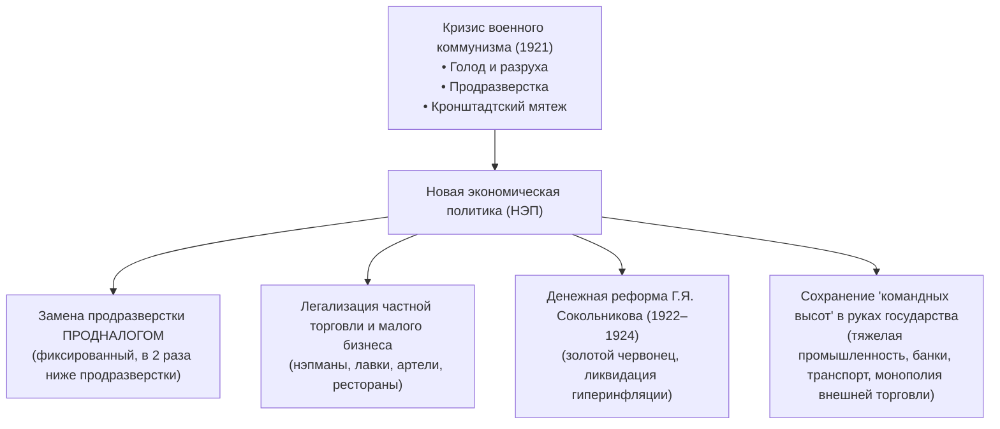
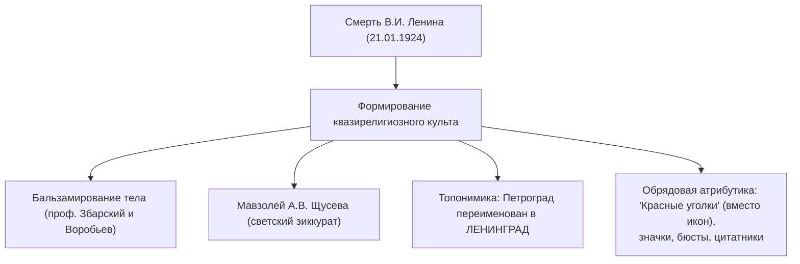
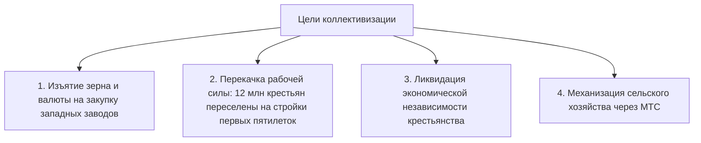

# 🏛️ Лекция №4: СССР в 1920–1930-е годы: НЭП, национальная политика, культ Ленина, индустриализация и коллективизация

> **Дисциплина:** История России  
> **Университет:** МТУСИ (Центр заочного обучения по программам бакалавриата)  
> **Направление:** 09.03.02 «Информационные системы и технологии» (Профиль: Инженерия DevSecOps)  
> **Семестр:** 3 семестр (2 курс)  
> **Дата лекции:** 17 сентября 2026 г.  
> **Преподаватель:** Янина Валерьевна Карпенкина (кандидат исторических наук, кафедра Истории МТУСИ)  
> **Исходный видеофайл:** `История рф 17.09.mp4` (продолжительность: 1 час 47 минут 23 секунды, платформа МТС Линк)  
> **Полная стенограмма с таймкодами:** `История рф 17.09_transcript.txt`

---

## 📋 Содержание лекции

1. [Вводный контекст: переход от Гражданской войны к миру и идеология «нового человека»](#1-вводный-контекст-переход-от-гражданской-войны-к-миру-и-идеология-нового-человека)
2. [Новая экономическая политика (НЭП): 1921–1929 гг.](#2-новая-экономическая-политика-нэп-19211929-гг)
3. [Национальная политика большевиков: Коренизация и образование СССР](#3-национальная-политика-большевиков-коренизация-и-образование-ссср)
4. [Кризис и противоречия советского общества 1920-х годов](#4-кризис-и-противоречия-советского-общества-1920-х-годов)
5. [Болезнь и смерть В.И. Ленина (1922–1924 гг.) и генезис советского культа вождя](#5-болезнь-и-смерть-ви-ленина-19221924-гг-и-генезис-советского-культа-вождя)
6. [Архитектура и сакрализация памяти: феномен Мавзолея и Лениниана](#6-архитектура-и-сакрализация-памяти-феномен-мавзолея-и-лениниана)
7. [Культурный феномен десакрализации: мистификация «Ленин — гриб» (1991 г.)](#7-культурный-феномен-десакрализации-мистификация-ленин--гриб-1991-г)
8. [«Великий перелом» и «Революция сверху» (1929–1932 гг.): свертывание НЭПа](#8-великий-перелом-и-революция-сверху-19291932-гг-свертывание-нэпа)
9. [Сплошная коллективизация сельского хозяйства и ликвидация кулачества](#9-сплошная-коллективизация-сельского-хозяйства-и-ликвидация-кулачества)
10. [Форсированная индустриализация: источники финансирования и цена модернизации](#10-форсированная-индустриализация-источники-финансирования-и-цена-модернизации)
11. [Экзаменационные вопросы и понятийный аппарат](#11-экзаменационные-вопросы-и-понятийный-аппарат)

---

## 1. Вводный контекст: переход от Гражданской войны к миру и идеология «нового человека»

*Таймкод: `[05:35] – [12:25]`*

### 1.1. Состояние страны к началу 1920-х годов
- Завершение Гражданской войны оставило Россию в состоянии катастрофической разрухи: промышленное производство сократилось в 7 раз по сравнению с 1913 годом, транспортная сеть парализована, сельское хозяйство деградировало из-за политики «военного коммунизма» и продразверстки.
- Массовые крестьянские восстания (Тамбовское восстание — «Антоновщина», восстания в Сибири и Поволжье) и Кронштадтский мятеж моряков в марте 1921 года под лозунгом *«Советы без большевиков!»* поставили советскую власть на грань краха.

### 1.2. Концепция социальной инженерии
- Большевистское руководство рассматривало государство как инструмент тотального переустройства не только экономики, но и человеческой природы.
- **Социальная инженерия (Social Engineering):** целенаправленное конструирование «нового советского человека» (*Homo Sovieticus*) — гармоничной, атеистической, преданной идеалам коммунизма личности с заданными физическими и ценностными установками.

---

## 2. Новая экономическая политика (НЭП): 1921–1929 гг.

*Таймкод: `[12:25] – [20:47]`*

### 2.1. Переход к НЭПу: сущность и компромисс
На **X съезде РКП(б) в марте 1921 года** по инициативе В.И. Ленина было принято решение об отказе от военного коммунизма и переходе к Новой экономической политике.

### 2.2. Отношение к НЭПу в партии и обществе
- **Лозунг Ленина:** *«Из России нэповской будет Россия социалистическая»*. НЭП трактовался Лениным как *«всерьез и надолго, но не навсегда»* — временное стратегическое отступление для восстановления производительных сил.
- **Сопротивление в большевистской среде:** рядовые коммунисты и ветераны Гражданской войны воспринимали НЭП как капитуляцию перед буржуазией, реставрацию капитализма и предательство революционных идеалов.
- **Появление «нэпманов»:** новый социальный слой мелких торговцев, арендаторов и посредников. При юридической свободе предпринимательства нэпманы были лишены избирательных прав («лишенцы»), облагались грабительскими налогами и подвергались постоянному риску экспроприации.

---

## 3. Национальная политика большевиков: Коренизация и образование СССР

*Таймкод: `[20:47] – [28:00]`*

### 3.1. Создание СССР (1922 г.)
- **30 декабря 1922 года** I Всесоюзным съездом Советов была принята Декларация и подписан Договор об образовании Союза Советских Социалистических Республик (РСФСР, УССР, БССР, ЗСФСР).
- **Спор Ленина и Сталина:**
  - *План Сталина («автономизация»):* вхождение советских республик в состав РСФСР на правах автономных образований.
  - *План Ленина («федерация»):* равноправный союз суверенных республик с формальным правом свободного выхода из состава СССР. Победила ленинская концепция, заложившая институциональные границы союзных республик.

### 3.2. Политика «Коренизации» (1923–1930-е гг.)
> **Коренизация** — официальная государственная политика советской власти в 1920-е годы, направленная на преодоление великодержавного шовинизма, внедрение национальных языков в государственное делопроизводство, образование и СМИ, а также ускоренное выдвижение представителей титульных национальностей на руководящие посты в партийных и советских органах республик.

- Примеры: *белорусизация* (газета «Савецкая Беларусь», открытие Белорусского государственного университета и Академии наук), *украинизация*, *татаризация*.
- Большевики стремились превратить национальные элиты из потенциальных сепаратистов в лояльных проводников советской власти.

---

## 4. Кризис и противоречия советского общества 1920-х годов

*Таймкод: `[28:00] – [35:49]`*

На основе архивных материалов лектор анализирует реальную повседневность 1920-х годов, разрушая миф о «сытом золотом веке НЭПа»:
- **Массовая безработица:** демобилизация миллионов красноармейцев и рационализация фабрик породили затяжную структурную безработицу в городах.
- **Кризисы НЭПа:** «кризис сбыта» и «ножницы цен» (1923 г.) — промышленность производила дорогие и некачественные товары, а государство искусственно занижало закупочные цены на хлеб, что приводило к отказу крестьян сдавать зерно.
- **Низкий культурный уровень масс:** вопросы крестьян пропагандистам: *«Кто такой Карло-Марс?»*, *«Если Ленин — новый царь, почему его не титулуют?»*.
- **Кризис партии:** эмоциональное выгорание, ранения и туберкулез старых большевиков-подпольщиков; приток в партию карьеристов и малограмотных приспособленцев.

---

## 5. Болезнь и смерть В.И. Ленина (1922–1924 гг.) и генезис советского культа вождя

*Таймкод: `[35:49] – [46:08]`*

### 5.1. Хроника угасания основателя государства
- 1918 г. — тяжелое ранение при покушении Фанни Каплан на заводе Михельсона.
- Май 1922 г. — первый инсульт.
- Декабрь 1922 г. — второй инсульт, паралич правой половины тела, отстранение от практического руководства.
- Март 1923 г. — третий инсульт, потеря речи.
- **21 января 1924 года в 18:50** — В.И. Ленин скончался в усадьбе Горки в возрасте 53 лет.

### 5.2. «Письмо к съезду» («Завещание Ленина»)
Продиктованные Лениным в декабре 1922 – январе 1923 гг. заметки содержали критические характеристики всех претендентов на лидерство:
- **О Сталине:** *«Тов. Сталин, сделавшись генсеком, сосредоточил в своих руках необъятную власть, и я не уверен, сумеет ли он всегда достаточно осторожно пользоваться этой властью... Сталин слишком груб, и этот недостаток... делается нетерпимым в должности генсека»*. Ленин предлагал переместить Сталина на другой пост.
- **О Троцком:** чрезмерное самомнение и увлечение чисто административной стороной дела при выдающихся способностях.
- **О Бухарине:** любимец партии, но его теоретические взгляды с трудом могут быть названы вполне марксистскими.

---

## 6. Архитектура и сакрализация памяти: феномен Мавзолея и Лениниана

*Таймкод: `[46:08] – [54:12]`*

### 6.1. Решение о сохранении тела
Несмотря на протесты вдовы Н.К. Крупской и Л.Д. Троцкого, комиссия по организации похорон (во главе с Ф.Э. Дзержинским при активной роли И.В. Сталина) приняла решение о бальзамировании тела вождя:
1. **Первый Мавзолей (январь 1924 г.):** временное деревянное сооружение архитектора А.В. Щусева в форме ступенчатой пирамиды кубистических форм с обшивкой красной материей внутри.
2. **Второй Мавзолей (лето 1924 г.):** укрупненный ступенчатый деревянный мавзолей с трибунами.
3. **Гранитный Мавзолей (1929–1930 гг.):** монументальное железобетонное сооружение, облицованное гранитом, порфиром и лабрадоритом (выдающийся шедевр конструктивизма).

> [!NOTE]
> **Концепция лектора:** Смерть Ленина запустила процесс замещения традиционного православного культа социалистическим квазирелигиозным культом. Мумия вождя («мощи»), Мавзолей («храм»), «Красный уголок» в каждой избе и цеху («божница»), труды классиков («священное писание»).

---

## 7. Культурный феномен десакрализации: мистификация «Ленин — гриб» (1991 г.)

*Таймкод: `[54:12] – [01:06:13]`*

Лектор демонстрирует фрагмент знаменитого телевизионного сюжета Сергея Курёхина и Сергея Шолохова из передачи «Пятое колесо» (Ленинградское телевидение, май 1991 г.):
- **Суть сюжета:** Псевдонаучный мистификационный перформанс, в котором музыкант Сергей Курёхин с серьезным видом, оперируя ложной силлогистикой и цитатами, «доказывал», что Ленин в результате неумеренного употребления галлюциногенных грибов сам стал грибом и радиоволной.
- **Историко-культурное значение:**
  - Символ эпохи **Гласности и Перестройки**: взлом советских цензурных табу и десакрализация незыблемых советских мифов.
  - Демонстрация манипулятивной силы телевизионных медиа: миллионы советских граждан, воспитанных на слепом доверии печатному слову и телевизору, всерьез поверили в показанную абсурдную гипотезу.

---

## 8. «Великий перелом» и «Революция сверху» (1929–1932 гг.): свертывание НЭПа

*Таймкод: `[01:06:13] – [01:18:13]`*

### 8.1. Внутрипартийная борьба и победа Сталина
- 1923–1924: Разгром «левой оппозиции» (Троцкий) блоком Сталина, Зиновьева и Каменева.
- 1925–1927: Разгром «новой/объединенной оппозиции» (Зиновьев, Каменев, Троцкий) в союзе с Бухариным. Высылка Троцкого из СССР (1929 г.).
- 1928–1929: Разгром «правого уклона» (Бухарин, Рыков, Томский), выступавших за сохранение НЭПа и эволюционное развитие деревни.
- К 1929 году И.В. Сталин сосредоточил в своих руках единоличную диктаторскую власть.

### 8.2. «Великий перелом» (статья Сталина от 7 ноября 1929 г.)
Отказ от рыночных механизмов НЭПа в пользу командно-административной системы и форсированной модернизации («Революция сверху»):
1. **Форсированная индустриализация.**
2. **Сплошная коллективизация.**
3. **«Культурная революция»** и ликвидация старой буржуазной интеллигенции.

### 8.3. Первые репрессивные процессы над «спецами»
- **Шахтинское дело (1928 г.):** процесс над горными инженерами Донбасса, обвиненными во вредительстве.
- **Дело Промпартии (1930 г.):** фабрикация обвинений против высшего руководства Госплана и научно-технических кадров. Власть возлагала вину за технологические сбои и плановые провалы на «классово чуждых специалистов».

---

## 9. Сплошная коллективизация сельского хозяйства и ликвидация кулачества

*Таймкод: `[01:18:13] – [01:32:00]`*

### 9.1. Раскулачивание и спецпоселения
Постановление Политбюро ЦК ВКП(б) от 30 января 1930 года *«О мероприятиях по ликвидации кулацких хозяйств в районах сплошной коллективизации»*:
- Кулачество разделялось на 3 категории:
  1. *Первая категория:* «контрреволюционный актив» — расстрел или заключение в концлагеря (ОГПУ).
  2. *Вторая категория:* наиболее зажиточные кулаки — высылка в отдаленные районы Севера, Сибири, Урала и Казахстана.
  3. *Третья категория:* расселение на худших землях в пределах своего района.
- **Масштаб:** Раскулачено **5–6 млн человек** (~4% всех крестьянских дворов). Имущество и скот конфисковывались в пользу создаваемых колхозов.
- **Создание спецпоселений:** депортированные семьи («спецпереселенцы») направлялись на лесозаготовки и тяжелые стройки в глухую тайгу без элементарных условий жизни, положив начало системе принудительного труда ГУЛАГа.

### 9.2. Статья Сталина «Головокружение от успехов» (2 марта 1930 г.)
- Вспышка сотен локальных крестьянских восстаний и массовый убой скота (крестьяне забили до 50% поголовья лошадей и коров, чтобы не отдавать в колхоз) привели руководство страны к угрозе весеннего срыва сева.
- Сталин временно отступил, опубликовав статью в «Правде», где цинично переложил вину за насильственную коллективизацию и перегибы на местных низовых партийных работников («головокружение от успехов»). Миллионы крестьян временно вышли из колхозов, однако уже осенью 1930 года нажим возобновился с удвоенной силой.

### 9.3. Катастрофический голод 1932–1933 гг.
- Непосильные планы хлебозаготовок привели к жесточайшему голоду на Украине, в Поволжье, на Северном Кавказе, Южном Урале и в Казахстане.
- **Трагедия кочевого Казахстана («Ашаршылык»):** принудительный перевод скотоводов-кочевников на оседлость привел к гибели более 80% скота и голодной смерти до 1.5 млн казахов (около трети этноса).
- **«Закон о трех колосках» (7 августа 1932 г.):** расстрел (с конфискацией) или 10 лет лагерей за хищение колхозной собственности даже в мизерных размерах.

---

## 10. Форсированная индустриализация: источники финансирования и цена модернизации

*Таймкод: `[01:32:00] – [01:47:00]`*

### 10.1. Первая пятилетка (1928–1932 гг.)
- **Главный приоритет:** группа «А» (производство средств производства — тяжелая промышленность, черная металлургия, машиностроение, энергетика, военная промышленность) в ущерб группе «Б» (товары народного потребления).
- **Флагманы первых пятилеток:** Магнитогорский металлургический комбинат (Магнитка), ДнепроГЭС, Сталинградский и Харьковский тракторные заводы, Московский и Горьковский автозаводы (ГАЗ, ЗИС).

### 10.2. Источники накопления («Где взять деньги?»)
СССР находился в условиях внешнеполитической изоляции и не имел доступа к международным кредитам. Все средства извлекались исключительно из внутренних ресурсов:

| Источник средств | Механизм изъятия | Последствия |
| :--- | :--- | :--- |
| **Ограбление деревни** | Неэквивалентный товарообмен, конфискация хлеба и экспорт за рубеж по демпинговым ценам | Голод 1932–1933 гг., разорение аграрного сектора |
| **Продажа культурных ценностей** | Продажа за границу шедевров Эрмитажа, сокровищ царской семьи, церковной утвари | Утрата уникального мирового культурного наследия |
| **Система «Торгсин»** | Магазины Всесоюзного объединения по торговле с иностранцами, где голодающие граждане обменивали золото и серебро на муку | Изъятие у населения 287 тонн чистого золота |
| **Водочная монополия** | Резкое увеличение производства и реализации крепкого алкоголя | Пополнение бюджета («пьяные деньги»), рост алкоголизации |
| **Падение уровня жизни** | Введение карточной системы в городах (1928–1935 гг.), дефицит одежды и обуви, инфляция | Реальная заработная плата рабочих упала на 40–50% |
| **Принудительный труд** | Использование труда заключенных ГУЛАГа (Беломорканал, БАМ, Норильск) | Миллионы узников, колоссальная смертность |
| **Урбанизация и женщины** | Вовлечение женщин в промышленность как дешевой рабсилы, переезд 12 млн крестьян в города | Быстрый рост пролетариата, тяжелейший жилищный кризис |

---

## 11. Экзаменационные вопросы и понятийный аппарат

### 11.1. Базовые термины и понятия
- **Продналог:** натуральный налог, введенный взамен продразверстки в 1921 г.; размер объявлялся до начала весеннего сева и не мог быть увеличен.
- **Нэпман:** частный предприниматель эпохи НЭПа (торговец, арендатор, кустарь).
- **Коренизация:** политика формирования национальных кадров и внедрения языков титульных этносов в республиках СССР в 1920-е годы.
- **Кулак:** по советской марксистской терминологии — зажиточный крестьянин, использующий наемный труд. В 1930 г. к кулакам относили любого крестьянина, отказывавшегося вступать в колхоз.
- **Колхоз (коллективное хозяйство):** производственное объединение крестьян с обобществлением земли, тяглового скота и инвентаря.
- **Торгсин:** государственная торговая сеть, принимавшая у населения драгоценные металлы и валюту в обмен на дефицитное продовольствие во время голода.
- **ГУЛАГ (Главное управление лагерей):** подразделение ОГПУ/НКВД, руководившее системой исправительно-трудовых лагерей.

---

### 11.2. Контрольные вопросы для зачета
1. В чем заключались причины перехода к НЭПу и почему он воспринимался многими большевиками как поражение революции?
2. Охарактеризуйте сущность политики коренизации на примере Белоруссии и Украины.
3. Какие варианты государственного устройства СССР предлагали В.И. Ленин и И.В. Сталин? Какой план был реализован?
4. В чем выражалась сакрализация памяти Ленина после его смерти и какую роль играл Мавзолей в советской идеологии?
5. Назовите основные источники финансирования форсированной индустриализации в СССР.
6. Каковы были экономические и демографические последствия сплошной коллективизации?
7. Что представляла собой статья И.В. Сталина «Головокружение от успехов» и какую тактическую цель она преследовала?
