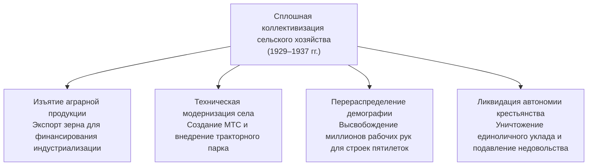
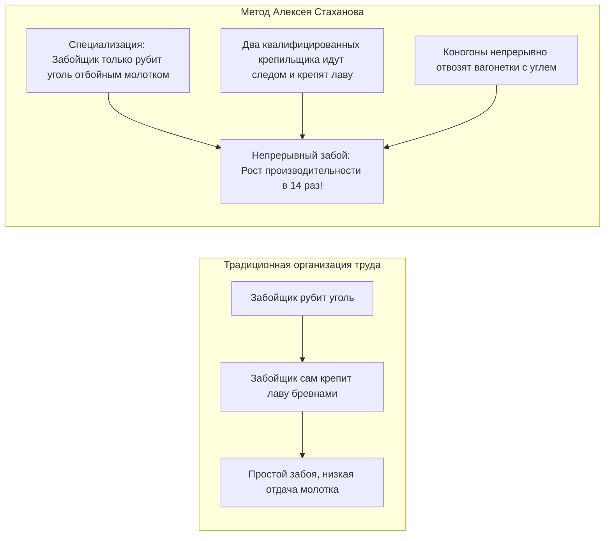
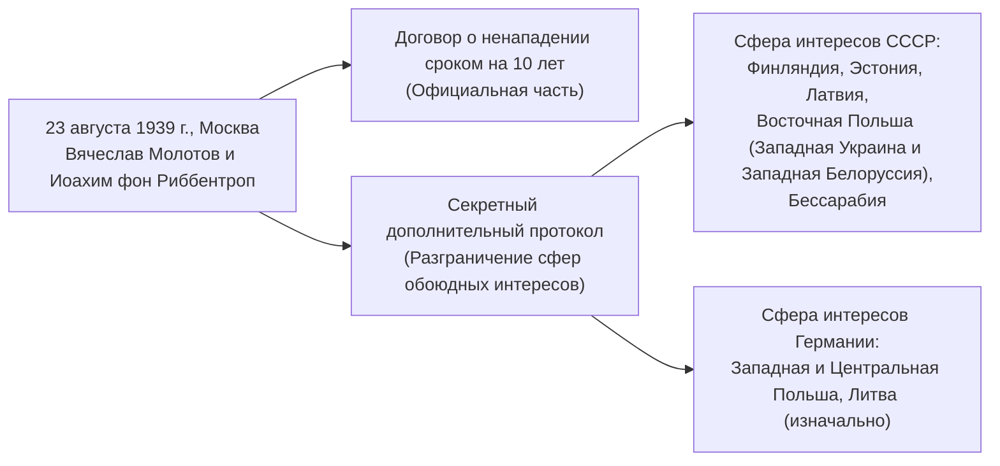
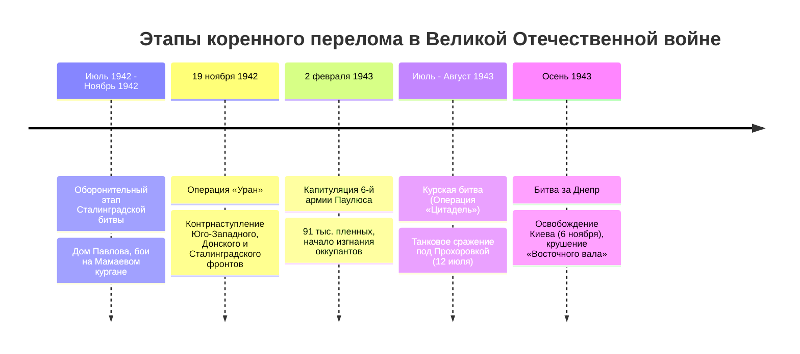

# Дисциплина: История России (Лекция 5)

**Преподаватель:** Карпенкина Янина Валерьевна, кандидат исторических наук, доцент  
**ВУЗ:** Московский технический университет связи и информатики (МТУСИ)  
**Подразделение:** Центр заочного обучения по программам бакалавриата  
**Группа:** БСТ2556  
**Курс / Семестр:** 2 курс, 3 семестр  
**Специальность:** 09.03.02 Информационные системы и технологии  
**Профиль:** Инженерия DevSecOps  
**Дата лекции:** 18 сентября 2026 года  
**Исходный видеофайл:** `История лекция 18.09.mp4`  
**Продолжительность:** 3 часа 15 минут 38 секунд (11738 сек.)  
**Текст транскрипции:** [lecture-05-transcript.txt](./transcripts/lecture-05-transcript.txt)

---

## 📑 Оглавление

1. [Введение и завершение темы коллективизации [00:00:00 - 00:25:00]](#1-введение-и-завершение-темы-коллективизации-000000---002500)
   - 1.1. [Цели и методы сплошной коллективизации](#11-цели-и-методы-сплошной-коллективизации)
   - 1.2. [Механизация села (МТС) и хлебозаготовки](#12-механизация-села-мтс-и-хлебозаготовки)
   - 1.3. [Социальная ломка: раскулачивание, паспортизация 1932 г. и исход в города](#13-социальная-ломка-раскулачивание-паспортизация-1932-г-и-исход-в-города)
2. [Индустриализация и феномен Стахановского движения [00:25:00 - 01:00:00]](#2-индустриализация-и-феномен-стахановского-движения-002500---010000)
   - 2.1. [Первые пятилетки и форсированное создание тяжелой индустрии](#21-первые-пятилетки-и-форсированное-создание-тяжелой-индустрии)
   - 2.2. [Рекорд Алексея Стаханова (август 1935 г.): технологическая суть новации](#22-рекорд-алексея-стаханова-август-1935-г-технологическая-суть-новации)
   - 2.3. [Отраслевое масштабирование движения (Виноградовы, Кривонос, Ангелина, Мазай)](#23-отраслевое-масштабирование-движения-виноградовы-кривонос-ангелина-мазай)
   - 2.4. [Социальные последствия: стахановская элита, пересмотр норм и рабочая среда](#24-социальные-последствия-стахановская-элита-пересмотр-норм-и-рабочая-среда)
   - 2.5. [Историографический ракурс: исследование Сета Бернстейна «Воспитанные при Сталине»](#25-историографический-ракурс-исследование-сета-бернстейна-воспитанные-при-сталине)
3. [«Сталинская» Конституция 1936 г. и общественно-политическая жизнь [01:00:00 - 01:15:00]](#3-сталинская-конституция-1936-г-и-общественно-политическая-жизнь-010000---011500)
   - 3.1. [Разработка и провозглашение «победы социализма в основном»](#31-разработка-и-провозглашение-победы-социализма-в-основном)
   - 3.2. [Конституционные инновации: всеобщее прямое избирательное право и социальные гарантии](#32-конституционные-инновации-всеобщее-прямое-избирательное-право-и-социальные-гарантии)
   - 3.3. [Драматический дуализм: демократический фасад и «Большой террор» (1937–1938 гг.)](#33-драматический-дуализм-демократический-фасад-и-большой-террор-19371938-гг)
4. [СССР и международный кризис накануне Второй мировой войны [01:15:00 - 01:50:00]](#4-ссср-и-международный-кризис-накануне-второй-мировой-войны-011500---015000)
   - 4.1. [Крах версальско-вашингтонской системы и Мюнхенский сговор 1938 г.](#41-крах-версальско-вашингтонской-системы-и-мюнхенский-сговор-1938-г)
   - 4.2. [Пакт Молотова — Риббентропа (23 августа 1939 г.) и Секретный дополнительный протокол](#42-пакт-молотова--риббентропа-23-августа-1939-г-и-секретный-дополнительный-протокол)
   - 4.3. [Начало Второй мировой войны и Польский поход РККА (сентябрь 1939 г.)](#43-начало-второй-мировой-войны-и-польский-поход-ркка-сентябрь-1939-г)
   - 4.4. [Советско-финляндская («Зимняя») война (1939–1940 гг.) и расширение границ СССР](#44-советско-финляндская-зимняя-война-19391940-гг-и-расширение-границ-ссср)
5. [Великая Отечественная война (1941–1945 гг.): фронт, тыл и стратегические битвы [01:50:00 - 02:30:00]](#5-великая-отечественная-война-19411945-гг-фронт-тыл-и-стратегические-битвы-015000---023000)
   - 5.1. [Внезапное нападение 22 июня 1941 г., план «Барбаросса» и трагедия первых месяцев](#51-внезапное-нападение-22-июня-1941-г-план-барбаросса-и-трагедия-первых-месяцев)
   - 5.2. [Беспрецедентная эвакуация индустрии на Восток и перестройка тыла](#52-беспрецедентная-эвакуация-индустрии-на-восток-и-перестройка-тыла)
   - 5.3. [Битва за Москву (1941–1942 гг.): крушение мифа о непобедимости вермахта](#53-битва-за-москву-19411942-гг-крушение-мифа-о-непобедимости-вермахта)
   - 5.4. [Коренной перелом: Сталинградская битва (1942–1943) и Огненная дуга под Курском (1943)](#54-коренной-перелом-сталинградская-битва-19421943-и-огненная-дуга-под-курском-1943)
   - 5.5. [Антигитлеровская коалиция, Тегеранская конференция (1943) и программа ленд-лиза](#55-антигитлеровская-коалиция-тегеранская-конференция-1943-и-программа-ленд-лиза)
6. [Освобождение Европы, разгром агрессоров и послевоенное устройство мира [02:30:00 - 03:15:38]](#6-освобождение-европы-разгром-агрессоров-и-послевоенное-устройство-мира-023000---031538)
   - 6.1. [Освободительная миссия РККА (1944–1945 гг.) и открытие Второго фронта](#61-освободительная-миссия-ркка-19441945-гг-и-открытие-второго-фронта)
   - 6.2. [Ялтинско-Потсдамская система: принципы «4Д», границы и учреждение ООН](#62-ялтинско-потсдамская-система-принципы-4д-границы-и-учреждение-оон)
   - 6.3. [Взятие Берлина, капитуляция Германии и разгром милитаристской Японии](#63-взятие-берлина-капитуляция-германии-и-разгром-милитаристской-японии)
   - 6.4. [Истоки Холодной войны: Фултонская речь У. Черчилля (1946), «железный занавес», НАТО и ОВД](#64-истоки-холодной-войны-фултонская-речь-у-черчилля-1946-железный-занавес-нато-и-овд)
7. [Хронологический справочник важнейших дат и событий (1929–1949 гг.)](#7-хронологический-справочник-важнейших-дат-и-событий-19291949-гг)
8. [Контрольные вопросы для дифференцированного зачета](#8-контрольные-вопросы-для-дифференцированного-зачета)

---

## 1. Введение и завершение темы коллективизации [00:00:00 - 00:25:00]

Лекция к.и.н., доцента Янины Валерьевны Карпенкиной логически продолжает курс отечественной истории 1930–1940-х годов, связывая воедино социально-экономические трансформации предвоенного СССР, величайшее испытание в истории страны — Великую Отечественную войну — и формирование послевоенного биполярного миропорядка.

### 1.1. Цели и методы сплошной коллективизации

В соответствии с советской доктриной модернизации, коллективизация решала комплекс стратегических задач:
1. **Экономическая:** превращение аграрного сектора в бесплатный источник накоплений для форсированного импорта западного промышленного оборудования, станков и технологий.
2. **Организационная:** переход от 25 миллионов раздробленных мелких крестьянских хозяйств к крупным механизированным производственным единицам — колхозам (коллективным хозяйствам) и совхозам (государственным хозяйствам).
3. **Демографическая:** выталкивание избыточного аграрного населения в города для обеспечения рабочей силой металлургических гигантов, угольных бассейнов и машиностроительных заводов.
4. **Идеологическая и политическая:** установление прямого партийно-государственного контроля над деревней, ликвидация кулачества как потенциальной базы сопротивления советской власти.

---

### 1.2. Механизация села (МТС) и хлебозаготовки

Ключевым звеном аграрной модернизации стали **Машинно-тракторные станции (МТС)** — государственные предприятия, сосредоточившие в своих руках сложную сельскохозяйственную технику (тракторы, комбайны, молотилки).
- Колхозы не владели тяжелой техникой, а арендовали ее у МТС, расплачиваясь натуральной оплатой — зерном и продуктами (**натуроплата**).
- МТС выполняли не только производственную, но и контрольно-политическую функцию: созданные при них политотделы МТС жестко контролировали выполнение планов обязательных государственных поставок зерна по твердым государственным заниженным ценам.

---

### 1.3. Социальная ломка: раскулачивание, паспортизация 1932 г. и исход в города

Коллективизация сопровождалась масштабной социальной инженерией и насилием:
- **Ликвидация кулачества как класса («раскулачивание»):** дифференциация зажиточных и сопротивляющихся крестьян на 3 категории (изоляция/расстрел контрреволюционного актива, высылка в отдаленные районы Севера и Сибири на спецпоселения, расселение на худших землях в пределах своего района).
- **Трагедия голода 1932–1933 гг.:** чрезмерные хлебозаготовки в зерновых регионах (Украинская ССР, Северный Кавказ, Поволжье, Южный Урал, Казахстан) привели к массовой смертности от голода.
- **Введение единой паспортной системы (декабрь 1932 г.):** паспорта выдавались жителям городов, рабочих поселков и новостроек. Колхозники паспортов не получали и фактически прикреплялись к месту проживания и работы в колхозе (покинуть деревню разрешалось лишь по организованному набору («оргнабор») на стройки пятилеток или при поступлении в вузы/техникумы).

---

## 2. Индустриализация и феномен Стахановского движения [00:25:00 - 01:00:00]

### 2.1. Первые пятилетки и форсированное создание тяжелой индустрии

Индустриализация в СССР разворачивалась под лозунгом И.В. Сталина: *«Мы отстали от передовых стран на 50–100 лет. Мы должны пробежать это расстояние в десять лет. Либо мы сделаем это, либо нас сомнут»* (февраль 1931 г.).

| Пятилетний план | Хронология | Приоритеты и ключевые объекты | Исторический результат |
| :--- | :---: | :--- | :--- |
| **Первая пятилетка** | 1928/29 – 1932 гг. | Тяжелая промышленность группы «А»: металлургия, энергетика, уголь, базовое машиностроение. Объекты: ДнепроГЭС, Магнитогорский и Кузнецкий меткомбинаты, Сталинградский и Харьковский тракторные, автозаводы ГАЗ и ЗИС. | Создание базового скелета тяжелой индустрии. Выполнена за 4 года и 3 месяца (по официальным данным). |
| **Вторая пятилетка** | 1933 – 1937 гг. | Освоение новой техники, авиастроение, танкостроение, химическая индустрия, транспорт (Московский метрополитен, Беломорско-Балтийский канал, канал Москва — Волга). Объекты: Уралмаш, Запорожсталь, Азовсталь. | Ликвидация технико-экономической зависимости от Запада. СССР вышел на 2-е место в мире и 1-е в Европе по объему промышленного производства. |

---

### 2.2. Рекорд Алексея Стаханова (август 1935 г.): технологическая суть новации

В ночь с **30 на 31 августа 1935 года** на шахте «Центральная-Ирмино» (поселок Кадиевка, Донбасс) забойщик **Алексей Стаханов** установил рекорд, добыв за 5 часов 45 минут **102 тонны угля**, перекрыв норму выработки в 14 раз (норма составляла 7 тонн).

> **Исторический вывод лектора:** Рекорд Стаханова не был простым физическим перенапряжением сил одного человека. Это была **продуманная организационно-инженерная рационализация труда**: переход от архаичного совмещения всех операций одним горняком к четкому конвейерному разделению функций между забойщиком, крепильщиками и откатчиками.

---

### 2.3. Отраслевое масштабирование движения (Виноградовы, Кривонос, Ангелина, Мазай)

Советское руководство мгновенно превратило единичный почин во всесоюзное массовое движение за овладение новой техникой и повышение производительности труда:

- **Текстильная промышленность:** Ткачихи **Евдокия и Мария Виноградовы** (фабрика им. Ногина, Вичуга) перешли на обслуживание сначала 100, затем 144 и 216 автоматических ткацких станков одновременно.
- **Железнодорожный транспорт:** Машинист **Петр Кривонос** (депо Славянск) применил метод форсированной тяги паровоза, увеличив техническую скорость грузовых составов в два раза за счет поддержания повышенного давления пара.
- **Сельское хозяйство:** **Паша (Прасковья) Ангелина** организовала первую женскую тракторную бригаду в Старобешевской МТС, перевыполнявшую нормы вспашки в несколько раз и сломавшую стереотип о «неженской» технической профессии.
- **Черная металлургия:** Сталевар Мариупольского завода им. Ильича **Макар Мазай** установил мировой рекорд съема стали с одного квадратного метра пода мартеновской печи благодаря изменению конструкции свода печи.

---

### 2.4. Социальные последствия: стахановская элита, пересмотр норм и рабочая среда

Стахановское движение породило сложный комплекс социально-экономических явлений:
1. **Формирование «рабочей аристократии»:** Стахановцы получали колоссальные по советским меркам заработки (до 1500–2000 рублей в месяц при средней зарплате 150–200 рублей), путевки в санатории, ордена Ленина и Трудового Красного Знамени, отдельные благоустроенные квартиры, автомобили и патефоны.
2. **Пересмотр технических норм выработки:** Опираясь на рекорды передовиков, наркоматы в 1936–1937 гг. повысили общие нормы выработки на 15–30%, что привело к снижению расценок за единицу продукции для основной массы рабочих.
3. **Напряженность и конфликты на производстве:** Рядовые рабочие нередко встречали стахановцев с глухим раздражением («из-за вас подняли нормы»), имели место случаи саботажа, порчи инструмента передовиков и физических столкновений.

---

### 2.5. Историографический ракурс: исследование Сета Бернстейна «Воспитанные при Сталине»

Лектор обращает особое внимание на монографию американского историка **Сета Бернстейна** (Seth Bernstein) *«Воспитанные при Сталине: комсомольцы и защита социализма»* (серия «История сталинизма»):
- Книга исследует первое поколение советских людей, родившихся и сформировавшихся исключительно при советской власти.
- Молодые люди 1930-х годов искренне воспринимали индустриализацию, ударный труд и комсомольские призывы как личное участие в построении справедливого будущего.
- Именно эта идеологическая убежденность, дисциплина и военизированная подготовка комсомольцев 1930-х годов обеспечили тот человеческий ресурс стойкости, который в 1941 году выдержал сокрушительный удар нацистской военной машины.

---

## 3. «Сталинская» Конституция 1936 г. и общественно-политическая жизнь [01:00:00 - 01:15:00]

### 3.1. Разработка и провозглашение «победы социализма в основном»

**5 декабря 1936 года** Чрезвычайный VIII Всесоюзный съезд Советов утвердил новую Конституцию СССР (день 5 декабря стал государственным праздником).
- Председателем Конституционной комиссии формально являлся И.В. Сталин, однако ключевые разделы и либеральные формулировки разрабатывались под руководством **Н.И. Бухарина** и **К.Б. Радека**.
- Главный идеологический постулат: в СССР *«социализм победил в основном»* — уничтожена частная собственность на средства производства, ликвидированы эксплуататорские классы, сформировалось бесклассовое общество двух дружественных классов (рабочих и колхозного крестьянства) и социальной прослойки (народной интеллигенции).

---

### 3.2. Конституционные инновации: всеобщее прямое избирательное право и социальные гарантии

Конституция 1936 года юридически зафиксировала передовые для своего времени стандарты прав и свобод:

| Направление | Содержание конституционных норм |
| :--- | :--- |
| **Избирательная система** | Переход от многоступенчатых и неравных выборов (где голос 1 рабочего приравнивался к 5 голосам крестьян) к **всеобщим, равным и прямым выборам при тайном голосовании**. Полная отмена категории «лишенцев» (бывших дворян, священнослужителей, офицеров, кулаков). |
| **Органы государственной власти** | Высшим органом государственной власти объявлялся **Верховный Совет СССР** (состоящий из Совета Союза и Совета Национальностей), избиравший Президиум ВС СССР и утверждавший правительство — Совет Народных Комиссаров (СНК). |
| **Социально-экономические права** | Гарантированное право на **труд** (с ликвидацией безработицы), право на **отдых** (7-часовой рабочий день), **материальное обеспечение в старости, при болезни и потере трудоспособности**, право на **бесплатное образование** и медицинскую помощь. |
| **Гражданские свободы** | Декларация свободы совести, слова, печати, собраний и митингов, неприкосновенности личности, жилища и тайны личной переписки. |

---

### 3.3. Драматический дуализм: демократический фасад и «Большой террор» (1937–1938 гг.)

Исторический парадокс эпохи заключался в непреодолимой пропасти между конституционными декларациями и реальной правоприменительной практикой:
- Буквально через несколько месяцев после принятия «самой демократической конституции в мире» в стране развернулась кампания массовых репрессий — **«Большой террор» (1937–1938 гг.)**.
- Оперативный приказ НКВД СССР **№ 00447** (июль 1937 г.) установил директивные «лимиты» на расстрелы (1-я категория) и заключение в лагеря ГУЛАГа (2-я категория).
- Судебная система была фактически подменена внесудебными органами — **«тройками» НКВД**, Военной коллегией Верховного суда и Особыми совещаниями.
- Репрессии обрушились на партийно-государственную элиту (Московские показательные процессы над «левой» и «правой» оппозицией, казнь Бухарина, Рыкова, Зиновьева, Каменева), деятелей культуры, рядовых граждан и командный состав РККА (дело маршала М.Н. Тухачевского, ликвидация значительной части высшего офицерства накануне войны).

---

## 4. СССР и международный кризис накануне Второй мировой войны [01:15:00 - 01:50:00]

### 4.1. Крах версальско-вашингтонской системы и Мюнхенский сговор 1938 г.

В 1930-е годы миропорядок стремительно деградировал под натиском ревизионистских держав (Германия, Италия, Япония):
- 1931–1932 гг. — захват Японией Маньчжурии;
- 1935 г. — агрессия фашистской Италии против Эфиопии, ремилитаризация Рейнской зоны Гитлером;
- 1936–1939 гг. — Гражданская война в Испании, оформление «Оси Берлин — Рим — Токио» (Антикоминтерновский пакт);
- Март 1938 г. — аншлюс Австрии;
- **Сентябрь 1938 г. — Мюнхенское соглашение («Мюнхенский сговор»):** лидеры Великобритании (Чемберлен) и Франции (Даладье) в рамках политики «умиротворения агрессора» отдали Гитлеру Судетскую область Чехословакии в обмен на обещание мира. СССР к переговорам допущен не был.

Советские дипломатические попытки создать **систему коллективной безопасности** в Европе (нарком иностранных дел М.М. Литвинов) потерпели фиаско. Провал Московских англо-франко-советских военных переговоров в августе 1939 года убедил советское руководство в нежелании западных демократий заключать реальный обязывающий антигитлеровский союз.

---

### 4.2. Пакт Молотова — Риббентропа (23 августа 1939 г.) и Секретный дополнительный протокол

Оказавшись перед угрозой войны на два фронта (в Европе против Германии и на Дальнем Востоке против Японии, где в мае — августе 1939 г. шли тяжелые бои на реке Халхин-Гол), советское руководство пошло на сближение с Берлином.

> **Историческая оценка договора:**  
> - *Для СССР:* Пакт позволил отсрочить начало неизбежного столкновения с Германией почти на два года (22 месяца), избежать изоляции и войны на два фронта, а также отодвинуть западную стратегическую границу на сотни километров вглубь Европы.  
> - *Для Германии:* Гитлер обезопасил свой восточный фланг и получил свободу рук для разгрома Польши, а затем Франции и Великобритании.

---

### 4.3. Начало Второй мировой войны и Польский поход РККА (сентябрь 1939 г.)

- **1 сентября 1939 года:** Нападение Германии на Польшу. Начало Второй мировой войны (Великобритания и Франция объявили войну Германии 3 сентября).
- **17 сентября 1939 года:** После распада польского государства и бегства правительства за границу части Красной армии перешли советско-польскую границу (**Освободительный поход РККА**).
- Земли Западной Украины и Западной Белоруссии, отторгнутые Польшей по Рижскому мирному договору 1921 года, были воссоединены с УССР и БССР.
- **28 сентября 1939 года:** Подписание Договора о дружбе и границе между СССР и Германией, зафиксировавшего новую демаркационную линию по рекам Нарев — Висла — Сан (с передачей Литвы в советскую сферу влияния).

---

### 4.4. Советско-финляндская («Зимняя») война (1939–1940 гг.) и расширение границ СССР

Советско-финский вооруженный конфликт продолжался со **ноября 1939 по март 1940 года** (105 дней):
- **Причина:** отказ правительства Финляндии отодвинуть границу от Ленинграда (проходившую всего в 32 км от города) на Карельском перешейке в обмен на территориальные уступки в советской Карелии, а также сдать в аренду полуостров Ханко под советскую военно-морскую базу.
- **Ход военных действий:** тяжелые бои в условиях суровой зимы, упорное сопротивление финской армии на укрепленной «линии Маннергейма». Ценой огромных потерь (более 126 тыс. погибших советских бойцов) оборона была прорвана в феврале 1940 г.
- **Итоги:** Московский мирный договор (12 марта 1940 г.) — граница отодвинута на 120–130 км от Ленинграда, к СССР отошел весь Карельский перешеек с Выборгом, ряд островов в Финском заливе и база Ханко.
- **Геополитические последствия:** СССР был исключен из Лиги Наций (декабрь 1939 г.). Выявившиеся недостатки в управлении и подготовке РККА подтолкнули нацистское командование к убеждению в слабости советской армии («колосс на глиняных ногах»).
- **Лето 1940 года:** мирное вхождение в состав СССР трех прибалтийских республик (Эстония, Латвия, Литва) и возврат Бессарабии и Северной Буковины от Румынии.

---

## 5. Великая Отечественная война (1941–1945 гг.): фронт, тыл и стратегические битвы [01:50:00 - 02:30:00]

### 5.1. Внезапное нападение 22 июня 1941 г., план «Барбаросса» и трагедия первых месяцев

На рассвете **22 июня 1941 года** нацистская Германия и ее сателлиты (Румыния, Венгрия, Финляндия, Италия) без объявления войны вторглись на территорию СССР:
- Немецкий стратегический план **«Барбаросса»** предполагал молниеносный разгром Красной армии за 8–10 недель («блицкриг») силами трех мощных групп армий («Север» — на Ленинград, «Центр» — на Москву, «Юг» — на Киев и Донбасс) с выходом на линию «Волга — Архангельск» (линия «А — А»).
- В первые недели войны советские войска понесли катастрофические потери: сотни тысяч бойцов попали в окружение («котлы» под Белостоком, Минском, Уманью, Киевом, Вязьмой), враг захватил Прибалтику, Белоруссию, Молдавию, значительную часть Украины и заблокировал Ленинград (начало **блокады Ленинграда** 8 сентября 1941 г., длившейся 872 дня).

---

### 5.2. Беспрецедентная эвакуация индустрии на Восток и перестройка тыла

В кратчайшие сроки страна была превращена в единый военный лагерь:
- **30 июня 1941 г.** создан чрезвычайный высший орган руководства — **Государственный Комитет Обороны (ГКО)** во главе с И.В. Сталиным.
- Под руководством Совета по эвакуации (Н.М. Шверник, А.Н. Косыгин) во второй половине 1941 года на восток (Поволжье, Урал, Западная Сибирь, Средняя Азия) по железным дорогам было перемещено более **1500 крупных промышленных предприятий** и свыше 10 миллионов человек.
- Заводы монтировались буквально под открытым небом на морозе и уже через несколько недель давали фронту танки Т-34, штурмовики Ил-2, реактивные минометы «Катюша» и боеприпасы.

---

### 5.3. Битва за Москву (1941–1942 гг.): крушение мифа о непобедимости вермахта

- Немецкая операция по захвату советской столицы носила кодовое наименование **«Тайфун»** (началась 30 сентября 1941 г.).
- **7 ноября 1941 года:** на Красной площади в осажденной Москве состоялся легендарный военный парад, с которого полки шли прямо на передовую. Парад имел колоссальное психологическое значение для страны и мира.
- **5–6 декабря 1941 года:** войска Западного фронта (командующий — генерал армии **Г.К. Жуков**) и Калининского фронта (И.С. Конев) перешли в масштабное контрнаступление.
- Враг был отброшен от стен столицы на 100–250 км на запад. Был окончательно похоронен гитлеровский план «молниеносной войны», развеян миф о непобедимости германской армии.

---

### 5.4. Коренной перелом: Сталинградская битва (1942–1943) и Огненная дуга под Курском (1943)

1. **Сталинградская битва (17 июля 1942 — 2 февраля 1943 г.):**
   - Величайшее сражение мировой истории на берегах Волги. В ходе операции «Уран» была окружена 330-тысячная группировка фельдмаршала Ф. Паулюса. Разгром немецких, румынских и итальянских армий положил начало **коренному перелому** во Второй мировой войне.
2. **Курская битва (5 июля — 23 августа 1943 г.):**
   - Попытка реванша вермахта (план «Цитадель») с применением новейшей бронетехники («Тигры», «Пантеры», «Фердинанды»).
   - Крупнейшее в истории танковое сражение под **Прохоровкой** (12 июля 1943 г.). Освобождение Орла и Белгорода (в честь чего 5 августа 1943 г. в Москве прозвучал первый победный артиллерийский салют). После Курска Германия окончательно утратила стратегическую инициативу и перешла к глухой обороне.

---

### 5.5. Антигитлеровская коалиция, Тегеранская конференция (1943) и программа ленд-лиза

- **Ленд-лиз (Lend-Lease Act):** Государственная программа поставок вооружения, боеприпасов, стратегического сырья (алюминий, медь), промышленного оборудования, автомобилей («Студебеккеры») и продовольствия (тушенка) из США и Великобритании в СССР по северным конвоям, через Иран и Дальний Восток (АЛСИБ).
- **Тегеранская конференция (28 ноября — 1 декабря 1943 г.):** Первая встреча лидеров «Большой тройки» — **И.В. Сталина**, **Ф.Д. Рузвельта** и **У. Черчилля**. Принято принципиальное решение об открытии Второго фронта во Франции в мае 1944 г. и согласованы контуры послевоенного устройства мира.

---

## 6. Освобождение Европы, разгром агрессоров и послевоенное устройство мира [02:30:00 - 03:15:38]

### 6.1. Освободительная миссия РККА (1944–1945 гг.) и открытие Второго фронта

- **1944 год — «Год десяти сталинских ударов»:**
  - Полное снятие блокады Ленинграда (январь);
  - Освобождение Правобережной Украины и Крыма (весна);
  - **Операция «Багратион» (июнь — август 1944 г.):** грандиозный разгром немецкой группы армий «Центр», полное освобождение Белоруссии, части Прибалтики и Польши;
  - Ясско-Кишиневская операция (август) и вывод из войны Румынии и Болгарии.
- **6 июня 1944 г. — Открытие Второго фронта:** Высадка англо-американских войск в Нормандии (Северная Франция) — операция **«Оверлорд»**.

---

### 6.2. Ялтинско-Потсдамская система: принципы «4Д», границы и учреждение ООН

Контуры послевоенного мира определялись на двух исторических конференциях лидеров коалиции:

| Параметр | Крымская (Ялтинская) конференция (4–11 февраля 1945 г.) | Потсдамская конференция (17 июля – 2 августа 1945 г.) |
| :--- | :--- | :--- |
| **Участники** | И.В. Сталин (СССР), Ф.Д. Рузвельт (США), У. Черчилль (Великобритания). | И.В. Сталин (СССР), Г. Трумэн (США), У. Черчилль / К. Эттли (Великобритания). |
| **Судьба Германии** | Разделение на 4 зоны оккупации (советскую, американскую, английскую, французскую) и Берлина на 4 сектора. Репарации в натуре. | Утверждение программы «4Д»: **Демилитаризация** (ликвидация армии), **Денацификация** (запрет НСДАП, трибунал над военными преступниками), **Декартелизация** (роспуск монополий), **Демократизация** общественной жизни. |
| **Территориальный вопрос** | Новые границы Польши: восточная — по «линии Керзона», западная — по рекам Одер и Нейсе. Передача СССР города Кенигсберга с прилегающим районом (будущая Калининградская область). | Подтверждение польско-германской границы, передача Кенигсберга СССР. Установление суммы репараций. |
| **Международная безопасность** | Решение о созыве учредительной конференции по созданию **Организации Объединенных Наций (ООН)** с правом вето постоянных членов Совета Безопасности. | Создание Совета министров иностранных дел для подготовки мирных договоров. Учреждение Международного военного трибунала в Нюрнберге. |
| **Война с Японией** | Обязательство СССР вступить в войну против Японии через 2–3 месяца после разгрома Германии в обмен на возврат Южного Сахалина и Курильских островов. | Потсдамская декларация с требованием безоговорочной капитуляции Японии. |

---

### 6.3. Взятие Берлина, капитуляция Германии и разгром милитаристской Японии

- **Берлинская наступательная операция (16 апреля — 8 мая 1945 г.):** войска 1-го Белорусского (Г.К. Жуков), 1-го Украинского (И.С. Конев) и 2-го Белорусского (К.К. Рокоссовский) фронтов взломали Зееловские высоты и штурмом овладели столицей Рейха. **30 апреля** над Рейхстагом водружено Знамя Победы (М. Егоров, М. Кантария, А. Берест).
- **Полночь 8 на 9 мая 1945 г. (Карлсхорст):** Маршал Г.К. Жуков от имени СССР принял Акт о безоговорочной капитуляции германских вооруженных сил.
- **24 июня 1945 г.:** Парад Победы на Красной площади в Москве.
- **Август 1945 г. — Маньчжурская операция:** Во исполнение ялтинских обязательств советские войска под командованием маршала А.М. Василевского за 24 дня наголову разгромили миллионную Квантунскую армию Японии.
- **2 сентября 1945 г.:** На борту американского линкора «Миссури» подписан Акт о безоговорочной капитуляции Японии. Окончание Второй мировой войны.

---

### 6.4. Истоки Холодной войны: Фултонская речь У. Черчилля (1946), «железный занавес», НАТО и ОВД

После общей победы противоречия между союзниками быстро переросли в глобальное военно-политическое и идеологическое противостояние:
- **5 марта 1946 года:** Речь У. Черчилля в колледже г. Фултон (США, штат Миссури) в присутствии президента Г. Трумэна:
  > *«От Штеттина на Балтике до Триеста на Адриатике железный занавес опустился поперек континента...»*
- **Факторы раскола:**
  1. Монополия США на ядерное оружие (август 1945 г. — Хиросима и Нагасаки);
  2. Доктрина Трумэна (сдерживание коммунизма) и План Маршалла по экономической привязке Западной Европы к США;
  3. Советизация стран Восточной Европы (создание «социалистического лагеря»);
  4. Первый Берлинский кризис (1948–1949 гг.) и блокада Западного Берлина.
- **Институциональное оформление биполярного мира:**
  - **1949 год:** Раскол Германии на **ФРГ** (Западная Германия, май 1949 г.) и **ГДР** (Восточная Германия, октябрь 1949 г.).
  - **4 апреля 1949 г.:** Создание Североатлантического альянса (**НАТО**) во главе с США.
  - **Август 1949 г.:** Успешное испытание первой советской атомной бомбы РДС-1 (ликвидация ядерной монополии США).
  - **14 мая 1955 г.:** Создание военного союза социалистических государств — **Организации Варшавского договора (ОВД)** в ответ на вступление ФРГ в НАТО.

---

## 7. Хронологический справочник важнейших дат и событий (1929–1949 гг.)

| Дата / Год | Историческое событие | Значение и последствия |
| :--- | :--- | :--- |
| **Ноябрь 1929 г.** | Статья И.В. Сталина «Год великого перелома» | Курс на форсированную индустриализацию и сплошную коллективизацию. |
| **Декабрь 1932 г.** | Введение единой паспортной системы в СССР | Разделение населения на горожан и беспаспортных колхозников. |
| **30–31 августа 1935 г.** | Шахтерский рекорд Алексея Стаханова (102 т угля) | Зарождение всесоюзного Стахановского движения за повышение производительности. |
| **5 декабря 1936 г.** | Принятие VIII съездом Советов новой Конституции СССР | Декларация победы социализма, введение всеобщих прямых выборов. |
| **1937–1938 гг.** | Пик массовых политических репрессий («Большой террор») | Приказ № 00447, репрессии против комсостава РККА и партийной оппозиции. |
| **23 августа 1939 г.** | Пакт Молотова — Риббентропа и Секретный протокол | Договор о ненападении с Германией, разграничение сфер интересов в Восточной Европе. |
| **1 сентября 1939 г.** | Нападение Германии на Польшу | Начало Второй мировой войны. |
| **17 сентября 1939 г.** | Освободительный поход РККА в Западную Украину и Белоруссию | Воссоединение белорусских и украинских земель в составе СССР. |
| **30 нояб. 1939 – 12 мар. 1940 г.** | Советско-финляндская («Зимняя») война | Прорыв линии Маннергейма, перенос границы от Ленинграда, исключение из Лиги Наций. |
| **22 июня 1941 г.** | Нападение нацистской Германии на СССР | Начало Великой Отечественной войны, реализация плана «Барбаросса». |
| **5–6 декабря 1941 г.** | Контрнаступление Красной армии под Москвой | Первое стратегическое поражение вермахта, крах гитлеровского «блицкрига». |
| **19 нояб. 1942 – 2 февр. 1943 г.** | Контрнаступление под Сталинградом (операция «Уран») | Окружение армии Паулюса, начало коренного перелома в войне. |
| **5 июля – 23 августа 1943 г.** | Курская битва и танковое сражение под Прохоровкой | Завершение коренного перелома, переход стратегической инициативы к СССР. |
| **28 нояб. – 1 дек. 1943 г.** | Тегеранская конференция лидеров «Большой тройки» | Встреча Сталина, Рузвельта и Черчилля, решение об открытии Второго фронта. |
| **Июнь – август 1944 г.** | Белорусская наступательная операция («Багратион») | Разгром группы армий «Центр», освобождение Белоруссии, Литвы и востока Польши. |
| **4–11 февраля 1945 г.** | Крымская (Ялтинская) конференция лидеров союзников | Согласование условий капитуляции Германии, зон оккупации и созыва ООН. |
| **16 апр. – 8 мая 1945 г.** | Берлинская наступательная операция | Штурм Берлина, водружение Знамени Победы над Рейхстагом. |
| **8–9 мая 1945 г.** | Подписание Акта о безоговорочной капитуляции Германии | Победоносное завершение Великой Отечественной войны. День Победы. |
| **17 июля – 2 августа 1945 г.** | Потсдамская конференция «Большой тройки» | Программа «4Д», утверждение послевоенных границ в Европе. |
| **2 сентября 1945 г.** | Капитуляция Японии на линкоре «Миссури» | Окончание Второй мировой войны. |
| **5 марта 1946 г.** | Фултонская речь Уинстона Черчилля | Символическое начало Холодной войны, метафора «железного занавеса». |
| **1949 г.** | Создание НАТО (апрель), раскол Германии (ФРГ/ГДР), атомная бомба СССР (август) | Окончательное институциональное оформление биполярного мира. |

---

## 8. Контрольные вопросы для дифференцированного зачета

1. В чем заключались главные экономические и социально-политические цели сплошной коллективизации сельского хозяйства в СССР?
2. Какова была технологическая сущность рекорда Алексея Стаханова, и чем метод Стаханова отличался от простого интенсификации физического труда?
3. В чем заключался фундаментальный парадокс Конституции СССР 1936 года и общественно-политической практики периода 1937–1938 гг.?
4. Охарактеризуйте геополитические причины и исторические последствия подписания Пакта Молотова — Риббентропа от 23 августа 1939 г.
5. Каковы были военно-стратегические и внешнеполитические итоги Советско-финляндской («Зимней») войны 1939–1940 гг.?
6. Какие сражения Великой Отечественной войны сформировали этап коренного перелома, и в чем выразилось изменение стратегической обстановки на фронтах?
7. Какую роль в победе антигитлеровской коалиции сыграла военно-экономическая помощь по программе ленд-лиза?
8. Раскройте содержание программы «Четырех Д» в отношении послевоенной Германии, выработанной на Потсдамской конференции 1945 года.
9. Какие события 1945–1949 гг. знаменовали переход от союзнического сотрудничества держав Антигитлеровской коалиции к глобальной Холодной войне?
