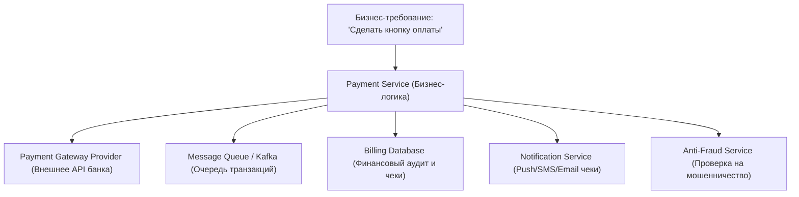
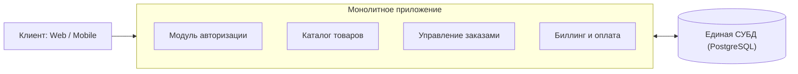
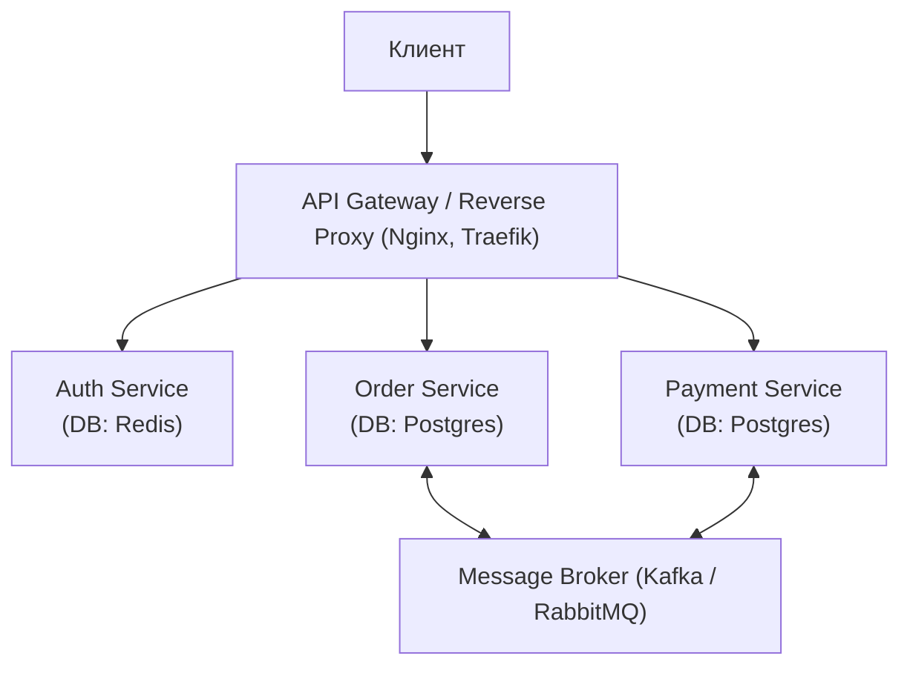
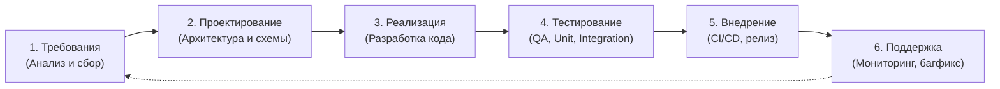
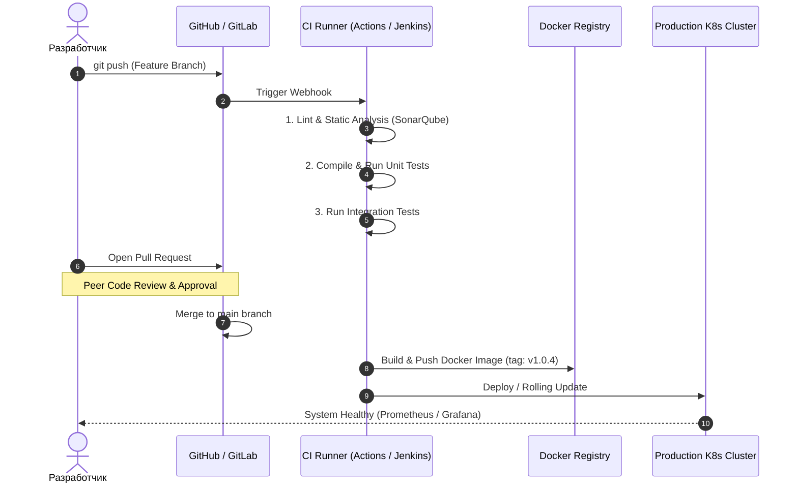

# 💻 Лекция №1: Введение в программную инженерию, архитектурные парадигмы и жизненный цикл ПО

> **Дисциплина:** Программная инженерия  
> **Университет:** МТУСИ (Центр заочного обучения по программам бакалавриата)  
> **Направление:** 09.03.02 «Информационные системы и технологии» (Профиль: Инженерия DevSecOps)  
> **Семестр:** 3 семестр (2 курс)  
> **Дата лекции:** 16 сентября 2026 г.  
> **Преподаватель:** Антон Водиченков (кафедра «Программная инженерия» МТУСИ, действующий Senior/Middle+ Java-разработчик и DevOps-инженер)  
> **Исходный видеофайл:** `Программная инженерия 16.09.mp4` (продолжительность: 1 час 53 минуты 23 секунды, 2 академические пары)  
> **Полная стенограмма с таймкодами:** `Программная инженерия 16.09_transcript.txt`

---

## 📋 Содержание лекции

1. [Организационно-методический регламент дисциплины и аттестация](#1-организационно-методический-регламент-дисциплины-и-аттестация)
2. [Программная инженерия как дисциплина: предмет, цели и ключевые отличия от программирования](#2-программная-инженерия-как-дисциплина-предмет-цели-и-ключевые-отличия-от-программирования)
3. [Управление сложностью и кризис программного обеспечения](#3-управление-сложностью-и-кризис-программного-обеспечения)
4. [Архитектурные парадигмы: Монолит vs Микросервисы](#4-архитектурные-парадигмы-монолит-vs-микросервисы)
5. [Жизненный цикл программного обеспечения (SDLC)](#5-жизненный-цикл-программного-обеспечения-sdlc)
6. [Обеспечение качества ПО: тестирование, статический анализ и Code Review](#6-обеспечение-качества-по-тестирование-статический-анализ-и-code-review)
7. [Культура DevOps, автоматизация сборки и CI/CD пайплайны](#7-культура-devops-автоматизация-сборки-и-cicd-пайплайны)
8. [Технический долг (Technical Debt) и стоимость изменений](#8-технический-долг-technical-debt-и-стоимость-изменений)
9. [Инженерная инфраструктура, безопасность и ОС (Linux, Astra Linux, мандатные метки)](#9-инженерная-инфраструктура-безопасность-и-ос-linux-astra-linux-мандатные-метки)
10. [Вопросы к экзамену и аналитические кейсы](#10-вопросы-к-экзамену-и-аналитические-кейсы)

---

## 1. Организационно-методический регламент дисциплины и аттестация

*Таймкод: `[00:15] – [23:36]`*

### 1.1. Структура учебного процесса и преподавательский состав
- **Лектор:** **Антон Водиченков** — кафедра «Программная инженерия» МТУСИ. Практикующий специалист IT-индустрии (0.75 ставки Java-разработчик, 0.25 ставки DevOps-инженер, аспирант, пишет кандидатскую диссертацию).
- **Преподаватель практики:** Загоровский / Касанин (лабораторные и практические работы по подгруппам).
- **Формат обучения:** Дистанционный (платформа Контур Толк, личный кабинет МТУСИ).

### 1.2. Форма и правила итогового контроля (Экзамен)
- **Итоговая аттестация:** **Экзамен**.
- **Экзаменационный регламент и политика выставления автоматов:**
  - Оценка за семестр формируется по результатам сдачи практических и лабораторных работ преподавателю практики.
  - **Уникальное правило лектора по автоматам:** если студент заработал оценку «3» (удовлетворительно) автоматом по итогам практик, **эта тройка не сгорает** при выходе на экзамен.
  - Студенту дается возможность повысить балл:
    - Ответ на **1 дополнительный вопрос** из трех качественным образом повышает оценку до **«4» (хорошо)**.
    - Ответ на **2 качественных вопроса** повышает оценку до **«5» (отлично)**.
    - В случае неудачного ответа заработанная ранее тройка сохраняется в ведомости без риска отчисления или пересдачи.
  - Экзамен принимает лектор курса (Антон Водиченков). Зачёты и предварительные допуски оформляются преподавателями практик.

---

## 2. Программная инженерия как дисциплина: предмет, цели и ключевые отличия от программирования

*Таймкод: `[23:36] – [35:38]`*

### 2.1. Определение программной инженерии
> **Программная инженерия (Software Engineering)** — это систематический, дисциплинированный и количественно измеримый подход к разработке, эксплуатации, сопровождению и выводу из эксплуатации программного обеспечения; это применение инженерных принципов к созданию программных систем.

Программная инженерия как самостоятельная дисциплина сформировалась в конце 1960-х годов на конференции НАТО (1968 г.) в Гармише в ответ на так называемый **кризис программного обеспечения (Software Crisis)** — ситуацию, когда стоимость и сроки разработки ПО неконтролируемо росли, а надежность и качество оставались недопустимо низкими.

### 2.2. Программирование vs Программная инженерия

| Параметр сравнения | Программирование (Coding / Programming) | Программная инженерия (Software Engineering) |
| :--- | :--- | :--- |
| **Основной вопрос** | «Как написать рабочий код прямо сейчас?» | «Как система будет жить, развиваться и масштабироваться через 2–10 лет?» |
| **Масштаб и охват** | Решение конкретной алгоритмической задачи, отдельная функция или скрипт | Комплексная программная система, архитектура, интеграции, процессы и инфраструктура |
| **Участники** | Один программист или небольшая изолированная группа | Кросс-функциональная команда (разработчики, архитекторы, QA, DevOps, аналитики, Product Owner) |
| **Критерий успеха** | Код компилируется, проходит базовые тесты и выдает корректный вывод | ПО решает бизнес-задачу, соответствует SLA, легко сопровождается, безопасно и экономически оправдано |
| **Управление временем** | Краткосрочная перспектива (часы, дни, спринт) | Долгосрочный жизненный цикл (годы эксплуатации, миграции, рефакторинг) |
| **Управление изменениями** | Ручные правки кода | Управление версиями, обратная совместимость, депрекация API, миграция данных |

---

## 3. Управление сложностью и кризис программного обеспечения

*Таймкод: `[35:38] – [44:41]`*

### 3.1. Природа сложности программных систем
Программное обеспечение принципиально отличается от других инженерных конструкций отсутствием физических ограничений. Сложность программных систем растет не линейно, а экспоненциально по отношению к объему функционала.



Добавление одной «простой» функции на практике порождает каскад инженерных задач:
1. **Надежность сети:** сетевые тайм-ауты, повторные попытки (retries), идемпотентность платежей.
2. **Безопасность:** соответствие PCI DSS, хранение токенов, шифрование каналов связи.
3. **Согласованность данных:** двухфазные коммиты или паттерн Saga в распределенных транзакциях.

### 3.2. Управление требованиями (Requirements Engineering)
Лектор акцентирует внимание на типичной ошибке начинающих инженеров — немедленном переходе к написанию кода после поверхностной формулировки заказчика («Сделайте мне чат»).

**Инженерный опросный чек-лист для декомпозиции требования:**
- *Кто целевые пользователи системы?* (B2C, внутренние сотрудники, анонимы).
- *Каковы требования к аутентификации и авторизации?* (OAuth2, SSO, LDAP, JWT, 2FA).
- *Каковы форматы передаваемых данных?* (Только текст, изображения, потоковое аудио/видео, бинарные файлы).
- *Каковы требования к хранению истории?* (Срок жизни сообщений, возможность редактирования, soft-delete vs hard-delete).
- *Каковы нефункциональные требования (NFR)?* (RPS, допустимая задержка доставки < 200 мс, 99.99% uptime).

---

## 4. Архитектурные парадигмы: Монолит vs Микросервисы

*Таймкод: `[44:41] – [56:42]`*

### 4.1. Монолитная архитектура (Monolith)
Вся бизнес-логика, доступ к базе данных, обработка запросов и пользовательский интерфейс скомпонованы в единую исполняемую кодовую базу и запускаются как единый процесс.



**Преимущества монолита:**
- **Простота разработки и локального запуска:** весь проект запускается в IDE одной кнопкой.
- **ACID-транзакции:** консистентность данных обеспечивается стандартными механизмами реляционной СУБД без распределенных протоколов.
- **Нулевой сетевой оверхед:** вызовы между модулями происходят в оперативной памяти (in-memory method calls), а не по HTTP/gRPC.
- **Легкость отладки и трассировки:** сквозной стек вызовов доступен в любом стандартном отладчике.

**Недостатки монолита:**
- Сложность масштабирования отдельных узких мест (приходится масштабировать весь монолит целиком).
- Высокая связанность кода (Tight Coupling) при отсутствии жесткой дисциплины модульности.
- Единая точка отказа (сбой в модуле генерации PDF-отчетов может уронить весь сервер).

### 4.2. Микросервисная архитектура (Microservices)
Приложение разделяется на набор небольших автономных сервисов, каждый из которых отвечает за строго ограниченный бизнес-контекст (Bounded Context по DDD), имеет собственную базу данных и взаимодействует по легковесным сетевым протоколам.



**Преимущества микросервисов:**
- **Независимое развертывание и масштабирование:** сервис платежей под пиковой нагрузкой масштабируется горизонтально независимо от каталога.
- **Изоляция сбоев:** падение аналитического сервиса не нарушает прием заказов.
- **Технологическая гетерогенность:** разные сервисы могут быть написаны на разных языках (Java/Go/Python) под конкретную задачу.

**Скрытая цена и недостатки микросервисов:**
- **Колоссальная распределенная сложность:** необходимость внедрения Service Discovery, Circuit Breaker, Distributed Tracing (Jaeger, Zipkin).
- **Сетевая ненадежность и задержки:** каждый межсервисный вызов подвержен латентности сети и риску потери пакетов.
- **Сложность тестирования и развертывания:** поднять локально среду из 40 микросервисов требует мощных стендов и оркестрации Kubernetes.

> [!TIP]
> **Инженерный вывод лектора:** Микросервисы — это не цель, а инструмент решения организационных и нагрузочных проблем гигантских команд. Для большинства стартапов и систем средней нагрузки грамотно спроектированный **модульный монолит** превосходит микросервисы по скорости вывода на рынок (Time-to-Market) и совокупной стоимости владения (TCO).

---

## 5. Жизненный цикл программного обеспечения (SDLC)

*Таймкод: `[56:42] – [01:11:44]`*

### 5.1. Фазы классического инженерного цикла (SDLC)



1. **Анализ требований:** выявление бизнес-целей, формализация пользовательских историй (User Stories), определение критериев приемки (Acceptance Criteria).
2. **Архитектурное проектирование:** выбор стека (Java Spring Boot, Go, PostgreSQL, Kafka), определение протоколов взаимодействия (REST, gRPC, WebSocket), построение схем БД (ERD) и диаграмм компонентов.
3. **Реализация (Кодирование):** написание чистого, самодокументированного кода в соответствии с утвержденными гайдлайнами.
4. **Тестирование:** валидация корректности работы системы на различных уровнях изоляции.
5. **Развертывание (Deployment):** автоматизированный выкат в тестовые (Dev, Staging) и продуктивную (Production) среды.
6. **Эксплуатация и сопровождение:** сбор метрик (Prometheus/Grafana), анализ логов (ELK/Loki), оперативное устранение дефектов.

---

## 6. Обеспечение качества ПО: тестирование, статический анализ и Code Review

*Таймкод: `[01:02:42] – [01:14:44]`*

### 6.1. Пирамида тестирования (Testing Pyramid)

```mermaid
pyramid
    title Пирамида тестирования ПО
    top to bottom
    "E2E / UI Tests (Медленные, дорогие, хрупкие)"
    "Integration Tests (Проверка взаимодействия сервисов и БД)"
    "Unit Tests (Быстрые модульные тесты изолированных функций)"
```

- **Модульные тесты (Unit Tests):** проверяют изолированную логику отдельного метода или класса. Внешние зависимости (БД, сетевые сервисы) заменяются заглушками (Mocks / Stubs, например, через Mockito). Выполняются за миллисекунды.
- **Интеграционные тесты (Integration Tests):** проверяют корректность совместной работы модулей с реальной базой данных или очередью сообщений (с использованием Testcontainers в Docker).
- **Сквозные тесты (End-to-End / E2E):** эмулируют реальные сценарии поведения пользователя через браузер или мобильный клиент (Selenium, Playwright).

### 6.2. Культура Code Review и стандартизация кода
Лектор подчеркивает критическую роль единообразия кода в команде:
- **Code Style & Linters:** использование автоматических форматеров (Spotless, Checkstyle, Black, Prettier) исключает споры о расстановке пробелов и скобок на этапе ревью.
- **Цели Code Review:**
  1. Выявление логических ошибок и потенциальных утечек памяти до попадания в основную ветку (`main`/`master`).
  2. Обмен контекстом и знаниями внутри инженерной команды.
  3. Проверка соответствия архитектурным принципам (SOLID, DRY, KISS).

---

## 7. Культура DevOps, автоматизация сборки и CI/CD пайплайны

*Таймкод: `[01:14:44] – [01:23:45]`*

### 7.1. Что такое DevOps?
**DevOps (Development & Operations)** — это культура, набор практик и инструментов, направленных на преодоление организационного барьера между разработчиками ПО и системными администраторами (инженерами эксплуатации), обеспечивающих непрерывную и безопасную доставку ценности пользователям.

### 7.2. Жизненный путь коммита: от ветки разработчика до продакшена



---

## 8. Технический долг (Technical Debt) и стоимость изменений

*Таймкод: `[01:38:50] – [01:41:50]`*

### 8.1. Сущность технического долга
> **Технический долг (Technical Debt)** — метафора, введенная Уордом Каннингемом, обозначающая накопление в программной системе скрытых компромиссных решений (быстрых «костылей», отсутствия тестов, устаревших библиотек), взятых ради ускорения текущего релиза, по которым в дальнейшем приходится выплачивать «проценты» в виде замедления темпов будущей разработки.

```text
Стоимость внесения изменений ($)
    ^
    |                                   / (Система с высоким техдолгом)
    |                                  /
    |                                 /
    |                                /
    |               ----------------* (Порог паралича разработки)
    |              /
    |             /     ------------------- (Система с контролируемым качеством)
    |            /     /
    |           /     /
    +----------*-----*---------------------> Время жизни проекта (t)
```

### 8.2. Виды технического долга и управление им
- **Осознанный технический долг:** команда намеренно выпускает MVP с упрощенной архитектурой, чтобы проверить гипотезу на рынке, закладывая время на рефакторинг в следующем квартале.
- **Неосознанный (токсичный) долг:** результат низкой квалификации разработчиков, отсутствия архитектурного контроля и тестов.
- **Принцип выплаты долга:** правило «Бойскаута» — оставляй место стоянки чище, чем оно было до тебя (рефакторинг фрагментов кода при выполнении любой текущей продуктовой задачи).

---

## 9. Инженерная инфраструктура, безопасность и ОС (Linux, Astra Linux, мандатные метки)

*Таймкод: `[01:37:26] – [01:44:53]`*

### 9.1. Семейство Linux в Enterprise и production
- В подавляющем большинстве серверных сред развертывание осуществляется на базе Linux (Debian, Ubuntu, RHEL/Rocky Linux, Fedora).
- Для инженера DevSecOps критически важно понимать архитектуру ядра Linux, принципы управления процессами, системными вызовами и сетевым стеком.

### 9.2. Российские дистрибутивы: специфика Astra Linux
Лектор поделился экспертным производственным анализом экосистемы Astra Linux:
- **Astra Linux Special Edition (версии 1.5, 1.6):** базировались на устаревших ветках Debian (Debian 8/9), что создавало сложности с установкой современных версий рантаймов и компиляторов.
- **Astra Linux 1.8 (актуальная версия):** переведена на современную пакетную базу Debian 12 (Bookworm), обладает высокой стабильностью, поддержкой современного оборудования и актуальных версий ПО.
- **Мандатное разграничение доступа (MAC, Mandatory Access Control):**
  - В стандартных ОС используется дискреционный контроль (DAC: права пользователя `rwx`).
  - В защищенных контурах (Astra Linux, SELinux) применяются **мандатные метки конфиденциальности**: доступ субъекта (процесса) к объекту (файлу, сокету) регулируется на уровне ядра в зависимости от уровня допуска независимо от прав владельца.

---

## 10. Вопросы к экзамену и аналитические кейсы

### 10.1. Теоретические экзаменационные вопросы
1. В чем заключается фундаментальное различие между понятиями «программирование» и «программная инженерия»?
2. Назовите основные фазы классического жизненного цикла программного обеспечения (SDLC).
3. Каковы преимущества и скрытые архитектурные издержки микросервисной архитектуры по сравнению с монолитом?
4. Объясните назначение уровней пирамиды тестирования (Unit, Integration, E2E). Почему нельзя ограничиться только ручным или только E2E тестированием?
5. Что такое технический долг? В каких случаях возникновение технического долга является оправданным инженерным решением?
6. Опишите типовые этапы CI/CD пайплайна от момента отправки `git push` до выкатки артефакта на продуктивный сервер.
7. Чем дискреционная модель разграничения доступа (DAC) отличается от мандатной модели (MAC)?

---

### 10.2. Практические кейсы от лектора

#### Кейс 1: Масштабируемость и деградация производительности
- **Проблема:** Разработчики создали систему, успешно прошедшую нагрузочное тестирование на 500 одновременных пользователей. В продуктивной эксплуатации число пользователей выросло до 4 000, после чего время ответа сервера выросло с 50 мс до 15 секунд (отказ в обслуживании).
- **Инженерный анализ:** Система не была спроектирована с учетом горизонтального масштабирования. Узким местом оказались блокировки таблиц в монолитной реляционной БД и отсутствие пула соединений (Connection Pool).
- **Решение:** Внедрение кэширующего слоя (Redis), оптимизация индексов, разделение операций чтения и записи (CQRS / Read Replicas), переход на пул соединений HikariCP.

#### Кейс 2: Человеческий фактор и аномальная нагрузка
- **Курьезный индустриальный случай от лектора:** В узкоспециализированной корпоративной системе произошел внезапный отказ сервиса из-за непрерывного потока тысяч одинаковых HTTP-запросов в секунду. Расследование инцидента показало, что единственный ночной оператор уснул лицом на клавиатуре, зажав клавишу отправки запроса.
- **Инженерный вывод:** Система обязана реализовывать механизмы защиты на границе входа (Rate Limiting, Throttling, Debouncing) независимо от степени доверия к пользователю.
